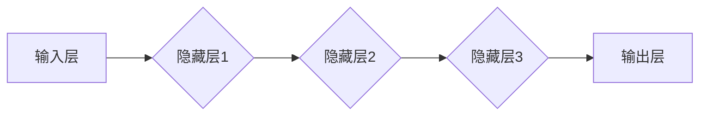

> 深度学习、神经网络、卷积神经网络、循环神经网络、自然语言处理、计算机视觉、机器学习、人工智能

## 1. 背景介绍

深度学习作为人工智能领域最前沿的研究方向之一，近年来取得了令人瞩目的成就。从语音识别、图像识别到自然语言处理，深度学习算法在各个领域都展现出强大的能力，并逐渐渗透到我们的日常生活。

深度学习的兴起离不开以下几个关键因素：

* **海量数据:**  深度学习算法依赖于海量数据进行训练，而近年来互联网的蓬勃发展和数据采集技术的进步为深度学习提供了充足的数据支撑。
* **计算能力提升:**  随着GPU计算能力的飞速发展，深度学习算法的训练速度和效率得到了显著提升。
* **算法创新:**  近年来，深度学习算法不断涌现，如卷积神经网络（CNN）、循环神经网络（RNN）等，为解决更复杂问题提供了新的思路和方法。

## 2. 核心概念与联系

深度学习的核心概念是**人工神经网络（ANN）**。人工神经网络模仿了人脑的神经元结构和功能，通过多层神经元网络进行信息处理。

**深度学习**是指使用具有多层隐藏层的深度神经网络进行训练。

**深度神经网络**的结构可以分为以下几层：

* **输入层:**  接收原始数据。
* **隐藏层:**  进行特征提取和学习。深度神经网络通常包含多层隐藏层，因此被称为“深度”神经网络。
* **输出层:**  输出最终结果。

**数据流向:** 数据从输入层进入，经过隐藏层逐层处理，最终输出到输出层。

**学习过程:** 深度学习算法通过调整神经网络中每个神经元的权重和偏差，使得网络的输出与实际目标值之间的误差最小化。

**Mermaid 流程图:**



## 3. 核心算法原理 & 具体操作步骤

### 3.1  算法原理概述

深度学习算法的核心是**反向传播算法（Backpropagation）**。反向传播算法通过计算误差信号，并将其反向传播到网络中的每一层，从而调整神经网络的权重和偏差，使得网络的输出更接近实际目标值。

### 3.2  算法步骤详解

1. **前向传播:** 将输入数据传递到网络中，计算每一层神经元的输出值。
2. **误差计算:** 计算网络输出与实际目标值之间的误差。
3. **反向传播:** 将误差信号反向传播到网络中的每一层，计算每一层神经元的梯度。
4. **权重更新:** 根据梯度信息，更新网络中每一层神经元的权重和偏差。
5. **重复步骤1-4:** 重复上述步骤，直到网络的输出误差达到预设阈值。

### 3.3  算法优缺点

**优点:**

* **强大的学习能力:** 深度学习算法能够学习到数据中的复杂特征，并进行精准的预测。
* **自动化特征提取:** 深度学习算法能够自动提取数据的特征，无需人工特征工程。
* **泛化能力强:** 深度学习算法能够将训练数据中的知识泛化到新的数据上。

**缺点:**

* **数据依赖性强:** 深度学习算法需要大量的训练数据才能达到良好的性能。
* **计算资源消耗大:** 深度学习算法的训练过程需要大量的计算资源。
* **可解释性差:** 深度学习算法的决策过程难以解释，难以理解模型是如何做出预测的。

### 3.4  算法应用领域

深度学习算法在各个领域都有广泛的应用，例如：

* **计算机视觉:** 图像识别、物体检测、图像分割、人脸识别等。
* **自然语言处理:** 文本分类、情感分析、机器翻译、语音识别等。
* **语音合成:**  语音助手、虚拟助理等。
* **医疗诊断:**  疾病诊断、影像分析等。
* **金融预测:**  股票预测、风险评估等。

## 4. 数学模型和公式 & 详细讲解 & 举例说明

### 4.1  数学模型构建

深度学习算法的核心是神经网络，神经网络可以看作是一个复杂的数学模型。

**神经元模型:**

每个神经元接收多个输入信号，并通过加权求和和激活函数进行处理，输出一个信号。

**激活函数:**

激活函数的作用是引入非线性，使得神经网络能够学习到更复杂的特征。常见的激活函数包括 sigmoid 函数、ReLU 函数、tanh 函数等。

**损失函数:**

损失函数用于衡量模型的预测结果与实际目标值之间的误差。常见的损失函数包括均方误差（MSE）、交叉熵损失等。

### 4.2  公式推导过程

**前向传播公式:**

$$
y = f(W x + b)
$$

其中：

* $y$ 是神经元的输出值。
* $f$ 是激活函数。
* $W$ 是权重矩阵。
* $x$ 是输入向量。
* $b$ 是偏置向量。

**反向传播公式:**

$$
\Delta W = \eta \frac{\partial L}{\partial W}
$$

$$
\Delta b = \eta \frac{\partial L}{\partial b}
$$

其中：

* $\Delta W$ 和 $\Delta b$ 是权重和偏置的更新量。
* $\eta$ 是学习率。
* $L$ 是损失函数。

### 4.3  案例分析与讲解

**举例说明:**

假设我们有一个简单的线性回归问题，目标是预测房价。

* 输入特征：房屋面积。
* 输出目标：房屋价格。

我们可以使用一个单层神经网络进行建模。

* 输入层：一个神经元，接收房屋面积作为输入。
* 隐藏层：一个神经元，使用线性激活函数。
* 输出层：一个神经元，输出房屋价格。

通过训练数据，我们可以调整神经网络的权重和偏置，使得模型能够准确预测房屋价格。

## 5. 项目实践：代码实例和详细解释说明

### 5.1  开发环境搭建

* Python 3.x
* TensorFlow 或 PyTorch 深度学习框架
* Jupyter Notebook 或 VS Code 开发环境

### 5.2  源代码详细实现

```python
import tensorflow as tf

# 定义模型
model = tf.keras.models.Sequential([
    tf.keras.layers.Dense(units=1, input_shape=[1]),
])

# 编译模型
model.compile(optimizer='sgd', loss='mean_squared_error')

# 训练模型
model.fit(x_train, y_train, epochs=100)

# 评估模型
loss = model.evaluate(x_test, y_test)
print('Loss:', loss)

# 预测
predictions = model.predict(x_new)
print('Predictions:', predictions)
```

### 5.3  代码解读与分析

* **模型定义:** 使用 `tf.keras.models.Sequential` 创建一个顺序模型，包含一个全连接层。
* **模型编译:** 使用 `model.compile` 编译模型，指定优化器、损失函数和指标。
* **模型训练:** 使用 `model.fit` 训练模型，传入训练数据和训练轮数。
* **模型评估:** 使用 `model.evaluate` 评估模型在测试数据上的性能。
* **模型预测:** 使用 `model.predict` 对新数据进行预测。

### 5.4  运行结果展示

运行代码后，会输出模型的训练过程、评估结果和预测结果。

## 6. 实际应用场景

### 6.1  图像识别

深度学习算法在图像识别领域取得了突破性的进展，例如：

* **人脸识别:** 用于解锁手机、身份验证等。
* **物体检测:** 用于自动驾驶、安防监控等。
* **图像分类:** 用于医学影像诊断、产品分类等。

### 6.2  自然语言处理

深度学习算法在自然语言处理领域也取得了显著的成果，例如：

* **机器翻译:** 将一种语言翻译成另一种语言。
* **文本摘要:** 自动生成文本的摘要。
* **情感分析:** 分析文本的情感倾向。

### 6.3  语音识别

深度学习算法在语音识别领域也取得了长足的进步，例如：

* **语音助手:** 例如 Siri、Alexa 等。
* **语音搜索:** 例如语音搜索引擎。
* **语音转文本:** 例如会议记录、语音转录等。

### 6.4  未来应用展望

深度学习算法的应用前景广阔，未来将应用于更多领域，例如：

* **个性化推荐:** 基于用户的行为数据，推荐个性化的商品、服务等。
* **医疗诊断:** 更准确、更早的疾病诊断。
* **自动驾驶:** 更安全、更智能的自动驾驶系统。
* **科学研究:** 加速科学研究的进程。

## 7. 工具和资源推荐

### 7.1  学习资源推荐

* **书籍:**
    * 深度学习
    * 深度学习实战
    * 
* **在线课程:**
    * Coursera 深度学习课程
    * Udacity 深度学习课程
    * fast.ai 深度学习课程

### 7.2  开发工具推荐

* **TensorFlow:** 开源深度学习框架，支持多种硬件平台。
* **PyTorch:** 开源深度学习框架，以其灵活性和易用性而闻名。
* **Keras:** 高级深度学习API，可以运行在 TensorFlow、Theano 或 CNTK 后端。

### 7.3  相关论文推荐

* **ImageNet Classification with Deep Convolutional Neural Networks**
* **Sequence to Sequence Learning with Neural Networks**
* **Attention Is All You Need**

## 8. 总结：未来发展趋势与挑战

### 8.1  研究成果总结

深度学习算法取得了令人瞩目的成就，在各个领域都展现出强大的能力。

### 8.2  未来发展趋势

* **模型更深、更复杂:** 研究更深层次、更复杂的深度神经网络结构。
* **数据更丰富、更多样:** 利用更多类型的数据进行训练，例如文本、图像、音频等。
* **算法更智能、更高效:** 研究更智能、更有效的深度学习算法，例如自监督学习、强化学习等。
* **边缘计算:** 将深度学习模型部署到边缘设备上，实现更快速的推理速度和更低的延迟。

### 8.3  面临的挑战

* **数据隐私和安全:** 深度学习算法依赖于大量数据，如何保护数据隐私和安全是一个重要的挑战。
* **算法可解释性:** 深度学习算法的决策过程难以解释，如何提高算法的可解释性是一个重要的研究方向。
* **计算资源消耗:** 深度学习算法的训练过程需要大量的计算资源，如何降低计算资源消耗是一个重要的挑战。

### 8.4  研究展望

未来，深度学习算法将继续发展，并应用于更多领域，为人类社会带来更多福祉。


## 9. 附录：常见问题与解答

**常见问题:**

* **什么是深度学习？**

深度学习是一种机器学习的子领域，它使用多层神经网络来学习数据中的复杂特征。

* **深度学习算法有哪些？**

常见的深度学习算法包括卷积神经网络（CNN）、循环神经网络（RNN）、生成对抗网络（GAN）等。

* **深度学习算法的应用有哪些？**

深度学习算法应用广泛，例如图像识别、自然语言处理、语音识别等。

* **如何学习深度学习？**

可以通过阅读书籍、在线课程、参加培训等方式学习深度学习。

**解答:**

* **什么是深度学习？**

深度学习是一种机器学习的子领域，它使用多层神经网络来学习数据中的复杂特征。

* **深度学习算法有哪些？**

常见的深度学习算法包括卷积神经网络（CNN）、循环神经网络（RNN）、生成对抗网络（GAN）等。

* **深度