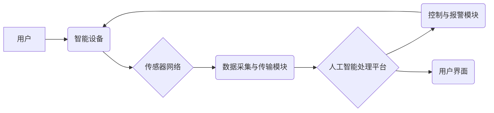

> 智能家居，安防系统，人工智能，机器学习，计算机视觉，深度学习，入侵检测，异常检测

## 1. 背景介绍

随着科技的飞速发展，智能家居已成为现代生活的重要组成部分。智能家居系统通过网络连接各种智能设备，实现对家居环境的自动化控制和远程管理，为用户提供更加便捷、舒适的生活体验。然而，智能家居的普及也带来了新的安全隐患。传统安防系统主要依赖于物理防护和报警机制，难以应对越来越复杂的网络攻击和入侵行为。因此，如何利用人工智能技术提升智能家居安防水平，保障用户财产安全和个人隐私，成为一个亟待解决的问题。

## 2. 核心概念与联系

**2.1 智能家居安防系统架构**

智能家居安防系统通常由以下几个核心组件组成：

* **传感器网络:** 包括摄像头、门窗传感器、烟雾探测器、气体探测器等，用于感知家居环境的变化和潜在的威胁。
* **数据采集与传输模块:** 收集传感器数据，并通过网络传输至云端或本地服务器进行处理。
* **人工智能处理平台:** 利用机器学习、深度学习等人工智能算法，对传感器数据进行分析和识别，判断是否存在安全威胁。
* **控制与报警模块:** 根据人工智能平台的分析结果，控制智能设备进行相应的动作，例如开启灯光、报警、通知用户等。
* **用户界面:** 提供用户查看实时监控、历史记录、设置报警规则等功能的界面。

**2.2 AI在智能家居安防中的应用**

人工智能技术在智能家居安防系统中发挥着至关重要的作用，主要体现在以下几个方面：

* **入侵检测:** 利用计算机视觉技术识别入侵者，并根据其行为特征进行分类和识别。
* **异常检测:** 分析传感器数据，识别异常行为，例如门窗突然打开、烟雾浓度突然升高等，及时报警。
* **身份识别:** 利用人脸识别、指纹识别等生物特征识别技术，验证用户的身份，确保只有授权用户才能控制智能家居设备。
* **行为分析:** 分析用户的日常行为模式，识别异常行为，例如长时间外出未关灯、频繁打开门窗等，提醒用户注意安全。

**2.3 AI智能家居安防系统架构流程图**



## 3. 核心算法原理 & 具体操作步骤

**3.1 算法原理概述**

在智能家居安防系统中，常用的AI算法包括：

* **机器学习:** 利用历史数据训练模型，识别入侵者、异常行为等。
* **深度学习:** 利用多层神经网络，提取更深层次的特征，提高识别准确率。
* **计算机视觉:** 利用图像处理和识别技术，识别入侵者、物体、场景等。

**3.2 算法步骤详解**

以入侵检测为例，其算法步骤如下：

1. **数据采集:** 收集摄像头视频数据，并进行预处理，例如图像增强、降噪等。
2. **特征提取:** 利用计算机视觉算法提取视频图像中的特征，例如颜色、纹理、形状等。
3. **模型训练:** 利用机器学习或深度学习算法，训练入侵检测模型，将特征与入侵行为进行关联。
4. **入侵检测:** 将实时视频数据输入模型，预测是否存在入侵行为。
5. **报警处理:** 如果模型预测存在入侵行为，则触发报警机制，例如开启灯光、发送通知等。

**3.3 算法优缺点**

* **优点:** 识别准确率高，能够识别多种类型的入侵行为，并提供实时报警。
* **缺点:** 需要大量训练数据，训练时间长，部署成本较高。

**3.4 算法应用领域**

* **智能家居安防:** 检测入侵者、异常行为，保障家居安全。
* **视频监控:** 监控公共场所，识别犯罪嫌疑人。
* **交通安全:** 检测交通违规行为，例如超速、闯红灯等。

## 4. 数学模型和公式 & 详细讲解 & 举例说明

**4.1 数学模型构建**

在智能家居安防系统中，可以使用概率模型来描述入侵事件的发生概率。例如，可以使用贝叶斯定理来计算给定特定特征的入侵概率。

**4.2 公式推导过程**

贝叶斯定理公式如下：

$$P(A|B) = \frac{P(B|A)P(A)}{P(B)}$$

其中：

* $P(A|B)$ 是在已知事件 B 发生的情况下，事件 A 发生的概率。
* $P(B|A)$ 是在已知事件 A 发生的情况下，事件 B 发生的概率。
* $P(A)$ 是事件 A 发生的概率。
* $P(B)$ 是事件 B 发生的概率。

**4.3 案例分析与讲解**

假设我们有一个智能家居安防系统，其传感器检测到门窗打开的事件。我们可以使用贝叶斯定理来计算给定门窗打开事件的入侵概率。

* $P(入侵|门窗打开)$ 是我们想要计算的概率，即在已知门窗打开的情况下，入侵发生的概率。
* $P(门窗打开|入侵)$ 是在已知入侵发生的情况下，门窗打开的概率，假设为 0.9。
* $P(入侵)$ 是入侵发生的概率，假设为 0.01。
* $P(门窗打开)$ 是门窗打开的概率，假设为 0.05。

将这些值代入贝叶斯定理公式，我们可以计算出 $P(入侵|门窗打开)$ 的值。

## 5. 项目实践：代码实例和详细解释说明

**5.1 开发环境搭建**

* 操作系统: Ubuntu 20.04
* Python 版本: 3.8
* 必要的库: OpenCV, TensorFlow, PyTorch

**5.2 源代码详细实现**

```python
# 导入必要的库
import cv2
import tensorflow as tf

# 加载预训练的入侵检测模型
model = tf.keras.models.load_model('invasion_detection_model.h5')

# 读取摄像头视频流
cap = cv2.VideoCapture(0)

while True:
    # 读取一帧视频
    ret, frame = cap.read()

    # 预处理图像
    frame = cv2.resize(frame, (224, 224))
    frame = frame / 255.0

    # 将图像输入模型进行预测
    prediction = model.predict(frame[None, ...])

    # 判断预测结果
    if prediction[0][0] > 0.5:
        # 识别到入侵行为
        cv2.putText(frame, '入侵检测', (10, 30), cv2.FONT_HERSHEY_SIMPLEX, 1, (0, 0, 255), 2)
    else:
        # 未识别到入侵行为
        cv2.putText(frame, '正常', (10, 30), cv2.FONT_HERSHEY_SIMPLEX, 1, (0, 255, 0), 2)

    # 显示视频帧
    cv2.imshow('视频流', frame)

    # 按键退出
    if cv2.waitKey(1) & 0xFF == ord('q'):
        break

# 释放资源
cap.release()
cv2.destroyAllWindows()
```

**5.3 代码解读与分析**

* 该代码首先导入必要的库，然后加载预训练的入侵检测模型。
* 接着，读取摄像头视频流，并对每一帧视频进行预处理，例如调整大小、归一化等。
* 将预处理后的图像输入模型进行预测，并根据预测结果判断是否存在入侵行为。
* 如果识别到入侵行为，则在视频帧上显示“入侵检测”的文字提示；否则，显示“正常”的文字提示。
* 最后，使用 `cv2.waitKey()` 函数等待用户按键退出程序，并释放资源。

**5.4 运行结果展示**

运行该代码后，将会打开一个窗口，显示摄像头视频流。如果摄像头捕捉到入侵行为，则会在视频帧上显示“入侵检测”的文字提示。

## 6. 实际应用场景

**6.1 智能家居安防系统**

* **入侵检测:** 当入侵者试图进入房屋时，智能家居安防系统可以利用摄像头和AI算法识别入侵行为，并触发报警机制，例如开启灯光、发送通知等。
* **异常行为检测:** 智能家居安防系统可以分析用户的日常行为模式，识别异常行为，例如门窗突然打开、烟雾浓度突然升高等，及时报警。
* **身份识别:** 智能家居安防系统可以利用人脸识别、指纹识别等生物特征识别技术，验证用户的身份，确保只有授权用户才能控制智能家居设备。

**6.2 其他应用场景**

* **公共场所安全监控:** 利用AI技术识别犯罪嫌疑人、异常行为，提高公共场所安全水平。
* **交通安全监控:** 检测交通违规行为，例如超速、闯红灯等，提高交通安全。
* **工业安全监控:** 检测设备故障、人员异常行为，提高工业生产安全水平。

**6.4 未来应用展望**

随着人工智能技术的不断发展，AI在智能家居安防中的应用将会更加广泛和深入。未来，AI智能家居安防系统将具备以下特点：

* **更精准的识别:** 利用更先进的机器学习和深度学习算法，提高入侵检测和异常行为检测的准确率。
* **更智能的决策:** 利用人工智能技术，实现智能家居安防系统的自主决策，例如自动报警、自动控制智能设备等。
* **更安全的防护:** 利用生物特征识别技术、加密技术等，保障智能家居安防系统的安全性。

## 7. 工具和资源推荐

**7.1 学习资源推荐**

* **书籍:**
    * 深度学习
    * 人工智能
    * 机器学习
* **在线课程:**
    * Coursera
    * edX
    * Udacity

**7.2 开发工具推荐**

* **Python:** 
    * TensorFlow
    * PyTorch
    * OpenCV
* **云平台:**
    * AWS
    * Azure
    * Google Cloud

**7.3 相关论文推荐**

* **入侵检测:**
    * A Survey on Intrusion Detection Systems
    * Deep Learning for Intrusion Detection: A Comprehensive Review
* **异常检测:**
    * Anomaly Detection: A Survey
    * Deep Learning for Anomaly Detection: A Comprehensive Review

## 8. 总结：未来发展趋势与挑战

**8.1 研究成果总结**

近年来，人工智能技术在智能家居安防领域的应用取得了显著进展。利用机器学习和深度学习算法，可以实现更精准的入侵检测和异常行为检测，提高智能家居安防系统的安全性。

**8.2 未来发展趋势**

未来，AI智能家居安防系统将朝着以下方向发展：

* **更精准的识别:** 利用更先进的机器学习和深度学习算法，提高入侵检测和异常行为检测的准确率。
* **更智能的决策:** 利用人工智能技术，实现智能家居安防系统的自主决策，例如自动报警、自动控制智能设备等。
* **更安全的防护:** 利用生物特征识别技术、加密技术等，保障智能家居安防系统的安全性。

**8.3 面临的挑战**

AI智能家居安防系统的发展也面临着一些挑战：

* **数据安全:** 智能家居安防系统需要收集大量的用户数据，如何保障用户数据安全是一个重要的挑战。
* **算法可解释性:** 许多AI算法是黑箱模型，难以解释其决策过程，这可能会导致用户对AI系统的信任度降低。
* **伦理问题:** AI智能家居安防系统可能会引发一些伦理问题，例如隐私侵犯、算法偏见等，需要进行深入的探讨和研究。

**8.4 研究展望**

未来，