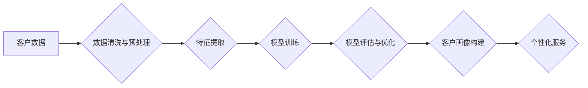

> 客户画像，个性化服务，人工智能，机器学习，深度学习，推荐系统，数据分析

## 1. 背景介绍

在当今数据爆炸的时代，企业拥有海量客户数据，但如何有效地挖掘这些数据，构建精准的客户画像，并提供个性化的服务，成为了企业竞争的关键。传统的人工分析方法效率低下，难以应对海量数据的处理需求。而人工智能（AI）技术的兴起，为企业提供了全新的解决方案。

AI驱动的客户画像与个性化服务，是指利用人工智能技术，从海量客户数据中识别和分析客户的特征、行为、偏好等信息，构建精准的客户画像，并根据客户画像，提供个性化的产品推荐、营销服务、客户服务等。

## 2. 核心概念与联系

**2.1 客户画像**

客户画像是指对目标客户进行深入分析和描述，构建出一个具有代表性的虚拟形象，包括客户的个人信息、行为特征、兴趣爱好、消费习惯、价值观等多方面信息。

**2.2 个性化服务**

个性化服务是指根据客户的具体需求和喜好，提供定制化的产品、服务和体验。

**2.3 人工智能 (AI)**

人工智能是指模拟人类智能的计算机系统，能够学习、推理、决策、解决问题等。

**2.4 机器学习 (ML)**

机器学习是人工智能的一个分支，是指通过算法训练模型，使模型能够从数据中学习，并进行预测或分类。

**2.5 深度学习 (DL)**

深度学习是机器学习的一个子领域，利用多层神经网络模拟人类大脑的学习过程，能够处理更复杂的数据，并获得更准确的预测结果。

**2.6 推荐系统**

推荐系统是利用机器学习算法，根据用户的历史行为、偏好等信息，推荐用户可能感兴趣的产品或服务。

**2.7 数据分析**

数据分析是指对数据进行收集、整理、分析和挖掘，以发现数据中的规律和趋势，并为决策提供支持。

**2.8 流程图**



## 3. 核心算法原理 & 具体操作步骤

### 3.1 算法原理概述

AI驱动的客户画像与个性化服务主要依赖于机器学习和深度学习算法。常见的算法包括：

* **聚类算法**: 将客户数据按照相似性进行分组，构建不同的客户群体。
* **分类算法**: 根据客户特征，预测客户的未来行为，例如是否购买产品、是否流失等。
* **推荐算法**: 根据用户的历史行为和偏好，推荐用户可能感兴趣的产品或服务。

### 3.2 算法步骤详解

1. **数据收集**: 收集客户的各种数据，例如用户行为数据、购买记录、社交媒体数据等。
2. **数据清洗与预处理**: 对收集到的数据进行清洗、转换、标准化等处理，去除噪声数据，并将其转换为模型可识别的格式。
3. **特征提取**: 从原始数据中提取具有代表性的特征，例如用户年龄、性别、购买频率、浏览历史等。
4. **模型训练**: 选择合适的机器学习算法，并利用训练数据训练模型。
5. **模型评估与优化**: 对训练好的模型进行评估，并根据评估结果进行模型优化，例如调整模型参数、增加训练数据等。
6. **客户画像构建**: 利用训练好的模型，对客户数据进行分析，构建精准的客户画像。
7. **个性化服务**: 根据客户画像，为客户提供个性化的产品推荐、营销服务、客户服务等。

### 3.3 算法优缺点

**优点**:

* **精准度高**: AI算法能够从海量数据中挖掘出隐藏的规律，构建更精准的客户画像。
* **效率高**: AI算法能够自动完成数据分析和模型训练，提高效率。
* **可扩展性强**: AI算法能够处理海量数据，并随着数据量的增加而不断优化。

**缺点**:

* **数据依赖性强**: AI算法的性能取决于数据的质量和数量。
* **算法解释性差**: 一些AI算法的决策过程难以解释，难以理解模型是如何做出决策的。
* **伦理风险**: AI算法可能存在偏见和歧视，需要谨慎使用。

### 3.4 算法应用领域

AI驱动的客户画像与个性化服务应用于各个领域，例如：

* **电商**: 个性化商品推荐、精准营销、客户服务自动化。
* **金融**: 风险评估、客户分级、个性化理财服务。
* **医疗**: 疾病诊断、个性化治疗方案、患者管理。
* **教育**: 个性化学习路径、智能辅导、学生行为分析。

## 4. 数学模型和公式 & 详细讲解 & 举例说明

### 4.1 数学模型构建

客户画像构建可以采用多种数学模型，例如：

* **K-Means聚类算法**: 将客户数据按照相似性进行分组，每个分组代表一个客户群体。

* **决策树算法**: 根据客户特征，预测客户的未来行为，例如是否购买产品、是否流失等。

* **神经网络算法**: 利用多层神经网络模拟人类大脑的学习过程，能够处理更复杂的数据，并获得更准确的预测结果。

### 4.2 公式推导过程

**K-Means聚类算法**:

目标函数:

$$
J = \sum_{i=1}^{k} \sum_{x \in C_i} ||x - \mu_i||^2
$$

其中:

* $k$ 是聚类数
* $C_i$ 是第 $i$ 个聚类
* $x$ 是一个数据点
* $\mu_i$ 是第 $i$ 个聚类的中心点

算法步骤:

1. 随机初始化 $k$ 个中心点
2. 将每个数据点分配到最近的中心点
3. 计算每个聚类的中心点
4. 重复步骤 2 和 3，直到中心点不再变化

### 4.3 案例分析与讲解

假设我们有一组客户数据，包括客户的年龄、性别、收入等特征。我们可以使用K-Means聚类算法将客户数据分为不同的客户群体，例如：

* 高收入、高消费的客户群体
* 低收入、低消费的客户群体
* 中收入、中消费的客户群体

根据不同的客户群体，我们可以提供不同的产品推荐、营销服务和客户服务。

## 5. 项目实践：代码实例和详细解释说明

### 5.1 开发环境搭建

* Python 3.x
* Jupyter Notebook
* scikit-learn
* pandas
* matplotlib

### 5.2 源代码详细实现

```python
import pandas as pd
from sklearn.cluster import KMeans

# 加载客户数据
data = pd.read_csv('customer_data.csv')

# 选择特征变量
features = ['age', 'income', 'spending_score']
X = data[features]

# 确定聚类数
# 使用肘部法等方法确定最佳聚类数
k = 3

# 训练K-Means模型
kmeans = KMeans(n_clusters=k, random_state=0)
kmeans.fit(X)

# 获取聚类结果
data['cluster'] = kmeans.labels_

# 查看聚类结果
print(data.groupby('cluster').mean())
```

### 5.3 代码解读与分析

* 首先，我们加载客户数据，并选择需要用于聚类的特征变量。
* 然后，我们使用K-Means算法训练模型，并确定最佳聚类数。
* 训练好的模型可以用来预测每个客户所属的聚类。
* 最后，我们可以查看每个聚类的特征值，了解不同客户群体的特点。

### 5.4 运行结果展示

运行代码后，我们会得到每个客户所属的聚类标签，以及每个聚类群体的特征值。

## 6. 实际应用场景

### 6.1 电商领域

* **个性化商品推荐**: 根据用户的购买历史、浏览记录等数据，推荐用户可能感兴趣的商品。
* **精准营销**: 根据客户的兴趣爱好、消费习惯等信息，进行精准的营销推广。
* **客户服务自动化**: 利用聊天机器人等技术，自动回答客户常见问题，提高客户服务效率。

### 6.2 金融领域

* **风险评估**: 根据客户的信用记录、收入水平等信息，评估客户的贷款风险。
* **客户分级**: 将客户按照风险等级、资产规模等信息进行分级，提供个性化的金融服务。
* **个性化理财服务**: 根据客户的风险偏好、投资目标等信息，提供个性化的理财方案。

### 6.3 医疗领域

* **疾病诊断**: 利用机器学习算法，分析患者的症状、检查结果等信息，辅助医生进行疾病诊断。
* **个性化治疗方案**: 根据患者的基因信息、病史等信息，制定个性化的治疗方案。
* **患者管理**: 利用AI技术，自动提醒患者服药、预约检查等，提高患者管理效率。

### 6.4 未来应用展望

随着人工智能技术的不断发展，AI驱动的客户画像与个性化服务将应用于更多领域，例如教育、交通、娱乐等。未来，AI将更加深入地融入到我们的生活，为我们提供更加个性化、智能化的服务。

## 7. 工具和资源推荐

### 7.1 学习资源推荐

* **书籍**:
    * 《深度学习》
    * 《机器学习实战》
    * 《Python机器学习》
* **在线课程**:
    * Coursera
    * edX
    * Udacity

### 7.2 开发工具推荐

* **Python**: 
* **scikit-learn**: 机器学习库
* **pandas**: 数据分析库
* **matplotlib**: 数据可视化库
* **TensorFlow**: 深度学习框架
* **PyTorch**: 深度学习框架

### 7.3 相关论文推荐

* **《Attention Is All You Need》**: Transformer模型
* **《BERT: Pre-training of Deep Bidirectional Transformers for Language Understanding》**: BERT模型
* **《Generative Adversarial Networks》**: 生成对抗网络

## 8. 总结：未来发展趋势与挑战

### 8.1 研究成果总结

AI驱动的客户画像与个性化服务取得了显著的成果，为企业提供了更精准的客户洞察和更个性化的服务体验。

### 8.2 未来发展趋势

* **模型更加智能**: 未来，AI模型将更加智能，能够更好地理解客户需求，提供更个性化的服务。
* **数据更加丰富**: 未来，客户数据将更加丰富，包括用户行为、社交媒体数据、传感器数据等，为AI模型提供更全面的信息。
* **应用更加广泛**: 未来，AI驱动的客户画像与个性化服务将应用于更多领域，例如教育、医疗、交通等。

### 8.3 面临的挑战

* **数据隐私**: 如何保护客户数据隐私，是AI驱动的客户画像与个性化服务面临的重大挑战。
* **算法解释性**: 一些AI算法的决策过程难以解释，难以理解模型是如何做出决策的，这可能会导致用户对AI技术的信任度降低。
* **伦理风险**: AI算法可能存在偏见和歧视，需要谨慎使用，避免造成不公平的结果。

### 8.4 研究展望

未来，我们需要继续研究如何提高AI模型的智能化、数据丰富度和应用范围，同时也要关注数据隐私、算法解释性和伦理风险等问题，确保AI技术能够安全、有效地服务于人类社会。

## 9. 附录：常见问题与解答

**1. 如何确定最佳聚类数？**

可以使用肘部法等方法来确定最佳聚类数。

**2. 如何处理缺失数据？**

可以使用均值、中位数等方法填充缺失数据。

**3. 如何评估模型性能？**

可以使用准确率、召回率、F1-score等指标来评估模型性能。

**4. 如何防止模型过拟合？**

可以使用正则化、交叉验证等方法来