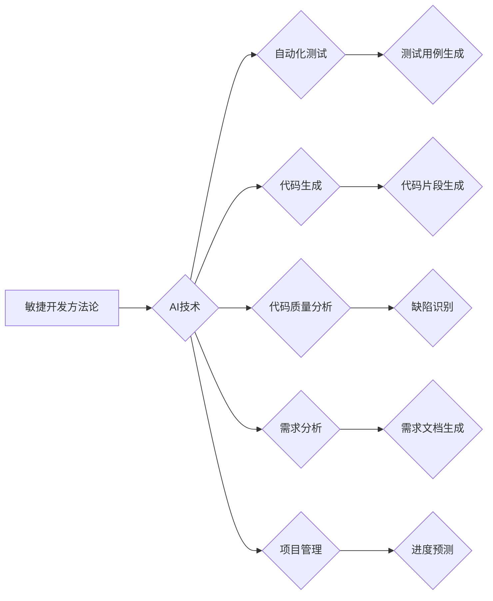

> AI、敏捷开发、机器学习、自动化测试、代码生成、持续集成、持续交付、软件开发流程优化

## 1. 背景介绍

在当今科技飞速发展的时代，软件开发行业面临着日益激烈的竞争压力和不断变化的需求。传统的软件开发方法论，例如瀑布模型，已经难以满足现代软件开发的快速迭代、灵活响应和高质量需求。敏捷开发方法论应运而生，强调团队协作、迭代开发和持续改进，极大地提高了软件开发效率和质量。然而，即使是敏捷开发方法论也面临着一些挑战，例如测试用例编写繁琐、代码质量难以保证、开发周期过长等。

近年来，人工智能（AI）技术取得了长足的进步，为软件开发带来了新的机遇。AI驱动的敏捷开发方法论将AI技术与敏捷开发方法论相结合，旨在进一步优化软件开发流程，提高开发效率和软件质量。

## 2. 核心概念与联系

AI驱动的敏捷开发方法论的核心概念包括：

* **AI驱动的自动化测试:** 利用机器学习算法自动生成测试用例，提高测试效率和覆盖率。
* **AI驱动的代码生成:** 基于代码规范和示例代码，利用AI算法自动生成代码片段，减少开发人员的重复劳动。
* **AI驱动的代码质量分析:** 利用机器学习算法分析代码结构和风格，识别潜在的代码缺陷和安全漏洞。
* **AI驱动的需求分析:** 利用自然语言处理技术分析用户需求，自动生成软件需求文档。
* **AI驱动的项目管理:** 利用机器学习算法预测项目进度和风险，帮助项目经理更好地管理项目。

**AI驱动的敏捷开发方法论架构**



## 3. 核心算法原理 & 具体操作步骤

### 3.1  算法原理概述

AI驱动的敏捷开发方法论的核心算法原理主要包括机器学习、深度学习、自然语言处理等。

* **机器学习:** 利用算法从数据中学习模式，并根据学习到的模式进行预测或分类。例如，在自动化测试中，机器学习算法可以从历史测试用例中学习，自动生成新的测试用例。
* **深度学习:** 是一种更高级的机器学习算法，利用多层神经网络模拟人类大脑的学习过程。深度学习算法在图像识别、语音识别等领域取得了突破性进展，也逐渐应用于软件开发领域。
* **自然语言处理:** 旨在使计算机能够理解和处理人类语言。自然语言处理技术可以用于分析用户需求，自动生成软件需求文档。

### 3.2  算法步骤详解

以AI驱动的自动化测试为例，其具体操作步骤如下：

1. **数据收集:** 收集历史测试用例、代码库、软件文档等数据。
2. **数据预处理:** 对收集到的数据进行清洗、转换、格式化等处理，使其适合机器学习算法的训练。
3. **模型训练:** 利用机器学习算法对预处理后的数据进行训练，学习测试用例的生成模式。
4. **模型评估:** 使用测试集评估模型的性能，并根据评估结果进行模型调优。
5. **测试用例生成:** 利用训练好的模型，根据新的软件代码生成新的测试用例。

### 3.3  算法优缺点

**优点:**

* **提高测试效率:** 自动化测试可以大幅度减少人工编写测试用例的时间和成本。
* **提高测试覆盖率:** AI算法可以生成更全面的测试用例，提高测试覆盖率。
* **降低测试错误率:** AI算法可以识别潜在的测试用例错误，降低测试错误率。

**缺点:**

* **数据依赖:** AI算法的性能依赖于训练数据的质量和数量。
* **解释性差:** 一些AI算法的决策过程难以解释，难以理解算法生成的测试用例背后的逻辑。
* **维护成本:** AI模型需要定期更新和维护，以适应软件代码的变化。

### 3.4  算法应用领域

AI驱动的自动化测试广泛应用于以下领域：

* **Web应用程序测试:** 自动化测试Web应用程序的UI、功能、性能等方面。
* **移动应用程序测试:** 自动化测试移动应用程序的UI、功能、兼容性等方面。
* **API测试:** 自动化测试API接口的请求和响应。
* **嵌入式系统测试:** 自动化测试嵌入式系统的功能和性能。

## 4. 数学模型和公式 & 详细讲解 & 举例说明

### 4.1  数学模型构建

在AI驱动的敏捷开发方法论中，常用的数学模型包括：

* **回归模型:** 用于预测连续变量，例如项目进度、代码缺陷数量等。
* **分类模型:** 用于分类数据，例如测试用例类型、代码缺陷严重程度等。
* **聚类模型:** 用于将数据分组，例如将用户需求进行分类、将代码模块进行聚类等。

### 4.2  公式推导过程

以回归模型为例，其目标是找到一个函数，将输入变量映射到输出变量。常用的回归模型包括线性回归、逻辑回归、支持向量机回归等。

**线性回归模型:**

$$
y = \beta_0 + \beta_1x_1 + \beta_2x_2 + ... + \beta_nx_n + \epsilon
$$

其中：

* $y$ 是输出变量
* $x_1, x_2, ..., x_n$ 是输入变量
* $\beta_0, \beta_1, ..., \beta_n$ 是模型参数
* $\epsilon$ 是误差项

### 4.3  案例分析与讲解

假设我们想要预测软件项目的开发时间，输入变量包括项目规模、团队人数、开发经验等。我们可以使用线性回归模型来建立预测模型。通过训练模型，我们可以得到模型参数，并利用这些参数预测新项目的开发时间。

## 5. 项目实践：代码实例和详细解释说明

### 5.1  开发环境搭建

AI驱动的敏捷开发方法论的项目实践需要搭建相应的开发环境，包括：

* **编程语言:** Python、Java、C++等
* **机器学习库:** TensorFlow、PyTorch、Scikit-learn等
* **代码版本控制系统:** Git、SVN等
* **持续集成和持续交付工具:** Jenkins、CircleCI等

### 5.2  源代码详细实现

以下是一个使用Python和Scikit-learn库实现AI驱动的自动化测试用例生成器的代码示例：

```python
from sklearn.feature_extraction.text import TfidfVectorizer
from sklearn.svm import SVC

# 训练数据
train_data = [
    ("登录页面输入用户名和密码", "登录测试用例"),
    ("注册页面输入用户名、密码和邮箱地址", "注册测试用例"),
    ("忘记密码页面输入用户名和邮箱地址", "忘记密码测试用例"),
]

# 将训练数据转换为特征向量
vectorizer = TfidfVectorizer()
X_train = vectorizer.fit_transform([text for text, label in train_data])

# 使用SVM算法训练分类模型
clf = SVC()
y_train = [label for text, label in train_data]
clf.fit(X_train, y_train)

# 新的代码片段
new_code = "用户点击首页的购物车按钮"

# 将新的代码片段转换为特征向量
new_code_vector = vectorizer.transform([new_code])

# 使用训练好的模型预测测试用例类型
predicted_label = clf.predict(new_code_vector)[0]

# 输出预测结果
print(f"预测的测试用例类型: {predicted_label}")
```

### 5.3  代码解读与分析

这段代码首先使用TfidfVectorizer将训练数据和新的代码片段转换为特征向量。然后使用SVM算法训练分类模型，将代码片段与对应的测试用例类型进行关联。最后，利用训练好的模型预测新的代码片段对应的测试用例类型。

### 5.4  运行结果展示

运行这段代码后，会输出预测的测试用例类型。例如，如果新的代码片段是“用户点击首页的购物车按钮”，则预测的测试用例类型可能是“购物车测试用例”。

## 6. 实际应用场景

AI驱动的敏捷开发方法论已在多个领域得到实际应用，例如：

* **金融科技:** 自动化测试金融软件，例如银行应用程序、交易平台等。
* **医疗保健:** 自动化测试医疗软件，例如电子病历系统、医疗设备管理系统等。
* **电商平台:** 自动化测试电商平台，例如商品搜索、订单管理、支付系统等。

### 6.4  未来应用展望

未来，AI驱动的敏捷开发方法论将更加广泛地应用于软件开发领域，例如：

* **更智能的代码生成:** 利用AI算法生成更复杂的代码片段，甚至可以生成完整的软件模块。
* **更精准的缺陷预测:** 利用AI算法分析代码结构和历史缺陷数据，更精准地预测代码缺陷。
* **更个性化的软件开发体验:** 利用AI算法分析开发人员的工作习惯和偏好，提供更个性化的开发工具和服务。

## 7. 工具和资源推荐

### 7.1  学习资源推荐

* **书籍:**
    * 《AI驱动的软件开发》
    * 《机器学习实战》
    * 《深度学习》
* **在线课程:**
    * Coursera: 机器学习
    * Udacity: 深度学习
    * edX: 自然语言处理

### 7.2  开发工具推荐

* **机器学习库:** TensorFlow、PyTorch、Scikit-learn
* **代码生成工具:** Tabnine、GitHub Copilot
* **代码质量分析工具:** SonarQube、Code Climate

### 7.3  相关论文推荐

* **AI驱动的软件测试:**
    * "Automated Test Case Generation Using Machine Learning"
    * "Deep Learning for Test Case Prioritization"
* **AI驱动的代码生成:**
    * "Code Generation with Deep Learning"
    * "Neural Code Synthesis"

## 8. 总结：未来发展趋势与挑战

### 8.1  研究成果总结

AI驱动的敏捷开发方法论取得了显著的成果，例如提高了测试效率、代码质量和开发速度。

### 8.2  未来发展趋势

未来，AI驱动的敏捷开发方法论将朝着以下方向发展：

* **更智能的AI算法:** 开发更智能的AI算法，例如能够理解自然语言、生成更复杂的代码片段的算法。
* **更广泛的应用场景:** 将AI驱动的敏捷开发方法论应用于更多领域，例如嵌入式系统、物联网等。
* **更人性化的开发体验:** 利用AI算法提供更个性化的开发工具和服务，提高开发人员的工作效率和体验。

### 8.3  面临的挑战

AI驱动的敏捷开发方法论也面临一些挑战，例如：

* **数据安全:** AI算法需要大量的数据进行训练，如何保证数据的安全和隐私是一个重要问题。
* **算法解释性:** 一些AI算法的决策过程难以解释，难以理解算法生成的代码背后的逻辑。
* **技术人才缺口:** AI驱动的敏捷开发方法论需要专业的技术人才，而目前技术人才的缺口仍然较大。

### 8.4  研究展望

未来，我们需要继续研究和探索AI驱动的敏捷开发方法论，解决其面临的挑战，并将其应用于更多领域，推动软件开发行业的发展。

## 9. 附录：常见问题与解答

**Q1: AI驱动的敏捷开发方法论是否会取代传统的软件开发方法论？**

**A1:** AI驱动的敏捷开发方法论是软件开发领域的新兴趋势，它可以有效地提高软件开发效率和质量，但它并不会完全取代传统的软件开发方法论。不同的软件开发项目有不同的需求，需要根据实际情况选择合适的开发方法论。

**Q2: AI驱动的敏捷开发方法论需要哪些技术技能？**

**A2