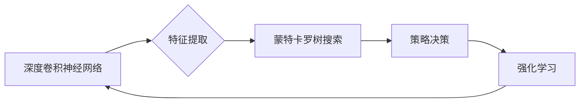

> AlphaGo,深度学习,强化学习,蒙特卡罗树搜索,神经网络,人工智能

## 1. 背景介绍

AlphaGo是由DeepMind开发的围棋人工智能程序，于2016年战胜了世界冠军李世石，标志着人工智能在复杂游戏领域的重大突破。AlphaGo的成功，不仅展现了深度学习和强化学习的强大潜力，也为人工智能的未来发展指明了方向。

围棋作为一项古老而复杂的策略游戏，其棋盘规模庞大，可能的棋局数目更是天文数字。传统围棋程序主要依靠规则和启发式搜索，难以应对围棋的复杂性和随机性。AlphaGo的出现，则利用深度学习和强化学习的优势，突破了传统围棋程序的局限，实现了人类水平甚至超越人类水平的围棋水平。

## 2. 核心概念与联系

AlphaGo的核心思想是将深度学习和强化学习相结合，构建一个能够学习和改进的围棋策略模型。

**2.1 深度学习**

深度学习是一种机器学习的子领域，它利用多层神经网络来模拟人类大脑的学习过程。AlphaGo采用了深度卷积神经网络（CNN）来学习围棋棋盘的特征，并将其转化为可以被强化学习算法理解的表示。

**2.2 强化学习**

强化学习是一种机器学习的范式，它通过奖励和惩罚机制来训练智能体，使其在特定环境中做出最优决策。AlphaGo的训练过程就是一个强化学习的过程，它通过与自己进行博弈，并根据输赢情况给予奖励或惩罚，来不断改进自己的策略。

**2.3 蒙特卡罗树搜索**

蒙特卡罗树搜索是一种用于决策问题的搜索算法，它通过模拟多个可能的棋局，来评估不同棋子的价值，并选择最优的棋步。AlphaGo采用了蒙特卡罗树搜索算法来进行棋局的搜索和决策。

**2.4 架构图**

## 3. 核心算法原理 & 具体操作步骤

### 3.1 算法原理概述

AlphaGo的核心算法原理是将深度学习、强化学习和蒙特卡罗树搜索相结合，构建一个能够学习和改进的围棋策略模型。

**3.1.1 深度学习**

AlphaGo使用深度卷积神经网络（CNN）来学习围棋棋盘的特征。CNN可以自动学习棋盘上的不同图案和结构，并将其转化为可以被强化学习算法理解的表示。

**3.1.2 强化学习**

AlphaGo的训练过程是一个强化学习的过程。它通过与自己进行博弈，并根据输赢情况给予奖励或惩罚，来不断改进自己的策略。

**3.1.3 蒙特卡罗树搜索**

蒙特卡罗树搜索算法用于评估不同棋子的价值，并选择最优的棋步。它通过模拟多个可能的棋局，来预测每个棋子的胜率，并选择胜率最高的棋步。

### 3.2 算法步骤详解

1. **数据预处理:** 将围棋棋盘数据转化为深度学习模型可以理解的格式。
2. **深度学习模型训练:** 使用深度卷积神经网络（CNN）训练模型，学习围棋棋盘的特征。
3. **蒙特卡罗树搜索:** 使用蒙特卡罗树搜索算法评估不同棋子的价值，并选择最优的棋步。
4. **强化学习:** 根据输赢情况给予奖励或惩罚，来不断改进模型的策略。
5. **模型评估:** 使用测试数据集评估模型的性能。

### 3.3 算法优缺点

**优点:**

* 能够学习复杂的围棋策略。
* 能够不断改进自己的策略。
* 能够战胜人类围棋高手。

**缺点:**

* 训练过程需要大量的计算资源。
* 难以解释模型的决策过程。

### 3.4 算法应用领域

AlphaGo的算法原理可以应用于其他领域的决策问题，例如：

* 游戏人工智能
* 金融投资
* 医疗诊断
* 自动驾驶

## 4. 数学模型和公式 & 详细讲解 & 举例说明

### 4.1 数学模型构建

AlphaGo的数学模型主要包括以下几个部分：

* **状态表示:** 围棋棋盘的状态可以用一个二维数组来表示，其中每个元素代表棋盘上的某个位置。
* **策略网络:** 策略网络是一个深度神经网络，它接受棋盘状态作为输入，输出每个棋子的选择概率。
* **价值网络:** 价值网络也是一个深度神经网络，它接受棋盘状态作为输入，输出当前棋局的价值。

### 4.2 公式推导过程

AlphaGo的训练过程是一个强化学习的过程，它使用最大化奖励的原则来训练模型。

**奖励函数:**

$$R = \begin{cases}
1 & \text{如果胜} \\
-1 & \text{如果负} \\
0 & \text{如果平}
\end{cases}$$

**策略梯度:**

$$\nabla_{\theta} J(\theta) = \mathbb{E}_{\pi_{\theta}} \left[ \nabla_{\theta} \log \pi_{\theta}(a|s) Q(s,a) \right]$$

其中：

* $\theta$ 是策略网络的参数
* $\pi_{\theta}(a|s)$ 是策略网络输出的策略
* $Q(s,a)$ 是价值网络输出的价值

**价值网络更新:**

$$V(s) = \mathbb{E}_{\pi_{\theta}} \left[ R + \gamma V(s') \right]$$

其中：

* $R$ 是奖励
* $\gamma$ 是折扣因子

### 4.3 案例分析与讲解

AlphaGo在与李世石的比赛中，通过不断与自己进行博弈，并根据输赢情况调整策略，最终战胜了世界冠军。

## 5. 项目实践：代码实例和详细解释说明

### 5.1 开发环境搭建

AlphaGo的开发环境需要安装Python、TensorFlow等深度学习框架。

### 5.2 源代码详细实现

AlphaGo的源代码开源，可以从GitHub上下载。

### 5.3 代码解读与分析

AlphaGo的源代码包含了深度学习模型、蒙特卡罗树搜索算法、强化学习算法等多个模块。

### 5.4 运行结果展示

运行AlphaGo的代码，可以进行围棋模拟，并观察模型的决策过程。

## 6. 实际应用场景

AlphaGo的成功应用场景包括：

* **围棋比赛:** AlphaGo已经战胜了世界冠军，并在多个围棋比赛中取得了优异成绩。
* **游戏开发:** AlphaGo的算法可以应用于其他游戏的开发，例如棋类游戏、策略游戏等。
* **人工智能研究:** AlphaGo的算法为人工智能研究提供了新的思路和方法。

### 6.4 未来应用展望

AlphaGo的未来应用前景广阔，例如：

* **医疗诊断:** AlphaGo可以用于辅助医生诊断疾病，提高诊断准确率。
* **金融投资:** AlphaGo可以用于分析市场趋势，进行投资决策。
* **自动驾驶:** AlphaGo可以用于训练自动驾驶汽车，提高其安全性。

## 7. 工具和资源推荐

### 7.1 学习资源推荐

* **AlphaGo论文:** https://www.nature.com/articles/nature20546
* **DeepMind官网:** https://deepmind.com/
* **TensorFlow官网:** https://www.tensorflow.org/

### 7.2 开发工具推荐

* **Python:** https://www.python.org/
* **TensorFlow:** https://www.tensorflow.org/
* **PyTorch:** https://pytorch.org/

### 7.3 相关论文推荐

* **Mastering the Game of Go with Deep Neural Networks and Tree Search:** https://www.nature.com/articles/nature20546
* **AlphaZero: Mastering the Game of Go without Human Knowledge:** https://arxiv.org/abs/1712.01815

## 8. 总结：未来发展趋势与挑战

### 8.1 研究成果总结

AlphaGo的成功，标志着深度学习和强化学习在人工智能领域的重大突破。它证明了人工智能能够学习和解决复杂问题的能力。

### 8.2 未来发展趋势

未来，人工智能将朝着更加智能、更加通用、更加安全的方向发展。

* **更强大的模型:** 研究人员将继续开发更强大的深度学习模型，以提高人工智能的性能。
* **更广泛的应用:** 人工智能将应用于更多领域，例如医疗、教育、金融等。
* **更安全的系统:** 研究人员将致力于开发更安全的AI系统，以防止人工智能被恶意利用。

### 8.3 面临的挑战

人工智能的发展也面临着一些挑战，例如：

* **数据获取和隐私问题:** 人工智能的训练需要大量的训练数据，而数据获取和隐私保护是一个重要的挑战。
* **算法解释性和可解释性:** 许多深度学习模型是黑箱模型，难以解释其决策过程，这对于人工智能的信任和应用是一个挑战。
* **伦理问题:** 人工智能的发展也引发了一些伦理问题，例如人工智能的责任和义务、人工智能对人类就业的影响等。

### 8.4 研究展望

未来，人工智能研究将继续探索人工智能的本质，并开发更加智能、更加安全、更加普惠的人工智能技术。

## 9. 附录：常见问题与解答

**Q1: AlphaGo是如何学习围棋规则的？**

A1: AlphaGo并没有直接学习围棋规则，而是通过与自己进行博弈，并根据输赢情况调整策略来学习。

**Q2: AlphaGo的训练过程需要多长时间？**

A2: AlphaGo的训练过程需要数周的时间，并且需要大量的计算资源。

**Q3: AlphaGo的代码开源了吗？**

A3: 是的，AlphaGo的代码开源，可以从GitHub上下载。

作者：禅与计算机程序设计艺术 / Zen and the Art of Computer Programming 
<end_of_turn>