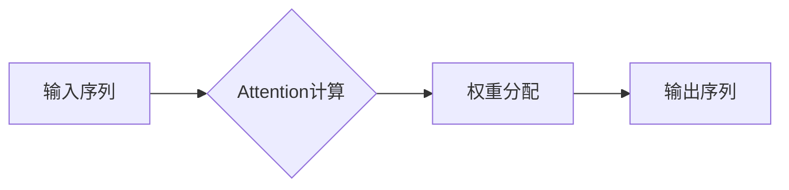

> Attention Mechanism, Transformer, 自然语言处理, 机器翻译, 序列模型, 权重分配, 计算效率

## 1. 背景介绍

在深度学习领域，序列模型在自然语言处理、机器翻译、语音识别等领域取得了显著的成果。然而，传统的循环神经网络（RNN）在处理长序列数据时存在梯度消失和梯度爆炸的问题，难以捕捉长距离依赖关系。为了解决这些问题，**Attention Mechanism**应运而生。

Attention Mechanism是一种机制，它允许模型关注输入序列中与当前任务最相关的部分，从而提高模型的准确性和效率。它类似于人类阅读时，会根据上下文和语义重点关注某些词语，而忽略其他无关的信息。

## 2. 核心概念与联系

**Attention Mechanism**的核心思想是通过计算输入序列中每个元素与当前输出元素之间的相关性，并根据相关性分配不同的权重，从而突出重要信息。

**流程图：**



**核心概念：**

* **Query (Q):** 表示当前输出元素，例如在机器翻译中，当前输出词的词向量。
* **Key (K):** 表示输入序列中每个元素的特征向量，例如每个词的词向量。
* **Value (V):** 表示输入序列中每个元素的实际信息，例如每个词的词义向量。
* **注意力分数 (Attention Score):** 计算Query与Key之间的相关性，通常使用点积或其他相似度度量。
* **注意力权重 (Attention Weight):** 将注意力分数归一化，得到每个Key对应的权重。
* **上下文向量 (Context Vector):** 将每个Value与对应的权重相乘，加权求和得到上下文向量，代表当前输出元素与输入序列的相关信息。

## 3. 核心算法原理 & 具体操作步骤

### 3.1  算法原理概述

Attention Mechanism的核心算法是计算Query与Key之间的注意力分数，并根据分数分配权重，最终得到上下文向量。

### 3.2  算法步骤详解

1. **计算注意力分数:** 使用点积或其他相似度度量计算Query与每个Key之间的相关性，得到注意力分数。
2. **归一化注意力分数:** 使用softmax函数将注意力分数归一化，得到每个Key对应的注意力权重。
3. **加权求和:** 将每个Value与对应的权重相乘，加权求和得到上下文向量。
4. **输出:** 将上下文向量作为当前输出元素的输入，进行后续的处理。

### 3.3  算法优缺点

**优点:**

* 可以捕捉长距离依赖关系，解决RNN的梯度消失问题。
* 可以提高模型的准确性和效率。
* 可以解释模型的决策过程，提高模型的可解释性。

**缺点:**

* 计算复杂度较高，训练时间较长。
* 需要大量的训练数据。

### 3.4  算法应用领域

Attention Mechanism广泛应用于自然语言处理、机器翻译、语音识别、图像识别等领域。

## 4. 数学模型和公式 & 详细讲解 & 举例说明

### 4.1  数学模型构建

假设输入序列长度为N，输出序列长度为M。

* **Query (Q):**  $Q \in R^{d_q}$
* **Key (K):**  $K \in R^{N \times d_k}$
* **Value (V):**  $V \in R^{N \times d_v}$

其中，$d_q$, $d_k$, $d_v$分别为Query、Key、Value的维度。

### 4.2  公式推导过程

**注意力分数:**

$$
\text{Attention}(Q, K, V) = \text{softmax}\left(\frac{Q K^T}{\sqrt{d_k}}\right) V
$$

其中，$K^T$表示Key的转置，$\sqrt{d_k}$是缩放因子，用于防止梯度爆炸。

**上下文向量:**

$$
C = \text{Attention}(Q, K, V)
$$

### 4.3  案例分析与讲解

例如，在机器翻译中，Query是当前输出词的词向量，Key和Value是输入句子中每个词的词向量。Attention Mechanism会计算Query与每个Key之间的注意力分数，并根据分数分配权重，最终得到上下文向量，代表当前输出词与输入句子相关的信息。

## 5. 项目实践：代码实例和详细解释说明

### 5.1  开发环境搭建

* Python 3.6+
* TensorFlow 2.0+
* PyTorch 1.0+

### 5.2  源代码详细实现

```python
import tensorflow as tf

class Attention(tf.keras.layers.Layer):
    def __init__(self, units):
        super(Attention, self).__init__()
        self.Wq = tf.keras.layers.Dense(units)
        self.Wk = tf.keras.layers.Dense(units)
        self.Wv = tf.keras.layers.Dense(units)
        self.fc = tf.keras.layers.Dense(1)

    def call(self, query, key, value, mask=None):
        # 计算Query、Key、Value的线性变换
        q = self.Wq(query)
        k = self.Wk(key)
        v = self.Wv(value)

        # 计算注意力分数
        scores = tf.matmul(q, k, transpose_b=True) / tf.math.sqrt(tf.cast(tf.shape(k)[-1], tf.float32))
        if mask is not None:
            scores += (mask * -1e9)

        # 归一化注意力分数
        attention_weights = tf.nn.softmax(scores, axis=-1)

        # 计算上下文向量
        context_vector = tf.matmul(attention_weights, v)

        return context_vector
```

### 5.3  代码解读与分析

* `Attention`类定义了一个Attention层，包含三个线性变换层`Wq`, `Wk`, `Wv`，用于对Query、Key、Value进行线性变换。
* `call`方法实现Attention机制的核心逻辑，包括计算注意力分数、归一化注意力分数和计算上下文向量。
* `mask`参数用于处理序列中的padding信息，避免对padding元素进行计算。

### 5.4  运行结果展示

运行上述代码，可以得到Attention机制的输出结果，即上下文向量。

## 6. 实际应用场景

### 6.1  机器翻译

Attention Mechanism可以帮助机器翻译模型更好地捕捉句子中的长距离依赖关系，提高翻译质量。

### 6.2  文本摘要

Attention Mechanism可以帮助文本摘要模型识别最重要的句子，并生成更准确的摘要。

### 6.3  问答系统

Attention Mechanism可以帮助问答系统更好地理解问题和上下文，并给出更准确的答案。

### 6.4  未来应用展望

Attention Mechanism在未来将有更广泛的应用，例如：

* **图像识别:** 使用Attention Mechanism可以帮助模型更好地关注图像中的关键区域。
* **视频理解:** 使用Attention Mechanism可以帮助模型更好地理解视频中的时间序列信息。
* **药物发现:** 使用Attention Mechanism可以帮助模型更好地理解药物分子结构和生物活性。

## 7. 工具和资源推荐

### 7.1  学习资源推荐

* **论文:**
    * "Attention Is All You Need"
    * "BERT: Pre-training of Deep Bidirectional Transformers for Language Understanding"
* **博客:**
    * Jay Alammar's Blog: https://jalammar.github.io/
    * Distill.pub: https://distill.pub/

### 7.2  开发工具推荐

* **TensorFlow:** https://www.tensorflow.org/
* **PyTorch:** https://pytorch.org/

### 7.3  相关论文推荐

* "Attention Is All You Need"
* "BERT: Pre-training of Deep Bidirectional Transformers for Language Understanding"
* "Transformer-XL: Attentive Language Models Beyond a Fixed-Length Context"

## 8. 总结：未来发展趋势与挑战

### 8.1  研究成果总结

Attention Mechanism在自然语言处理等领域取得了显著的成果，提高了模型的准确性和效率。

### 8.2  未来发展趋势

* **更有效的Attention机制:** 研究更有效的Attention机制，例如自注意力机制、多头注意力机制等。
* **跨模态Attention:** 研究跨模态Attention机制，例如将文本和图像等不同模态的信息融合在一起。
* **可解释性:** 研究Attention机制的可解释性，以便更好地理解模型的决策过程。

### 8.3  面临的挑战

* **计算复杂度:** Attention机制的计算复杂度较高，难以应用于大型模型和设备资源有限的场景。
* **数据需求:** Attention机制需要大量的训练数据，难以应用于数据稀缺的领域。

### 8.4  研究展望

未来，Attention机制将继续发展，并应用于更多领域，为人工智能的发展做出更大的贡献。

## 9. 附录：常见问题与解答

* **Q: Attention机制与RNN相比有什么优势？**

* **A:** Attention机制可以捕捉长距离依赖关系，解决RNN的梯度消失问题，并提高模型的准确性和效率。

* **Q: Attention机制的计算复杂度如何？**

* **A:** Attention机制的计算复杂度较高，与序列长度的平方成正比。

* **Q: Attention机制需要多少训练数据？**

* **A:** Attention机制需要大量的训练数据才能达到最佳效果。


作者：禅与计算机程序设计艺术 / Zen and the Art of Computer Programming 
<end_of_turn>