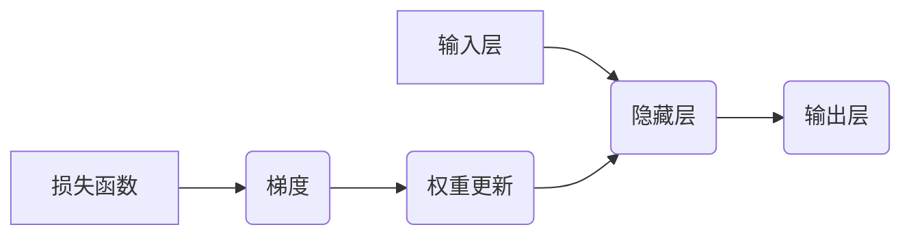

> Backpropagation, 神经网络, 梯度下降, 误差反向传播, 训练模型, 深度学习

## 1. 背景介绍

深度学习近年来取得了令人瞩目的成就，在图像识别、自然语言处理、语音识别等领域展现出强大的能力。而深度学习的核心在于神经网络，而神经网络的训练则离不开**反向传播算法（Backpropagation）**。

反向传播算法是一种高效的优化算法，它通过计算误差梯度来调整神经网络的权重和偏置，从而使模型的预测结果越来越接近真实值。

本篇文章将深入探讨反向传播算法的原理、步骤和应用，并通过代码实例讲解其具体实现过程。

## 2. 核心概念与联系

**2.1 核心概念**

* **神经网络:** 由多个层级的神经元组成，每个神经元接收来自上一层的输入，并通过权重进行加权求和，然后经过激活函数处理，输出到下一层。
* **激活函数:** 用于引入非线性，使神经网络能够学习复杂的模式。常见的激活函数包括 sigmoid、ReLU、tanh 等。
* **损失函数:** 用于衡量模型预测结果与真实值的差距。常见的损失函数包括均方误差、交叉熵等。
* **梯度下降:** 一种优化算法，通过迭代更新模型参数，使损失函数最小化。

**2.2 联系图**



**2.3 工作流程**

1. **前向传播:** 输入数据通过神经网络层层传递，最终得到输出结果。
2. **损失函数计算:** 将输出结果与真实值进行比较，计算损失函数的值。
3. **反向传播:** 计算损失函数对每个参数的梯度，并根据梯度更新参数值。
4. **重复步骤1-3:** 直到损失函数达到最小值或满足其他停止条件。

## 3. 核心算法原理 & 具体操作步骤

### 3.1 算法原理概述

反向传播算法的核心思想是利用链式法则，将损失函数对每个参数的梯度计算出来，并根据梯度更新参数值。

**3.1.1 链式法则**

链式法则是一种微积分中的重要法则，用于计算复合函数的导数。

对于一个复合函数 f(g(x))，其导数为：

```latex
\frac{d}{dx} f(g(x)) = f'(g(x)) \cdot g'(x)
```

**3.1.2 应用于反向传播**

在反向传播算法中，损失函数可以看作是复合函数，其中输入是神经网络的输出，输出是模型的预测结果。

通过链式法则，我们可以将损失函数对每个参数的梯度计算出来，并根据梯度更新参数值。

### 3.2 算法步骤详解

1. **前向传播:** 将输入数据通过神经网络层层传递，计算每个神经元的输出值。
2. **损失函数计算:** 将输出结果与真实值进行比较，计算损失函数的值。
3. **反向传播:** 从输出层开始，计算每个神经元的误差值，并根据误差值计算每个参数的梯度。
4. **参数更新:** 根据梯度更新每个参数的值，例如使用梯度下降算法。
5. **重复步骤1-4:** 直到损失函数达到最小值或满足其他停止条件。

### 3.3 算法优缺点

**优点:**

* **高效:** 反向传播算法能够有效地计算梯度，并快速更新参数值。
* **通用:** 可以应用于各种类型的神经网络，包括多层感知机、卷积神经网络等。
* **成熟:** 反向传播算法已经得到了广泛的应用和研究，有很多成熟的实现和工具。

**缺点:**

* **梯度消失/爆炸问题:** 在训练深层神经网络时，梯度可能会消失或爆炸，导致训练困难。
* **局部最优解:** 梯度下降算法可能会陷入局部最优解，导致模型性能不佳。

### 3.4 算法应用领域

反向传播算法广泛应用于以下领域:

* **图像识别:** 用于识别物体、场景、人脸等。
* **自然语言处理:** 用于机器翻译、文本摘要、情感分析等。
* **语音识别:** 用于识别语音、语音合成等。
* **推荐系统:** 用于推荐商品、电影、音乐等。

## 4. 数学模型和公式 & 详细讲解 & 举例说明

### 4.1 数学模型构建

假设我们有一个神经网络，包含输入层、隐藏层和输出层。

* **输入层:** 接收原始数据，每个神经元代表一个特征。
* **隐藏层:** 对输入数据进行处理，提取特征，并传递到输出层。
* **输出层:** 输出模型的预测结果。

每个神经元接收来自上一层的输入，并通过权重进行加权求和，然后经过激活函数处理，输出到下一层。

### 4.2 公式推导过程

**4.2.1 激活函数**

常见的激活函数包括 sigmoid、ReLU、tanh 等。

* **sigmoid 函数:**

```latex
\sigma(x) = \frac{1}{1 + e^{-x}}
```

* **ReLU 函数:**

```latex
ReLU(x) = max(0, x)
```

**4.2.2 损失函数**

常见的损失函数包括均方误差、交叉熵等。

* **均方误差:**

```latex
L = \frac{1}{2} \sum_{i=1}^{n} (y_i - \hat{y}_i)^2
```

其中，$y_i$ 是真实值，$\hat{y}_i$ 是预测值。

**4.2.3 梯度下降**

梯度下降算法用于更新模型参数，使其能够最小化损失函数。

```latex
\theta = \theta - \alpha \frac{\partial L}{\partial \theta}
```

其中，$\theta$ 是模型参数，$\alpha$ 是学习率，$\frac{\partial L}{\partial \theta}$ 是损失函数对参数$\theta$的梯度。

**4.2.4 反向传播算法**

反向传播算法利用链式法则，计算损失函数对每个参数的梯度，并根据梯度更新参数值。

### 4.3 案例分析与讲解

假设我们有一个简单的单层神经网络，用于预测房价。

* 输入层：房屋面积、房间数量等特征。
* 隐藏层：一个神经元。
* 输出层：房价预测值。

我们可以使用反向传播算法训练这个神经网络，使其能够准确预测房价。

## 5. 项目实践：代码实例和详细解释说明

### 5.1 开发环境搭建

* Python 3.x
* TensorFlow 或 PyTorch 等深度学习框架

### 5.2 源代码详细实现

```python
import tensorflow as tf

# 定义模型
model = tf.keras.models.Sequential([
    tf.keras.layers.Dense(1, input_shape=[2]),
])

# 编译模型
model.compile(optimizer='adam', loss='mse')

# 训练模型
model.fit(x_train, y_train, epochs=100)

# 评估模型
loss = model.evaluate(x_test, y_test)
```

### 5.3 代码解读与分析

* **定义模型:** 使用 `tf.keras.models.Sequential` 创建一个顺序模型，包含一个全连接层。
* **编译模型:** 使用 `model.compile` 编译模型，指定优化器、损失函数等参数。
* **训练模型:** 使用 `model.fit` 训练模型，传入训练数据和训练轮数。
* **评估模型:** 使用 `model.evaluate` 评估模型，传入测试数据，计算损失值。

### 5.4 运行结果展示

训练完成后，我们可以使用测试数据评估模型的性能，例如计算均方误差。

## 6. 实际应用场景

反向传播算法在深度学习领域有着广泛的应用场景，例如：

* **图像识别:** 用于识别物体、场景、人脸等。
* **自然语言处理:** 用于机器翻译、文本摘要、情感分析等。
* **语音识别:** 用于识别语音、语音合成等。
* **推荐系统:** 用于推荐商品、电影、音乐等。

## 7. 工具和资源推荐

### 7.1 学习资源推荐

* **书籍:**
    * 《深度学习》
    * 《神经网络与深度学习》
* **在线课程:**
    * Coursera: 深度学习
    * Udacity: 深度学习工程师
* **博客:**
    * TensorFlow Blog
    * PyTorch Blog

### 7.2 开发工具推荐

* **TensorFlow:** 开源深度学习框架
* **PyTorch:** 开源深度学习框架
* **Keras:** 高级深度学习API

### 7.3 相关论文推荐

* **《Gradient-Based Learning Applied to Document Recognition》**
* **《Backpropagation: A Tutorial》**

## 8. 总结：未来发展趋势与挑战

### 8.1 研究成果总结

反向传播算法是深度学习领域的重要成果，它使得深度神经网络的训练成为可能，并推动了深度学习在各个领域的应用。

### 8.2 未来发展趋势

* **更高效的优化算法:** 研究更有效、更快速的优化算法，例如自适应学习率算法、基于动量的算法等。
* **解决梯度消失/爆炸问题:** 研究解决梯度消失/爆炸问题的有效方法，例如残差网络、梯度裁剪等。
* **可解释性:** 研究如何提高深度学习模型的可解释性，使模型的决策过程更加透明。

### 8.3 面临的挑战

* **数据依赖性:** 深度学习模型对大量数据依赖，数据获取和处理仍然是一个挑战。
* **计算资源:** 训练大型深度学习模型需要大量的计算资源，这对于资源有限的机构或个人来说是一个挑战。
* **伦理问题:** 深度学习模型的应用可能带来一些伦理问题，例如数据隐私、算法偏见等，需要引起重视和解决。

### 8.4 研究展望

未来，反向传播算法将继续发展和完善，并与其他领域的技术融合，推动深度学习的进一步发展。


## 9. 附录：常见问题与解答

**问题 1:** 为什么反向传播算法需要链式法则？

**解答:** 链式法则用于计算复合函数的导数，而损失函数可以看作是神经网络输出和真实值的复合函数。通过链式法则，我们可以将损失函数对每个参数的梯度计算出来。

**问题 2:** 如何解决梯度消失/爆炸问题？

**解答:** 

* 使用残差网络，将梯度传递到更深层的网络。
* 使用梯度裁剪，限制梯度的最大值。
* 使用自适应学习率算法，例如Adam算法，可以自动调整学习率。

**问题 3:** 如何评估深度学习模型的性能？

**解答:** 

* 使用测试数据计算损失函数值。
* 使用准确率、召回率、F1-score等指标评估分类模型的性能。
* 使用均方误差、平均绝对误差等指标评估回归模型的性能。


作者：禅与计算机程序设计艺术 / Zen and the Art of Computer Programming 
<end_of_turn>