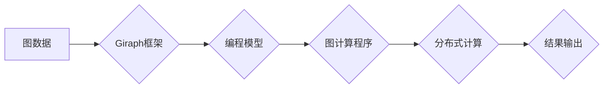

> Giraph, 图计算, 算法, 数据结构, 并行处理, 编程模型, 代码实例

## 1. 背景介绍

在海量数据时代，图数据作为一种重要的数据结构，在社交网络分析、推荐系统、知识图谱构建等领域发挥着越来越重要的作用。传统的数据库和数据处理技术难以有效地处理复杂图数据，因此，图计算成为一个重要的研究方向。

Giraph是一个开源的图计算框架，它基于Apache Hadoop平台，利用分布式计算的优势，能够高效地处理海量图数据。Giraph提供了一种编程模型，允许开发者以简洁易懂的方式编写图计算程序，并利用Hadoop的分布式存储和计算能力进行大规模图计算。

## 2. 核心概念与联系

Giraph的核心概念包括：

* **图数据:** 图数据由节点和边组成，节点代表实体，边代表实体之间的关系。
* **图计算:** 图计算是指对图数据进行分析和处理，以发现图结构中的模式、关系和洞察。
* **编程模型:** Giraph提供了一种编程模型，允许开发者以迭代的方式编写图计算程序，并利用Giraph提供的API进行图数据操作。
* **分布式计算:** Giraph基于Hadoop平台，利用分布式计算的优势，能够高效地处理海量图数据。

**Mermaid 流程图:**



## 3. 核心算法原理 & 具体操作步骤

### 3.1  算法原理概述

Giraph主要采用迭代算法进行图计算，例如PageRank算法、ShortestPath算法等。迭代算法通过重复执行一系列操作，逐步逼近最终结果。

### 3.2  算法步骤详解

1. **数据加载:** 将图数据加载到Giraph框架中。
2. **初始化:** 对图数据进行初始化，例如设置节点的初始值。
3. **迭代计算:** 重复执行图计算操作，例如对节点进行聚合计算，更新节点的状态。
4. **结果输出:** 输出计算结果。

### 3.3  算法优缺点

**优点:**

* **高效性:** 利用分布式计算的优势，能够高效地处理海量图数据。
* **灵活性:** 提供多种编程模型，支持不同的图计算算法。
* **开源性:** 作为开源框架，可以自由使用和修改。

**缺点:**

* **复杂性:** 编程模型相对复杂，需要一定的学习成本。
* **性能瓶颈:** 在某些情况下，数据传输和通信可能会成为性能瓶颈。

### 3.4  算法应用领域

* **社交网络分析:** 分析社交网络结构，发现社区结构、影响力节点等。
* **推荐系统:** 基于用户行为和商品关系，推荐相关商品或内容。
* **知识图谱构建:** 建立知识图谱，表示知识和关系。
* **生物信息学:** 分析生物网络，研究基因调控网络等。

## 4. 数学模型和公式 & 详细讲解 & 举例说明

### 4.1  数学模型构建

Giraph中的图计算算法通常基于图论和代数的数学模型。例如，PageRank算法可以表示为一个线性方程组，其中每个节点的PageRank值是其邻居节点PageRank值的加权平均值。

### 4.2  公式推导过程

PageRank算法的公式如下：

$$PR(v) = (1-d) + d \sum_{u \in N(v)} \frac{PR(u)}{out(u)}$$

其中：

* $PR(v)$ 是节点 $v$ 的PageRank值。
* $d$ 是阻尼因子，通常设置为0.85。
* $N(v)$ 是节点 $v$ 的邻居节点集合。
* $out(u)$ 是节点 $u$ 的出度，即连接到其他节点的边的数量。

### 4.3  案例分析与讲解

假设有一个图，其中节点A和节点B是邻居节点，节点A的出度为2，节点B的出度为1。如果节点A的PageRank值为0.5，则节点B的PageRank值可以计算如下：

$$PR(B) = (1-0.85) + 0.85 \times \frac{0.5}{2} = 0.15 + 0.2125 = 0.3625$$

## 5. 项目实践：代码实例和详细解释说明

### 5.1  开发环境搭建

Giraph需要基于Hadoop平台进行开发，因此需要先搭建Hadoop环境。

### 5.2  源代码详细实现

```java
import org.apache.giraph.graph.BasicComputation;
import org.apache.giraph.graph.Vertex;
import org.apache.hadoop.io.DoubleWritable;
import org.apache.hadoop.io.LongWritable;
import org.apache.hadoop.io.Text;

public class PageRankComputation extends BasicComputation<LongWritable, Text, DoubleWritable, DoubleWritable> {

    @Override
    public void compute(Vertex<LongWritable, Text, DoubleWritable> vertex,
                        Iterable<DoubleWritable> messages) throws Exception {
        long vid = vertex.getId().get();
        Text value = vertex.getValue();
        double sum = 0;
        for (DoubleWritable message : messages) {
            sum += message.get();
        }
        double pagerank = (1 - dampingFactor) + dampingFactor * sum / outDegree;
        vertex.setValue(new DoubleWritable(pagerank));
    }

    private static final double dampingFactor = 0.85;
}
```

### 5.3  代码解读与分析

该代码实现了一个PageRank算法的Giraph程序。

* `compute()`方法是Giraph程序的核心方法，它在每个迭代中执行。
* `vid`表示节点的ID。
* `value`表示节点的值，例如节点的名称。
* `sum`表示从邻居节点接收到的PageRank值之和。
* `pagerank`表示节点的PageRank值。
* `dampingFactor`表示阻尼因子。
* `outDegree`表示节点的出度。

### 5.4  运行结果展示

运行该程序后，Giraph框架会将图数据分布到不同的节点上，并并行执行PageRank算法。最终，每个节点的PageRank值都会被计算出来，并输出到HDFS中。

## 6. 实际应用场景

Giraph在许多实际应用场景中得到了广泛应用，例如：

* **社交网络分析:** 分析社交网络结构，发现社区结构、影响力节点等。
* **推荐系统:** 基于用户行为和商品关系，推荐相关商品或内容。
* **知识图谱构建:** 建立知识图谱，表示知识和关系。
* **生物信息学:** 分析生物网络，研究基因调控网络等。

### 6.4  未来应用展望

随着大数据和人工智能技术的快速发展，Giraph在未来将有更广泛的应用前景，例如：

* **图神经网络:** Giraph可以与图神经网络结合，用于更复杂的图数据分析和预测任务。
* **联邦学习:** Giraph可以用于联邦学习，在保护数据隐私的前提下进行图数据分析。
* **边缘计算:** Giraph可以部署在边缘设备上，用于离线图数据分析。

## 7. 工具和资源推荐

### 7.1  学习资源推荐

* Giraph官方文档: https://giraph.apache.org/
* Giraph教程: https://giraph.apache.org/tutorial/
* 图计算书籍: 《图计算导论》、《图算法》

### 7.2  开发工具推荐

* Hadoop: https://hadoop.apache.org/
* Apache Spark: https://spark.apache.org/

### 7.3  相关论文推荐

* PageRank: https://dl.acm.org/doi/10.1145/306216.306224
* Giraph: https://dl.acm.org/doi/10.1145/2386808.2386819

## 8. 总结：未来发展趋势与挑战

### 8.1  研究成果总结

Giraph是一个高效、灵活的图计算框架，在处理海量图数据方面取得了显著成果。

### 8.2  未来发展趋势

Giraph将继续朝着以下方向发展:

* **性能优化:** 进一步优化Giraph的性能，提高其处理海量图数据的效率。
* **功能扩展:** 添加新的图计算算法和功能，支持更复杂的图数据分析任务。
* **易用性提升:** 简化Giraph的使用流程，降低开发者学习成本。

### 8.3  面临的挑战

Giraph也面临一些挑战，例如:

* **数据存储和管理:** 海量图数据的存储和管理是一个挑战，需要开发更有效的存储和管理方案。
* **算法复杂度:** 一些图计算算法的复杂度很高，需要开发更有效的算法和优化策略。
* **生态系统建设:** Giraph的生态系统还需要进一步完善，需要更多的开发者和贡献者参与。

### 8.4  研究展望

未来，Giraph将继续作为图计算领域的重要研究方向，推动图计算技术的进步，并为解决现实世界中的各种问题提供新的解决方案。

## 9. 附录：常见问题与解答

* **Giraph与Hadoop的关系是什么？**

Giraph是一个基于Hadoop平台的图计算框架。

* **Giraph支持哪些图计算算法？**

Giraph支持多种图计算算法，例如PageRank算法、ShortestPath算法等。

* **如何使用Giraph进行图计算？**

可以使用Giraph提供的API编写图计算程序，并利用Hadoop的分布式计算能力进行大规模图计算。


作者：禅与计算机程序设计艺术 / Zen and the Art of Computer Programming 
<end_of_turn>