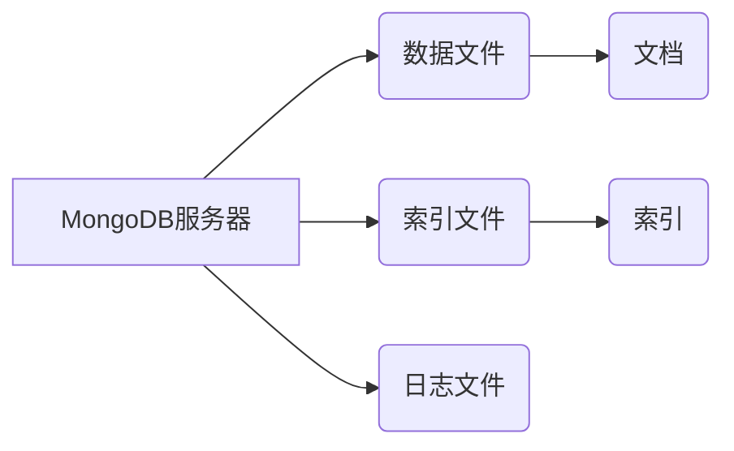

> MongoDB, NoSQL, 数据库, 文档存储, 索引, 查询, 聚合, 性能优化

## 1. 背景介绍

随着互联网和移动互联网的蓬勃发展，数据量呈指数级增长，传统的关系型数据库在处理海量数据和复杂查询时面临着越来越多的挑战。为了应对这些挑战，NoSQL数据库应运而生，其中MongoDB作为一款流行的文档型数据库，凭借其灵活的数据模型、高性能和易于扩展的特点，在电商、社交媒体、金融等领域得到了广泛应用。

MongoDB的出现，为开发者提供了更灵活的数据存储方式，打破了关系型数据库的固有模式，为处理海量数据和复杂业务场景提供了新的解决方案。

## 2. 核心概念与联系

MongoDB是一种基于分布式文件存储的NoSQL数据库，它采用文档存储模型，数据以JSON格式存储，每个文档可以包含不同的字段，并且字段类型可以是任意类型。

**MongoDB架构**



**核心概念:**

* **文档:** MongoDB的数据单元，类似于关系型数据库中的记录，以JSON格式存储。
* **集合:** MongoDB中的数据容器，类似于关系型数据库中的表，包含多个文档。
* **数据库:** MongoDB中的逻辑容器，可以包含多个集合。
* **索引:** 用于加速查询的结构化数据，类似于关系型数据库中的索引。

**MongoDB的优势:**

* **灵活的数据模型:** MongoDB支持多种数据类型，并且文档结构可以灵活变化，无需事先定义表结构。
* **高性能:** MongoDB采用内存缓存和异步IO技术，可以提供高吞吐量和低延迟。
* **易于扩展:** MongoDB支持水平扩展，可以将多个服务器集群起来，提高数据库的容量和性能。
* **丰富的查询语言:** MongoDB提供了一套强大的查询语言，可以进行复杂的查询操作。

## 3. 核心算法原理 & 具体操作步骤

### 3.1  算法原理概述

MongoDB的核心算法主要包括数据存储、索引管理、查询优化和数据恢复等方面。

* **数据存储:** MongoDB采用B-tree索引和数据分片技术，将数据存储在多个磁盘文件上，提高数据访问效率。
* **索引管理:** MongoDB支持多种类型的索引，例如B-tree索引、全文索引和地理空间索引，可以根据查询需求选择合适的索引类型，加速查询速度。
* **查询优化:** MongoDB采用查询计划优化器，根据查询语句和索引信息，选择最优的查询路径，提高查询效率。
* **数据恢复:** MongoDB采用日志机制，记录数据变更信息，可以快速恢复数据到指定时间点。

### 3.2  算法步骤详解

**数据存储步骤:**

1. 将数据转换为JSON格式。
2. 根据数据类型和大小，选择合适的存储方式。
3. 将数据写入磁盘文件。
4. 更新索引文件。

**索引管理步骤:**

1. 根据查询需求，选择合适的索引类型。
2. 将数据构建成索引结构。
3. 将索引文件存储在磁盘上。
4. 更新数据文件中的索引信息。

**查询优化步骤:**

1. 解析查询语句。
2. 分析查询条件和索引信息。
3. 生成多个查询计划。
4. 选择最优的查询计划。
5. 执行查询语句。

**数据恢复步骤:**

1. 读取日志文件。
2. 根据日志信息，恢复数据到指定时间点。
3. 更新索引文件。

### 3.3  算法优缺点

**优点:**

* 高性能
* 灵活的数据模型
* 易于扩展
* 丰富的查询语言

**缺点:**

* 数据一致性问题
* 缺乏事务支持
* 查询复杂度较高

### 3.4  算法应用领域

MongoDB广泛应用于以下领域:

* **电商:** 商品信息存储、订单管理、用户行为分析
* **社交媒体:** 用户信息存储、好友关系维护、内容发布和推荐
* **金融:** 交易记录存储、风险控制、客户关系管理
* **物联网:** 设备数据采集、分析和处理

## 4. 数学模型和公式 & 详细讲解 & 举例说明

### 4.1  数学模型构建

MongoDB的数据存储模型可以抽象为一个图结构，其中文档作为节点，字段作为边。

**图结构模型:**

```
文档1 -- 字段1 --> 文档2
文档1 -- 字段2 --> 文档3
```

### 4.2  公式推导过程

MongoDB的查询优化器使用基于成本的查询计划选择算法，其核心公式为:

$$
Cost(Q) = I(Q) + S(Q)
$$

其中:

* $Cost(Q)$: 查询$Q$的总成本
* $I(Q)$: 查询$Q$的索引访问成本
* $S(Q)$: 查询$Q$的数据扫描成本

### 4.3  案例分析与讲解

假设我们有一个包含用户信息的集合，其中包含字段"用户名"、"年龄"和"城市"。

**查询语句:**

```
SELECT * FROM users WHERE age > 20 AND city = '北京'
```

**查询优化过程:**

1. 查询优化器分析查询语句，发现需要访问"age"和"city"字段。
2. 查询优化器检查索引信息，发现存在"age"和"city"字段的索引。
3. 查询优化器根据索引信息和数据扫描成本，选择使用索引进行查询。
4. 查询优化器生成查询计划，使用索引访问"age"和"city"字段，并返回符合条件的用户数据。

## 5. 项目实践：代码实例和详细解释说明

### 5.1  开发环境搭建

* 安装MongoDB数据库
* 安装MongoDB驱动程序（例如：MongoDB Java Driver）

### 5.2  源代码详细实现

```java
import com.mongodb.client.MongoClient;
import com.mongodb.client.MongoClients;
import com.mongodb.client.MongoCollection;
import com.mongodb.client.MongoDatabase;
import org.bson.Document;

public class MongoDBExample {

    public static void main(String[] args) {

        // 连接到MongoDB数据库
        MongoClient mongoClient = MongoClients.create("mongodb://localhost:27017");
        MongoDatabase database = mongoClient.getDatabase("mydatabase");
        MongoCollection<Document> collection = database.getCollection("users");

        // 插入文档
        Document document = new Document("name", "John Doe")
                .append("age", 30)
                .append("city", "New York");
        collection.insertOne(document);

        // 查询文档
        Document query = new Document("age", 30);
        Iterable<Document> results = collection.find(query);
        for (Document result : results) {
            System.out.println(result);
        }

        // 关闭连接
        mongoClient.close();
    }
}
```

### 5.3  代码解读与分析

* 代码首先连接到MongoDB数据库，并指定数据库名称和集合名称。
* 然后，代码插入一个文档到集合中。
* 接着，代码使用查询语句查询符合条件的文档，并打印查询结果。
* 最后，代码关闭数据库连接。

### 5.4  运行结果展示

```
{
    "_id" : ObjectId("..."),
    "name" : "John Doe",
    "age" : 30,
    "city" : "New York"
}
```

## 6. 实际应用场景

### 6.1  电商平台

MongoDB可以用于存储商品信息、订单信息、用户行为数据等，并支持高并发访问和快速查询，满足电商平台的高性能需求。

### 6.2  社交媒体平台

MongoDB可以用于存储用户数据、好友关系、帖子内容等，并支持实时数据更新和分析，满足社交媒体平台的实时性和互动性需求。

### 6.3  金融机构

MongoDB可以用于存储交易记录、客户信息、风险数据等，并支持数据安全和合规性要求，满足金融机构的安全性需求。

### 6.4  未来应用展望

随着数据量的不断增长和业务模式的不断创新，MongoDB的应用场景将更加广泛，例如：

* **物联网:** 存储设备数据、分析设备状态、实现智能控制。
* **人工智能:** 存储训练数据、构建机器学习模型、进行数据分析。
* **区块链:** 存储区块链数据、实现数据共享和验证。

## 7. 工具和资源推荐

### 7.1  学习资源推荐

* MongoDB官方文档: https://docs.mongodb.com/
* MongoDB University: https://university.mongodb.com/
* MongoDB中文社区: https://www.mongodb.com/community/forums/zh-cn

### 7.2  开发工具推荐

* MongoDB Compass: https://www.mongodb.com/products/compass
* MongoDB Shell: https://docs.mongodb.com/manual/reference/program/mongo/

### 7.3  相关论文推荐

* MongoDB: A NoSQL Database for Modern Applications
* The Design and Implementation of MongoDB

## 8. 总结：未来发展趋势与挑战

### 8.1  研究成果总结

MongoDB作为一款成熟的NoSQL数据库，在数据存储、查询优化、数据恢复等方面取得了显著的成果，并不断发展和完善。

### 8.2  未来发展趋势

* **云原生化:** MongoDB将更加注重云原生架构，支持容器化部署和服务化管理。
* **人工智能集成:** MongoDB将更加深入地集成人工智能技术，例如自动索引管理、智能查询优化和数据分析。
* **数据安全:** MongoDB将更加重视数据安全，提供更完善的访问控制、数据加密和审计功能。

### 8.3  面临的挑战

* **数据一致性:** NoSQL数据库面临着数据一致性挑战，需要不断改进数据一致性机制。
* **事务支持:** NoSQL数据库缺乏事务支持，需要探索新的事务模型。
* **查询复杂度:** NoSQL数据库的查询语言相对简单，需要进一步扩展查询能力。

### 8.4  研究展望

未来，MongoDB的研究方向将集中在以下几个方面:

* **提高数据一致性:** 研究新的数据一致性机制，满足不同应用场景的需求。
* **增强事务支持:** 探索新的事务模型，支持更复杂的业务逻辑。
* **扩展查询能力:** 开发更强大的查询语言，支持更复杂的查询操作。


## 9. 附录：常见问题与解答

**常见问题:**

* MongoDB和关系型数据库有什么区别？
* MongoDB有哪些数据模型？
* 如何在MongoDB中创建索引？
* 如何在MongoDB中进行数据备份和恢复？

**解答:**

* MongoDB是一种NoSQL数据库，而关系型数据库是一种SQL数据库。NoSQL数据库采用灵活的数据模型，而关系型数据库采用结构化数据模型。
* MongoDB支持多种数据模型，例如文档模型、键值对模型和图形模型。
* 在MongoDB中创建索引可以提高查询速度。可以使用`createIndex()`方法创建索引。
* MongoDB支持数据备份和恢复，可以使用`mongodump()`和`mongorestore()`命令进行备份和恢复。


作者：禅与计算机程序设计艺术 / Zen and the Art of Computer Programming 
<end_of_turn>