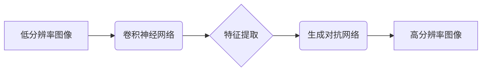

> 深度学习，图像超分辨率，卷积神经网络，生成对抗网络，Python

## 1. 背景介绍

在数字图像处理领域，图像超分辨率重建 (Image Super-Resolution, SR) 是一项重要的技术，旨在通过利用现有低分辨率图像信息，生成高分辨率图像。随着图像传感器分辨率的提升和高分辨率图像需求的增加，图像超分辨率重建技术得到了广泛的关注和研究。

传统的图像超分辨率重建方法主要依赖于插值算法和特征匹配技术，但这些方法往往难以有效地恢复图像细节和纹理信息。近年来，深度学习技术的发展为图像超分辨率重建带来了新的突破。深度学习模型能够学习图像特征和重建规则，从而实现更准确、更有效的图像超分辨率重建。

## 2. 核心概念与联系

### 2.1  图像超分辨率重建

图像超分辨率重建是指通过利用现有低分辨率图像信息，生成高分辨率图像的技术。

### 2.2  深度学习

深度学习是一种机器学习的子领域，它利用多层神经网络来学习数据特征和模式。深度学习模型能够自动学习复杂的非线性关系，从而实现更准确的预测和分类。

### 2.3  卷积神经网络 (CNN)

卷积神经网络 (CNN) 是一种专门用于处理图像数据的深度学习模型。CNN 利用卷积操作和池化操作来提取图像特征，并通过全连接层进行分类或回归。

### 2.4  生成对抗网络 (GAN)

生成对抗网络 (GAN) 是一种由两个神经网络组成的对抗性学习框架。生成器网络负责生成新的数据样本，判别器网络负责判断数据样本的真实性。通过对抗训练，生成器网络能够生成越来越逼真的数据样本。

**Mermaid 流程图**



## 3. 核心算法原理 & 具体操作步骤

### 3.1  算法原理概述

图像超分辨率重建的深度学习算法通常基于卷积神经网络 (CNN) 或生成对抗网络 (GAN)。

CNN-based SR 算法通常采用编码器-解码器结构，其中编码器负责提取图像特征，解码器负责生成高分辨率图像。GAN-based SR 算法则利用生成器和判别器网络进行对抗训练，生成器网络学习生成高分辨率图像，判别器网络学习区分真实图像和生成图像。

### 3.2  算法步骤详解

**CNN-based SR 算法步骤:**

1. **输入低分辨率图像:** 将低分辨率图像作为输入，送入编码器网络。
2. **特征提取:** 编码器网络通过卷积层和池化层提取图像特征。
3. **特征融合:** 将提取到的特征进行融合，生成高分辨率特征图。
4. **图像重建:** 解码器网络通过反卷积层和激活函数生成高分辨率图像。

**GAN-based SR 算法步骤:**

1. **生成器网络训练:** 生成器网络接收低分辨率图像作为输入，生成高分辨率图像。
2. **判别器网络训练:** 判别器网络接收真实高分辨率图像和生成器生成的图像作为输入，判断图像的真实性。
3. **对抗训练:** 生成器网络和判别器网络进行对抗训练，生成器网络试图生成逼真的图像，判别器网络试图区分真实图像和生成图像。

### 3.3  算法优缺点

**CNN-based SR 算法:**

* **优点:** 训练相对简单，效果较好。
* **缺点:** 难以生成高质量的细节信息。

**GAN-based SR 算法:**

* **优点:** 可以生成更逼真的图像细节。
* **缺点:** 训练复杂，容易出现模式崩溃问题。

### 3.4  算法应用领域

图像超分辨率重建技术广泛应用于以下领域:

* **图像增强:** 提升图像分辨率，增强图像细节。
* **视频处理:** 提高视频清晰度，增强观看体验。
* **医学影像:** 增强医学图像细节，辅助诊断。
* **遥感图像:** 提高遥感图像分辨率，增强信息提取能力。

## 4. 数学模型和公式 & 详细讲解 & 举例说明

### 4.1  数学模型构建

图像超分辨率重建的数学模型通常可以表示为一个映射关系，将低分辨率图像映射到高分辨率图像。

假设 $x$ 为低分辨率图像，$y$ 为高分辨率图像，则可以表示为：

$$y = f(x)$$

其中，$f$ 为映射函数，它可以由深度学习模型实现。

### 4.2  公式推导过程

深度学习模型的训练过程通常基于最小化损失函数。损失函数衡量预测结果与真实结果之间的差异。常用的损失函数包括均方误差 (MSE) 和感知器损失 (L1)。

**均方误差 (MSE):**

$$L_{MSE} = \frac{1}{N} \sum_{i=1}^{N} (y_i - \hat{y}_i)^2$$

其中，$y_i$ 为真实图像像素值，$\hat{y}_i$ 为预测图像像素值，$N$ 为图像像素总数。

**感知器损失 (L1):**

$$L_{L1} = \frac{1}{N} \sum_{i=1}^{N} |y_i - \hat{y}_i|$$

### 4.3  案例分析与讲解

假设我们使用 CNN-based SR 算法进行图像超分辨率重建，训练数据包括低分辨率图像和对应的真实高分辨率图像。

训练过程中，模型会不断调整参数，以最小化损失函数。当模型训练完成之后，可以将新的低分辨率图像输入到模型中，得到相应的超分辨率图像。

## 5. 项目实践：代码实例和详细解释说明

### 5.1  开发环境搭建

* Python 3.6+
* TensorFlow/PyTorch
* OpenCV

### 5.2  源代码详细实现

```python
# 使用 TensorFlow 实现 CNN-based SR 算法

import tensorflow as tf

# 定义 CNN 模型
def build_model():
    # ...

# 加载训练数据
# ...

# 训练模型
model.compile(optimizer='adam', loss='mse')
model.fit(train_data, train_labels, epochs=100)

# 保存模型
model.save('sr_model.h5')

# 使用模型进行图像超分辨率重建
# ...
```

### 5.3  代码解读与分析

* `build_model()` 函数定义了 CNN 模型的结构，包括卷积层、池化层、全连接层等。
* `load_data()` 函数加载训练数据，包括低分辨率图像和对应的真实高分辨率图像。
* `model.compile()` 函数配置模型的训练参数，包括优化器、损失函数等。
* `model.fit()` 函数训练模型，将训练数据输入到模型中，并根据损失函数进行参数更新。
* `model.save()` 函数保存训练完成的模型。
* `predict()` 函数使用训练好的模型进行图像超分辨率重建。

### 5.4  运行结果展示

运行代码后，可以将低分辨率图像输入到模型中，得到相应的超分辨率图像。

## 6. 实际应用场景

### 6.1  图像增强

图像超分辨率重建技术可以用于增强图像分辨率，提升图像细节。例如，可以将低分辨率的卫星图像进行超分辨率重建，得到更高分辨率的图像，从而提高地图的精度和细节。

### 6.2  视频处理

图像超分辨率重建技术也可以应用于视频处理，提高视频清晰度。例如，可以将低分辨率的视频进行超分辨率重建，得到更高分辨率的视频，从而增强观看体验。

### 6.3  医学影像

在医学影像领域，图像超分辨率重建技术可以用于增强医学图像细节，辅助诊断。例如，可以将低分辨率的CT扫描图像进行超分辨率重建，得到更高分辨率的图像，从而更清晰地观察病灶。

### 6.4  未来应用展望

随着深度学习技术的不断发展，图像超分辨率重建技术将会得到更广泛的应用。例如，可以将图像超分辨率重建技术应用于虚拟现实、增强现实等领域，创造更逼真的虚拟世界。

## 7. 工具和资源推荐

### 7.1  学习资源推荐

* **书籍:**
    * 《深度学习》 - Ian Goodfellow
    * 《Python深度学习》 - Francois Chollet
* **在线课程:**
    * Coursera: 深度学习
    * Udacity: 深度学习工程师

### 7.2  开发工具推荐

* **TensorFlow:** https://www.tensorflow.org/
* **PyTorch:** https://pytorch.org/
* **OpenCV:** https://opencv.org/

### 7.3  相关论文推荐

* **SRGAN:** https://arxiv.org/abs/1609.04802
* **EDSR:** https://arxiv.org/abs/1609.02500
* **RCAN:** https://arxiv.org/abs/1704.06861

## 8. 总结：未来发展趋势与挑战

### 8.1  研究成果总结

近年来，深度学习技术在图像超分辨率重建领域取得了显著的成果，能够生成逼真的高分辨率图像。

### 8.2  未来发展趋势

* **更高分辨率的图像重建:** 研究更高分辨率的图像重建技术，满足更高清晰度的图像需求。
* **更复杂的场景重建:** 研究能够处理更复杂场景的图像超分辨率重建技术，例如多视角图像融合、运动模糊去除等。
* **更有效的训练方法:** 研究更有效的训练方法，例如迁移学习、自监督学习等，提高模型训练效率和性能。

### 8.3  面临的挑战

* **数据获取和标注:** 高质量的训练数据是深度学习模型训练的关键，获取和标注高分辨率图像数据成本较高。
* **模型复杂度和计算资源:** 深度学习模型通常非常复杂，需要大量的计算资源进行训练。
* **算法泛化能力:** 现有的图像超分辨率重建算法在处理不同类型图像时，泛化能力有限。

### 8.4  研究展望

未来，图像超分辨率重建技术将会继续发展，应用于更广泛的领域，为人们带来更清晰、更逼真的视觉体验。


## 9. 附录：常见问题与解答

### 9.1  Q1: 如何选择合适的图像超分辨率重建算法？

**A1:** 选择合适的图像超分辨率重建算法需要根据具体应用场景和数据特点进行选择。

* **CNN-based SR 算法:** 适用于图像细节相对较少的场景，训练相对简单。
* **GAN-based SR 算法:** 适用于图像细节丰富的场景，可以生成更逼真的图像，但训练复杂。

### 9.2  Q2: 如何提高图像超分辨率重建的质量？

**A2:** 提高图像超分辨率重建的质量可以通过以下方法：

* 使用高质量的训练数据。
* 优化模型结构和参数。
* 使用更先进的训练方法。

### 9.3  Q3: 图像超分辨率重建技术有哪些伦理问题？

**A3:** 图像超分辨率重建技术可能会被用于生成虚假图像，传播虚假信息，因此需要谨慎使用，并制定相应的伦理规范。

作者：禅与计算机程序设计艺术 / Zen and the Art of Computer Programming


<end_of_turn>