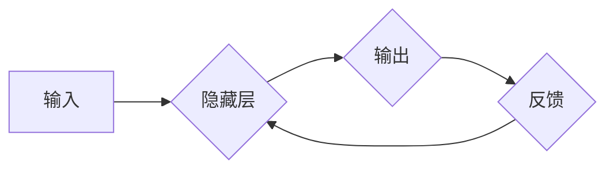

> Recurrent Neural Networks (RNN), 长短期记忆网络 (LSTM), Gated Recurrent Unit (GRU), 自然语言处理 (NLP), 时间序列预测, 深度学习

## 1. 背景介绍

深度学习近年来取得了令人瞩目的成就，尤其是在图像识别、语音识别等领域。然而，传统的深度学习模型难以处理顺序数据，例如文本和时间序列。为了解决这个问题，循环神经网络 (Recurrent Neural Networks，RNN)应运而生。RNN 是一种特殊的深度神经网络结构，能够处理具有时间依赖性的数据。

RNN 的核心特点是其内部包含循环连接，使得网络能够记住之前的信息，并将其用于处理当前的输入。这种记忆机制赋予 RNN 处理顺序数据的强大能力，使其在自然语言处理、机器翻译、语音识别、时间序列预测等领域得到广泛应用。

## 2. 核心概念与联系

**2.1 RNN 的基本结构**

RNN 的基本结构由一个隐藏层和一个输出层组成。隐藏层中的神经元具有循环连接，这意味着每个神经元的输出不仅会传递到下一层，还会反馈到自身。这种循环连接使得 RNN 可以记住之前的信息，并将其用于处理当前的输入。

**2.2 RNN 的工作原理**

RNN 的工作原理可以简单描述为：

1. 在每个时间步，RNN 会接收一个输入向量。
2. RNN 将输入向量与隐藏层状态进行结合，并计算出新的隐藏层状态。
3. RNN 将新的隐藏层状态与输出层进行结合，并计算出输出向量。
4. RNN 将输出向量传递到下一个时间步，作为下一个时间步的输入。

**2.3 RNN 的优势和局限性**

**优势:**

* 能够处理顺序数据，例如文本和时间序列。
* 具有记忆机制，能够记住之前的信息。

**局限性:**

* 长期依赖问题：RNN 难以处理长序列数据，因为梯度消失或爆炸问题会导致网络难以学习长期依赖关系。

**2.4 Mermaid 流程图**



## 3. 核心算法原理 & 具体操作步骤

### 3.1  算法原理概述

RNN 的核心算法原理是通过循环连接来实现记忆机制。隐藏层中的每个神经元都接收来自前一个时间步的隐藏层状态和当前时间步的输入向量，并根据这些信息计算出新的隐藏层状态。这种循环连接使得 RNN 可以记住之前的信息，并将其用于处理当前的输入。

### 3.2  算法步骤详解

1. **初始化隐藏层状态:** 在开始处理序列数据之前，需要先初始化隐藏层状态。隐藏层状态可以是一个零向量或随机向量。
2. **循环处理每个时间步:** 对于每个时间步，RNN 会执行以下步骤:
    * 计算隐藏层状态: 将当前时间步的输入向量和前一个时间步的隐藏层状态作为输入，计算出新的隐藏层状态。
    * 计算输出向量: 将新的隐藏层状态作为输入，计算出输出向量。
3. **更新隐藏层状态:** 将计算出的新的隐藏层状态作为下一个时间步的输入。

### 3.3  算法优缺点

**优点:**

* 能够处理顺序数据，例如文本和时间序列。
* 具有记忆机制，能够记住之前的信息。

**缺点:**

* 长期依赖问题：RNN 难以处理长序列数据，因为梯度消失或爆炸问题会导致网络难以学习长期依赖关系。

### 3.4  算法应用领域

RNN 在以下领域有广泛的应用:

* **自然语言处理 (NLP):** 机器翻译、文本摘要、情感分析、问答系统等。
* **语音识别:** 将语音信号转换为文本。
* **时间序列预测:** 预测股票价格、天气预报、用户行为等。

## 4. 数学模型和公式 & 详细讲解 & 举例说明

### 4.1  数学模型构建

RNN 的数学模型可以表示为以下公式:

$$h_t = f(W_{hh}h_{t-1} + W_{xh}x_t + b_h)$$

$$y_t = g(W_{hy}h_t + b_y)$$

其中:

* $h_t$ 是时间步 $t$ 的隐藏层状态。
* $x_t$ 是时间步 $t$ 的输入向量。
* $y_t$ 是时间步 $t$ 的输出向量。
* $W_{hh}$ 是隐藏层到隐藏层的权重矩阵。
* $W_{xh}$ 是输入层到隐藏层的权重矩阵。
* $W_{hy}$ 是隐藏层到输出层的权重矩阵。
* $b_h$ 是隐藏层的偏置向量。
* $b_y$ 是输出层的偏置向量。
* $f$ 是激活函数，例如tanh或ReLU。
* $g$ 是输出层激活函数，例如softmax。

### 4.2  公式推导过程

RNN 的公式推导过程可以参考深度学习相关的教材和论文。

### 4.3  案例分析与讲解

假设我们有一个简单的 RNN 模型，用于预测下一个单词。输入序列为 "The cat sat on the", 输出序列为 "mat". RNN 会将每个单词作为输入，并根据之前单词的信息预测下一个单词。

## 5. 项目实践：代码实例和详细解释说明

### 5.1  开发环境搭建

* Python 3.x
* TensorFlow 或 PyTorch

### 5.2  源代码详细实现

```python
import tensorflow as tf

# 定义 RNN 模型
model = tf.keras.Sequential([
    tf.keras.layers.Embedding(input_dim=vocab_size, output_dim=embedding_dim),
    tf.keras.layers.LSTM(units=128),
    tf.keras.layers.Dense(units=vocab_size, activation='softmax')
])

# 编译模型
model.compile(optimizer='adam', loss='sparse_categorical_crossentropy', metrics=['accuracy'])

# 训练模型
model.fit(x_train, y_train, epochs=10)

# 预测
predictions = model.predict(x_test)
```

### 5.3  代码解读与分析

* `Embedding`: 将单词转换为稠密的向量表示。
* `LSTM`: 循环神经网络层，用于处理顺序数据。
* `Dense`: 全连接层，用于预测下一个单词。
* `adam`: 优化器，用于更新模型参数。
* `sparse_categorical_crossentropy`: 损失函数，用于计算预测结果与真实结果之间的差异。
* `accuracy`: 评估指标，用于衡量模型的准确率。

### 5.4  运行结果展示

训练完成后，可以将模型应用于新的文本数据，并预测下一个单词。

## 6. 实际应用场景

### 6.1 自然语言处理

* **机器翻译:** RNN 可以用于将一种语言翻译成另一种语言。
* **文本摘要:** RNN 可以用于生成文本的简短摘要。
* **情感分析:** RNN 可以用于分析文本的情感倾向。
* **问答系统:** RNN 可以用于构建问答系统，能够理解自然语言问题并给出相应的答案。

### 6.2 语音识别

RNN 可以用于将语音信号转换为文本。

### 6.3 时间序列预测

RNN 可以用于预测股票价格、天气预报、用户行为等。

### 6.4 未来应用展望

RNN 在未来将有更广泛的应用，例如:

* **对话系统:** RNN 可以用于构建更自然、更智能的对话系统。
* **自动驾驶:** RNN 可以用于处理自动驾驶汽车中的传感器数据，并帮助汽车做出决策。
* **医疗诊断:** RNN 可以用于分析患者的医疗记录，并帮助医生做出诊断。

## 7. 工具和资源推荐

### 7.1 学习资源推荐

* **书籍:**
    * "Deep Learning" by Ian Goodfellow, Yoshua Bengio, and Aaron Courville
    * "Hands-On Machine Learning with Scikit-Learn, Keras & TensorFlow" by Aurélien Géron
* **在线课程:**
    * Coursera: "Deep Learning Specialization" by Andrew Ng
    * Udacity: "Deep Learning Nanodegree"

### 7.2 开发工具推荐

* **TensorFlow:** 开源深度学习框架。
* **PyTorch:** 开源深度学习框架。
* **Keras:** 高级深度学习 API，可以运行在 TensorFlow 或 Theano 之上。

### 7.3 相关论文推荐

* "Recurrent Neural Networks" by Sepp Hochreiter and Jürgen Schmidhuber (1997)
* "Long Short-Term Memory" by Geoffrey E. Hinton, et al. (1997)
* "Gated Recurrent Unit" by Kyunghyun Cho, et al. (2014)

## 8. 总结：未来发展趋势与挑战

### 8.1 研究成果总结

RNN 在处理顺序数据方面取得了显著的成果，并在自然语言处理、语音识别、时间序列预测等领域得到了广泛应用。

### 8.2 未来发展趋势

* **更长序列的处理:** 研究更有效的 RNN 变体，例如 Transformer，以更好地处理更长的序列数据。
* **效率提升:** 研究更有效的训练方法和模型架构，以提高 RNN 的训练效率和推理速度。
* **解释性增强:** 研究更有效的 RNN 解释方法，以更好地理解 RNN 的决策过程。

### 8.3 面临的挑战

* **长期依赖问题:** RNN 难以处理长序列数据，因为梯度消失或爆炸问题会导致网络难以学习长期依赖关系。
* **训练效率:** RNN 的训练效率相对较低，尤其是在处理长序列数据时。
* **解释性:** RNN 的决策过程相对难以解释，这使得其在一些应用场景中难以接受。

### 8.4 研究展望

未来，RNN 将继续是深度学习研究的重要方向，并将在更多领域得到应用。

## 9. 附录：常见问题与解答

**Q1: RNN 的长短期记忆问题如何解决？**

**A1:** 长短期记忆网络 (LSTM) 和 Gated Recurrent Unit (GRU) 是 RNN 的改进版本，能够更好地解决长期依赖问题。

**Q2: 如何选择 RNN 的隐藏层大小？**

**A2:** 隐藏层大小的选择取决于数据的复杂性和任务的难度。一般来说，隐藏层大小越大，模型的表达能力越强，但训练时间也越长。

**Q3: 如何评估 RNN 的性能？**

**A3:** 常见的评估指标包括准确率、损失函数值、BLEU 分数等。

作者：禅与计算机程序设计艺术 / Zen and the Art of Computer Programming


<end_of_turn>