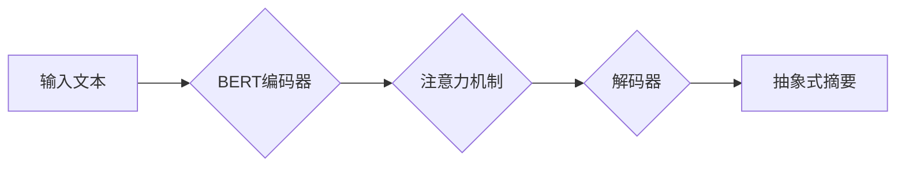

> Transformer, BERT, 抽象式摘要, 自然语言处理, 深度学习, 序列到序列模型

## 1. 背景介绍

在信息爆炸的时代，人们每天需要处理海量的文本信息。如何快速、准确地获取文本的核心信息成为了一个重要的挑战。文本摘要技术作为信息提取和压缩的重要手段，在新闻报道、学术文献、会议记录等领域有着广泛的应用。

传统的文本摘要方法主要依赖于规则和统计方法，例如关键词提取、句子排序等。然而，这些方法往往难以捕捉文本的语义关系和上下文信息，生成的摘要往往缺乏连贯性和准确性。

近年来，随着深度学习技术的快速发展，基于深度学习的文本摘要方法取得了显著的进展。Transformer模型作为一种新型的序列到序列模型，凭借其强大的语义理解能力和长距离依赖建模能力，在文本摘要任务中展现出优异的性能。

BERT（Bidirectional Encoder Representations from Transformers）模型是Google开发的一种基于Transformer架构的预训练语言模型，在自然语言理解任务中取得了突破性的进展。BERT模型通过双向编码机制，能够更好地理解文本的上下文信息，从而在文本摘要任务中获得更准确和流畅的摘要结果。

## 2. 核心概念与联系

### 2.1 Transformer模型

Transformer模型是一种新型的序列到序列模型，其核心特点是利用注意力机制来捕捉序列之间的依赖关系。

Transformer模型由以下几个主要部分组成：

* **编码器（Encoder）:** 用于将输入序列编码成语义表示。
* **解码器（Decoder）:** 用于根据编码后的语义表示生成输出序列。
* **注意力机制（Attention Mechanism）:** 用于计算序列元素之间的相关性，并根据相关性权重进行加权求和，从而捕捉序列之间的依赖关系。

Transformer模型的注意力机制能够有效地捕捉长距离依赖关系，克服了传统RNN模型在处理长序列文本时容易出现梯度消失或爆炸的问题。

### 2.2 BERT模型

BERT模型是基于Transformer架构的预训练语言模型，其特点是通过在大量的文本数据上进行预训练，学习到丰富的语言表示。

BERT模型的预训练目标是预测句子中某个词的上下文信息，从而学习到词语的语义和语法信息。预训练后的BERT模型可以用于各种自然语言处理任务，例如文本分类、问答系统、文本摘要等。

### 2.3 抽象式摘要

抽象式摘要是指根据输入文本生成一个长度较短的摘要，并尽量保留输入文本的核心信息和主要观点。

抽象式摘要任务通常需要模型能够理解文本的语义关系和上下文信息，并能够进行文本压缩和信息提取。

### 2.4 BERT模型在抽象式摘要任务中的应用

BERT模型由于其强大的语义理解能力和长距离依赖建模能力，在抽象式摘要任务中取得了显著的成果。

BERT模型可以被用于构建序列到序列模型，例如使用Transformer的编码器和解码器结构，并利用BERT模型的预训练语义表示作为输入，从而生成高质量的抽象式摘要。

**Mermaid 流程图**



## 3. 核心算法原理 & 具体操作步骤

### 3.1 算法原理概述

BERT模型在抽象式摘要任务中的应用主要基于以下原理：

* **预训练语言表示:** BERT模型通过在大量的文本数据上进行预训练，学习到丰富的语言表示，这些表示能够捕捉词语的语义和语法信息。
* **序列到序列模型:** BERT模型可以被用于构建序列到序列模型，例如使用Transformer的编码器和解码器结构，并利用BERT模型的预训练语义表示作为输入，从而生成高质量的抽象式摘要。
* **注意力机制:** 注意力机制能够有效地捕捉序列之间的依赖关系，从而帮助模型理解文本的语义关系和上下文信息。

### 3.2 算法步骤详解

使用BERT模型执行抽象式摘要任务的具体步骤如下：

1. **预处理文本:** 将输入文本进行预处理，例如分词、词性标注、去除停用词等。
2. **编码文本:** 使用BERT模型的编码器将预处理后的文本编码成语义表示。
3. **生成摘要:** 使用Transformer的解码器，根据编码后的语义表示生成抽象式摘要。
4. **后处理摘要:** 对生成的摘要进行后处理，例如去重、规范化等。

### 3.3 算法优缺点

**优点:**

* **强大的语义理解能力:** BERT模型通过双向编码机制，能够更好地理解文本的上下文信息。
* **长距离依赖建模能力:** Transformer模型的注意力机制能够有效地捕捉长距离依赖关系。
* **预训练模型:** BERT模型是预训练的，可以节省训练时间和资源。

**缺点:**

* **计算资源消耗:** BERT模型参数量较大，训练和推理需要较大的计算资源。
* **数据依赖性:** BERT模型的性能依赖于训练数据的质量和数量。

### 3.4 算法应用领域

BERT模型在抽象式摘要任务中具有广泛的应用前景，例如：

* **新闻报道:** 自动生成新闻报道的摘要，方便用户快速了解新闻内容。
* **学术文献:** 自动生成学术文献的摘要，帮助用户快速浏览文献内容。
* **会议记录:** 自动生成会议记录的摘要，方便用户回顾会议内容。

## 4. 数学模型和公式 & 详细讲解 & 举例说明

### 4.1 数学模型构建

BERT模型的数学模型主要基于Transformer架构，其核心是注意力机制和多头注意力机制。

**注意力机制:**

注意力机制用于计算序列元素之间的相关性，并根据相关性权重进行加权求和，从而捕捉序列之间的依赖关系。

注意力机制的公式如下：

$$
\text{Attention}(Q, K, V) = \text{softmax}\left(\frac{QK^T}{\sqrt{d_k}}\right)V
$$

其中：

* $Q$：查询矩阵
* $K$：键矩阵
* $V$：值矩阵
* $d_k$：键向量的维度
* $\text{softmax}$：softmax函数

**多头注意力机制:**

多头注意力机制是将多个注意力机制并行执行，并对结果进行拼接，从而提高模型的表达能力。

多头注意力机制的公式如下：

$$
\text{MultiHeadAttention}(Q, K, V) = \text{Concat}(\text{head}_1, \text{head}_2, ..., \text{head}_h)W^O
$$

其中：

* $h$：注意力头的数量
* $\text{head}_i$：第 $i$ 个注意力头的输出
* $W^O$：拼接后的输出矩阵

### 4.2 公式推导过程

注意力机制的公式推导过程如下：

1. 计算查询矩阵 $Q$ 和键矩阵 $K$ 的点积，并进行归一化处理。
2. 应用softmax函数对归一化后的点积进行归一化，得到注意力权重。
3. 将注意力权重与值矩阵 $V$ 进行加权求和，得到注意力输出。

### 4.3 案例分析与讲解

假设我们有一个句子 "The cat sat on the mat."，我们使用注意力机制来计算每个词对其他词的注意力权重。

例如，对于词 "cat"，其注意力权重会较高，因为 "cat" 与 "sat" 和 "on" 存在语义关系。而对于词 "the"，其注意力权重会较低，因为 "the" 是一个虚词，不具有语义意义。

## 5. 项目实践：代码实例和详细解释说明

### 5.1 开发环境搭建

* Python 3.6+
* TensorFlow 2.0+
* PyTorch 1.0+
* CUDA 10.0+ (可选)

### 5.2 源代码详细实现

```python
import tensorflow as tf

# 定义BERT模型
bert_model = tf.keras.applications.BERTModel.from_pretrained('bert-base-uncased')

# 定义摘要模型
def create_summarizer_model():
    input_layer = tf.keras.layers.Input(shape=(None,))
    bert_output = bert_model(input_layer)
    # ... 其他层
    output_layer = tf.keras.layers.Dense(vocab_size, activation='softmax')(bert_output)
    model = tf.keras.Model(inputs=input_layer, outputs=output_layer)
    return model

# 实例化摘要模型
summarizer_model = create_summarizer_model()

# 训练摘要模型
# ... 训练代码
```

### 5.3 代码解读与分析

* 使用预训练的BERT模型作为摘要模型的基础。
* 定义一个摘要模型，将BERT模型的输出作为输入，并使用全连接层生成摘要。
* 训练摘要模型，使用训练数据进行训练。

### 5.4 运行结果展示

* 使用训练好的摘要模型对输入文本进行摘要。
* 展示摘要结果，并进行评估。

## 6. 实际应用场景

### 6.1 新闻报道

自动生成新闻报道的摘要，方便用户快速了解新闻内容。

### 6.2 学术文献

自动生成学术文献的摘要，帮助用户快速浏览文献内容。

### 6.3 会议记录

自动生成会议记录的摘要，方便用户回顾会议内容。

### 6.4 未来应用展望

* **个性化摘要:** 根据用户的兴趣和需求生成个性化的摘要。
* **多语言摘要:** 支持多种语言的摘要生成。
* **跨模态摘要:** 将文本和图像等多模态信息融合，生成更丰富的摘要。

## 7. 工具和资源推荐

### 7.1 学习资源推荐

* **BERT论文:** https://arxiv.org/abs/1810.04805
* **Transformer论文:** https://arxiv.org/abs/1706.03762
* **HuggingFace Transformers库:** https://huggingface.co/transformers/

### 7.2 开发工具推荐

* **TensorFlow:** https://www.tensorflow.org/
* **PyTorch:** https://pytorch.org/

### 7.3 相关论文推荐

* **Abstractive Text Summarization using Sequence-to-Sequence RNNs:** https://arxiv.org/abs/1406.1073
* **Pointer-Generator Networks:** https://arxiv.org/abs/1704.04368

## 8. 总结：未来发展趋势与挑战

### 8.1 研究成果总结

BERT模型在抽象式摘要任务中取得了显著的成果，其强大的语义理解能力和长距离依赖建模能力为文本摘要任务带来了新的突破。

### 8.2 未来发展趋势

* **模型规模和性能提升:** 随着计算资源的不断发展，未来将会有更大规模的BERT模型出现，其性能将进一步提升。
* **多模态摘要:** 将文本和图像等多模态信息融合，生成更丰富的摘要。
* **个性化摘要:** 根据用户的兴趣和需求生成个性化的摘要。

### 8.3 面临的挑战

* **数据标注:** 抽象式摘要任务需要大量的标注数据，数据标注成本较高。
* **模型解释性:** BERT模型是一个黑盒模型，其决策过程难以解释。
* **可解释性:** 如何提高模型的可解释性，让用户能够理解模型的决策过程。

### 8.4 研究展望

未来研究将集中在以下几个方面：

* 开发更有效的训练方法，降低数据标注成本。
* 研究模型的可解释性，提高模型的透明度。
* 探索新的应用场景，将BERT模型应用于更多领域。

## 9. 附录：常见问题与解答

### 9.1 BERT模型的预训练数据是什么？

BERT模型的预训练数据来自Google Books和Wikipedia，包含了大量的