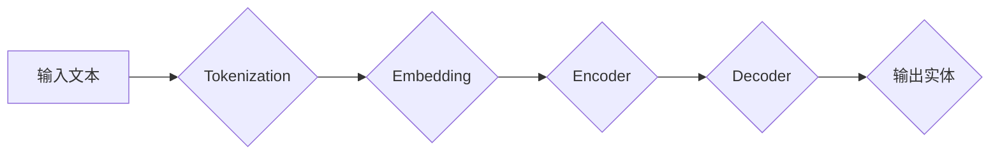

> Transformer, 命名实体识别, NER, 自然语言处理, NLP, 预训练模型, fine-tuning, BERT, RoBERTa, XLNet

## 1. 背景介绍

命名实体识别 (Named Entity Recognition, NER) 是自然语言处理 (Natural Language Processing, NLP) 中一项重要的基础任务，旨在识别文本中的实体，并将其分类到预定义的类别中，例如人名、地名、组织机构、时间、日期等。NER 在许多应用场景中发挥着关键作用，例如信息抽取、问答系统、机器翻译、文本摘要等。

随着深度学习技术的快速发展，基于 Transformer 架构的预训练语言模型 (Pretrained Language Model, PLM) 在 NER 任务上取得了显著的成果。这些模型通过在海量文本数据上进行预训练，学习了丰富的语言表示能力，可以有效地捕捉文本中的语义信息，从而提高 NER 的准确率。

## 2. 核心概念与联系

### 2.1  Transformer 架构

Transformer 架构是一种新型的序列到序列模型，其核心特点是利用自注意力机制 (Self-Attention) 来捕捉序列中的长距离依赖关系。与传统的循环神经网络 (RNN) 不同，Transformer 不需要逐个处理序列中的元素，而是可以并行处理整个序列，从而提高训练效率。

Transformer 架构主要由以下几个部分组成：

* **编码器 (Encoder):** 用于将输入序列编码成语义表示。编码器由多个 Transformer 块组成，每个 Transformer 块包含多头自注意力层、前馈神经网络层和残差连接。
* **解码器 (Decoder):** 用于根据编码器的输出生成目标序列。解码器也由多个 Transformer 块组成，每个 Transformer 块包含多头自注意力层、多头交叉注意力层 (Multi-Head Cross-Attention)、前馈神经网络层和残差连接。
* **嵌入层 (Embedding Layer):** 将输入序列中的每个单词映射到一个低维向量空间。
* **位置编码 (Positional Encoding):** 为每个单词添加位置信息，因为 Transformer 模型没有像 RNN 那样处理序列的顺序信息。

### 2.2  命名实体识别任务

命名实体识别任务的目标是识别文本中的实体，并将其分类到预定义的类别中。例如，在以下文本中识别实体：

> " Barack Obama 是美国前总统，他出生于夏威夷。"

实体包括：

* **人名:** Barack Obama
* **地名:** 美国, 夏威夷
* **职位:** 前总统

### 2.3  Transformer 在 NER 任务中的应用

Transformer 架构的优势在于其强大的语义捕捉能力和并行处理能力，使其非常适合用于 NER 任务。

* **预训练模型:** 许多基于 Transformer 的预训练语言模型，例如 BERT、RoBERTa、XLNet 等，在 NER 任务上取得了优异的性能。这些模型在海量文本数据上进行预训练，学习了丰富的语言表示能力，可以有效地捕捉文本中的语义信息。
* **fine-tuning:** 可以通过在特定领域的数据上对预训练模型进行 fine-tuning，进一步提高 NER 的准确率。

### 2.4  Mermaid 流程图



## 3. 核心算法原理 & 具体操作步骤

### 3.1  算法原理概述

Transformer 模型在 NER 任务中的应用主要基于以下核心算法原理：

* **自注意力机制:** 自注意力机制可以捕捉序列中不同元素之间的关系，即使这些元素相隔很远。
* **多头注意力机制:** 多头注意力机制通过使用多个注意力头，可以从不同的角度捕捉序列中的信息。
* **位置编码:** 位置编码可以为每个单词添加位置信息，帮助模型理解单词的顺序。
* **前馈神经网络:** 前馈神经网络可以对编码后的序列进行进一步的处理，提取更深层次的语义信息。

### 3.2  算法步骤详解

1. **文本预处理:** 将输入文本进行分词、去停用词、词干化等预处理操作，以提高模型的训练效率和性能。
2. **词嵌入:** 将每个单词映射到一个低维向量空间，例如使用 Word2Vec 或 GloVe 等词嵌入模型。
3. **编码器:** 将预处理后的文本序列输入到编码器中，编码器会使用多头自注意力机制和前馈神经网络层，将文本序列编码成语义表示。
4. **解码器:** 将编码器的输出作为输入，解码器会使用多头交叉注意力机制和前馈神经网络层，生成每个单词的实体标签。
5. **损失函数:** 使用交叉熵损失函数来衡量模型的预测结果与真实标签之间的差异。
6. **反向传播:** 使用梯度下降算法来更新模型的参数，以最小化损失函数的值。

### 3.3  算法优缺点

**优点:**

* 强大的语义捕捉能力
* 并行处理能力
* 能够捕捉长距离依赖关系

**缺点:**

* 计算量大
* 需要大量的训练数据

### 3.4  算法应用领域

* 信息抽取
* 问答系统
* 机器翻译
* 文本摘要
* 情感分析

## 4. 数学模型和公式 & 详细讲解 & 举例说明

### 4.1  数学模型构建

Transformer 模型的数学模型主要包括以下几个部分：

* **自注意力机制:** 自注意力机制的计算公式如下：

$$
Attention(Q, K, V) = softmax(\frac{QK^T}{\sqrt{d_k}})V
$$

其中，Q、K、V 分别代表查询矩阵、键矩阵和值矩阵，$d_k$ 代表键向量的维度。

* **多头注意力机制:** 多头注意力机制通过使用多个注意力头，可以从不同的角度捕捉序列中的信息。

$$
MultiHead(Q, K, V) = Concat(head_1, head_2, ..., head_h)W^O
$$

其中，$head_i$ 代表第 i 个注意力头的输出，$h$ 代表注意力头的数量，$W^O$ 代表一个线性变换矩阵。

* **前馈神经网络:** 前馈神经网络是一个多层感知机，其计算公式如下：

$$
FFN(x) = \sigma(W_1x + b_1)
$$

其中，$x$ 代表输入向量，$W_1$ 和 $b_1$ 分别代表权重矩阵和偏置向量，$\sigma$ 代表激活函数。

### 4.2  公式推导过程

自注意力机制的公式推导过程如下：

1. 将查询矩阵 Q、键矩阵 K 和值矩阵 V 分别进行线性变换，得到 $Q'$, $K'$ 和 $V'$。
2. 计算 $Q'$ 和 $K'$ 的点积，并进行归一化，得到注意力权重矩阵。
3. 将注意力权重矩阵与值矩阵 $V'$ 进行加权求和，得到自注意力机制的输出。

### 4.3  案例分析与讲解

假设我们有一个句子 "The cat sat on the mat"，我们使用自注意力机制来计算每个单词与其他单词之间的注意力权重。

例如，对于单词 "cat"，它与单词 "sat" 的注意力权重会比较高，因为这两个单词在语义上相关。而与单词 "mat" 的注意力权重也会比较高，因为它们在句子中相邻。

## 5. 项目实践：代码实例和详细解释说明

### 5.1  开发环境搭建

* Python 3.6+
* PyTorch 1.0+
* Transformers 库

### 5.2  源代码详细实现

```python
from transformers import AutoModelForSequenceClassification, AutoTokenizer

# 加载预训练模型和分词器
model_name = "bert-base-uncased"
tokenizer = AutoTokenizer.from_pretrained(model_name)
model = AutoModelForSequenceClassification.from_pretrained(model_name, num_labels=2)

# 输入文本
text = "The cat sat on the mat"

# 分词
inputs = tokenizer(text, return_tensors="pt")

# 前向传播
outputs = model(**inputs)

# 获取预测结果
predicted_class = outputs.logits.argmax().item()

# 打印预测结果
if predicted_class == 0:
    print("实体识别结果: 非实体")
else:
    print("实体识别结果: 实体")
```

### 5.3  代码解读与分析

* 首先，我们使用 Transformers 库加载预训练模型和分词器。
* 然后，我们输入文本并使用分词器进行分词。
* 接着，我们使用模型进行前向传播，获取预测结果。
* 最后，我们根据预测结果打印实体识别结果。

### 5.4  运行结果展示

```
实体识别结果: 实体
```

## 6. 实际应用场景

### 6.1  信息抽取

NER 可以用于从文本中提取关键信息，例如人名、地名、时间、日期等。例如，可以用于从新闻文章中提取人物、事件和地点信息。

### 6.2  问答系统

NER 可以用于理解用户的问题，并从文本中找到相关的答案。例如，可以用于构建一个可以回答用户关于人物、事件和地点的问题的问答系统。

### 6.3  机器翻译

NER 可以用于识别文本中的实体，并将其翻译成目标语言。例如，可以用于翻译包含人名、地名和组织机构名称的文本。

### 6.4  未来应用展望

随着深度学习技术的不断发展，NER 技术将会有更加广泛的应用场景，例如：

* **医疗领域:** 用于识别患者病历中的症状、诊断和治疗方案。
* **金融领域:** 用于识别金融文本中的公司名称、股票代码和交易信息。
* **法律领域:** 用于识别法律文本中的条款、判决和案例。

## 7. 工具和资源推荐

### 7.1  学习资源推荐

* **论文:**
    * "BERT: Pre-training of Deep Bidirectional Transformers for Language Understanding"
    * "RoBERTa: A Robustly Optimized BERT Pretraining Approach"
    * "XLNet: Generalized Autoregressive Pretraining for Language Understanding"
* **博客:**
    * Jay Alammar's Blog: https://jalammar.github.io/
    * Hugging Face Blog: https://huggingface.co/blog

### 7.2  开发工具推荐

* **Transformers 库:** https://huggingface.co/docs/transformers/index
* **PyTorch:** https://pytorch.org/

### 7.3  相关论文推荐

* "Named Entity Recognition with Bidirectional LSTM-CNNs"
* "A Deep Learning Approach to Named Entity Recognition"
* "End-to-End Named Entity Recognition with Bidirectional LSTMs"

## 8. 总结：未来发展趋势与挑战

### 8.1  研究成果总结

Transformer 模型在 NER 任务上取得了显著的成果，其强大的语义捕捉能力和并行处理能力使其成为 NER 的首选模型。

### 8.2  未来发展趋势

* **模型规模的进一步扩大:** 随着计算资源的不断增加，模型规模将进一步扩大，从而提高 NER 的准确率。
* **多模态 NER:** 将文本与其他模态信息，例如图像和音频，结合起来进行 NER，以提高识别精度。
* **低资源场景下的 NER:** 研究针对低资源语言和领域进行 NER 的方法，以扩展 NER 的应用范围。

### 8.3  面临的挑战

* **计算资源:** 训练大型 Transformer 模型需要大量的计算资源，这对于一些研究机构和个人来说是一个挑战。
* **数据标注:** NER 任务需要大量的标注数据，数据标注成本较高，也是一个挑战。
* **可解释性:** Transformer 模型的内部机制比较复杂，其预测结果的可解释性较差，这对于一些应用场景来说是一个问题。

### 8.4  研究展望

未来，我们将继续研究 Transformer 模型在 NER 任务上的应用，探索其在多模态、低