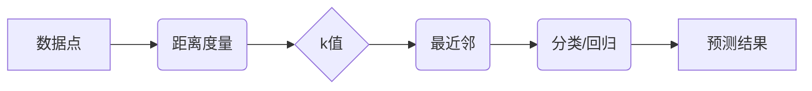

> k-近邻算法,机器学习,分类,回归,距离度量,算法原理,代码实现,Python

## 1. 背景介绍

在机器学习领域，k-近邻算法(k-Nearest Neighbors, k-NN) 是一种简单易懂且广泛应用的监督学习算法。它属于懒惰学习算法，即在训练阶段不建立任何模型，而是将所有数据点存储在内存中，待预测时再根据距离计算进行分类或回归。

k-NN算法的优势在于其易于理解和实现，并且对数据没有强烈的假设，适用于各种类型的数据。然而，它也存在一些缺点，例如计算复杂度高，对数据规模敏感，以及容易受到噪声数据的影响。

## 2. 核心概念与联系

**2.1 核心概念**

* **距离度量:**  k-NN算法的核心是计算数据点之间的距离。常用的距离度量包括欧氏距离、曼哈顿距离、切比雪夫距离等。
* **k值:** k值代表着用于分类或回归的最近邻的数量。k值的选择对算法性能有重要影响。
* **分类:**  对于分类问题，k-NN算法根据数据点所属类别投票，选择出现次数最多的类别作为预测结果。
* **回归:**  对于回归问题，k-NN算法根据最近邻的数据点值进行加权平均，得到预测结果。

**2.2 核心概念联系**



## 3. 核心算法原理 & 具体操作步骤

### 3.1 算法原理概述

k-NN算法的基本原理是：一个数据点的类别或值应该与其最近邻的类别或值相近。

具体来说，对于一个新的数据点，k-NN算法会计算它与所有已知数据点的距离。然后，选择距离最近的k个数据点，并根据这些数据点的类别或值进行预测。

### 3.2 算法步骤详解

1. **数据预处理:** 对数据进行清洗、转换和特征工程，例如处理缺失值、标准化特征等。
2. **距离计算:** 使用距离度量计算新数据点与所有已知数据点的距离。
3. **最近邻选择:** 选择距离新数据点最近的k个数据点。
4. **分类/回归:** 根据k个最近邻的数据点类别或值进行预测。

### 3.3 算法优缺点

**优点:**

* 易于理解和实现。
* 对数据没有强烈的假设。
* 适用于各种类型的数据。

**缺点:**

* 计算复杂度高，随着数据规模的增加，性能会下降。
* 对数据规模敏感，容易受到噪声数据的影响。
* k值的选择对算法性能有重要影响。

### 3.4 算法应用领域

k-NN算法广泛应用于以下领域:

* **图像识别:**  识别图像中的物体、场景等。
* **文本分类:**  分类文本文档，例如垃圾邮件过滤、情感分析等。
* **推荐系统:**  根据用户的历史行为推荐商品、电影等。
* **模式识别:**  识别模式和趋势，例如金融欺诈检测等。

## 4. 数学模型和公式 & 详细讲解 & 举例说明

### 4.1 数学模型构建

k-NN算法的数学模型可以概括为以下公式:

$$
h(x) = \text{arg}\max_{c \in C} \sum_{i=1}^{k} I(y_i = c)
$$

其中:

* $h(x)$ 是预测结果。
* $x$ 是新的数据点。
* $C$ 是所有可能的类别集合。
* $y_i$ 是第i个最近邻的数据点的类别。
* $I(y_i = c)$ 是指示函数，当 $y_i = c$ 时取值为1，否则取值为0。

### 4.2 公式推导过程

该公式的推导过程如下:

1. 计算新数据点 $x$ 与所有已知数据点 $x_i$ 的距离。
2. 选择距离 $x$ 最近的 $k$ 个数据点，即 $x_{i_1}, x_{i_2}, ..., x_{i_k}$。
3. 统计每个类别 $c$ 在最近邻数据点中出现的次数。
4. 选择出现次数最多的类别 $c$ 作为预测结果 $h(x)$。

### 4.3 案例分析与讲解

假设我们有一个包含三个类别的分类问题，即类别A、类别B和类别C。

我们有一个新的数据点 $x$，需要对其进行分类。

我们计算 $x$ 与所有已知数据点的距离，并选择距离最近的 $k=3$ 个数据点。

假设这三个最近邻数据点的类别分别为类别A、类别B和类别C。

根据公式，我们可以看到 $h(x)$ 将选择类别A作为预测结果，因为类别A在最近邻数据点中出现次数最多。

## 5. 项目实践：代码实例和详细解释说明

### 5.1 开发环境搭建

本项目使用Python语言进行开发，需要安装以下库:

* scikit-learn: 机器学习库，包含k-NN算法的实现。
* numpy: 数值计算库。
* matplotlib: 数据可视化库。

可以使用以下命令安装这些库:

```bash
pip install scikit-learn numpy matplotlib
```

### 5.2 源代码详细实现

```python
from sklearn.neighbors import KNeighborsClassifier
from sklearn.datasets import load_iris
from sklearn.model_selection import train_test_split
from sklearn.metrics import accuracy_score

# 加载iris数据集
iris = load_iris()
X = iris.data
y = iris.target

# 将数据划分为训练集和测试集
X_train, X_test, y_train, y_test = train_test_split(X, y, test_size=0.2, random_state=42)

# 创建k-NN分类器
knn = KNeighborsClassifier(n_neighbors=3)

# 训练模型
knn.fit(X_train, y_train)

# 预测测试集结果
y_pred = knn.predict(X_test)

# 计算准确率
accuracy = accuracy_score(y_test, y_pred)
print(f"准确率: {accuracy}")
```

### 5.3 代码解读与分析

* **加载数据集:** 使用 `load_iris()` 函数加载iris数据集。
* **数据划分:** 使用 `train_test_split()` 函数将数据划分为训练集和测试集。
* **创建分类器:** 使用 `KNeighborsClassifier()` 函数创建k-NN分类器，并设置k值。
* **训练模型:** 使用 `fit()` 函数训练模型。
* **预测结果:** 使用 `predict()` 函数预测测试集结果。
* **计算准确率:** 使用 `accuracy_score()` 函数计算模型的准确率。

### 5.4 运行结果展示

运行以上代码，可以得到模型的准确率。

## 6. 实际应用场景

k-NN算法在实际应用中有很多场景，例如:

* **推荐系统:** 根据用户的历史行为推荐商品、电影等。
* **图像识别:** 识别图像中的物体、场景等。
* **文本分类:** 分类文本文档，例如垃圾邮件过滤、情感分析等。
* **模式识别:** 识别模式和趋势，例如金融欺诈检测等。

## 7. 工具和资源推荐

### 7.1 学习资源推荐

* **书籍:**
    * 《机器学习》 - 周志华
    * 《Python机器学习实战》 - 塞缪尔·阿布拉姆斯
* **在线课程:**
    * Coursera: 机器学习
    * edX: 机器学习
* **博客:**
    * 机器学习 Mastery
    * Analytics Vidhya

### 7.2 开发工具推荐

* **Python:** 
* **scikit-learn:** 机器学习库
* **numpy:** 数值计算库
* **matplotlib:** 数据可视化库

### 7.3 相关论文推荐

* **k-Nearest Neighbors:** Thomas Cover and Peter Hart (1967)
* **The k-Nearest Neighbors Algorithm:**  Ethem Alpaydin (2014)

## 8. 总结：未来发展趋势与挑战

### 8.1 研究成果总结

k-NN算法是一种简单易懂且广泛应用的机器学习算法。它在分类、回归等任务中表现良好，并且对数据没有强烈的假设。

### 8.2 未来发展趋势

* **高效性提升:** 研究更高效的k-NN算法，例如基于树结构的k-NN算法。
* **鲁棒性增强:** 研究更鲁棒的k-NN算法，例如对噪声数据和异常值更加敏感的算法。
* **可解释性提高:** 研究更可解释的k-NN算法，例如能够解释预测结果的算法。

### 8.3 面临的挑战

* **计算复杂度:** k-NN算法的计算复杂度随着数据规模的增加而增加，这限制了其在处理大规模数据时的应用。
* **参数选择:** k值的选取对算法性能有重要影响，需要进行仔细的调参。
* **数据质量:** k-NN算法对数据质量要求较高，容易受到噪声数据和异常值的影响。

### 8.4 研究展望

未来，k-NN算法的研究将继续朝着提高效率、鲁棒性和可解释性方向发展。


## 9. 附录：常见问题与解答

**1. 如何选择k值？**

k值的选取对算法性能有重要影响。常用的方法包括交叉验证和折线图法。

**2. k-NN算法对数据规模敏感吗？**

是的，k-NN算法对数据规模敏感，随着数据规模的增加，计算复杂度会显著增加。

**3. k-NN算法容易受到噪声数据的影响吗？**

是的，k-NN算法容易受到噪声数据的影响。可以使用一些方法来减少噪声数据的影响，例如数据清洗和异常值处理。


作者：禅与计算机程序设计艺术 / Zen and the Art of Computer Programming 
<end_of_turn>