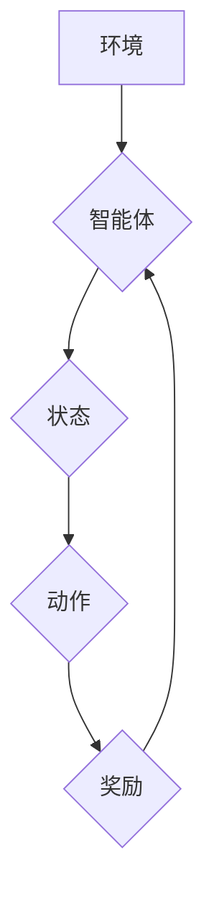

> Deep Q-Network (DQN), 泛化能力, 迁移学习, 强化学习, 神经网络, 机器学习

## 1. 背景介绍

在机器学习领域，深度学习的兴起掀起了前所未有的浪潮。其中，强化学习作为一种学习方式，通过智能体与环境的交互，学习最优策略，在解决复杂决策问题方面展现出强大的潜力。Deep Q-Network (DQN) 作为一种结合深度神经网络和强化学习的算法，在游戏领域取得了突破性的成就，例如 AlphaGo 和 OpenAI Five。然而，DQN 的泛化能力和迁移学习能力仍然是一个值得深入研究的问题。

DQN 的核心思想是利用深度神经网络来估计状态-动作值函数 (Q-value)，并通过最大化 Q-value 来选择最优动作。然而，传统的 DQN 算法在面对新的环境或任务时，往往需要从头开始训练，这会导致训练时间长、数据需求大等问题。因此，如何提高 DQN 的泛化能力和迁移学习能力，使其能够更有效地应用于现实世界中的复杂问题，成为了一个重要的研究方向。

## 2. 核心概念与联系

**2.1 强化学习**

强化学习是一种基于交互学习的机器学习方法，智能体通过与环境的交互，学习最优策略以最大化累积奖励。强化学习的核心要素包括：

* **智能体 (Agent):**  学习和决策的实体。
* **环境 (Environment):** 智能体所处的外部世界。
* **状态 (State):** 环境的当前状态。
* **动作 (Action):** 智能体可以采取的行动。
* **奖励 (Reward):** 环境对智能体动作的反馈。
* **策略 (Policy):** 智能体根据状态选择动作的规则。

**2.2 深度Q网络 (DQN)**

DQN 是一种结合深度神经网络和强化学习的算法，它利用深度神经网络来估计状态-动作值函数 (Q-value)，并通过最大化 Q-value 来选择最优动作。DQN 的核心思想是将 Q-value 函数表示为一个深度神经网络，并通过监督学习的方式训练该网络。

**2.3 泛化能力**

泛化能力是指模型在未见过的数据上也能表现良好的能力。一个具有良好泛化能力的模型，能够从有限的训练数据中学习到通用的知识，并应用于新的、未见过的数据。

**2.4 迁移学习**

迁移学习是指利用已学习到的知识来解决新的任务或问题。迁移学习可以分为以下几种类型：

* **知识迁移:** 将从源任务中学习到的知识迁移到目标任务。
* **参数迁移:** 将从源任务中训练好的模型参数迁移到目标任务。
* **特征迁移:** 将从源任务中提取的特征迁移到目标任务。

**2.5 Mermaid 流程图**



## 3. 核心算法原理 & 具体操作步骤

### 3.1 算法原理概述

DQN 算法的核心思想是利用深度神经网络来估计状态-动作值函数 (Q-value)，并通过最大化 Q-value 来选择最优动作。DQN 算法的主要步骤如下：

1. **初始化深度神经网络:**  DQN 算法使用一个深度神经网络来估计 Q-value，网络的结构可以根据具体任务进行调整。
2. **收集经验:** 智能体与环境交互，收集状态、动作、奖励和下一个状态的经验数据，并存储在经验池中。
3. **训练神经网络:** 从经验池中随机抽取样本，利用监督学习的方式训练深度神经网络，目标是使网络输出的 Q-value 与实际奖励的期望值相匹配。
4. **选择动作:** 在新的状态下，利用训练好的神经网络来估计不同动作的 Q-value，并选择 Q-value 最高的动作。

### 3.2 算法步骤详解

1. **初始化:** 
    * 初始化深度神经网络，其输入为状态，输出为每个动作对应的 Q-value。
    * 初始化经验池，用于存储智能体与环境交互的经验数据。
2. **收集经验:**
    * 智能体与环境交互，根据当前状态选择动作。
    * 记录当前状态、选择的动作、获得的奖励和下一个状态。
    * 将这些信息存储到经验池中。
3. **训练神经网络:**
    * 从经验池中随机抽取一个批次的样本。
    * 计算每个样本的 Q-target，即最大化 Q-value 的目标动作对应的 Q-value 加上折扣因子乘以下一个状态的 Q-value。
    * 使用梯度下降算法更新神经网络的权重，使网络输出的 Q-value 与 Q-target 尽量接近。
4. **选择动作:**
    * 在新的状态下，利用训练好的神经网络来估计每个动作对应的 Q-value。
    * 选择 Q-value 最高的动作作为智能体的行动。

### 3.3 算法优缺点

**优点:**

* 可以学习复杂决策问题。
* 可以利用深度神经网络学习复杂的特征表示。
* 训练过程相对简单。

**缺点:**

* 训练时间长，数据需求大。
* 容易陷入局部最优解。
* 泛化能力有限。

### 3.4 算法应用领域

DQN 算法在以下领域有广泛的应用:

* **游戏:** AlphaGo、OpenAI Five 等游戏 AI。
* **机器人控制:** 机器人导航、抓取等任务。
* **推荐系统:** 个性化推荐。
* **金融:** 股票交易、风险管理等。

## 4. 数学模型和公式 & 详细讲解 & 举例说明

### 4.1 数学模型构建

DQN 算法的核心是估计状态-动作值函数 (Q-value)，即在给定状态和动作的情况下，获得的累积奖励的期望值。数学模型可以表示为：

$$Q(s, a) = E[\sum_{t=0}^{\infty} \gamma^t r_{t+1} | s_t = s, a_t = a]$$

其中：

* $s$ 表示状态。
* $a$ 表示动作。
* $r_{t+1}$ 表示在时间步 $t+1$ 获得的奖励。
* $\gamma$ 表示折扣因子，控制未来奖励的权重。

### 4.2 公式推导过程

DQN 算法利用深度神经网络来估计 Q-value，网络的输出可以表示为：

$$Q(s, a) = f_{\theta}(s, a)$$

其中：

* $f_{\theta}(s, a)$ 表示深度神经网络的输出。
* $\theta$ 表示神经网络的权重。

DQN 算法的目标是通过最小化以下损失函数来更新神经网络的权重：

$$L(\theta) = E[(y - Q(s, a))^2]$$

其中：

* $y$ 表示 Q-target，即最大化 Q-value 的目标动作对应的 Q-value 加上折扣因子乘以下一个状态的 Q-value。

### 4.3 案例分析与讲解

假设一个智能体在玩一个简单的游戏，游戏环境有两种状态： "红灯" 和 "绿灯"，智能体可以选择两种动作： "前进" 和 "停止"。

* 当智能体在 "红灯" 状态下选择 "前进" 动作时，会获得 -1 的奖励。
* 当智能体在 "绿灯" 状态下选择 "前进" 动作时，会获得 1 的奖励。
* 当智能体在任何状态下选择 "停止" 动作时，会获得 0 的奖励。

DQN 算法可以学习到以下策略：

* 在 "红灯" 状态下选择 "停止" 动作。
* 在 "绿灯" 状态下选择 "前进" 动作。

## 5. 项目实践：代码实例和详细解释说明

### 5.1 开发环境搭建

* Python 3.6+
* TensorFlow 2.0+
* OpenAI Gym

### 5.2 源代码详细实现

```python
import tensorflow as tf
import numpy as np
from tensorflow.keras.models import Sequential
from tensorflow.keras.layers import Dense

# 定义 DQN 网络
class DQN(tf.keras.Model):
    def __init__(self):
        super(DQN, self).__init__()
        self.dense1 = Dense(64, activation='relu')
        self.dense2 = Dense(64, activation='relu')
        self.dense3 = Dense(2, activation='linear')

    def call(self, x):
        x = self.dense1(x)
        x = self.dense2(x)
        x = self.dense3(x)
        return x

# 初始化 DQN 网络
dqn = DQN()

# 定义损失函数和优化器
loss_fn = tf.keras.losses.MeanSquaredError()
optimizer = tf.keras.optimizers.Adam(learning_rate=0.001)

# 训练 DQN 网络
def train_dqn(state, action, reward, next_state, done):
    with tf.GradientTape() as tape:
        q_values = dqn(state)
        target_q_values = reward + gamma * tf.reduce_max(dqn(next_state), axis=1) * (1 - done)
        loss = loss_fn(target_q_values, q_values[tf.range(tf.shape(state)[0]), action])
    gradients = tape.gradient(loss, dqn.trainable_variables)
    optimizer.apply_gradients(zip(gradients, dqn.trainable_variables))

# ... (其他代码，例如收集经验、选择动作等)
```

### 5.3 代码解读与分析

* 代码首先定义了 DQN 网络的结构，使用三个全连接层和 ReLU 激活函数。
* 然后定义了损失函数和优化器，使用均方误差损失函数和 Adam 优化器。
* 训练函数 `train_dqn` 使用梯度下降算法更新神经网络的权重。
* 其他代码负责收集经验、选择动作等操作。

### 5.4 运行结果展示

训练完成后，可以将训练好的 DQN 模型应用于游戏环境中，观察智能体的行为。

## 6. 实际应用场景

DQN 算法在以下实际应用场景中展现出强大的潜力:

* **机器人控制:** DQN 可以用于训练机器人进行导航、抓取、避障等任务。
* **推荐系统:** DQN 可以用于个性化推荐，例如推荐电影、商品、新闻等。
* **金融:** DQN 可以用于股票交易、风险管理等金融领域。
* **医疗:** DQN 可以用于辅助诊断、制定治疗方案等医疗领域。

### 6.4 未来应用展望

随着深度学习技术的不断发展，DQN 算法的应用场景将会更加广泛。未来，DQN 算法可能会应用于以下领域:

* **自动驾驶:** DQN 可以用于训练自动驾驶汽车，使其能够在复杂道路环境中安全行驶。
* **无人机控制:** DQN 可以用于训练无人机进行自主飞行、任务执行等任务。
* **自然语言处理:** DQN 可以用于训练机器翻译、文本摘要等自然语言处理任务。

## 7. 工具和资源推荐

### 7.1 学习资源推荐

* **书籍:**
    * Deep Reinforcement Learning Hands-On by Maxim Lapan
    * Reinforcement Learning: An Introduction by Richard S. Sutton and Andrew G. Barto
* **在线课程:**
    * Deep Reinforcement Learning Specialization by DeepLearning.AI
    * Reinforcement Learning by David Silver (University of DeepMind)

### 7.2 开发工具推荐

* **TensorFlow:** 深度学习框架
* **PyTorch:** 深度学习框架
* **OpenAI Gym:** 强化学习环境

### 7.3 相关论文推荐

* Deep Reinforcement Learning with Double Q-learning by Hasselt et al. (2015)
* Dueling