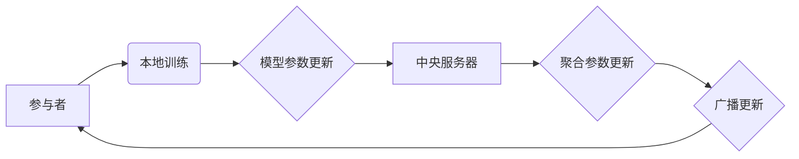

> 联邦学习，分布式训练，神经网络，隐私保护，数据安全，模型压缩

## 1. 背景介绍

在当今数据驱动时代，深度学习模型的训练离不开海量数据。然而，数据往往分散在不同的机构或用户手中，例如医疗机构、金融机构、社交平台等。直接将这些数据集中到一个中心进行训练，会引发严重的隐私泄露和数据安全问题。

联邦学习（Federated Learning，FL）应运而生，它是一种分布式机器学习方法，旨在训练全局模型而无需将原始数据传输到中央服务器。每个参与者（例如，用户设备、机构服务器）在本地训练模型，并将模型参数更新发送到中央服务器。中央服务器聚合所有参与者的参数更新，并将其广播回所有参与者，从而迭代地更新全局模型。

## 2. 核心概念与联系

**2.1 核心概念**

* **联邦学习（Federated Learning，FL）：**一种分布式机器学习方法，旨在训练全局模型而无需将原始数据传输到中央服务器。
* **参与者（Client）：**拥有本地数据的个体或机构，例如用户设备、服务器等。
* **中央服务器（Server）：**负责协调参与者，聚合模型参数更新，并广播更新给参与者。
* **全局模型（Global Model）：**由所有参与者共同训练的最终模型。
* **模型参数（Model Parameters）：**深度学习模型的权重和偏差等可训练参数。

**2.2 架构图**



**2.3 联系**

联邦学习将分布式计算与机器学习相结合，克服了数据集中带来的隐私泄露和安全风险，同时利用了分散的数据资源，提高了模型训练的效率和准确性。

## 3. 核心算法原理 & 具体操作步骤

**3.1 算法原理概述**

联邦学习的核心思想是将模型训练分散到多个参与者，每个参与者在本地训练模型，并将模型参数更新发送到中央服务器。中央服务器聚合所有参与者的参数更新，并将其广播回所有参与者，从而迭代地更新全局模型。

**3.2 算法步骤详解**

1. **初始化：**中央服务器将初始模型参数广播给所有参与者。
2. **本地训练：**每个参与者使用本地数据训练模型，并计算模型参数更新。
3. **参数聚合：**参与者将模型参数更新发送到中央服务器。中央服务器聚合所有参与者的参数更新，并生成全局模型参数更新。
4. **模型更新：**中央服务器将全局模型参数更新广播回所有参与者。
5. **重复步骤 2-4：**重复上述步骤，直到模型收敛或达到预设的训练轮数。

**3.3 算法优缺点**

**优点：**

* **隐私保护：**原始数据从未离开参与者的设备，有效保护了数据隐私。
* **数据安全：**分散的数据存储降低了数据泄露的风险。
* **数据利用率：**利用了分散的数据资源，提高了模型训练的效率和准确性。

**缺点：**

* **通信开销：**模型参数更新需要频繁传输，可能会导致通信开销较大。
* **模型不一致性：**参与者数据分布不均匀，可能会导致模型训练不一致。
* **安全风险：**恶意参与者可能会攻击系统，导致模型训练失败或数据泄露。

**3.4 算法应用领域**

* **医疗保健：**训练疾病诊断模型，保护患者隐私。
* **金融服务：**训练欺诈检测模型，提高金融安全。
* **物联网：**训练设备状态预测模型，优化设备维护。
* **个性化推荐：**训练用户个性化推荐模型，提高用户体验。

## 4. 数学模型和公式 & 详细讲解 & 举例说明

**4.1 数学模型构建**

假设有 $N$ 个参与者，每个参与者拥有本地数据集 $D_i$。全局模型参数为 $\theta$，每个参与者在本地训练模型后获得的模型参数更新为 $\Delta \theta_i$。

**4.2 公式推导过程**

联邦学习的目标是训练一个全局模型 $\theta^*$，使得其在所有参与者数据集上的性能最佳。

中央服务器聚合所有参与者的参数更新，得到全局模型参数更新：

$$\Delta \theta = \frac{1}{N} \sum_{i=1}^{N} \Delta \theta_i$$

全局模型参数更新为：

$$\theta^* = \theta + \Delta \theta$$

**4.3 案例分析与讲解**

假设有三个参与者，每个参与者拥有 100 个样本的数据集。每个参与者训练模型后，获得的模型参数更新分别为 $\Delta \theta_1 = [0.1, 0.2, 0.3]$，$\Delta \theta_2 = [0.2, 0.3, 0.4]$，$\Delta \theta_3 = [0.3, 0.4, 0.5]$。

中央服务器聚合所有参与者的参数更新：

$$\Delta \theta = \frac{1}{3} ([0.1, 0.2, 0.3] + [0.2, 0.3, 0.4] + [0.3, 0.4, 0.5]) = [0.2, 0.3, 0.4]$$

全局模型参数更新为：

$$\theta^* = \theta + [0.2, 0.3, 0.4]$$

## 5. 项目实践：代码实例和详细解释说明

**5.1 开发环境搭建**

* Python 3.7+
* TensorFlow 2.0+
* PyTorch 1.0+

**5.2 源代码详细实现**

```python
# 参与者代码示例
import tensorflow as tf

# 训练模型并获取参数更新
def train_model(data):
    # ... 训练模型代码 ...
    return model_parameters_update

# 发送参数更新到中央服务器
def send_update(update):
    # ... 发送更新代码 ...

# 接收全局模型参数更新
def receive_update(update):
    # ... 更新模型代码 ...

# 中央服务器代码示例
import numpy as np

# 聚合所有参与者的参数更新
def aggregate_updates(updates):
    return np.mean(updates, axis=0)

# 广播全局模型参数更新
def broadcast_update(update):
    # ... 广播更新代码 ...
```

**5.3 代码解读与分析**

* 参与者代码：每个参与者训练模型并计算模型参数更新，然后将更新发送到中央服务器。
* 中央服务器代码：中央服务器聚合所有参与者的参数更新，并将其广播回所有参与者。

**5.4 运行结果展示**

运行联邦学习模型，可以观察到全局模型的性能随着训练轮数的增加而提升。

## 6. 实际应用场景

**6.1 医疗保健**

* 训练疾病诊断模型，例如癌症检测、糖尿病预测等，保护患者隐私。

**6.2 金融服务**

* 训练欺诈检测模型，例如信用卡欺诈、网络钓鱼攻击等，提高金融安全。

**6.3 物联网**

* 训练设备状态预测模型，例如传感器故障预测、设备维护优化等，提高设备可靠性。

**6.4 个性化推荐**

* 训练用户个性化推荐模型，例如商品推荐、内容推荐等，提高用户体验。

**6.5 未来应用展望**

联邦学习在未来将有更广泛的应用场景，例如：

* **自动驾驶：**训练自动驾驶模型，利用分散的驾驶数据提高模型性能。
* **语音识别：**训练语音识别模型，利用分散的语音数据提高模型准确性。
* **自然语言处理：**训练自然语言处理模型，例如机器翻译、文本摘要等，利用分散的文本数据提高模型效果。

## 7. 工具和资源推荐

**7.1 学习资源推荐**

* **论文：**
    * Federated Learning: Strategies for Improving Communication Efficiency
    * Communication-Efficient Learning of Deep Networks from Decentralized Data
* **博客：**
    * TensorFlow Federated: https://www.tensorflow.org/federated
    * PySyft: https://www.openmined.org/

**7.2 开发工具推荐**

* **TensorFlow Federated:** https://www.tensorflow.org/federated
* **PySyft:** https://www.openmined.org/
* **Flower:** https://flower.dev/

**7.3 相关论文推荐**

* **Federated Learning: Collaborative Machine Learning Without Centralized Training Data**
* **Communication-Efficient Learning of Deep Networks from Decentralized Data**
* **Federated Averaging: A Communication-Efficient Distributed Learning Method**

## 8. 总结：未来发展趋势与挑战

**8.1 研究成果总结**

联邦学习在隐私保护、数据安全、数据利用率等方面取得了显著的成果，并得到了广泛的应用。

**8.2 未来发展趋势**

* **模型压缩：**降低模型参数量，减少通信开销。
* **个性化联邦学习：**根据参与者的数据分布和需求，个性化训练模型。
* **安全联邦学习：**提高系统安全性，防止恶意攻击。

**8.3 面临的挑战**

* **数据不一致性：**参与者数据分布不均匀，可能会导致模型训练不一致。
* **通信开销：**模型参数更新需要频繁传输，可能会导致通信开销较大。
* **安全风险：**恶意参与者可能会攻击系统，导致模型训练失败或数据泄露。

**8.4 研究展望**

未来研究将重点关注解决联邦学习面临的挑战，提高模型训练的效率和准确性，并将其应用于更多领域。

## 9. 附录：常见问题与解答

**9.1 Q：联邦学习与传统机器学习有什么区别？**

**A：**传统机器学习需要将所有数据集中到一个中心进行训练，而联邦学习则将模型训练分散到多个参与者，每个参与者在本地训练模型，并将模型参数更新发送到中央服务器。

**9.2 Q：联邦学习如何保证数据隐私？**

**A：**联邦学习的核心思想是将模型训练分散到多个参与者，原始数据从未离开参与者的设备，从而有效保护了数据隐私。

**9.3 Q：联邦学习有哪些应用场景？**

**A：**联邦学习在医疗保健、金融服务、物联网、个性化推荐等领域都有广泛的应用场景。


作者：禅与计算机程序设计艺术 / Zen and the Art of Computer Programming 
<end_of_turn>