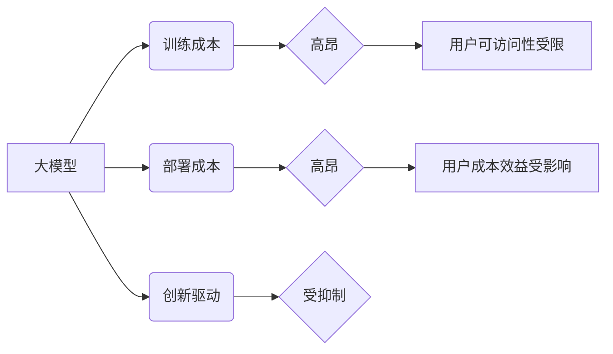

> 大模型，价格，用户影响，成本效益，可访问性，公平性，商业模式

## 1. 背景介绍

近年来，大模型（Large Language Models，LLMs）在自然语言处理、计算机视觉、代码生成等领域取得了突破性进展，展现出强大的应用潜力。然而，大模型的训练和部署成本极高，这使得其应用范围受到限制，也引发了关于大模型价格对用户影响的讨论。

大模型的训练需要海量数据和强大的计算资源，这导致其训练成本非常高昂。此外，大模型的部署也需要大量的计算资源和存储空间，这进一步增加了运营成本。这些高昂的成本使得大模型难以普及，只有具备充足资金和技术实力的企业或机构才能负担得起。

## 2. 核心概念与联系

大模型的价格影响着用户在以下几个方面：

* **可访问性:** 价格高的模型会限制用户的使用范围，只有经济实力较强的用户才能获得使用权。这会导致大模型技术的不公平分配，不利于推动科技进步和社会发展。
* **成本效益:** 用户在使用大模型时需要考虑其成本效益。如果模型的价格过高，而其带来的收益不足以抵消成本，那么用户就不会选择使用该模型。
* **创新驱动:** 高昂的价格可能会抑制用户的创新热情，因为用户担心投入大量资金后无法获得足够的回报。这将阻碍大模型技术的进一步发展和应用。

**核心概念与联系流程图:**



## 3. 核心算法原理 & 具体操作步骤

大模型的训练通常采用深度学习算法，例如Transformer模型。

### 3.1  算法原理概述

Transformer模型是一种基于注意力机制的序列到序列模型，能够有效地捕捉文本中的长距离依赖关系。其核心结构包括编码器和解码器，编码器用于将输入序列编码成上下文向量，解码器则根据上下文向量生成输出序列。

### 3.2  算法步骤详解

1. **数据预处理:** 将文本数据进行清洗、分词、词嵌入等预处理操作。
2. **编码器训练:** 使用训练数据训练编码器，使其能够将输入序列编码成上下文向量。
3. **解码器训练:** 使用训练数据训练解码器，使其能够根据上下文向量生成输出序列。
4. **模型评估:** 使用测试数据评估模型的性能，例如准确率、困惑度等。
5. **模型调优:** 根据评估结果对模型参数进行调优，提高模型性能。

### 3.3  算法优缺点

**优点:**

* 能够有效地捕捉文本中的长距离依赖关系。
* 训练速度快，性能优异。

**缺点:**

* 训练成本高昂，需要大量的计算资源和数据。
* 模型参数量大，部署成本较高。

### 3.4  算法应用领域

* 自然语言理解
* 机器翻译
* 文本生成
* 代码生成
* 聊天机器人

## 4. 数学模型和公式 & 详细讲解 & 举例说明

Transformer模型的训练基于深度学习算法，其核心是优化模型参数以最小化预测误差。

### 4.1  数学模型构建

Transformer模型的损失函数通常采用交叉熵损失函数，其表达式如下：

$$
L = -\sum_{i=1}^{N} y_i \log \hat{y}_i
$$

其中：

* $N$ 是样本数量
* $y_i$ 是真实标签
* $\hat{y}_i$ 是模型预测的概率

### 4.2  公式推导过程

交叉熵损失函数的推导过程基于概率论和信息论的原理。其目标是衡量模型预测结果与真实标签之间的差异。

### 4.3  案例分析与讲解

假设我们训练一个文本分类模型，其目标是将文本分类为正类或负类。训练数据包含100个样本，其中50个样本为正类，50个样本为负类。模型预测结果如下：

* 正类样本预测概率：0.8, 0.9, 0.7, ..., 0.6
* 负类样本预测概率：0.2, 0.1, 0.3, ..., 0.4

使用交叉熵损失函数计算模型的损失值，并根据损失值进行模型参数更新。

## 5. 项目实践：代码实例和详细解释说明

以下是一个使用TensorFlow框架训练Transformer模型的代码示例：

### 5.1  开发环境搭建

* 安装Python 3.x
* 安装TensorFlow库
* 安装其他依赖库，例如NumPy、pandas等

### 5.2  源代码详细实现

```python
import tensorflow as tf

# 定义Transformer模型
class Transformer(tf.keras.Model):
    def __init__(self, vocab_size, embedding_dim, num_heads, num_layers):
        super(Transformer, self).__init__()
        self.embedding = tf.keras.layers.Embedding(vocab_size, embedding_dim)
        self.transformer_layers = tf.keras.layers.StackedRNNCells([
            tf.keras.layers.MultiHeadAttention(num_heads=num_heads, key_dim=embedding_dim)
            for _ in range(num_layers)
        ])

    def call(self, inputs):
        x = self.embedding(inputs)
        x = self.transformer_layers(x)
        return x

# 训练模型
model = Transformer(vocab_size=10000, embedding_dim=128, num_heads=8, num_layers=6)
model.compile(optimizer='adam', loss='sparse_categorical_crossentropy', metrics=['accuracy'])
model.fit(train_data, train_labels, epochs=10)
```

### 5.3  代码解读与分析

* 代码定义了一个Transformer模型类，包含嵌入层、多头注意力层和堆叠的RNN单元。
* 模型使用Adam优化器、交叉熵损失函数和准确率指标进行训练。
* 训练过程使用训练数据和标签进行迭代训练，最终得到训练好的模型。

### 5.4  运行结果展示

训练完成后，可以使用测试数据评估模型的性能，例如计算准确率、困惑度等指标。

## 6. 实际应用场景

大模型在各个领域都有广泛的应用场景，例如：

* **自然语言理解:** 用于文本分类、情感分析、问答系统等。
* **机器翻译:** 将一种语言翻译成另一种语言。
* **文本生成:** 用于生成新闻文章、小说、诗歌等。
* **代码生成:** 自动生成代码，提高开发效率。
* **聊天机器人:** 用于与用户进行自然语言对话。

### 6.4  未来应用展望

随着大模型技术的不断发展，其应用场景将更加广泛，例如：

* **个性化推荐:** 根据用户的兴趣爱好推荐个性化内容。
* **自动驾驶:** 用于辅助驾驶决策，提高驾驶安全。
* **医疗诊断:** 用于辅助医生诊断疾病，提高诊断准确率。

## 7. 工具和资源推荐

### 7.1  学习资源推荐

* **书籍:**
    * 《深度学习》
    * 《自然语言处理》
* **在线课程:**
    * Coursera
    * edX
* **开源项目:**
    * TensorFlow
    * PyTorch

### 7.2  开发工具推荐

* **IDE:**
    * VS Code
    * PyCharm
* **深度学习框架:**
    * TensorFlow
    * PyTorch
* **云计算平台:**
    * AWS
    * Azure
    * Google Cloud

### 7.3  相关论文推荐

* 《Attention Is All You Need》
* 《BERT: Pre-training of Deep Bidirectional Transformers for Language Understanding》
* 《GPT-3: Language Models are Few-Shot Learners》

## 8. 总结：未来发展趋势与挑战

大模型技术发展迅速，其应用潜力巨大，但也面临着一些挑战。

### 8.1  研究成果总结

* 大模型的性能不断提升，应用场景不断拓展。
* 训练和部署大模型的成本逐渐降低。
* 大模型的安全性、可靠性和可解释性等问题得到越来越多的关注。

### 8.2  未来发展趋势

* 模型规模将继续扩大，性能将进一步提升。
* 多模态大模型将成为主流，能够处理多种数据类型。
* 大模型的应用将更加广泛，渗透到各个领域。

### 8.3  面临的挑战

* 训练和部署大模型的成本仍然较高。
* 大模型的安全性、可靠性和可解释性等问题需要进一步解决。
* 大模型的公平性、伦理性和社会影响需要得到重视。

### 8.4  研究展望

* 研究更高效、更低成本的训练和部署方法。
* 开发更安全、更可靠、更可解释的大模型。
* 探索大模型的伦理和社会影响，推动其健康发展。

## 9. 附录：常见问题与解答

* **Q: 如何选择合适的模型？**
* **A:** 选择模型需要考虑应用场景、数据规模、计算资源等因素。

* **Q: 如何训练大模型？**
* **A:** 训练大模型需要使用深度学习框架，例如TensorFlow或PyTorch，并根据具体任务进行模型设计和参数调优。

* **Q: 如何部署大模型？**
* **A:** 大模型的部署方式包括云端部署、边缘部署和本地部署等。

* **Q: 大模型的安全性如何保证？**
* **A:** 大模型的安全性需要从多个方面考虑，例如数据安全、模型安全和攻击防御等。

* **Q: 大模型的伦理问题如何解决？**
* **A:** 大模型的伦理问题需要得到社会各界的关注和讨论，并制定相应的规范和制度。


作者：禅与计算机程序设计艺术 / Zen and the Art of Computer Programming 
<end_of_turn>