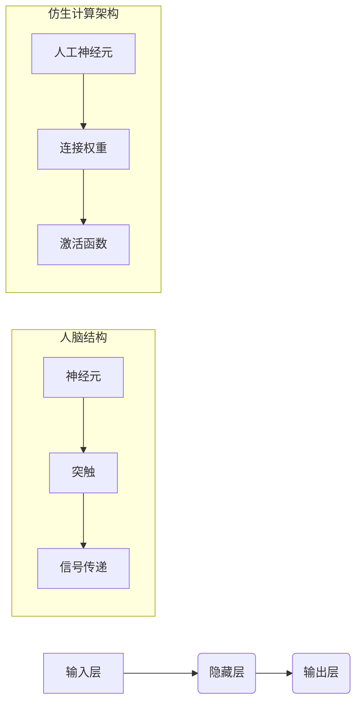

> 仿生计算，神经网络，人脑，AI架构，深度学习，生物启发

## 1. 背景介绍

人工智能（AI）近年来取得了令人瞩目的进展，从语音识别到图像生成，AI已经渗透到我们生活的方方面面。然而，传统的基于符号的AI方法在处理复杂、非结构化数据方面仍然存在局限性。 

受生物神经网络的启发，仿生计算应运而生。它旨在借鉴人脑的结构和功能，构建更强大、更智能的AI系统。仿生计算的核心思想是将计算任务分解成许多简单的、并行处理的单元，并通过学习和适应来提高性能。

## 2. 核心概念与联系

仿生计算的核心概念是模仿人脑的结构和功能。人脑由数十亿的神经元组成，这些神经元通过复杂的连接网络相互传递信息。当神经元接收足够强烈的刺激时，就会产生电信号，并传递给其他神经元。这种连接和传递的过程形成了人脑的学习和推理机制。

仿生计算试图通过构建类似于人脑的神经网络来实现类似的功能。这些神经网络由人工神经元组成，每个神经元都接收来自其他神经元的输入，并根据一定的规则进行处理，然后将处理后的结果传递给其他神经元。

**仿生计算架构流程图:**



## 3. 核心算法原理 & 具体操作步骤

### 3.1  算法原理概述

仿生计算的核心算法是**反向传播算法**。该算法通过不断调整神经网络中连接权重来最小化预测误差。

反向传播算法的工作原理如下：

1. 将输入数据输入到神经网络中，并计算输出结果。
2. 将输出结果与实际目标值进行比较，计算误差。
3. 将误差反向传播到神经网络的各个层，并根据误差调整连接权重。
4. 重复步骤1-3，直到误差达到预设阈值。

### 3.2  算法步骤详解

1. **初始化连接权重:** 将神经网络中所有连接权重随机初始化。
2. **前向传播:** 将输入数据依次传递到神经网络的各个层，并计算每个神经元的输出值。
3. **计算误差:** 将神经网络的输出值与实际目标值进行比较，计算误差。
4. **反向传播:** 将误差反向传播到神经网络的各个层，并计算每个连接权重的梯度。
5. **更新连接权重:** 根据梯度下降算法，更新每个连接权重。
6. **重复步骤2-5:** 重复上述步骤，直到误差达到预设阈值。

### 3.3  算法优缺点

**优点:**

* 能够学习复杂、非线性关系。
* 具有强大的泛化能力。
* 可以处理大规模数据。

**缺点:**

* 训练时间长，计算资源消耗大。
* 容易陷入局部最优解。
* 模型解释性差。

### 3.4  算法应用领域

反向传播算法广泛应用于各种AI领域，例如：

* **图像识别:** 识别物体、场景、人脸等。
* **自然语言处理:** 机器翻译、文本摘要、情感分析等。
* **语音识别:** 将语音转换为文本。
* **推荐系统:** 根据用户历史行为推荐商品或内容。

## 4. 数学模型和公式 & 详细讲解 & 举例说明

### 4.1  数学模型构建

仿生计算的数学模型主要基于神经网络的结构和功能。一个典型的多层感知机（MLP）可以表示为：

$$
y = f(W^L x^L + b^L)
$$

其中：

* $y$ 是输出值。
* $x^L$ 是第 $L$ 层的输入值。
* $W^L$ 是第 $L$ 层的权重矩阵。
* $b^L$ 是第 $L$ 层的偏置向量。
* $f$ 是激活函数。

### 4.2  公式推导过程

反向传播算法的核心是计算每个连接权重的梯度。梯度表示权重变化的方向和幅度。

梯度计算公式如下：

$$
\frac{\partial E}{\partial w_{ij}^l} = \frac{\partial E}{\partial y} \cdot \frac{\partial y}{\partial x^l} \cdot \frac{\partial x^l}{\partial w_{ij}^l}
$$

其中：

* $E$ 是误差函数。
* $w_{ij}^l$ 是第 $l$ 层第 $i$ 个神经元到第 $j$ 个神经元的连接权重。

### 4.3  案例分析与讲解

假设我们有一个简单的感知机，用于分类手写数字。输入数据是数字的像素值，输出是数字的类别。

通过反向传播算法，我们可以训练感知机，使其能够准确地识别手写数字。

## 5. 项目实践：代码实例和详细解释说明

### 5.1  开发环境搭建

本项目使用Python语言和TensorFlow框架进行开发。

需要安装以下软件：

* Python 3.x
* TensorFlow 2.x
* NumPy
* Matplotlib

### 5.2  源代码详细实现

```python
import tensorflow as tf

# 定义模型
model = tf.keras.models.Sequential([
    tf.keras.layers.Dense(128, activation='relu', input_shape=(784,)),
    tf.keras.layers.Dense(10, activation='softmax')
])

# 编译模型
model.compile(optimizer='adam',
              loss='sparse_categorical_crossentropy',
              metrics=['accuracy'])

# 加载MNIST数据集
(x_train, y_train), (x_test, y_test) = tf.keras.datasets.mnist.load_data()

# 数据预处理
x_train = x_train.reshape(-1, 784).astype('float32') / 255
x_test = x_test.reshape(-1, 784).astype('float32') / 255

# 训练模型
model.fit(x_train, y_train, epochs=5)

# 评估模型
loss, accuracy = model.evaluate(x_test, y_test)
print('Test loss:', loss)
print('Test accuracy:', accuracy)
```

### 5.3  代码解读与分析

这段代码定义了一个简单的多层感知机模型，并使用MNIST数据集进行训练。

* `tf.keras.models.Sequential` 创建了一个顺序模型，其中层级依次连接。
* `tf.keras.layers.Dense` 定义了一个全连接层，每个神经元都连接到上一层的每个神经元。
* `activation='relu'` 指定了ReLU激活函数。
* `optimizer='adam'` 指定了Adam优化器。
* `loss='sparse_categorical_crossentropy'` 指定了分类交叉熵损失函数。
* `metrics=['accuracy']` 指定了准确率作为评估指标。

### 5.4  运行结果展示

训练完成后，模型可以用来预测新的手写数字。

## 6. 实际应用场景

仿生计算在各个领域都有着广泛的应用场景：

### 6.1  医疗诊断

仿生计算可以用于分析医学图像，辅助医生诊断疾病。例如，可以用于识别肿瘤、骨折等。

### 6.2  金融风险管理

仿生计算可以用于分析金融数据，识别潜在的风险。例如，可以用于预测股票价格波动、识别欺诈交易等。

### 6.3  智能制造

仿生计算可以用于优化生产流程，提高生产效率。例如，可以用于预测设备故障、控制机器人运动等。

### 6.4  未来应用展望

随着仿生计算技术的不断发展，未来将有更多新的应用场景出现。例如，可以用于开发更智能的机器人、虚拟助手、自动驾驶系统等。

## 7. 工具和资源推荐

### 7.1  学习资源推荐

* **书籍:**
    * 《Deep Learning》 by Ian Goodfellow, Yoshua Bengio, and Aaron Courville
    * 《Hands-On Machine Learning with Scikit-Learn, Keras & TensorFlow》 by Aurélien Géron
* **在线课程:**
    * Coursera: Deep Learning Specialization
    * Udacity: Deep Learning Nanodegree

### 7.2  开发工具推荐

* **TensorFlow:** https://www.tensorflow.org/
* **PyTorch:** https://pytorch.org/
* **Keras:** https://keras.io/

### 7.3  相关论文推荐

* **AlexNet:** http://papers.nips.cc/paper/4824-imagenet-classification-with-deep-convolutional-neural-networks.pdf
* **VGGNet:** http://arxiv.org/abs/1409.1556
* **ResNet:** http://arxiv.org/abs/1512.03385

## 8. 总结：未来发展趋势与挑战

### 8.1  研究成果总结

仿生计算取得了显著的进展，在图像识别、自然语言处理等领域取得了突破性成果。

### 8.2  未来发展趋势

未来仿生计算的发展趋势包括：

* **更深层次的网络结构:** 探索更深、更复杂的网络结构，提高模型的表达能力。
* **更有效的训练算法:** 开发更有效的训练算法，降低训练时间和资源消耗。
* **更强的泛化能力:** 提高模型的泛化能力，使其能够更好地适应新的数据和任务。
* **更强的解释性:** 提高模型的解释性，使其能够更好地被理解和信任。

### 8.3  面临的挑战

仿生计算仍然面临一些挑战：

* **数据获取和标注:** 训练高质量的仿生计算模型需要大量的标注数据，这在某些领域仍然是一个难题。
* **计算资源:** 训练大型的仿生计算模型需要大量的计算资源，这对于个人开发者和小型企业来说是一个障碍。
* **模型解释性:** 仿生计算模型的内部机制仍然比较复杂，难以解释其决策过程，这限制了其在一些安全敏感领域的应用。

### 8.4  研究展望

未来，仿生计算将继续朝着更智能、更强大、更安全的方向发展。随着技术的进步，仿生计算将为我们带来更多新的应用和价值。

## 9. 附录：常见问题与解答

**Q1: 仿生计算和深度学习有什么区别？**

**A1:** 深度学习是仿生计算的一种具体实现方式，它使用多层神经网络来学习数据特征。

**Q2: 仿生计算的应用场景有哪些？**

**A2:** 仿生计算的应用场景非常广泛，包括医疗诊断、金融风险管理、智能制造等。

**Q3: 如何学习仿生计算？**

**A3:** 可以通过阅读相关书籍、在线课程、参加培训等方式学习仿生计算。

作者：禅与计算机程序设计艺术 / Zen and the Art of Computer Programming


<end_of_turn>