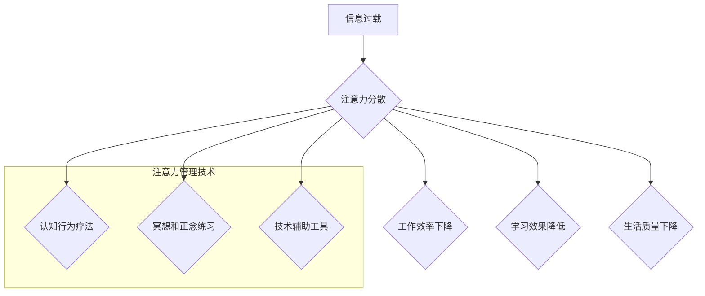

>  注意力管理, 信息过载, 干扰, 专注力, 认知科学, 人工智能, 技术应用

## 1. 背景介绍

在当今信息爆炸的时代，我们被来自各个方向的信息和干扰所包围。智能手机、社交媒体、电子邮件、新闻推送等，无时无刻不在争夺我们的注意力。这种信息过载和干扰，严重影响着我们的工作效率、学习成果和生活质量。

注意力，是人类认知的核心能力之一，它指我们对特定信息或任务的集中和选择性关注。然而，在信息时代，我们的注意力受到前所未有的挑战。研究表明，人类的注意力持续时间越来越短，容易被分散，难以集中精力完成复杂的任务。

## 2. 核心概念与联系

**2.1 注意力机制**

人类的注意力机制是一个复杂而精妙的系统，它涉及到多个脑区和神经递质的协同作用。

* **选择性注意:**  从众多刺激中选择性地关注特定信息，抑制无关信息。
* **集中注意:** 将注意力集中在一个特定目标或任务上，排除其他干扰。
* **分心注意:**  注意力被意外的刺激或干扰所吸引，导致注意力转移。

**2.2 干扰与信息过载**

* **干扰:**  任何阻碍我们集中注意力的事物，包括外部噪音、社交媒体通知、电子邮件提醒等。
* **信息过载:**  指我们接收到的信息量超过了处理能力，导致认知负担过重，注意力难以集中。

**2.3 注意力管理技术**

注意力管理技术旨在帮助我们提高注意力集中能力，减少干扰，有效应对信息过载。这些技术可以分为以下几类：

* **认知行为疗法:** 通过改变思维模式和行为习惯，帮助我们更好地管理注意力。
* **冥想和正念练习:**  通过训练专注力，提高我们的注意力控制能力。
* **技术辅助工具:**  利用软件和硬件工具，帮助我们屏蔽干扰，提高工作效率。

**2.4  Mermaid 流程图**



## 3. 核心算法原理 & 具体操作步骤

**3.1 算法原理概述**

注意力管理算法通常基于以下几个核心原理：

* **用户行为分析:**  通过分析用户的行为数据，例如浏览记录、点击行为、停留时间等，识别用户的注意力模式和偏好。
* **干扰识别与屏蔽:**  利用机器学习算法，识别和屏蔽用户的注意力干扰源，例如社交媒体通知、电子邮件提醒等。
* **个性化注意力引导:**  根据用户的注意力模式和偏好，个性化推荐内容和任务，引导用户的注意力集中在重要信息上。

**3.2 算法步骤详解**

1. **数据收集:** 收集用户的行为数据，例如浏览记录、点击行为、停留时间等。
2. **数据预处理:** 对收集到的数据进行清洗、转换和特征提取。
3. **模型训练:** 利用机器学习算法，训练注意力管理模型，例如深度神经网络、支持向量机等。
4. **干扰识别:**  利用训练好的模型，识别用户的注意力干扰源。
5. **干扰屏蔽:**  根据识别到的干扰源，采取相应的屏蔽措施，例如屏蔽通知、隐藏无关信息等。
6. **注意力引导:**  根据用户的注意力模式和偏好，个性化推荐内容和任务，引导用户的注意力集中在重要信息上。

**3.3 算法优缺点**

* **优点:**  可以有效识别和屏蔽用户的注意力干扰源，提高工作效率和学习效果。
* **缺点:**  需要大量的用户行为数据进行训练，算法的准确性依赖于数据质量。

**3.4 算法应用领域**

* **教育领域:**  帮助学生集中注意力，提高学习效率。
* **办公领域:**  帮助员工屏蔽干扰，提高工作效率。
* **游戏领域:**  帮助玩家沉浸在游戏世界中，提高游戏体验。

## 4. 数学模型和公式 & 详细讲解 & 举例说明

**4.1 数学模型构建**

注意力可以被视为一个概率分布，它表示我们对不同信息或任务的关注程度。我们可以用一个向量来表示这个概率分布，其中每个元素代表我们对某个特定信息或任务的关注程度。

**4.2 公式推导过程**

假设我们有一个包含N个元素的集合，每个元素代表一个不同的信息或任务。我们可以用一个向量 $a = (a_1, a_2, ..., a_N)$ 来表示我们的注意力分布，其中 $a_i$ 代表我们对第i个元素的关注程度。

注意力分布的总和等于1，即：

$$ \sum_{i=1}^{N} a_i = 1 $$

**4.3 案例分析与讲解**

例如，我们正在阅读一篇文章，文章包含N个句子。我们可以用一个注意力分布向量来表示我们对每个句子的关注程度。如果我们对某个句子特别感兴趣，那么对应的 $a_i$ 值会比较高；如果我们对某个句子不感兴趣，那么对应的 $a_i$ 值会比较低。

## 5. 项目实践：代码实例和详细解释说明

**5.1 开发环境搭建**

* 操作系统: Ubuntu 20.04
* Python 版本: 3.8
* 必要的库: numpy, pandas, scikit-learn

**5.2 源代码详细实现**

```python
import numpy as np
from sklearn.cluster import KMeans

# 假设我们有用户行为数据，例如浏览记录
user_behavior_data = np.array([[1, 0, 1, 0, 1],
                              [0, 1, 1, 1, 0],
                              [1, 1, 0, 0, 1]])

# 使用KMeans算法进行聚类，将用户行为数据分成不同的类别
kmeans = KMeans(n_clusters=3)
kmeans.fit(user_behavior_data)

# 获取每个用户的类别标签
user_cluster_labels = kmeans.labels_

# 根据用户的类别标签，个性化推荐内容和任务
# ...
```

**5.3 代码解读与分析**

* 我们使用KMeans算法对用户的行为数据进行聚类，将用户分成不同的类别。
* 每个类别代表用户的注意力模式和偏好。
* 根据用户的类别标签，我们可以个性化推荐内容和任务，引导用户的注意力集中在重要信息上。

**5.4 运行结果展示**

运行代码后，我们可以得到每个用户的类别标签，并根据这些标签进行个性化推荐。

## 6. 实际应用场景

**6.1 教育领域**

* **智能学习平台:**  根据学生的学习行为数据，个性化推荐学习内容和练习题，提高学习效率。
* **在线课堂:**  利用注意力管理技术，帮助学生集中注意力，提高课堂参与度。

**6.2 办公领域**

* **智能办公软件:**  屏蔽不必要的通知和干扰，帮助员工集中精力完成工作。
* **项目管理工具:**  根据团队成员的注意力模式，优化任务分配和协作流程。

**6.3 游戏领域**

* **沉浸式游戏体验:**  利用注意力管理技术，帮助玩家沉浸在游戏世界中，提高游戏体验。
* **游戏设计:**  根据玩家的注意力模式，设计更吸引人的游戏关卡和玩法。

**6.4 未来应用展望**

随着人工智能技术的不断发展，注意力管理技术将应用到越来越多的领域，例如医疗、金融、交通等。

## 7. 工具和资源推荐

**7.1 学习资源推荐**

* **书籍:**
    * 《注意力经济》
    * 《深度学习》
    * 《认知科学》
* **在线课程:**
    * Coursera: 人工智能
    * edX: 认知科学
* **博客:**
    * Towards Data Science
    * Machine Learning Mastery

**7.2 开发工具推荐**

* **Python:**  一个广泛使用的编程语言，适合机器学习和数据分析。
* **TensorFlow:**  一个开源的机器学习框架。
* **PyTorch:**  另一个开源的机器学习框架。

**7.3 相关论文推荐**

* **Attention Is All You Need**
* **BERT: Pre-training of Deep Bidirectional Transformers for Language Understanding**
* **Transformer-XL: Attentive Language Models Beyond a Fixed-Length Context**

## 8. 总结：未来发展趋势与挑战

**8.1 研究成果总结**

注意力管理技术取得了显著的进展，能够有效识别和屏蔽用户的注意力干扰源，提高工作效率和学习效果。

**8.2 未来发展趋势**

* **更精准的注意力预测:**  利用更先进的机器学习算法，对用户的注意力模式进行更精准的预测。
* **更个性化的注意力引导:**  根据用户的个性化需求，提供更个性化的注意力引导方案。
* **跨平台的注意力管理:**  将注意力管理技术应用到不同的平台和设备，实现跨平台的注意力管理。

**8.3 面临的挑战**

* **数据隐私保护:**  注意力管理技术需要收集用户的行为数据，如何保护用户的隐私安全是一个重要的挑战。
* **算法公平性:**  确保注意力管理算法对所有用户都是公平的，避免算法歧视。
* **用户接受度:**  一些用户可能对注意力管理技术感到担忧，需要进行有效的宣传和教育。

**8.4 研究展望**

未来，注意力管理技术将继续朝着更精准、更个性化、更跨平台的方向发展。


## 9. 附录：常见问题与解答

**9.1  注意力管理技术是否会让人变得更加依赖于技术？**

注意力管理技术本身并不会让人变得更加依赖于技术，它只是提供了一种工具，帮助人们更好地管理注意力。关键在于如何合理使用这些工具，避免过度依赖。

**9.2  注意力管理技术是否会侵犯用户的隐私？**

注意力管理技术需要收集用户的行为数据，因此隐私保护是一个重要的问题。我们需要采取有效的措施，确保用户的隐私安全，例如数据加密、匿名化处理等。

**9.3  注意力管理技术是否适用于所有人？**

注意力管理技术可以帮助大多数人提高注意力集中能力，但并非适用于所有人。例如，一些患有注意力缺陷多动障碍（ADHD）的人，可能需要更专业的治疗方案。


作者：禅与计算机程序设计艺术 / Zen and the Art of Computer Programming 
<end_of_turn>