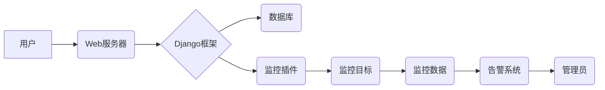

> Django, 服务器监控, 监控系统, 实时数据, 告警机制, 数据可视化

## 1. 背景介绍

随着互联网技术的快速发展，服务器作为网络应用的核心基础设施，其稳定性和可靠性至关重要。服务器监控系统能够实时监测服务器运行状态，及时发现潜在问题，并采取相应的措施，保障服务器的正常运行。传统的服务器监控系统往往依赖于手工操作和单点监控，效率低下，难以应对复杂的网络环境。

基于Django框架的服务器监控系统，能够提供更加高效、灵活、可扩展的监控解决方案。Django是一个开源的Python Web框架，拥有强大的功能和丰富的生态系统，能够快速搭建高性能的Web应用。

## 2. 核心概念与联系

### 2.1 核心概念

* **服务器监控:** 指对服务器硬件、软件、网络等方面的运行状态进行实时监测和分析，以确保服务器的稳定运行。
* **监控指标:** 指服务器运行状态的具体表现，例如CPU使用率、内存使用率、磁盘空间、网络流量等。
* **告警机制:** 当监控指标超出预设阈值时，系统会自动触发告警，通知管理员及时处理。
* **数据可视化:** 将监控数据以图表、仪表盘等形式展示，方便管理员直观了解服务器运行状况。

### 2.2 架构设计



**架构说明:**

* 用户通过Web浏览器访问Web服务器，获取监控数据和操作界面。
* Django框架负责处理用户请求、数据交互和业务逻辑。
* 数据库用于存储监控数据和用户配置信息。
* 监控插件负责采集监控目标的运行状态数据。
* 监控目标包括服务器、网络设备、应用等。
* 告警系统根据监控数据触发告警，并通知管理员。

## 3. 核心算法原理 & 具体操作步骤

### 3.1 算法原理概述

服务器监控系统主要采用以下算法原理：

* **数据采集:** 使用SNMP、SSH、HTTP等协议，从监控目标采集运行状态数据。
* **数据处理:** 对采集到的数据进行清洗、转换、聚合等处理，生成可分析的监控指标。
* **数据存储:** 将处理后的数据存储到数据库中，方便后续查询和分析。
* **告警触发:** 根据预设阈值，判断监控指标是否异常，并触发告警机制。
* **数据可视化:** 使用图表、仪表盘等形式，将监控数据可视化展示。

### 3.2 算法步骤详解

1. **数据采集:** 监控插件根据监控目标的类型，选择合适的协议和方法进行数据采集。例如，可以使用SNMP协议采集服务器的CPU使用率、内存使用率等指标。
2. **数据处理:** 收集到的原始数据可能包含噪声和冗余信息，需要进行清洗和转换。例如，将CPU使用率从百分比格式转换为整数格式。
3. **数据存储:** 处理后的数据存储到数据库中，可以使用时间序列数据库，例如InfluxDB，高效存储和查询大量时间序列数据。
4. **告警触发:** 定期查询数据库中的监控指标，判断是否超出预设阈值。如果超出阈值，则触发告警机制，发送邮件、短信或其他方式通知管理员。
5. **数据可视化:** 使用Django的模板引擎和图表库，将监控数据以图表、仪表盘等形式展示，方便管理员直观了解服务器运行状况。

### 3.3 算法优缺点

**优点:**

* **实时性:** 能够实时采集和展示服务器运行状态数据。
* **灵活性:** 可以根据不同的监控目标和需求，定制不同的监控指标和告警规则。
* **可扩展性:** 可以通过添加新的监控插件，扩展监控范围。

**缺点:**

* **复杂度:** 系统架构复杂，需要专业的技术人员进行开发和维护。
* **成本:** 需要投入一定的硬件和软件成本。

### 3.4 算法应用领域

服务器监控系统广泛应用于以下领域:

* **企业IT运维:** 监控企业内部服务器的运行状态，保障业务稳定运行。
* **云计算平台:** 监控云服务器的资源使用情况，优化资源分配。
* **网络安全:** 监控网络设备的运行状态，及时发现安全威胁。

## 4. 数学模型和公式 & 详细讲解 & 举例说明

### 4.1 数学模型构建

服务器监控系统中，可以使用数学模型来描述服务器资源的利用率和性能指标。例如，CPU使用率可以表示为：

$$CPU使用率 = \frac{CPU占用时间}{总时间} \times 100\%$$

其中，CPU占用时间是指CPU在某个时间段内执行任务的时间，总时间是指该时间段的总时长。

### 4.2 公式推导过程

CPU使用率公式的推导过程如下：

1. 假设CPU在某个时间段内执行任务的时间为$t_1$，总时间为$t_2$。
2. CPU使用率定义为CPU在总时间内执行任务的时间占总时间的比例。
3. 因此，CPU使用率可以表示为：

$$CPU使用率 = \frac{t_1}{t_2} \times 100\%$$

### 4.3 案例分析与讲解

假设服务器的CPU占用时间为10分钟，总时间为60分钟，则CPU使用率为：

$$CPU使用率 = \frac{10分钟}{60分钟} \times 100\% = 16.67\%$$

## 5. 项目实践：代码实例和详细解释说明

### 5.1 开发环境搭建

* **操作系统:** Ubuntu 20.04 LTS
* **Python版本:** Python 3.8
* **Django版本:** Django 4.0
* **数据库:** PostgreSQL 14

### 5.2 源代码详细实现

```python
# settings.py
INSTALLED_APPS = [
    # ...
    'monitor',
]

# monitor/models.py
from django.db import models

class Server(models.Model):
    hostname = models.CharField(max_length=255)
    ip_address = models.CharField(max_length=255)
    # ... 其他服务器信息

# monitor/views.py
from django.shortcuts import render
from .models import Server

def server_list(request):
    servers = Server.objects.all()
    context = {'servers': servers}
    return render(request, 'monitor/server_list.html', context)
```

### 5.3 代码解读与分析

* **settings.py:** 将`monitor`应用添加到INSTALLED_APPS中，以便Django能够识别和加载该应用。
* **monitor/models.py:** 定义了`Server`模型，用于存储服务器信息。
* **monitor/views.py:** 定义了`server_list`视图函数，用于展示服务器列表。

### 5.4 运行结果展示

运行Django项目后，访问`http://localhost:8000/monitor/`，即可看到服务器列表页面。

## 6. 实际应用场景

### 6.1 应用场景

基于Django框架的服务器监控系统可以应用于以下场景：

* **企业IT运维:** 监控企业内部服务器的运行状态，及时发现问题，保障业务稳定运行。
* **云计算平台:** 监控云服务器的资源使用情况，优化资源分配，提高资源利用率。
* **网络安全:** 监控网络设备的运行状态，及时发现安全威胁，保障网络安全。

### 6.2 案例分析

一家电商公司使用基于Django框架的服务器监控系统，监控其电商平台的服务器运行状态。通过监控系统，公司能够及时发现服务器CPU使用率过高、内存不足等问题，并采取措施解决问题，保障电商平台的稳定运行。

### 6.4 未来应用展望

随着云计算、大数据、人工智能等技术的快速发展，服务器监控系统将更加智能化、自动化。未来，服务器监控系统将能够：

* **自动发现和配置监控目标:** 通过自动化手段，自动发现和配置监控目标，简化监控系统部署和维护。
* **智能分析和预警:** 利用机器学习算法，对监控数据进行智能分析，预测潜在问题，并提前预警。
* **提供个性化监控视图:** 根据用户的需求，提供个性化的监控视图，方便用户快速了解关键信息。

## 7. 工具和资源推荐

### 7.1 学习资源推荐

* **Django官方文档:** https://docs.djangoproject.com/en/4.0/
* **Python官方文档:** https://docs.python.org/3/
* **监控系统相关书籍:** 《服务器监控与管理》、《网络监控与管理》

### 7.2 开发工具推荐

* **VS Code:** https://code.visualstudio.com/
* **PyCharm:** https://www.jetbrains.com/pycharm/
* **PostgreSQL:** https://www.postgresql.org/

### 7.3 相关论文推荐

* **基于机器学习的服务器性能预测模型研究**
* **云计算环境下的服务器监控与管理技术**

## 8. 总结：未来发展趋势与挑战

### 8.1 研究成果总结

基于Django框架的服务器监控系统能够提供高效、灵活、可扩展的监控解决方案，满足企业和个人对服务器监控的需求。

### 8.2 未来发展趋势

服务器监控系统将更加智能化、自动化，能够自动发现和配置监控目标，智能分析和预警，提供个性化监控视图。

### 8.3 面临的挑战

* **数据安全:** 服务器监控系统需要处理大量敏感数据，需要加强数据安全防护。
* **系统复杂度:** 随着监控功能的增加，系统复杂度会不断提高，需要不断优化系统架构和代码设计。
* **技术更新:** 随着技术的不断发展，需要不断更新监控系统，以适应新的技术和需求。

### 8.4 研究展望

未来，我们将继续研究服务器监控系统的智能化、自动化和安全性的提升，为用户提供更加高效、可靠的监控解决方案。

## 9. 附录：常见问题与解答

### 9.1 常见问题

* **如何配置监控指标？**
* **如何设置告警规则？**
* **如何查看监控数据？**

### 9.2 问题解答

* **如何配置监控指标？**

可以通过Django的管理后台配置监控指标，选择监控目标、监控指标类型和采集频率。

* **如何设置告警规则？**

可以通过Django的管理后台设置告警规则，指定监控指标阈值和告警方式。

* **如何查看监控数据？**

可以通过Django的管理后台或自定义的监控页面查看监控数据。


作者：禅与计算机程序设计艺术 / Zen and the Art of Computer Programming 
<end_of_turn>