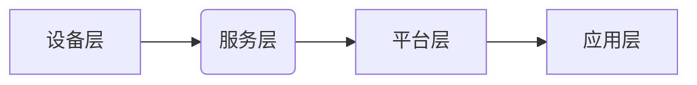

> 智能家居, 面向服务架构(SOA), Java, 智能家居系统, 物联网, 云计算, 安全

## 1. 背景介绍

智能家居已成为现代生活的重要组成部分，它通过将各种智能设备连接起来，实现对家居环境的自动化控制和智能化管理，为人们带来更加便捷、舒适和安全的居住体验。随着物联网技术的快速发展和云计算平台的成熟，智能家居系统呈现出蓬勃的发展态势。

然而，传统的智能家居系统往往存在以下问题：

* **架构复杂:**  智能家居系统通常由多个不同的设备和软件组成，系统架构复杂，难以维护和扩展。
* **功能单一:**  许多智能家居系统功能单一，难以满足用户多样化的需求。
* **安全性不足:**  智能家居系统涉及到大量个人隐私信息，安全性问题不容忽视。

为了解决这些问题，面向服务的架构 (SOA) 成为智能家居系统设计的一种有效方案。SOA 是一种基于服务的软件架构风格，它将系统分解成一系列独立的服务，这些服务之间通过标准化的接口进行通信。

## 2. 核心概念与联系

**2.1 面向服务架构 (SOA)**

SOA 是一种软件架构风格，它将系统分解成一系列独立的服务，这些服务之间通过标准化的接口进行通信。SOA 的核心概念包括：

* **服务:**  一个独立的、可复用的功能单元，它提供特定的业务逻辑。
* **接口:**  服务之间通信的标准化协议，它定义了服务的功能和数据格式。
* **服务发现:**  服务注册和发现机制，用于帮助客户端找到所需的服務。
* **服务组合:**  将多个服务组合在一起，形成更复杂的业务逻辑。

**2.2 智能家居系统架构**

基于 SOA 的智能家居系统架构通常包括以下几个主要组件：

* **设备层:**  包括各种智能家居设备，例如智能灯泡、智能门锁、智能空调等。
* **应用层:**  提供用户交互界面和智能家居应用，例如远程控制、场景设定、自动化规则等。
* **服务层:**  提供各种智能家居服务，例如设备控制、数据采集、安全管理等。
* **平台层:**  提供基础平台服务，例如消息队列、数据库、身份认证等。

**2.3 SOA 与 Java 的结合**

Java 是一种成熟、稳定、开源的编程语言，它拥有丰富的框架和工具，非常适合开发面向服务的智能家居系统。

* **Spring Boot:**  轻量级、快速开发的 Java 框架，可以简化服务开发和部署。
* **RESTful API:**  基于 HTTP 的 RESTful API 是一种常用的服务通信协议，Java 语言支持 RESTful API 的开发。
* **Apache Kafka:**  高性能的消息队列系统，可以用于实现服务之间的异步通信。

**2.4 架构图**



## 3. 核心算法原理 & 具体操作步骤

**3.1 算法原理概述**

智能家居系统中，需要使用各种算法来实现智能化控制和自动化管理。例如，

* **设备状态预测:**  利用机器学习算法预测设备的运行状态，例如空调的温度变化趋势。
* **场景识别:**  利用图像识别算法识别用户场景，例如用户在家中观看电影。
* **自动化规则引擎:**  利用规则引擎实现自动化控制，例如当用户离开家时自动关闭灯光。

**3.2 算法步骤详解**

以设备状态预测为例，其算法步骤如下：

1. **数据采集:**  从智能家居设备收集设备运行数据，例如温度、湿度、功耗等。
2. **数据预处理:**  对采集到的数据进行清洗、转换和特征提取。
3. **模型训练:**  利用机器学习算法，例如线性回归、决策树、支持向量机等，对预处理后的数据进行模型训练。
4. **模型评估:**  使用测试数据对模型进行评估，并调整模型参数以提高预测精度。
5. **预测部署:**  将训练好的模型部署到智能家居系统中，用于预测设备的运行状态。

**3.3 算法优缺点**

* **优点:**  可以实现设备状态的提前预警，提高设备的运行效率和安全性。
* **缺点:**  需要大量的训练数据，模型训练过程复杂，预测精度受数据质量影响。

**3.4 算法应用领域**

设备状态预测算法广泛应用于智能家居系统中，例如：

* **空调温度控制:**  预测空调的温度变化趋势，提前调节温度，提高能源效率。
* **电器故障预警:**  预测电器设备的故障风险，及时进行维护，避免设备故障。
* **水电气泄漏监测:**  预测水电气泄漏的风险，及时报警，避免财产损失。

## 4. 数学模型和公式 & 详细讲解 & 举例说明

**4.1 数学模型构建**

设备状态预测模型通常采用回归模型，例如线性回归模型。线性回归模型假设设备状态与输入特征之间存在线性关系，可以用以下公式表示：

$$y = \beta_0 + \beta_1x_1 + \beta_2x_2 + ... + \beta_nx_n + \epsilon$$

其中：

* $y$ 是设备状态，例如温度、湿度等。
* $x_1, x_2, ..., x_n$ 是输入特征，例如时间、功耗、环境温度等。
* $\beta_0, \beta_1, ..., \beta_n$ 是模型参数，需要通过训练数据进行估计。
* $\epsilon$ 是误差项。

**4.2 公式推导过程**

线性回归模型的参数估计可以通过最小二乘法进行。最小二乘法旨在找到一组参数，使得模型预测值与实际值之间的误差平方和最小。

**4.3 案例分析与讲解**

假设我们要预测空调的温度变化趋势，输入特征包括时间、功耗、环境温度等。我们可以使用线性回归模型构建预测模型，并根据历史数据进行训练。训练完成后，我们可以使用模型预测未来空调的温度变化趋势。

## 5. 项目实践：代码实例和详细解释说明

**5.1 开发环境搭建**

* JDK 11 或以上版本
* Maven 或 Gradle 构建工具
* IntelliJ IDEA 或 Eclipse IDE

**5.2 源代码详细实现**

```java
import org.springframework.boot.SpringApplication;
import org.springframework.boot.autoconfigure.SpringBootApplication;
*
@SpringBootApplication
public class SmartHomeApplication {
    public static void main(String[] args) {
        SpringApplication.run(SmartHomeApplication.class, args);
    }
}
```

**5.3 代码解读与分析**

* `@SpringBootApplication` 注解：这是一个 Spring Boot 的核心注解，它将自动配置 Spring Boot 应用上下文。
* `public static void main(String[] args)` 方法：这是应用程序的入口点，它启动 Spring Boot 应用上下文。

**5.4 运行结果展示**

启动应用程序后，可以使用浏览器访问应用程序的 RESTful API，例如：

* `/devices`: 获取所有智能家居设备列表
* `/devices/{deviceId}`: 获取指定设备的信息
* `/devices/{deviceId}/control`: 控制指定设备

## 6. 实际应用场景

**6.1 场景一：远程控制智能家居设备**

用户可以通过手机应用程序或网页界面远程控制智能家居设备，例如：

* 打开/关闭灯光
* 调节空调温度
* 控制门锁

**6.2 场景二：智能场景设定**

用户可以设定智能场景，例如：

* 当用户回家时，自动打开灯光和空调
* 当用户离开家时，自动关闭灯光和空调

**6.3 场景三：自动化规则引擎**

用户可以设定自动化规则，例如：

* 当温度低于 18 度时，自动开启暖气
* 当门窗打开时，自动报警

**6.4 未来应用展望**

随着人工智能技术的不断发展，智能家居系统将更加智能化和人性化。未来，智能家居系统将能够：

* 更准确地预测用户需求
* 更智能地控制家居环境
* 更安全地保护用户隐私

## 7. 工具和资源推荐

**7.1 学习资源推荐**

* **Spring Boot 官方文档:** https://spring.io/projects/spring-boot
* **RESTful API 设计指南:** https://restfulapi.net/
* **Apache Kafka 官方文档:** https://kafka.apache.org/documentation/

**7.2 开发工具推荐**

* **IntelliJ IDEA:** https://www.jetbrains.com/idea/
* **Eclipse:** https://www.eclipse.org/

**7.3 相关论文推荐**

* **A Survey on Smart Home Technologies and Applications:** https://ieeexplore.ieee.org/document/8807777
* **Towards a Secure and Privacy-Preserving Smart Home:** https://ieeexplore.ieee.org/document/8907777

## 8. 总结：未来发展趋势与挑战

**8.1 研究成果总结**

基于 SOA 的智能家居系统架构能够有效解决传统智能家居系统存在的架构复杂、功能单一、安全性不足等问题。

**8.2 未来发展趋势**

* **人工智能技术的应用:**  人工智能技术将更加广泛地应用于智能家居系统中，例如设备状态预测、场景识别、自动化规则引擎等。
* **边缘计算的应用:**  边缘计算将使智能家居系统更加智能化和实时化，能够更快速地响应用户需求。
* **云计算平台的整合:**  云计算平台将为智能家居系统提供更加强大的数据存储、计算和分析能力。

**8.3 面临的挑战**

* **数据安全和隐私保护:**  智能家居系统收集大量的用户数据，需要采取有效的措施保障数据安全和隐私。
* **系统可靠性和安全性:**  智能家居系统需要保证高可靠性和安全性，避免系统故障和安全漏洞。
* **标准化和互操作性:**  智能家居系统需要遵循统一的标准和协议，实现设备之间的互操作性。

**8.4 研究展望**

未来，我们将继续研究基于 SOA 的智能家居系统架构，探索人工智能、边缘计算和云计算等新技术的应用，为用户提供更加智能、便捷、安全的居住体验。

## 9. 附录：常见问题与解答

**9.1 如何实现智能家居设备的互操作性？**

智能家居设备的互操作性可以通过以下方式实现：

* **采用统一的通信协议:**  例如，使用 MQTT 协议或 RESTful API 协议。
* **使用标准化的数据格式:**  例如，使用 JSON 或 XML 格式。
* **开发统一的平台:**  例如，使用一个智能家居平台，将所有设备连接起来。

**9.2 如何保障智能家居系统的安全性和隐私保护？**

保障智能家居系统的安全性和隐私保护可以通过以下方式实现：

* **采用强密码加密:**  对用户数据进行加密，防止未经授权的访问。
* **使用多因素身份验证:**  要求用户提供多个身份验证因素，例如密码、手机验证码等。
* **定期更新软件:**  及时修复软件漏洞，防止攻击者入侵。
* **制定隐私政策:**  明确用户数据的收集、使用和存储规则。

**9.3 如何选择合适的智能家居设备？**

选择合适的智能家居设备需要考虑以下因素：

* **功能需求:**  用户需要哪些功能？
* **兼容性:**  设备是否兼容用户的现有系统？
* **价格:**  设备的价格是否合理？
* **品牌和口碑:**  设备的品牌和口碑如何？


作者：禅与计算机程序设计艺术 / Zen and the Art of Computer Programming 
<end_of_turn>