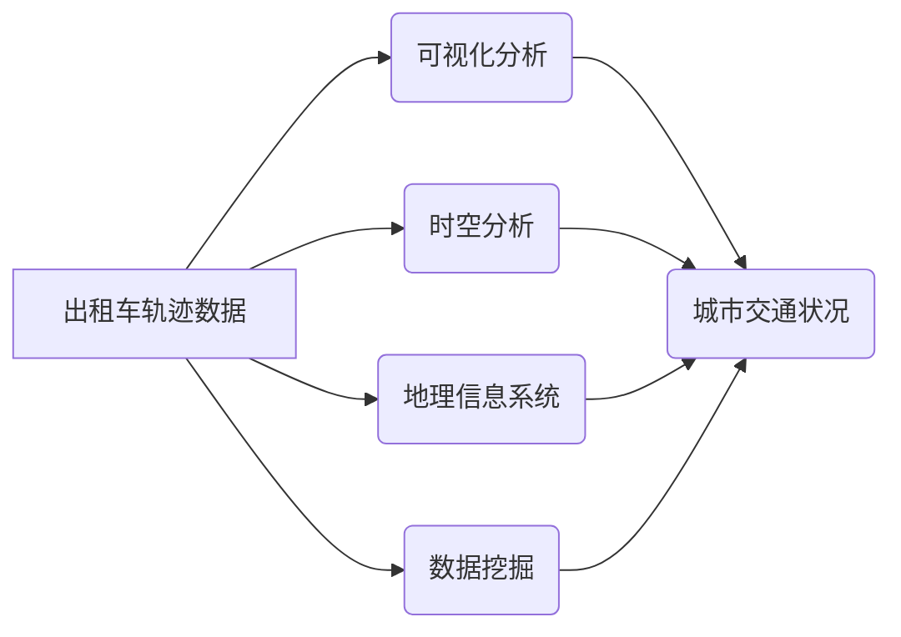

>出租车轨迹数据，可视化，时空分析，地理信息系统，数据挖掘

## 1. 背景介绍

随着城市化进程的加速和信息技术的快速发展，大数据时代已悄然到来。城市交通作为城市发展的重要组成部分，其运行状态和效率直接影响着城市居民的生活质量和经济发展水平。出租车作为城市交通的重要组成部分，其轨迹数据蕴含着丰富的城市交通信息，例如出行模式、交通流量、拥堵情况等。

传统的交通数据分析方法往往依赖于静态数据，难以反映城市交通的动态变化。而基于出租车轨迹数据的可视化分析，能够直观地展示城市交通的时空分布特征，为交通管理、城市规划和出行决策提供决策支持。

## 2. 核心概念与联系

**2.1  出租车轨迹数据**

出租车轨迹数据是指出租车在行驶过程中记录的地理位置、时间戳等信息。这些数据通常以GPS坐标、时间戳、车速等形式存储，可以用来追踪出租车的行驶路线和行驶状态。

**2.2  可视化分析**

可视化分析是指通过图形、图表等形式，将复杂的数据信息转化为直观易懂的视觉呈现，以帮助人们理解和分析数据。在城市交通领域，可视化分析可以用来展示出租车轨迹、交通流量、拥堵情况等信息，帮助人们直观地了解城市交通状况。

**2.3  时空分析**

时空分析是指对空间和时间两个维度的数据进行分析和处理。在城市交通领域，时空分析可以用来研究出租车出行模式、交通流量变化趋势等信息，为城市交通管理提供决策支持。

**2.4  地理信息系统 (GIS)**

地理信息系统 (GIS) 是一种用于处理、分析和可视化地理空间数据的系统。GIS 可以用来展示出租车轨迹数据，并与其他地理数据进行叠加和分析，例如道路网络、人口密度等信息。

**2.5  数据挖掘**

数据挖掘是指从大规模数据中发现隐藏的模式和规律。在城市交通领域，数据挖掘可以用来分析出租车轨迹数据，发现出行热点、交通拥堵区域等信息，为城市交通规划提供参考。

**2.6  核心概念关系图**



## 3. 核心算法原理 & 具体操作步骤

**3.1  算法原理概述**

基于出租车轨迹数据的可视化分析主要涉及以下几个核心算法：

* **轨迹聚类算法**: 将出租车轨迹数据进行聚类，将具有相似行驶轨迹的出租车归为一类，例如，将行驶在同一区域的出租车归为一类。
* **热点检测算法**: 识别出租车轨迹数据中的热点区域，例如，识别乘客需求较高的区域。
* **时空关联分析算法**: 分析出租车轨迹数据中的时空关联性，例如，分析不同时间段的出行模式变化。

**3.2  算法步骤详解**

**3.2.1 轨迹聚类算法**

1. **数据预处理**: 对出租车轨迹数据进行清洗、格式转换等预处理操作。
2. **特征提取**: 从出租车轨迹数据中提取特征，例如，行驶距离、行驶时间、速度等。
3. **聚类算法选择**: 选择合适的聚类算法，例如，K-means聚类算法、DBSCAN聚类算法等。
4. **聚类结果分析**: 对聚类结果进行分析，识别不同类型的出租车轨迹。

**3.2.2 热点检测算法**

1. **数据预处理**: 对出租车轨迹数据进行清洗、格式转换等预处理操作。
2. **热点定义**: 定义热点区域的标准，例如，根据出租车停留时间、乘客数量等指标进行定义。
3. **热点检测算法**: 选择合适的热点检测算法，例如，密度基热点检测算法、空间关联度热点检测算法等。
4. **热点结果分析**: 对热点结果进行分析，识别乘客需求较高的区域。

**3.2.3 时空关联分析算法**

1. **数据预处理**: 对出租车轨迹数据进行清洗、格式转换等预处理操作。
2. **时空特征提取**: 从出租车轨迹数据中提取时空特征，例如，出行时间、出行目的地等。
3. **关联规则挖掘**: 使用关联规则挖掘算法，例如，Apriori算法、FP-Growth算法等，挖掘出租车轨迹数据中的时空关联规则。
4. **关联规则分析**: 对关联规则进行分析，识别不同时间段的出行模式变化。

**3.3  算法优缺点**

* **轨迹聚类算法**: 优点：能够将具有相似行驶轨迹的出租车归为一类，方便后续分析。缺点：聚类结果受算法参数的影响较大，需要根据实际情况进行调整。
* **热点检测算法**: 优点：能够识别乘客需求较高的区域，为城市交通规划提供参考。缺点：热点检测结果受定义标准的影响较大，需要根据实际情况进行调整。
* **时空关联分析算法**: 优点：能够分析出租车轨迹数据中的时空关联性，识别不同时间段的出行模式变化。缺点：算法复杂度较高，需要较大的计算资源。

**3.4  算法应用领域**

* **城市交通管理**: 分析出租车轨迹数据，了解城市交通状况，优化交通流量，缓解交通拥堵。
* **城市规划**: 分析出租车轨迹数据，识别出行热点区域，为城市规划提供参考。
* **出行决策**: 基于出租车轨迹数据，为用户提供个性化的出行建议。

## 4. 数学模型和公式 & 详细讲解 & 举例说明

**4.1  数学模型构建**

**4.1.1 轨迹距离计算**

出租车轨迹距离可以使用欧氏距离、曼哈顿距离等距离计算公式。

* **欧氏距离**:  $d = \sqrt{(x_2 - x_1)^2 + (y_2 - y_1)^2}$

其中，$(x_1, y_1)$ 和 $(x_2, y_2)$ 分别是两个地理位置的坐标。

* **曼哈顿距离**: $d = |x_2 - x_1| + |y_2 - y_1|$

**4.1.2 热点检测模型**

热点检测模型可以使用密度基热点检测算法，例如，DBSCAN算法。DBSCAN算法将数据点划分为核心点、边界点和噪声点，并根据核心点的密度来识别热点区域。

**4.2  公式推导过程**

**4.2.1 DBSCAN算法**

DBSCAN算法的核心思想是：

* **核心点**: 核心点是指在一个给定半径内至少包含 minPts 个点的点。
* **边界点**: 边界点是指在某个核心点的半径内包含 minPts 个点，但本身不是核心点的点。
* **噪声点**: 噪声点是指既不是核心点也不是边界点的点。

DBSCAN算法的步骤如下：

1. 对于每个数据点，计算其与其他数据点的距离。
2. 如果一个数据点在给定半径内包含 minPts 个点，则将其标记为核心点。
3. 对于每个核心点，将其与其所有邻近点（距离小于半径）组成一个簇。
4. 对于每个边界点，将其分配到最近的核心点的簇中。
5. 对于每个噪声点，将其标记为未分配。

**4.3  案例分析与讲解**

假设我们有一组出租车轨迹数据，其中每个数据点包含地理位置和时间戳信息。我们可以使用DBSCAN算法来识别热点区域。

例如，如果我们设置半径为 500 米，minPts 为 5，则可以识别出乘客需求较高的区域，例如，靠近商业区、旅游景点等区域。

## 5. 项目实践：代码实例和详细解释说明

**5.1  开发环境搭建**

* 操作系统：Windows/Linux/macOS
* Python 版本：3.6+
* 必要的库：pandas, numpy, matplotlib, geopandas, folium

**5.2  源代码详细实现**

```python
import pandas as pd
import geopandas as gpd
import folium

# 加载出租车轨迹数据
data = pd.read_csv('taxi_trajectory.csv')

# 数据预处理
# ...

# 轨迹聚类
# ...

# 热点检测
# ...

# 可视化展示
map = folium.Map(location=[data['latitude'].mean(), data['longitude'].mean()], zoom_start=12)

# 添加轨迹
for index, row in data.iterrows():
    folium.PolyLine(
        locations=[(row['latitude'], row['longitude'])],
        color='blue',
        weight=2
    ).add_to(map)

# 添加热点
# ...

map.save('taxi_trajectory_map.html')
```

**5.3  代码解读与分析**

* 代码首先加载出租车轨迹数据，并进行数据预处理。
* 然后，使用轨迹聚类算法将出租车轨迹数据进行聚类。
* 接着，使用热点检测算法识别乘客需求较高的区域。
* 最后，使用folium库生成地图，并在地图上添加轨迹和热点。

**5.4  运行结果展示**

运行代码后，会生成一个名为`taxi_trajectory_map.html`的HTML文件，该文件包含一个交互式地图，展示了出租车轨迹和热点区域。

## 6. 实际应用场景

**6.1  城市交通管理**

* **交通拥堵分析**: 通过分析出租车轨迹数据，可以识别交通拥堵区域，并为交通管理部门提供决策支持。
* **交通流量预测**: 基于出租车轨迹数据，可以建立交通流量预测模型，预测未来交通流量变化趋势。
* **交通信号灯优化**: 通过分析出租车轨迹数据，可以优化交通信号灯的控制策略，提高交通效率。

**6.2  城市规划**

* **出行热点识别**: 通过分析出租车轨迹数据，可以识别出行热点区域，为城市规划提供参考。
* **公共交通规划**: 基于出租车轨迹数据，可以规划更合理的公共交通线路和站点布局。
* **停车位规划**: 通过分析出租车轨迹数据，可以识别停车位需求较高的区域，为停车位规划提供参考。

**6.3  出行决策**

* **个性化出行建议**: 基于出租车轨迹数据，可以为用户提供个性化的出行建议，例如，推荐最短路线、最经济路线等。
* **出行时间预测**: 基于出租车轨迹数据，可以预测用户出行所需时间，帮助用户合理安排行程。
* **出行安全预警**: 通过分析出租车轨迹数据，可以识别出行安全风险区域，为用户提供安全预警。

**6.4  未来应用展望**

随着人工智能、物联网等技术的不断发展，基于出租车轨迹数据的可视化分析将有更广泛的应用场景。例如，可以用于预测交通事故、优化物流配送、管理共享单车等。

## 7. 工具和资源推荐

**7.1  学习资源推荐**

* **书籍**:
    * 《数据可视化设计》
    * 《Python数据科学手册》
    * 《地理信息系统原理与应用》
* **在线课程**:
    * Coursera: 数据可视化
    * edX: Python编程
    * Udemy: GIS基础

**7.2  开发工具推荐**

* **Python**: 强大的数据分析和可视化工具
* **pandas**: 数据处理和分析库
* **matplotlib**: 数据可视化库
* **geopandas**: 处理地理空间数据的库
* **folium**: 生成交互式地图的库

**7.3  相关论文推荐**

* **