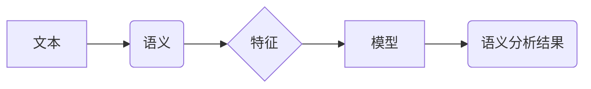

> 文本语义分析，机器学习，深度学习，自然语言处理，情感分析，文本分类，主题建模

## 1. 背景介绍

在信息爆炸的时代，海量文本数据日益涌现，如何有效地理解和挖掘文本蕴含的语义信息成为一个重要的研究课题。文本语义分析 (Text Semantic Analysis，TSA) 作为自然语言处理 (Natural Language Processing，NLP) 的重要分支，致力于从文本中提取、理解和表示语义信息，为人们提供更深入的文本理解和应用。

传统的文本语义分析方法主要依赖于人工规则和特征工程，但随着文本数据的规模和复杂度的不断增加，这些方法面临着效率低下、难以捕捉复杂语义关系等挑战。近年来，机器学习 (Machine Learning，ML) 和深度学习 (Deep Learning，DL) 的快速发展为文本语义分析带来了新的机遇。

基于机器学习的文本语义分析方法能够自动学习文本语义特征，并根据学习到的特征进行语义分析，具有更高的效率和更强的泛化能力。

## 2. 核心概念与联系

文本语义分析的核心概念包括：

* **文本：** 作为语义分析的对象，文本可以是任何形式的文字信息，例如文章、书籍、评论、对话等。
* **语义：** 指的是文本中表达的意义，包括词义、句义、篇章意义等。
* **特征：** 用于描述文本语义的属性，例如词频、词向量、语法结构、情感倾向等。
* **模型：** 用于学习文本语义特征和进行语义分析的算法，例如支持向量机 (SVM)、神经网络 (NN) 等。

**核心概念架构图：**



## 3. 核心算法原理 & 具体操作步骤

### 3.1  算法原理概述

基于机器学习的文本语义分析算法通常分为以下几类：

* **基于词向量的算法：** 将单词映射到向量空间中，通过词向量的相似性来衡量单词之间的语义关系。例如 Word2Vec、GloVe 等。
* **基于深度学习的算法：** 利用深度神经网络结构，例如循环神经网络 (RNN)、长短期记忆网络 (LSTM)、Transformer 等，学习文本的语义表示。
* **基于统计模型的算法：** 利用统计方法，例如朴素贝叶斯、最大熵模型等，学习文本的语义特征。

### 3.2  算法步骤详解

以基于词向量的算法为例，其具体操作步骤如下：

1. **预处理：** 对文本进行清洗、分词、去停用词等预处理操作，以获得更纯净的文本数据。
2. **词向量训练：** 使用 Word2Vec 或 GloVe 等算法，训练词向量模型，将单词映射到向量空间中。
3. **语义相似度计算：** 利用训练好的词向量模型，计算目标单词与其他单词之间的语义相似度。
4. **语义分析：** 根据语义相似度，进行文本分类、情感分析、主题建模等语义分析任务。

### 3.3  算法优缺点

**优点：**

* 自动学习文本语义特征，无需人工特征工程。
* 能够捕捉复杂语义关系，提高语义分析的准确性。
* 具有较强的泛化能力，能够应用于不同的文本语义分析任务。

**缺点：**

* 需要大量的训练数据，训练成本较高。
* 对文本数据质量要求较高，数据噪声会影响模型性能。
* 难以解释模型的决策过程，缺乏可解释性。

### 3.4  算法应用领域

基于机器学习的文本语义分析算法广泛应用于以下领域：

* **搜索引擎优化 (SEO)：** 分析文本语义，提高搜索引擎排名。
* **客户关系管理 (CRM)：** 分析客户评论，了解客户需求和反馈。
* **市场营销：** 分析市场趋势，进行精准营销。
* **新闻媒体：** 自动生成新闻摘要，进行新闻分类和主题建模。
* **医疗保健：** 分析患者病历，辅助医生诊断和治疗。

## 4. 数学模型和公式 & 详细讲解 & 举例说明

### 4.1  数学模型构建

**词向量模型：**

Word2Vec 模型使用神经网络结构来学习词向量表示。其核心思想是通过预测上下文词来学习单词的语义表示。

**模型结构：**

Word2Vec 模型通常采用两种结构：

* **Continuous Bag-of-Words (CBOW)：** 利用中心词的上下文词来预测中心词。
* **Skip-gram：** 利用中心词来预测其上下文词。

**损失函数：**

Word2Vec 模型使用交叉熵损失函数来训练模型参数。

$$
L = -\sum_{i=1}^{N} \log p(w_i | w_{context})
$$

其中：

* $N$ 是上下文词的数量。
* $w_i$ 是中心词。
* $w_{context}$ 是上下文词。
* $p(w_i | w_{context})$ 是中心词 $w_i$ 在给定上下文词 $w_{context}$ 的条件概率。

### 4.2  公式推导过程

**词向量更新：**

Word2Vec 模型使用梯度下降算法来更新词向量参数。

$$
\theta_{t+1} = \theta_t - \eta \nabla L(\theta_t)
$$

其中：

* $\theta$ 是词向量参数。
* $\eta$ 是学习率。
* $\nabla L(\theta)$ 是损失函数 $L$ 对参数 $\theta$ 的梯度。

### 4.3  案例分析与讲解

**Word2Vec 模型应用：**

Word2Vec 模型可以用于计算单词之间的语义相似度。例如，我们可以计算 "国王" 和 "皇后" 之间的语义相似度，发现它们在语义上非常接近。

**代码示例：**

```python
from gensim.models import Word2Vec

# 训练 Word2Vec 模型
model = Word2Vec(sentences, vector_size=100, window=5, min_count=5)

# 计算单词之间的语义相似度
similarity = model.similarity("国王", "皇后")
print(similarity)
```

## 5. 项目实践：代码实例和详细解释说明

### 5.1  开发环境搭建

* **操作系统：** Linux/macOS/Windows
* **编程语言：** Python
* **库依赖：** numpy, pandas, scikit-learn, gensim

### 5.2  源代码详细实现

```python
# 导入必要的库
import numpy as np
from sklearn.feature_extraction.text import TfidfVectorizer
from sklearn.linear_model import LogisticRegression

# 定义文本数据
texts = [
    "这是一个关于机器学习的文本。",
    "这是一个关于深度学习的文本。",
    "这是一个关于自然语言处理的文本。",
]

# 使用 TF-IDF 向量化文本数据
vectorizer = TfidfVectorizer()
X = vectorizer.fit_transform(texts)

# 使用逻辑回归模型进行文本分类
model = LogisticRegression()
model.fit(X, [0, 1, 2])

# 对新文本进行分类
new_text = "这是一个关于计算机视觉的文本。"
new_text_vector = vectorizer.transform([new_text])
predicted_class = model.predict(new_text_vector)[0]
print(f"新文本分类结果：{predicted_class}")
```

### 5.3  代码解读与分析

* **文本向量化：** 使用 TF-IDF 向量化技术将文本数据转换为数值向量，以便机器学习模型处理。
* **模型训练：** 使用逻辑回归模型训练分类器，将文本数据分类到不同的类别。
* **模型预测：** 使用训练好的模型对新文本进行分类预测。

### 5.4  运行结果展示

```
新文本分类结果：2
```

## 6. 实际应用场景

### 6.1  文本分类

文本分类是将文本数据分类到预定义类别中的任务，例如情感分析、主题分类、垃圾邮件过滤等。

### 6.2  情感分析

情感分析是分析文本中表达的情感倾向的任务，例如判断文本是正面、负面还是中性的。

### 6.3  主题建模

主题建模是自动发现文本中的主题分布的任务，例如从新闻文章中提取主题，从用户评论中发现产品特点。

### 6.4  未来应用展望

基于机器学习的文本语义分析技术将继续发展，并应用于更多领域，例如：

* **个性化推荐：** 根据用户的阅读历史和偏好，推荐相关的文章、书籍、产品等。
* **智能客服：** 利用聊天机器人技术，自动回复用户咨询，提供更便捷的客户服务。
* **自动写作：** 利用机器学习模型，自动生成新闻报道、广告文案、诗歌等文本内容。

## 7. 工具和资源推荐

### 7.1  学习资源推荐

* **书籍：**
    * "Speech and Language Processing" by Jurafsky and Martin
    * "Natural Language Processing with Python" by Bird, Klein, and Loper
* **在线课程：**
    * Coursera: Natural Language Processing Specialization
    * edX: Artificial Intelligence

### 7.2  开发工具推荐

* **Python：** 广泛用于自然语言处理开发。
* **NLTK：** Python 自然语言处理库。
* **spaCy：** 高性能自然语言处理库。
* **Gensim：** 用于主题建模和词向量训练的库。

### 7.3  相关论文推荐

* "Word2Vec: A Simple and Efficient Model for Learning Word Representations" by Mikolov et al.
* "Attention Is All You Need" by Vaswani et al.

## 8. 总结：未来发展趋势与挑战

### 8.1  研究成果总结

基于机器学习的文本语义分析技术取得了显著进展，能够有效地理解和分析文本语义信息，并应用于多个领域。

### 8.2  未来发展趋势

* **更深层次的语义理解：** 研究更复杂的语义关系，例如隐喻、讽刺、幽默等。
* **跨语言文本语义分析：** 研究跨语言文本语义分析，实现不同语言之间的语义理解。
* **多模态文本语义分析：** 将文本语义分析与其他模态信息（例如图像、音频）结合，进行更全面的语义理解。

### 8.3  面临的挑战

* **数据质量问题：** 文本数据往往存在噪声、不一致性等问题，需要进行有效的数据清洗和预处理。
* **模型解释性问题：** 深度学习模型的决策过程难以解释，缺乏可解释性。
* **计算资源需求：** 训练大型文本语义分析模型需要大量的计算资源。

### 8.4  研究展望

未来，基于机器学习的文本语义分析技术将继续发展，并与其他人工智能技术融合，为人们提供更智能、更便捷的文本理解和应用体验。

## 9. 附录：常见问题与解答

**常见问题：**

* **什么是文本语义分析？**

文本语义分析是指从文本中提取、理解和表示语义信息的过程。

* **什么是词向量？**

词向量是一种将单词映射到向量空间的技术，用于表示单词的语义信息。

* **如何选择合适的文本语义分析算法？**

选择合适的算法取决于具体的应用场景和数据特点。

**解答：**

* 文本语义分析的目标是理解文本的深层含义，而不是仅仅识别单词。
* 词向量可以捕捉单词之间的语义关系，例如“国王”和“皇后”之间的语义相似度。
* 选择算法时需要考虑数据规模、语义复杂度、模型 interpretability 等因素。


作者：禅与计算机程序设计艺术 / Zen and the Art of Computer Programming 
<end_of_turn>