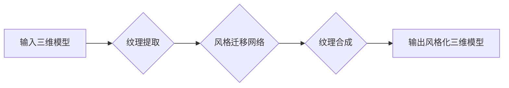

> 生成对抗网络 (GAN)，三维建模，纹理风格化迁移，深度学习，计算机图形学

## 1. 背景介绍

三维建模技术在游戏、电影、建筑设计等领域有着广泛的应用。然而，现有的三维模型往往缺乏精细的纹理细节，难以满足高品质视觉效果的需求。纹理风格化迁移技术旨在将一种纹理风格应用到另一种三维模型上，从而提升模型的视觉效果和艺术价值。

传统的纹理风格化迁移方法通常依赖于手工设计的特征提取和纹理映射算法，难以捕捉纹理的复杂细节和全局结构。近年来，随着深度学习技术的快速发展，基于生成对抗网络 (GAN) 的纹理风格化迁移方法逐渐成为研究热点。GAN 是一种强大的生成模型，能够学习数据分布的复杂特征，并生成逼真的纹理图像。

## 2. 核心概念与联系

### 2.1 生成对抗网络 (GAN)

GAN 由两个神经网络组成：生成器 (Generator) 和鉴别器 (Discriminator)。生成器负责生成新的纹理图像，而鉴别器负责判断图像是否为真实纹理或生成纹理。两者在对抗博弈中相互竞争，生成器不断改进生成图像的质量，而鉴别器不断提高识别真实纹理的能力。

### 2.2 三维建模与纹理映射

三维建模是指创建三维物体模型的过程，通常包括建模、纹理贴图、光照等步骤。纹理贴图是指将二维图像贴到三维模型表面，以赋予模型颜色、材质和细节。纹理风格化迁移的目标是将一种纹理风格应用到另一种三维模型上，从而改变模型的视觉效果。

### 2.3 核心架构



## 3. 核心算法原理 & 具体操作步骤

### 3.1 算法原理概述

基于 GAN 的三维建模纹理风格化迁移技术主要包括以下步骤：

1. **纹理提取:** 从目标三维模型中提取纹理信息。
2. **风格迁移网络:** 使用 GAN 训练一个风格迁移网络，该网络能够将源纹理风格迁移到目标纹理上。
3. **纹理合成:** 将风格迁移后的纹理应用到目标三维模型上，生成风格化三维模型。

### 3.2 算法步骤详解

1. **纹理提取:** 使用纹理贴图算法从目标三维模型中提取纹理信息。可以采用多种方法提取纹理，例如 UV 坐标映射、纹理采样等。
2. **风格迁移网络:** 构建一个 GAN 网络，包括生成器和鉴别器。
    * **生成器:** 负责将源纹理风格应用到目标纹理上，生成风格化纹理。
    * **鉴别器:** 负责判断纹理是否为真实纹理或生成纹理。
3. **训练过程:** 使用源纹理和目标纹理作为训练数据，训练 GAN 网络。生成器不断生成风格化纹理，鉴别器不断判断纹理的真实性。通过对抗博弈，生成器逐渐学习到将源纹理风格迁移到目标纹理的技巧。
4. **纹理合成:** 将训练好的生成器应用于目标纹理，生成风格化纹理。将风格化纹理应用到目标三维模型上，生成风格化三维模型。

### 3.3 算法优缺点

**优点:**

* 能够生成逼真的纹理风格化效果。
* 不需要手工设计特征提取和纹理映射算法。
* 可以迁移多种纹理风格。

**缺点:**

* 训练过程复杂，需要大量的训练数据。
* 难以控制风格迁移的程度。
* 可能出现纹理失真或模糊现象。

### 3.4 算法应用领域

* 游戏开发：为游戏角色、场景和道具添加更逼真的纹理细节。
* 电影制作：为电影角色和场景添加更丰富的视觉效果。
* 建筑设计：为建筑模型添加更逼真的材质和纹理。
* 艺术创作：创作具有独特风格的艺术作品。

## 4. 数学模型和公式 & 详细讲解 & 举例说明

### 4.1 数学模型构建

GAN 的核心是生成器 (G) 和鉴别器 (D) 之间的对抗博弈。

* **生成器 (G):** 接收噪声向量 z 作为输入，生成纹理图像 x。

* **鉴别器 (D):** 接收纹理图像 x 作为输入，判断 x 是否为真实纹理 (y = 1) 或生成纹理 (y = 0)。

### 4.2 公式推导过程

* **生成器损失函数:**

$$
L_G(G, D) = E_{z \sim p_z(z)}[ -log(D(G(z))) ]
$$

* **鉴别器损失函数:**

$$
L_D(D, G) = E_{x \sim p_{data}(x)}[ -log(D(x)) ] + E_{z \sim p_z(z)}[ -log(1 - D(G(z))) ]
$$

其中:

* $p_z(z)$ 是噪声向量 z 的分布。
* $p_{data}(x)$ 是真实纹理图像 x 的分布。

### 4.3 案例分析与讲解

假设我们想要将一种艺术风格的纹理应用到一个建筑模型上。

1. **数据准备:** 收集大量具有目标艺术风格的纹理图像和建筑模型纹理图像。
2. **模型训练:** 使用 GAN 网络训练风格迁移模型。
3. **纹理合成:** 将训练好的生成器应用于建筑模型的纹理图像，生成风格化纹理。
4. **结果展示:** 将风格化纹理应用到建筑模型上，展示最终效果。

## 5. 项目实践：代码实例和详细解释说明

### 5.1 开发环境搭建

* 操作系统: Ubuntu 20.04
* Python 版本: 3.8
* 深度学习框架: PyTorch 1.7

### 5.2 源代码详细实现

```python
import torch
import torch.nn as nn

# 生成器网络
class Generator(nn.Module):
    def __init__(self):
        super(Generator, self).__init__()
        # ...

    def forward(self, z):
        # ...

# 鉴别器网络
class Discriminator(nn.Module):
    def __init__(self):
        super(Discriminator, self).__init__()
        # ...

    def forward(self, x):
        # ...

# 训练循环
for epoch in range(num_epochs):
    for batch_idx, (real_images, _) in enumerate(train_loader):
        # ...

```

### 5.3 代码解读与分析

* **生成器网络:** 负责将噪声向量转换为纹理图像。网络结构通常包含多个卷积层和反卷积层，用于学习纹理的复杂特征和结构。
* **鉴别器网络:** 负责判断纹理图像是否为真实纹理或生成纹理。网络结构通常包含多个卷积层和全连接层，用于提取纹理特征并进行分类。
* **训练循环:** 使用训练数据训练生成器和鉴别器网络。训练过程包括以下步骤:
    * 生成器生成纹理图像。
    * 鉴别器判断纹理图像的真实性。
    * 计算生成器和鉴别器的损失函数。
    * 更新生成器和鉴别器的参数。

### 5.4 运行结果展示

运行代码后，可以生成风格化纹理图像，并将其应用到目标三维模型上，展示最终效果。

## 6. 实际应用场景

### 6.1 游戏开发

* 为游戏角色添加更逼真的纹理细节，例如皮肤纹理、服装纹理、武器纹理等。
* 为游戏场景添加更丰富的视觉效果，例如地面纹理、建筑纹理、植物纹理等。

### 6.2 电影制作

* 为电影角色添加更逼真的纹理细节，例如皮肤纹理、服装纹理、道具纹理等。
* 为电影场景添加更丰富的视觉效果，例如地面纹理、建筑纹理、环境纹理等。

### 6.3 建筑设计

* 为建筑模型添加更逼真的材质和纹理，例如砖石纹理、木材纹理、金属纹理等。
* 帮助设计师快速地探索不同的设计方案。

### 6.4 未来应用展望

* **个性化纹理生成:** 根据用户的喜好生成个性化的纹理风格。
* **跨域纹理迁移:** 将一种领域的纹理风格迁移到另一种领域。
* **实时纹理风格化:** 在实时渲染场景中进行纹理风格化。

## 7. 工具和资源推荐

### 7.1 学习资源推荐

* **书籍:**
    * 《深度学习》
    * 《生成对抗网络》
* **在线课程:**
    * Coursera: 深度学习
    * Udacity: 生成对抗网络

### 7.2 开发工具推荐

* **深度学习框架:** PyTorch, TensorFlow
* **图像处理库:** OpenCV, Pillow

### 7.3 相关论文推荐

* 《Generative Adversarial Networks》
* 《Style Transfer Using Convolutional Neural Networks》

## 8. 总结：未来发展趋势与挑战

### 8.1 研究成果总结

基于 GAN 的三维建模纹理风格化迁移技术取得了显著的进展，能够生成逼真的纹理风格化效果。

### 8.2 未来发展趋势

* **更高质量的纹理生成:** 探索更先进的 GAN 架构和训练方法，生成更高质量的纹理图像。
* **更灵活的风格迁移:** 研究更灵活的风格迁移方法，能够控制风格迁移的程度和方向。
* **更广泛的应用场景:** 将纹理风格化迁移技术应用到更多领域，例如虚拟现实、增强现实等。

### 8.3 面临的挑战

* **训练数据不足:** 训练 GAN 网络需要大量的纹理数据，而高质量的纹理数据往往难以获取。
* **训练过程复杂:** 训练 GAN 网络需要复杂的训练过程和调参技巧。
* **纹理失真问题:** 某些情况下，生成的纹理图像可能出现失真或模糊现象。

### 8.4 研究展望

未来，我们将继续探索基于 GAN 的三维建模纹理风格化迁移技术，致力于解决上述挑战，并将其应用到更多领域。

## 9. 附录：常见问题与解答

* **Q: 如何选择合适的 GAN 架构？**

* **A:** 选择 GAN 架构需要根据具体应用场景和数据特点进行选择。常见的 GAN 架构包括 DCGAN, CycleGAN, Pix2Pix 等。

* **Q: 如何解决训练数据不足的问题？**

* **A:** 可以使用数据增强技术增加训练数据的数量，例如旋转、缩放、翻转等操作。也可以使用迁移学习技术，将预训练模型应用于新的任务。

* **Q: 如何控制风格迁移的程度？**

* **A:** 可以通过调整网络参数或使用风格迁移损失函数来控制风格迁移的程度。

* **Q: 如何解决纹理失真问题？**

* **A:** 可以尝试使用更先进的 GAN 架构或训练方法，例如使用对抗训练、风格损失函数等。


作者：禅与计算机程序设计艺术 / Zen and the Art of Computer Programming 
<end_of_turn>