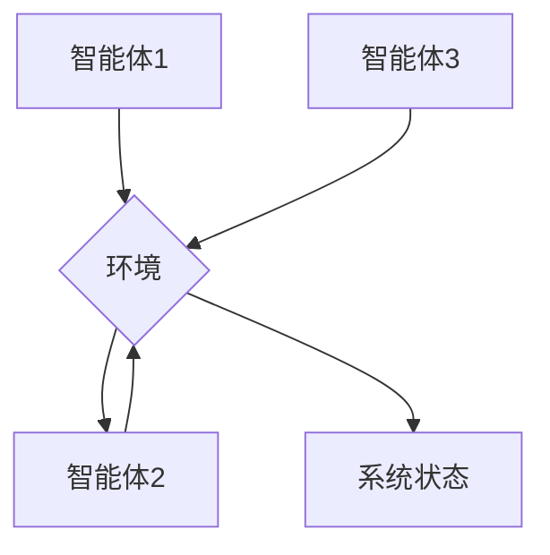

> 多智能体系统，协作算法，智能体，分布式计算，机器学习，强化学习，游戏AI

## 1. 背景介绍

在人工智能领域，多智能体协作（Multi-Agent Collaboration）已成为一个备受关注的研究方向。它旨在构建由多个智能体组成的系统，这些智能体能够相互协作，共同完成复杂的任务。与单智能体系统相比，多智能体系统具有更强的鲁棒性、适应性和可扩展性，能够更好地应对复杂、动态的环境。

近年来，随着人工智能技术的快速发展，多智能体协作在各个领域都得到了广泛的应用，例如：

* **机器人协作:** 多个机器人可以协同完成复杂的任务，例如搬运货物、组装产品等。
* **无人驾驶:** 多辆无人驾驶汽车可以协同行驶，提高交通效率和安全性。
* **金融市场:** 多个智能体可以协同进行交易，优化投资策略。
* **游戏开发:** 多个智能体可以扮演不同的角色，与玩家进行互动，提升游戏体验。

## 2. 核心概念与联系

多智能体协作系统由以下几个核心概念组成：

* **智能体 (Agent):** 能够感知环境、做出决策并执行行动的独立实体。
* **环境 (Environment):** 智能体所处的外部世界，包括智能体感知到的信息和智能体可以执行的行动。
* **状态 (State):** 系统在某个时刻的完整描述，包括所有智能体的状态和环境的状态。
* **动作 (Action):** 智能体可以执行的操作，例如移动、通信、决策等。
* **奖励 (Reward):** 智能体根据其行为获得的反馈，用于指导智能体的决策。

**多智能体协作系统架构**



## 3. 核心算法原理 & 具体操作步骤

### 3.1  算法原理概述

多智能体协作算法旨在指导智能体如何相互协作，共同完成任务。常见的协作算法包括：

* **中心化控制:** 一个中央控制器协调所有智能体的行动。
* **分布式控制:** 智能体之间直接通信，协商决策。
* **强化学习:** 智能体通过与环境交互，学习最优的协作策略。

### 3.2  算法步骤详解

以分布式控制为例，其具体操作步骤如下：

1. **环境感知:** 智能体感知环境信息，例如位置、目标、其他智能体的状态等。
2. **状态表示:** 智能体将感知到的环境信息转换为状态表示，以便于决策。
3. **决策制定:** 智能体根据自身状态和环境信息，制定行动计划。
4. **行动执行:** 智能体执行决策，并观察环境的变化。
5. **反馈更新:** 智能体接收环境反馈，更新自身状态和决策策略。

### 3.3  算法优缺点

**分布式控制算法**

* **优点:** 
    * 鲁棒性强，单个智能体故障不会影响整个系统的运行。
    * 可扩展性好，可以轻松添加新的智能体。
    * 适应性强，可以应对动态变化的环境。
* **缺点:** 
    * 协调难度大，需要智能体之间进行有效的通信和协商。
    * 算法复杂度高，需要复杂的控制策略。

### 3.4  算法应用领域

分布式控制算法广泛应用于以下领域：

* **机器人协作:** 多个机器人可以协同完成复杂的任务，例如搬运货物、组装产品等。
* **无人驾驶:** 多辆无人驾驶汽车可以协同行驶，提高交通效率和安全性。
* **网络安全:** 多个安全代理可以协同防御网络攻击。

## 4. 数学模型和公式 & 详细讲解 & 举例说明

### 4.1  数学模型构建

多智能体协作系统可以用马尔可夫决策过程（MDP）来建模。

* **状态空间 (S):** 所有可能的系统状态的集合。
* **动作空间 (A):** 所有智能体可以执行的动作的集合。
* **转移概率 (P):** 从一个状态到另一个状态的概率，取决于智能体的动作。
* **奖励函数 (R):** 智能体在某个状态执行某个动作后获得的奖励。

### 4.2  公式推导过程

目标是找到一个策略 π，使得智能体在执行该策略时获得最大的累积奖励。

$$
\pi^* = \arg\max_{\pi} \mathbb{E}_{\pi} \sum_{t=0}^{\infty} \gamma^t R_t
$$

其中：

* π* 是最优策略。
*  γ 是折扣因子，控制未来奖励的权重。
*  R_t 是在时间步 t 获得的奖励。

### 4.3  案例分析与讲解

例如，在一个简单的寻路问题中，智能体需要从起点到终点移动。状态空间可以是所有可能的格子位置，动作空间可以是向上、向下、向左、向右四个方向。奖励函数可以设计为，到达终点获得最大奖励，其他状态获得较小的奖励。

通过使用强化学习算法，例如 Q-learning，智能体可以学习到最优的策略，找到从起点到终点的最短路径。

## 5. 项目实践：代码实例和详细解释说明

### 5.1  开发环境搭建

* Python 3.x
* TensorFlow 或 PyTorch
* ROS (可选，用于机器人协作)

### 5.2  源代码详细实现

```python
# 智能体类
class Agent:
    def __init__(self, env):
        self.env = env
        # 初始化策略
        self.policy = ...

    def act(self, state):
        # 根据策略选择动作
        action = self.policy(state)
        return action

# 环境类
class Environment:
    def __init__(self):
        # 初始化环境
        pass

    def step(self, action):
        # 执行动作，更新环境状态
        pass

    def reset(self):
        # 重置环境
        pass

# 主程序
if __name__ == "__main__":
    # 创建环境和智能体
    env = Environment()
    agent = Agent(env)

    # 运行仿真
    while True:
        # 获取当前状态
        state = env.get_state()
        # 选择动作
        action = agent.act(state)
        # 执行动作
        env.step(action)
```

### 5.3  代码解读与分析

* **Agent 类:** 代表单个智能体，包含环境信息和策略。
* **Environment 类:** 代表环境，提供与智能体交互的接口。
* **主程序:** 创建环境和智能体，并运行仿真。

### 5.4  运行结果展示

运行结果将显示智能体在环境中执行的动作和环境状态的变化。

## 6. 实际应用场景

### 6.1  机器人协作

多智能体协作技术可以用于控制多个机器人协同完成复杂的任务，例如：

* **物流配送:** 多个机器人可以协同完成货物搬运、分拣和配送任务。
* **制造业:** 多个机器人可以协同完成产品组装、焊接和喷涂等任务。
* **灾害救援:** 多个机器人可以协同进行搜救、救援和物资运输等任务。

### 6.2  无人驾驶

多智能体协作技术可以用于控制多个无人驾驶汽车协同行驶，提高交通效率和安全性。例如：

* **自动驾驶车队:** 多辆无人驾驶汽车可以协同行驶，减少拥堵和交通事故。
* **无人驾驶货车:** 多辆无人驾驶货车可以协同运输货物，提高运输效率。

### 6.3  金融市场

多智能体协作技术可以用于控制多个智能体协同进行交易，优化投资策略。例如：

* **量化投资:** 多个智能体可以协同分析市场数据，制定投资策略。
* **风险管理:** 多个智能体可以协同监控市场风险，降低投资风险。

### 6.4  未来应用展望

多智能体协作技术在未来将有更广泛的应用，例如：

* **医疗保健:** 多个智能体可以协同诊断疾病、制定治疗方案和提供远程医疗服务。
* **教育:** 多个智能体可以协同提供个性化教育服务。
* **娱乐:** 多个智能体可以协同开发更具沉浸性和交互性的游戏和虚拟现实体验。

## 7. 工具和资源推荐

### 7.1  学习资源推荐

* **书籍:**
    * Multi-Agent Systems: A Modern Approach
    * Reinforcement Learning: An Introduction
* **在线课程:**
    * Coursera: Multi-Agent Systems
    * Udacity: Reinforcement Learning Nanodegree

### 7.2  开发工具推荐

* **ROS (Robot Operating System):** 用于机器人开发的开源平台。
* **Gazebo:** 用于机器人仿真和测试的开源软件。
* **TensorFlow/PyTorch:** 用于深度学习的开源框架。

### 7.3  相关论文推荐

* **Multi-Agent Reinforcement Learning: A Survey**
* **Decentralized Multi-Agent Reinforcement Learning: A Survey**

## 8. 总结：未来发展趋势与挑战

### 8.1  研究成果总结

多智能体协作技术取得了显著的进展，在机器人协作、无人驾驶、金融市场等领域得到了广泛应用。

### 8.2  未来发展趋势

* **更复杂的协作场景:** 研究更复杂的协作场景，例如多模态协作、跨领域协作等。
* **更鲁棒的算法:** 研究更鲁棒的协作算法，能够应对更复杂、更动态的环境。
* **更强的可解释性:** 研究更可解释的协作算法，能够更好地理解智能体的决策过程。

### 8.3  面临的挑战

* **算法复杂度:** 多智能体协作算法的复杂度很高，难以设计和实现。
* **数据获取:** 多智能体协作系统需要大量的训练数据，获取这些数据非常困难。
* **安全性和可靠性:** 多智能体协作系统需要保证安全性和可靠性，避免出现意外情况。

### 8.4  研究展望

未来，多智能体协作技术将继续发展，在更多领域发挥重要作用。研究者将继续探索更有效的协作算法、更强大的计算能力和更安全的系统架构，推动多智能体协作技术走向更广阔的应用前景。

## 9. 附录：常见问题与解答

### 9.1  Q1: 多智能体协作与分布式计算有什么区别？

**A1:** 多智能体协作和分布式计算都是处理复杂任务的有效方法，但它们侧重点不同。

* **分布式计算:** 侧重于将任务分解成多个子任务，并由多个计算节点并行执行。
* **多智能体协作:** 侧重于构建由多个智能体组成的系统，这些智能体能够相互协作，共同完成任务。

### 9.2  Q2: 多智能体协作算法有哪些？

**A2:** 常见的多智能体协作算法包括：

* **中心化控制:** 一个中央控制器协调所有智能体的行动。
* **分布式控制:** 智能体之间直接通信，协商决策。
* **强化学习:** 智能体通过与环境交互，学习最优的协作策略。

### 9.3  Q3: 多智能体协作技术有哪些应用场景？

**A3:** 多智能体协作技术广泛应用于以下领域：

* **机器人协作:** 多个机器人可以协同完成复杂的任务，例如搬运货物、组装产品等。
* **无人驾驶:** 多辆无人驾驶汽车可以协同行驶，提高交通效率和安全性。
* **金融市场:** 多个智能体可以协同进行交易，优化投资策略。

作者：禅与计算机程序设计艺术 / Zen and the Art of Computer Programming


<end_of_turn>