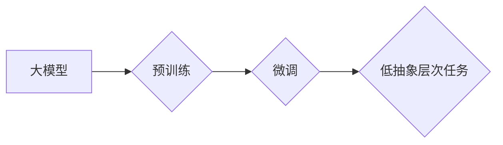

> 大模型，低抽象层次任务，自然语言处理，计算机视觉，代码生成，推理能力，泛化能力，迁移学习

## 1. 背景介绍

近年来，大模型在自然语言处理（NLP）、计算机视觉（CV）等领域取得了显著成就，展现出强大的学习和泛化能力。然而，大模型的训练成本高昂，部署也存在挑战。同时，许多低抽象层次的任务，例如代码生成、数据结构操作、算法实现等，对模型的推理能力和对底层细节的理解提出了更高的要求。

传统的大模型主要侧重于高抽象层次的任务，例如文本分类、机器翻译、图像识别等。这些任务通常可以抽象为输入-输出的映射关系，而低抽象层次的任务则更加依赖于模型对底层细节的理解和操作能力。

## 2. 核心概念与联系

**2.1 大模型**

大模型是指参数量达到数十亿甚至千亿级别的深度学习模型。它们通常通过海量数据进行预训练，并能够在多种下游任务中进行微调。

**2.2 低抽象层次任务**

低抽象层次任务是指需要模型对底层细节进行理解和操作的任务，例如：

* **代码生成:** 根据自然语言描述生成代码。
* **数据结构操作:** 对数据结构进行操作，例如插入、删除、查找等。
* **算法实现:** 根据算法描述实现相应的代码。
* **系统级任务:** 对系统进行配置、管理和优化。

**2.3 核心概念联系**

大模型的强大学习能力和泛化能力为低抽象层次任务的解决提供了新的可能性。通过对大模型进行微调，可以使其具备对底层细节的理解和操作能力，从而更好地完成低抽象层次的任务。

**2.4 Mermaid 流程图**



## 3. 核心算法原理 & 具体操作步骤

**3.1 算法原理概述**

大模型在低抽象层次任务中的表现主要依赖于以下几个方面：

* **强大的表示能力:** 大模型能够学习到丰富的语义表示，能够更好地理解自然语言描述和代码结构。
* **强大的推理能力:** 大模型能够进行复杂的逻辑推理，能够根据输入信息推断出相应的操作步骤。
* **对底层细节的理解:** 大模型能够学习到底层代码和数据结构的特征，能够更好地进行代码生成和数据操作。

**3.2 算法步骤详解**

1. **预训练:** 使用大模型在海量文本和代码数据上进行预训练，学习到丰富的语义表示和代码结构特征。
2. **微调:** 将预训练好的大模型在特定低抽象层次任务的数据集上进行微调，使其能够更好地完成该任务。
3. **推理:** 将输入信息输入到微调后的模型中，模型根据其学习到的知识和规则进行推理，并输出相应的结果。

**3.3 算法优缺点**

**优点:**

* 强大的学习能力和泛化能力。
* 对底层细节的理解能力强。
* 可以应用于多种低抽象层次任务。

**缺点:**

* 训练成本高昂。
* 部署也存在挑战。
* 对数据质量要求高。

**3.4 算法应用领域**

* **代码生成:** 根据自然语言描述生成代码。
* **数据结构操作:** 对数据结构进行操作，例如插入、删除、查找等。
* **算法实现:** 根据算法描述实现相应的代码。
* **系统级任务:** 对系统进行配置、管理和优化。

## 4. 数学模型和公式 & 详细讲解 & 举例说明

**4.1 数学模型构建**

大模型通常采用 Transformer 架构，其核心是注意力机制。注意力机制能够学习到输入序列中不同元素之间的关系，从而更好地理解上下文信息。

**4.2 公式推导过程**

注意力机制的计算公式如下：

$$
Attention(Q, K, V) = softmax(\frac{QK^T}{\sqrt{d_k}})V
$$

其中：

* $Q$：查询矩阵
* $K$：键矩阵
* $V$：值矩阵
* $d_k$：键向量的维度
* $softmax$：softmax 函数

**4.3 案例分析与讲解**

例如，在代码生成任务中，输入的自然语言描述可以看作是查询矩阵 $Q$，代码库中的代码片段可以看作是键矩阵 $K$ 和值矩阵 $V$。通过注意力机制，模型可以学习到自然语言描述与代码片段之间的关系，从而生成相应的代码。

## 5. 项目实践：代码实例和详细解释说明

**5.1 开发环境搭建**

* Python 3.7+
* PyTorch 1.7+
* CUDA 10.2+

**5.2 源代码详细实现**

```python
import torch
import torch.nn as nn

class Attention(nn.Module):
    def __init__(self, d_model, num_heads):
        super(Attention, self).__init__()
        self.d_model = d_model
        self.num_heads = num_heads
        self.head_dim = d_model // num_heads

        self.query = nn.Linear(d_model, d_model)
        self.key = nn.Linear(d_model, d_model)
        self.value = nn.Linear(d_model, d_model)
        self.fc_out = nn.Linear(d_model, d_model)

    def forward(self, query, key, value, mask=None):
        batch_size = query.size(0)

        # Linear projections
        Q = self.query(query).view(batch_size, -1, self.num_heads, self.head_dim).transpose(1, 2)
        K = self.key(key).view(batch_size, -1, self.num_heads, self.head_dim).transpose(1, 2)
        V = self.value(value).view(batch_size, -1, self.num_heads, self.head_dim).transpose(1, 2)

        # Scaled dot-product attention
        scores = torch.matmul(Q, K.transpose(-2, -1)) / torch.sqrt(torch.tensor(self.head_dim, dtype=torch.float))

        if mask is not None:
            scores = scores.masked_fill(mask == 0, -1e9)

        attention_weights = torch.softmax(scores, dim=-1)

        # Weighted sum of values
        context = torch.matmul(attention_weights, V)

        # Concatenate heads and project
        context = context.transpose(1, 2).contiguous().view(batch_size, -1, self.d_model)
        output = self.fc_out(context)

        return output, attention_weights
```

**5.3 代码解读与分析**

这段代码实现了 Transformer 架构中的注意力机制。

* `__init__` 方法初始化模型参数，包括模型维度 `d_model` 和注意力头数 `num_heads`。
* `forward` 方法实现注意力机制的计算过程，包括线性投影、缩放点积注意力计算、softmax 归一化和加权求和。

**5.4 运行结果展示**

运行该代码可以得到注意力机制的输出结果，以及注意力权重分布。

## 6. 实际应用场景

大模型在低抽象层次任务中的应用场景非常广泛，例如：

* **代码生成:** GitHub Copilot 等工具利用大模型生成代码，提高开发效率。
* **数据结构操作:** 大模型可以自动生成数据结构操作代码，例如插入、删除、查找等。
* **算法实现:** 大模型可以根据算法描述自动实现相应的代码。
* **系统级任务:** 大模型可以帮助自动化系统配置、管理和优化。

**6.4 未来应用展望**

随着大模型技术的不断发展，其在低抽象层次任务中的应用场景将会更加广泛。例如：

* **更智能的代码生成:** 大模型可以生成更复杂的代码，并能够理解代码的语义和逻辑。
* **更强大的数据操作能力:** 大模型可以对更复杂的数据库进行操作，并能够进行数据分析和挖掘。
* **更智能的系统管理:** 大模型可以帮助自动化系统管理，并能够根据系统状态进行优化。

## 7. 工具和资源推荐

**7.1 学习资源推荐**

* **论文:**
    * Attention Is All You Need
    * BERT: Pre-training of Deep Bidirectional Transformers for Language Understanding
* **博客:**
    * The Illustrated Transformer
    * Jay Alammar's Blog

**7.2 开发工具推荐**

* **PyTorch:** 深度学习框架
* **TensorFlow:** 深度学习框架
* **Hugging Face Transformers:** 预训练模型库

**7.3 相关论文推荐**

* **CodeBERT: A Pretrained Language Model for Code**
* **CodeT5: A Code-to-Code Transfer Transformer**
* **GPT-3: Language Models are Few-Shot Learners**

## 8. 总结：未来发展趋势与挑战

**8.1 研究成果总结**

大模型在低抽象层次任务中的表现取得了显著进展，例如代码生成、数据结构操作、算法实现等。

**8.2 未来发展趋势**

* **模型规模的进一步扩大:** 更大的模型规模能够学习到更丰富的知识和规则。
* **算法的不断优化:** 新的算法和架构能够提高模型的效率和性能。
* **数据的多样化:** 更丰富的训练数据能够提高模型的泛化能力。

**8.3 面临的挑战**

* **训练成本高昂:** 大模型的训练需要大量的计算资源和时间。
* **部署难度大:** 大模型的部署需要强大的硬件支持。
* **数据安全和隐私问题:** 大模型的训练和应用需要考虑数据安全和隐私问题。

**8.4 研究展望**

未来研究方向包括：

* **开发更有效的训练方法:** 降低大模型的训练成本。
* **设计更轻量级的模型架构:** 提高大模型的部署效率。
* **解决数据安全和隐私问题:** 保证大模型的安全和可信赖性。

## 9. 附录：常见问题与解答

**9.1 如何选择合适的预训练模型？**

选择预训练模型需要根据具体的任务需求和数据特点进行选择。

**9.2 如何进行大模型的微调？**

微调大模型需要使用少量标记数据，并调整模型的学习率和训练参数。

**9.3 如何部署大模型？**

大模型的部署需要使用强大的硬件支持，例如GPU集群。


作者：禅与计算机程序设计艺术 / Zen and the Art of Computer Programming 
<end_of_turn>