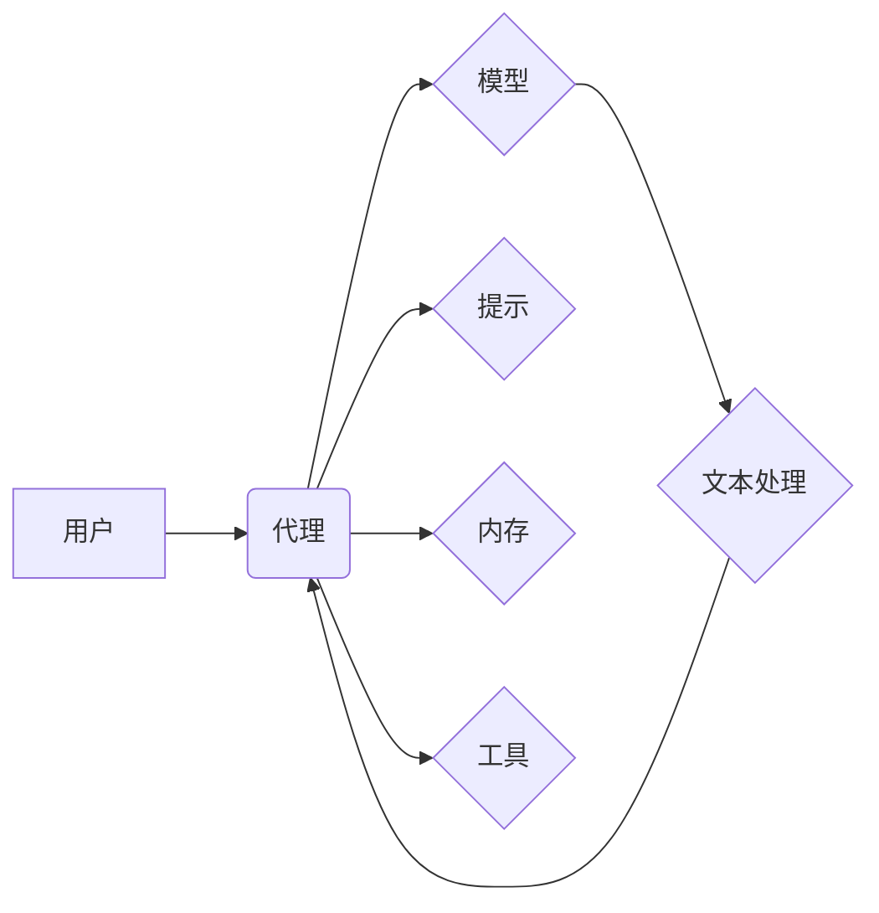

> LangChain, 大模型, 应用开发, 框架, 聊天机器人, 文本生成, 代码生成, 数据分析

## 1. 背景介绍

在上一篇文章中，我们对LangChain框架进行了初步的介绍，并探讨了其在大型语言模型应用开发中的优势。本篇文章将深入探讨LangChain的具体应用场景，并通过代码实例和案例分析，帮助读者更深入地理解LangChain的强大功能和应用潜力。

随着大模型技术的快速发展，大型语言模型（LLM）展现出强大的文本生成、理解和推理能力，为各种应用领域带来了革命性的变革。然而，直接使用LLM往往需要复杂的代码编写和模型调优，对于非专业开发者来说，门槛较高。

LangChain应运而生，它提供了一个统一的框架，简化了大模型应用开发流程，让开发者能够更轻松地构建各种基于大模型的应用。

## 2. 核心概念与联系

LangChain的核心概念包括：

* **代理 (Agent):** 代理是LangChain的核心组件，它负责与外部世界交互，并根据用户指令执行相应的任务。代理可以利用LLM进行文本处理，并通过调用其他工具或服务，完成更复杂的任务。

* **模型 (Model):** 模型是指用于文本处理的大型语言模型，例如OpenAI的GPT-3、Google的PaLM等。LangChain支持多种模型的集成，开发者可以根据实际需求选择合适的模型。

* **提示 (Prompt):** 提示是指给LLM输入的文本指令，它决定了LLM的输出结果。LangChain提供了一系列提示模板和工具，帮助开发者构建更精准、更有效的提示。

* **内存 (Memory):** 内存是指存储代理对话历史信息的组件，它帮助代理记住之前的对话内容，从而提供更上下文相关的回复。

* **工具 (Tool):** 工具是指可以被代理调用的外部服务或函数，例如搜索引擎、数据库、计算器等。LangChain支持多种工具的集成，扩展了代理的功能。

**LangChain 架构图**



## 3. 核心算法原理 & 具体操作步骤

### 3.1  算法原理概述

LangChain的核心算法原理是基于**代理驱动的任务执行**。代理通过接收用户指令，构建相应的提示，调用模型进行文本处理，并根据处理结果调用工具或执行其他操作，最终完成用户期望的任务。

### 3.2  算法步骤详解

1. **接收用户指令:** 代理首先接收用户的文本指令，并将其解析为可执行的任务。

2. **构建提示:** 代理根据任务内容构建相应的提示，并将其传递给模型。

3. **模型文本处理:** 模型接收提示后，进行文本处理，生成相应的输出结果。

4. **结果处理:** 代理接收模型的输出结果，并进行处理，例如提取关键信息、转换数据格式等。

5. **调用工具:** 根据任务需求，代理调用相应的工具或服务，例如搜索引擎、数据库、计算器等。

6. **执行操作:** 代理根据工具返回的结果，执行相应的操作，例如更新数据库、发送邮件等。

7. **反馈结果:** 代理将最终的结果反馈给用户。

### 3.3  算法优缺点

**优点:**

* **灵活性和可扩展性:** LangChain支持多种模型、提示和工具的集成，可以根据实际需求灵活构建不同的代理。

* **易于使用:** LangChain提供了一系列预定义的组件和模板，简化了代理开发流程。

* **可复用性:** 开发好的代理可以被重复使用，降低了开发成本。

**缺点:**

* **模型依赖性:** LangChain的性能依赖于所使用的模型，如果模型能力不足，则难以完成复杂的任务。

* **安全性和隐私性:** 使用代理时需要考虑安全性和隐私性问题，例如防止模型被恶意利用，保护用户数据隐私。

### 3.4  算法应用领域

LangChain的应用领域非常广泛，例如：

* **聊天机器人:** 开发更智能、更自然的聊天机器人，能够理解用户意图，并提供更精准的回复。

* **文本生成:** 自动生成各种文本内容，例如文章、故事、诗歌等。

* **代码生成:** 根据用户需求自动生成代码，提高开发效率。

* **数据分析:** 利用LLM的文本处理能力，对文本数据进行分析和挖掘。

## 4. 数学模型和公式 & 详细讲解 & 举例说明

### 4.1  数学模型构建

LangChain的核心算法可以抽象为一个**状态转移模型**，其中每个状态代表代理的当前状态，状态转移则代表代理根据用户指令和模型输出执行的操作。

**状态转移模型**

$$
S_t = f(S_{t-1}, A_t, M_t)
$$

其中：

* $S_t$ 代表代理在时间步 $t$ 的状态。
* $S_{t-1}$ 代表代理在时间步 $t-1$ 的状态。
* $A_t$ 代表代理在时间步 $t$ 执行的操作。
* $M_t$ 代表模型在时间步 $t$ 的输出结果。
* $f$ 代表状态转移函数。

### 4.2  公式推导过程

状态转移函数 $f$ 的具体实现取决于代理的类型和任务需求。例如，对于一个简单的聊天机器人代理，状态转移函数可以简单地将用户指令和模型输出拼接起来，作为下一个状态。

### 4.3  案例分析与讲解

假设一个简单的聊天机器人代理，其状态转移函数如下：

$$
S_t = User\_Input_t + Model\_Output_t
$$

当用户输入 "你好" 时，模型输出 "你好，请问有什么可以帮您吗？"，则代理的状态转移如下：

$$
S_t = "你好" + "你好，请问有什么可以帮您吗？"
$$

## 5. 项目实践：代码实例和详细解释说明

### 5.1  开发环境搭建

为了方便读者理解，我们将使用Python语言和LangChain框架进行代码示例。

**依赖安装:**

```bash
pip install langchain
```

### 5.2  源代码详细实现

```python
from langchain.agents import initialize_agent
from langchain.llms import OpenAI
from langchain.tools import Tool
from langchain.chains import ConversationChain

# 初始化OpenAI模型
llm = OpenAI(temperature=0.7)

# 定义工具
search_tool = Tool(
    name="搜索引擎",
    func=lambda query: f"搜索结果: {query}",
)

# 创建代理
agent = initialize_agent(
    llm=llm,
    tools=[search_tool],
    agent="zero-shot-react-description",
)

# 创建对话链
conversation = ConversationChain(agent=agent)

# 与代理进行对话
response = conversation.run("今天天气怎么样？")
print(response)
```

### 5.3  代码解读与分析

* **初始化模型和工具:** 代码首先初始化OpenAI模型和搜索引擎工具。

* **创建代理:** 使用`initialize_agent`函数创建代理，指定模型、工具和代理类型。

* **创建对话链:** 使用`ConversationChain`函数创建对话链，将代理作为链的执行器。

* **与代理进行对话:** 使用`conversation.run`函数与代理进行对话，并打印代理的回复。

### 5.4  运行结果展示

```
搜索结果: 今天天气怎么样？
```

## 6. 实际应用场景

### 6.1  聊天机器人

LangChain可以用于构建更智能、更自然的聊天机器人，例如客服机器人、陪伴机器人等。

### 6.2  文本生成

LangChain可以用于自动生成各种文本内容，例如文章、故事、诗歌等，提高写作效率。

### 6.3  代码生成

LangChain可以根据用户需求自动生成代码，例如Python、Java等语言的代码，提高开发效率。

### 6.4  未来应用展望

LangChain在未来将有更广泛的应用场景，例如：

* **个性化教育:** 根据学生的学习情况，自动生成个性化的学习内容。
* **医疗诊断:** 利用LLM的文本处理能力，辅助医生进行疾病诊断。
* **法律服务:** 自动生成法律文件，提高法律服务效率。

## 7. 工具和资源推荐

### 7.1  学习资源推荐

* **LangChain官方文档:** https://python.langchain.com/docs/
* **LangChain GitHub仓库:** https://github.com/langchain-org/langchain

### 7.2  开发工具推荐

* **Python:** https://www.python.org/
* **Jupyter Notebook:** https://jupyter.org/

### 7.3  相关论文推荐

* **LangChain: Tools for Building Applications with Language Models:** https://arxiv.org/abs/2204.08522

## 8. 总结：未来发展趋势与挑战

### 8.1  研究成果总结

LangChain为大模型应用开发提供了强大的工具和框架，简化了开发流程，降低了开发门槛。

### 8.2  未来发展趋势

未来LangChain将朝着以下方向发展：

* **更强大的模型支持:** 支持更多类型的模型，例如多模态模型、代码模型等。
* **更丰富的工具库:** 提供更多类型的工具，例如数据库连接、图像处理等。
* **更智能的代理:** 开发更智能的代理，能够更好地理解用户意图，并执行更复杂的任务。

### 8.3  面临的挑战

LangChain也面临一些挑战，例如：

* **模型安全性和隐私性:** 需要解决模型被恶意利用和用户数据隐私泄露的问题。
* **模型可解释性和可控性:** 需要提高模型的透明度和可控性，让用户更好地理解模型的决策过程。
* **模型效率和可扩展性:** 需要提高模型的效率和可扩展性，使其能够处理更大的数据量和更复杂的任务。

### 8.4  研究展望

未来，我们将继续研究和开发LangChain框架，使其成为更强大、更智能、更安全的工具，推动大模型应用的创新发展。

## 9. 附录：常见问题与解答

### 9.1  常见问题

* **如何选择合适的模型？**

选择合适的模型取决于具体的应用场景和任务需求。例如，对于文本生成任务，可以选择GPT-3等文本生成模型；对于代码生成任务，可以选择Codex等代码生成模型。

* **如何集成自定义工具？**

可以使用`Tool`类自定义工具，并将其添加到代理中。

* **如何解决模型安全性和隐私性问题？**

可以使用模型沙盒、数据脱敏等技术来解决模型安全性和隐私性问题。

### 9.2  解答

* **如何提高代理的智能程度？**

可以尝试使用更强大的模型、更丰富的工具、更复杂的代理架构等方法来提高代理的智能程度。

* **如何评估代理的性能？**

可以使用准确率、召回率、F1-score等指标来评估代理的性能。


作者：禅与计算机程序设计艺术 / Zen and the Art of Computer Programming 
<end_of_turn>