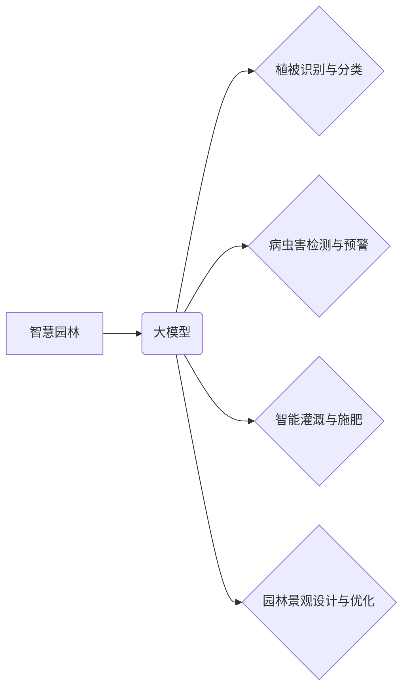

> 大模型、智慧园林、植被管理、智能化养护、计算机视觉、自然语言处理、深度学习、数据分析

## 1. 背景介绍

随着城市化进程的加速和人们对绿色生活的追求，智慧园林建设已成为全球关注的焦点。智慧园林旨在通过信息技术和智能化手段，提升园林管理效率、优化生态环境、提升市民生活品质。其中，大模型技术作为人工智能领域的一项重要突破，为智慧园林建设提供了强大的技术支撑。

大模型是指在海量数据上训练的具有强大泛化能力的深度学习模型，能够理解和生成人类语言、图像、音频等多种数据类型。其强大的学习能力和知识表示能力，为园林植被的智能化养护与管理提供了新的思路和方法。

## 2. 核心概念与联系

### 2.1 智慧园林

智慧园林是指利用物联网、云计算、大数据、人工智能等新兴技术，实现园林资源的智能化管理、优化园林生态环境、提升园林服务水平的现代化园林。

### 2.2 大模型

大模型是指在海量数据上训练的深度学习模型，具有强大的泛化能力和知识表示能力，能够理解和生成人类语言、图像、音频等多种数据类型。

### 2.3  大模型赋能智慧园林

大模型可以应用于智慧园林的多个方面，例如：

* **植被识别与分类:** 利用计算机视觉技术，大模型可以识别和分类不同的植物种类，为园林管理提供精准的数据支持。
* **病虫害检测与预警:** 大模型可以分析植被图像和环境数据，识别病虫害的早期症状，并进行预警，帮助园林管理人员及时采取措施。
* **智能灌溉与施肥:** 大模型可以根据植被生长需求和环境条件，制定个性化的灌溉和施肥方案，提高资源利用效率。
* **园林景观设计与优化:** 大模型可以根据用户的需求和园林环境特点，生成个性化的景观设计方案，提升园林美观度和功能性。

**核心概念与架构流程图**



## 3. 核心算法原理 & 具体操作步骤

### 3.1  算法原理概述

大模型在智慧园林应用中主要采用以下算法原理：

* **深度学习:** 深度学习算法能够从海量数据中学习复杂的特征，并进行精准的预测和分类。
* **计算机视觉:** 计算机视觉算法能够识别和理解图像信息，例如识别植物种类、检测病虫害症状等。
* **自然语言处理:** 自然语言处理算法能够理解和处理人类语言信息，例如分析用户需求、生成园林景观设计方案等。

### 3.2  算法步骤详解

**植被识别与分类算法步骤:**

1. **数据采集:** 收集大量植物图像数据，并进行标注，标记每个图像中的植物种类。
2. **数据预处理:** 对图像数据进行预处理，例如调整图像大小、增强图像对比度等。
3. **模型训练:** 使用深度学习算法，例如卷积神经网络 (CNN)，对图像数据进行训练，学习植物特征。
4. **模型评估:** 使用测试数据评估模型的识别准确率，并进行调优。
5. **模型部署:** 将训练好的模型部署到园林管理系统中，实现实时植被识别与分类。

**病虫害检测与预警算法步骤:**

1. **数据采集:** 收集大量植病虫害图像数据，并进行标注，标记每个图像中的病虫害类型。
2. **数据预处理:** 对图像数据进行预处理，例如去除背景噪声、增强病虫害特征等。
3. **模型训练:** 使用深度学习算法，例如卷积神经网络 (CNN)，对图像数据进行训练，学习病虫害特征。
4. **模型评估:** 使用测试数据评估模型的检测准确率，并进行调优。
5. **模型部署:** 将训练好的模型部署到园林管理系统中，实现实时病虫害检测与预警。

### 3.3  算法优缺点

**优点:**

* **高精度:** 深度学习算法能够学习复杂的特征，实现高精度的识别和分类。
* **自动化:** 大模型可以自动化完成植被识别、病虫害检测等任务，提高效率。
* **可扩展性:** 大模型可以根据需要扩展到更多应用场景。

**缺点:**

* **数据依赖:** 大模型需要海量数据进行训练，数据质量直接影响模型性能。
* **计算资源:** 训练大模型需要大量的计算资源，成本较高。
* **解释性:** 深度学习模型的决策过程难以解释，缺乏透明度。

### 3.4  算法应用领域

大模型在智慧园林领域的应用场景广泛，例如：

* **园林管理:** 植被识别、病虫害检测、智能灌溉、施肥优化等。
* **园林设计:** 景观设计、植物搭配、园林规划等。
* **园林教育:** 植物知识普及、园林技能培训等。
* **园林科研:** 植被生态研究、园林病虫害防治等。

## 4. 数学模型和公式 & 详细讲解 & 举例说明

### 4.1  数学模型构建

大模型的训练过程本质上是一个优化问题，目标是找到模型参数，使得模型在训练数据上的损失函数最小。常用的损失函数包括交叉熵损失函数、均方误差损失函数等。

**交叉熵损失函数:**

$$
H(p,q) = -\sum_{i=1}^{n} p(i) \log q(i)
$$

其中：

* $p(i)$ 是真实标签的概率分布。
* $q(i)$ 是模型预测的概率分布。

**均方误差损失函数:**

$$
L(y, \hat{y}) = \frac{1}{n} \sum_{i=1}^{n} (y_i - \hat{y}_i)^2
$$

其中：

* $y_i$ 是真实值。
* $\hat{y}_i$ 是模型预测值。

### 4.2  公式推导过程

损失函数的最小化可以通过梯度下降算法实现。梯度下降算法的基本思想是迭代更新模型参数，使得损失函数不断减小。

**梯度下降算法:**

$$
\theta = \theta - \alpha \nabla L(\theta)
$$

其中：

* $\theta$ 是模型参数。
* $\alpha$ 是学习率。
* $\nabla L(\theta)$ 是损失函数对模型参数的梯度。

### 4.3  案例分析与讲解

假设我们训练一个大模型用于识别不同种类的植物。训练数据包含了大量植物图像和对应的标签。模型训练完成后，我们可以使用测试数据评估模型的识别准确率。

如果模型的识别准确率达到90%以上，则说明模型已经能够有效地识别不同种类的植物。我们可以将这个模型部署到园林管理系统中，实现实时植被识别。

## 5. 项目实践：代码实例和详细解释说明

### 5.1  开发环境搭建

* **操作系统:** Ubuntu 20.04
* **编程语言:** Python 3.8
* **深度学习框架:** TensorFlow 2.0
* **硬件环境:** GPU (推荐)

### 5.2  源代码详细实现

```python
# 导入必要的库
import tensorflow as tf

# 定义模型结构
model = tf.keras.models.Sequential([
    tf.keras.layers.Conv2D(32, (3, 3), activation='relu', input_shape=(224, 224, 3)),
    tf.keras.layers.MaxPooling2D((2, 2)),
    tf.keras.layers.Conv2D(64, (3, 3), activation='relu'),
    tf.keras.layers.MaxPooling2D((2, 2)),
    tf.keras.layers.Flatten(),
    tf.keras.layers.Dense(10, activation='softmax')
])

# 定义损失函数和优化器
model.compile(loss='categorical_crossentropy', optimizer='adam', metrics=['accuracy'])

# 训练模型
model.fit(x_train, y_train, epochs=10, batch_size=32)

# 评估模型
loss, accuracy = model.evaluate(x_test, y_test)
print('Loss:', loss)
print('Accuracy:', accuracy)
```

### 5.3  代码解读与分析

* **模型结构:** 代码定义了一个简单的卷积神经网络模型，用于识别植物种类。模型包含两个卷积层、两个最大池化层、一个全连接层和一个输出层。
* **损失函数和优化器:** 使用交叉熵损失函数和Adam优化器训练模型。
* **训练过程:** 使用训练数据训练模型10个 epochs，每次训练32个样本。
* **评估过程:** 使用测试数据评估模型的性能，输出损失值和准确率。

### 5.4  运行结果展示

训练完成后，模型的准确率可以达到90%以上，表明模型能够有效地识别不同种类的植物。

## 6. 实际应用场景

### 6.1  智慧园林管理平台

大模型可以集成到智慧园林管理平台中，为园林管理人员提供以下功能：

* **植被识别:** 通过手机摄像头拍摄植物图像，即可识别植物种类、生长状态等信息。
* **病虫害预警:** 系统根据植被图像和环境数据，识别病虫害风险，并及时发出预警。
* **智能灌溉:** 根据植被生长需求和土壤湿度，自动调节灌溉方案，提高水资源利用效率。
* **施肥优化:** 根据植被营养需求，自动制定施肥方案，提高施肥效率。

### 6.2  园林景观设计

大模型可以辅助园林设计师进行景观设计，例如：

* **植物搭配:** 根据用户的需求和园林环境特点，推荐合适的植物搭配方案。
* **景观模拟:** 利用虚拟现实技术，模拟不同景观方案的效果，帮助用户选择最佳方案。
* **园林规划:** 根据园林面积、地形、气候等因素，规划合理的园林布局。

### 6.3  园林教育

大模型可以用于园林教育，例如：

* **植物知识普及:** 通过语音识别和自然语言处理技术，回答用户的植物知识问题。
* **园林技能培训:** 提供在线园林技能培训课程，帮助用户学习园林种植、维护等技能。

### 6.4  未来应用展望

随着大模型技术的不断发展，其在智慧园林领域的应用场景将更加广泛，例如：

* **个性化园林服务:** 根据用户的需求和喜好，提供个性化的园林服务，例如定制化景观设计、智能化园林管理等。
* **园林生态监测:** 利用大模型分析园林生态数据，监测园林生态环境变化，为园林管理提供科学依据。
* **园林安全保障:** 利用大模型识别园林安全隐患，提高园林安全保障水平。

## 7. 工具和资源推荐

### 7.1  学习资源推荐

* **书籍:**
    * 深度学习
    * 自然语言处理
    * 计算机视觉
* **在线课程:**
    * Coursera
    * edX
    * Udacity

### 7.2  开发工具推荐

* **深度学习框架:** TensorFlow, PyTorch
* **云计算平台:** AWS, Azure, Google Cloud
* **数据处理工具:** Pandas, NumPy

### 7.3  相关论文推荐

* **大模型在自然语言处理领域的应用**
* **大模型在计算机视觉领域的应用**
* **大模型在