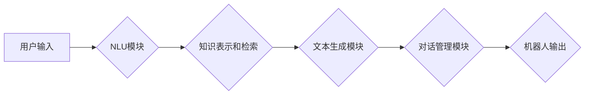

> 大模型、问答机器人、自然语言处理、对话系统、深度学习、Transformer、BERT、GPT

## 1. 背景介绍

近年来，人工智能技术取得了飞速发展，特别是深度学习的兴起，为自然语言处理（NLP）领域带来了革命性的变革。大模型问答机器人作为一种新型的智能交互系统，在人们的生活和工作中扮演着越来越重要的角色。

传统的问答系统通常依赖于规则引擎或基于知识库的检索机制，难以应对复杂、开放式的自然语言问题。而大模型问答机器人则通过训练海量文本数据，学习语言的语义和结构，能够理解用户的意图，并生成自然流畅的回答。

## 2. 核心概念与联系

大模型问答机器人主要由以下几个核心模块组成：

* **自然语言理解（NLU）模块：**负责对用户的自然语言输入进行分析和理解，提取关键信息，例如实体、关系和意图。
* **知识表示和检索模块：**负责将知识存储在可查询的结构化形式中，并根据用户的查询进行高效的知识检索。
* **文本生成模块：**负责根据理解到的信息和知识，生成自然流畅的文本回答。
* **对话管理模块：**负责管理对话的上下文和流程，确保对话的自然性和流畅性。

**Mermaid 流程图**



## 3. 核心算法原理 & 具体操作步骤

### 3.1  算法原理概述

大模型问答机器人的核心算法主要基于深度学习技术，特别是 Transformer 架构。Transformer 是一种新型的神经网络架构，能够有效地处理序列数据，例如文本。它通过自注意力机制学习文本之间的关系，并能够捕捉长距离依赖关系。

### 3.2  算法步骤详解

1. **数据预处理：**将原始文本数据进行清洗、分词、标记等预处理操作，使其能够被模型理解。
2. **模型训练：**使用预训练的 Transformer 模型，例如 BERT 或 GPT，对预处理后的文本数据进行训练。训练过程的目标是让模型能够准确地理解文本的语义和结构。
3. **模型评估：**使用测试数据集评估模型的性能，例如准确率、召回率和 F1 分数。
4. **模型部署：**将训练好的模型部署到服务器或云平台，以便用户进行交互。

### 3.3  算法优缺点

**优点：**

* 能够理解复杂的自然语言问题。
* 生成自然流畅的文本回答。
* 能够不断学习和改进。

**缺点：**

* 训练成本高，需要海量数据和计算资源。
* 容易受到恶意攻击和数据偏差的影响。
* 缺乏可解释性，难以理解模型的决策过程。

### 3.4  算法应用领域

大模型问答机器人具有广泛的应用领域，例如：

* **客服机器人：**自动回答用户常见问题，提高客服效率。
* **教育机器人：**为学生提供个性化的学习辅导。
* **搜索引擎：**提供更准确和相关的搜索结果。
* **医疗诊断：**辅助医生进行疾病诊断。

## 4. 数学模型和公式 & 详细讲解 & 举例说明

### 4.1  数学模型构建

大模型问答机器人的数学模型主要基于 Transformer 架构，其核心是自注意力机制。自注意力机制能够学习文本中每个词与其他词之间的关系，并赋予每个词不同的权重。

### 4.2  公式推导过程

自注意力机制的计算公式如下：

$$
Attention(Q, K, V) = softmax(\frac{QK^T}{\sqrt{d_k}})V
$$

其中：

* $Q$：查询矩阵
* $K$：键矩阵
* $V$：值矩阵
* $d_k$：键向量的维度
* $softmax$：softmax 函数

### 4.3  案例分析与讲解

假设我们有一个句子：“我爱吃苹果”。

* $Q$：查询矩阵，表示每个词对其他词的关注程度。
* $K$：键矩阵，表示每个词的特征。
* $V$：值矩阵，表示每个词的语义信息。

通过计算 $QK^T$，我们可以得到每个词对其他词的注意力权重。然后，通过 softmax 函数将权重归一化，得到每个词对其他词的关注程度。最后，将注意力权重与值矩阵相乘，得到每个词的上下文信息。

## 5. 项目实践：代码实例和详细解释说明

### 5.1  开发环境搭建

* Python 3.7+
* TensorFlow 或 PyTorch
* CUDA 和 cuDNN

### 5.2  源代码详细实现

```python
# 使用 TensorFlow 实现简单的问答模型

import tensorflow as tf

# 定义模型结构
model = tf.keras.Sequential([
    tf.keras.layers.Embedding(input_dim=vocab_size, output_dim=embedding_dim),
    tf.keras.layers.LSTM(units=128),
    tf.keras.layers.Dense(units=vocab_size, activation='softmax')
])

# 编译模型
model.compile(optimizer='adam', loss='sparse_categorical_crossentropy', metrics=['accuracy'])

# 训练模型
model.fit(x_train, y_train, epochs=10)

# 预测
predictions = model.predict(x_test)
```

### 5.3  代码解读与分析

* `Embedding` 层将词向量化，将每个词映射到一个低维向量空间。
* `LSTM` 层是一个循环神经网络，能够捕捉文本序列中的长距离依赖关系。
* `Dense` 层是一个全连接层，用于将 LSTM 的输出映射到输出词汇表。

### 5.4  运行结果展示

训练完成后，可以使用测试数据评估模型的性能。

## 6. 实际应用场景

大模型问答机器人已经应用于多个领域，例如：

* **客服机器人：**例如，阿里巴巴的“小客服”能够自动回答用户关于订单、物流等常见问题。
* **教育机器人：**例如，百度“小度”能够为学生提供个性化的学习辅导。
* **搜索引擎：**例如，谷歌的“搜索助手”能够理解用户的自然语言查询，并提供更准确的搜索结果。

### 6.4  未来应用展望

未来，大模型问答机器人将更加智能化、个性化和场景化。例如：

* **多模态交互：**能够理解和生成多种模态信息，例如文本、图像和语音。
* **个性化定制：**能够根据用户的喜好和需求进行个性化定制。
* **场景化应用：**能够针对不同的场景进行定制开发，例如医疗、金融、教育等。

## 7. 工具和资源推荐

### 7.1  学习资源推荐

* **书籍：**
    * 《深度学习》
    * 《自然语言处理》
* **在线课程：**
    * Coursera
    * edX
* **开源项目：**
    * Hugging Face Transformers

### 7.2  开发工具推荐

* **TensorFlow:** https://www.tensorflow.org/
* **PyTorch:** https://pytorch.org/
* **spaCy:** https://spacy.io/

### 7.3  相关论文推荐

* **BERT: Pre-training of Deep Bidirectional Transformers for Language Understanding**
* **GPT: Generative Pre-trained Transformer**
* **XLNet: Generalized Autoregressive Pretraining for Language Understanding**

## 8. 总结：未来发展趋势与挑战

### 8.1  研究成果总结

近年来，大模型问答机器人取得了显著的进展，能够理解和生成更加自然流畅的文本。

### 8.2  未来发展趋势

未来，大模型问答机器人将朝着更加智能化、个性化和场景化的方向发展。

### 8.3  面临的挑战

大模型问答机器人还面临着一些挑战，例如：

* **数据偏差：**训练数据可能存在偏差，导致模型产生偏见。
* **可解释性：**模型的决策过程难以解释，难以获得用户的信任。
* **安全性和隐私性：**模型可能被用于恶意攻击或侵犯用户隐私。

### 8.4  研究展望

未来，需要进一步研究如何解决这些挑战，使大模型问答机器人更加安全、可靠和可解释。

## 9. 附录：常见问题与解答

**Q1：大模型问答机器人与传统问答系统的区别是什么？**

**A1：**传统问答系统通常依赖于规则引擎或基于知识库的检索机制，难以应对复杂、开放式的自然语言问题。而大模型问答机器人则通过训练海量文本数据，学习语言的语义和结构，能够理解用户的意图，并生成自然流畅的回答。

**Q2：大模型问答机器人的训练成本很高吗？**

**A2：**是的，大模型问答机器人的训练成本很高，需要海量数据和强大的计算资源。

**Q3：大模型问答机器人的安全性如何？**

**A3：**大模型问答机器人的安全性是一个重要的挑战。需要采取措施防止模型被用于恶意攻击或侵犯用户隐私。


作者：禅与计算机程序设计艺术 / Zen and the Art of Computer Programming 
<end_of_turn>