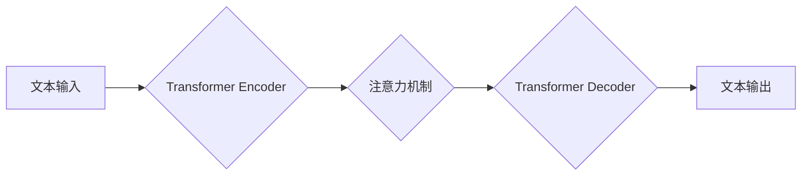

> 大规模语言模型，Transformer，深度学习，自然语言处理，文本生成，机器翻译，预训练模型

## 1. 背景介绍

近年来，深度学习技术取得了飞速发展，特别是大规模语言模型（Large Language Models，LLMs）的出现，为自然语言处理（Natural Language Processing，NLP）领域带来了革命性的变革。LLMs 拥有庞大的参数量和海量文本数据训练，能够理解和生成人类语言，展现出强大的文本生成、机器翻译、问答系统等能力。

从 GPT-3 到 LaMDA，从 BERT 到 T5，一系列突破性的模型不断涌现，推动着人工智能技术的进步。然而，LLMs 的发展也面临着诸多挑战，例如训练成本高、模型规模庞大、数据偏见等问题。

本文将从理论到实践，深入探讨大规模语言模型的原理、算法、应用场景以及未来发展趋势，并结合实际案例，提供一些实践思考。

## 2. 核心概念与联系

大规模语言模型的核心概念包括：

* **Transformer:**  Transformer 是一种基于注意力机制的神经网络架构，是 LLMs 的基础。它能够有效地捕捉文本序列中的长距离依赖关系，显著提升了模型的性能。

* **深度学习:** 深度学习是一种机器学习的子领域，利用多层神经网络来学习复杂的数据模式。LLMs 依赖于深度学习算法进行训练。

* **自然语言处理:** 自然语言处理是指让计算机能够理解、处理和生成人类语言的技术。LLMs 是 NLP 领域的重要应用之一。

* **预训练模型:** 预训练模型是指在大量文本数据上进行预训练的模型，能够捕捉语言的通用知识和模式。LLMs 通常采用预训练模型作为基础，并针对特定任务进行微调。

**Mermaid 流程图:**



## 3. 核心算法原理 & 具体操作步骤

### 3.1  算法原理概述

Transformer 是一种基于注意力机制的神经网络架构，其核心思想是通过注意力机制来捕捉文本序列中的长距离依赖关系。

Transformer 模型由两个主要部分组成：Encoder 和 Decoder。Encoder 用于编码输入文本序列，将文本转换为隐藏表示；Decoder 用于解码隐藏表示，生成输出文本序列。

### 3.2  算法步骤详解

1. **词嵌入:** 将输入文本中的每个词转换为稠密的向量表示。

2. **多头注意力机制:**  对输入序列中的每个词进行多头注意力计算，捕捉词与词之间的关系。

3. **前馈神经网络:** 对每个词的注意力输出进行非线性变换，提取更深层的语义信息。

4. **位置编码:**  由于 Transformer 模型不具备顺序信息，需要添加位置编码来表示每个词在序列中的位置。

5. **解码过程:** Decoder 接收编码后的隐藏表示，并通过类似的注意力机制和前馈神经网络进行解码，生成输出文本序列。

### 3.3  算法优缺点

**优点:**

* 能够有效地捕捉长距离依赖关系。
* 并行计算能力强，训练速度快。
* 性能优异，在各种 NLP 任务中取得了突破性进展。

**缺点:**

* 参数量大，训练成本高。
* 对训练数据要求高，容易出现过拟合问题。

### 3.4  算法应用领域

Transformer 算法广泛应用于各种 NLP 任务，例如：

* **机器翻译:** 将一种语言翻译成另一种语言。
* **文本摘要:**  生成文本的简短摘要。
* **问答系统:**  回答用户提出的问题。
* **文本生成:**  生成高质量的文本内容。
* **对话系统:**  与用户进行自然语言对话。

## 4. 数学模型和公式 & 详细讲解 & 举例说明

### 4.1  数学模型构建

Transformer 模型的数学模型主要基于以下几个核心概念：

* **注意力机制:**  注意力机制是一种机制，用于计算每个词与其他词之间的相关性，并根据相关性赋予不同的权重。

* **多头注意力:**  多头注意力机制是指使用多个注意力头来计算词之间的关系，每个注意力头关注不同的方面，从而捕捉更丰富的语义信息。

* **位置编码:**  位置编码用于表示每个词在序列中的位置信息，因为 Transformer 模型不具备顺序信息。

### 4.2  公式推导过程

**注意力机制公式:**

$$
Attention(Q, K, V) = softmax(\frac{QK^T}{\sqrt{d_k}})V
$$

其中：

* $Q$：查询矩阵
* $K$：键矩阵
* $V$：值矩阵
* $d_k$：键向量的维度
* $softmax$：softmax 函数

**多头注意力机制公式:**

$$
MultiHead(Q, K, V) = Concat(head_1, head_2, ..., head_h)W_O
$$

其中：

* $head_i$：第 $i$ 个注意力头的输出
* $h$：注意力头的数量
* $W_O$：线性变换矩阵

### 4.3  案例分析与讲解

假设我们有一个句子 "The cat sat on the mat"，我们使用多头注意力机制来计算每个词与其他词之间的关系。

在计算注意力权重时，每个词的查询向量 $Q$ 与其他词的键向量 $K$ 进行点积，然后通过 softmax 函数归一化得到注意力权重。

注意力权重表示每个词对其他词的影响程度。例如，"cat" 与 "sat" 的注意力权重较高，因为它们在语义上相关。

## 5. 项目实践：代码实例和详细解释说明

### 5.1  开发环境搭建

* Python 3.7+
* PyTorch 1.7+
* CUDA 10.2+

### 5.2  源代码详细实现

```python
import torch
import torch.nn as nn

class Transformer(nn.Module):
    def __init__(self, vocab_size, embedding_dim, num_heads, num_layers):
        super(Transformer, self).__init__()
        self.embedding = nn.Embedding(vocab_size, embedding_dim)
        self.encoder_layers = nn.ModuleList([EncoderLayer(embedding_dim, num_heads) for _ in range(num_layers)])
        self.decoder_layers = nn.ModuleList([DecoderLayer(embedding_dim, num_heads) for _ in range(num_layers)])

    def forward(self, src, tgt):
        src = self.embedding(src)
        tgt = self.embedding(tgt)
        # ... (Encoder and Decoder logic)
```

### 5.3  代码解读与分析

* **`__init__` 方法:** 初始化模型参数，包括词嵌入层、编码器层和解码器层。
* **`forward` 方法:** 定义模型的正向传播过程，输入源文本和目标文本，并输出预测的输出文本。
* **`EncoderLayer` 和 `DecoderLayer`:** 编码器和解码器层分别由多头注意力机制和前馈神经网络组成。

### 5.4  运行结果展示

运行模型后，可以生成预测的输出文本，并与真实文本进行比较，评估模型的性能。

## 6. 实际应用场景

### 6.1  机器翻译

LLMs 可以用于将一种语言翻译成另一种语言，例如将英文翻译成中文。

### 6.2  文本摘要

LLMs 可以生成文本的简短摘要，例如将一篇长篇文章总结成几句话。

### 6.3  问答系统

LLMs 可以回答用户提出的问题，例如根据给定的文本回答问题。

### 6.4  未来应用展望

LLMs 的应用场景还在不断扩展，未来可能应用于：

* **代码生成:**  自动生成代码。
* **创意写作:**  辅助创作小说、诗歌等。
* **个性化教育:**  提供个性化的学习内容。

## 7. 工具和资源推荐

### 7.1  学习资源推荐

* **论文:** "Attention Is All You Need"
* **博客:**  Hugging Face Blog
* **在线课程:**  Coursera, Udacity

### 7.2  开发工具推荐

* **PyTorch:**  深度学习框架
* **TensorFlow:**  深度学习框架
* **Hugging Face Transformers:**  预训练模型库

### 7.3  相关论文推荐

* "BERT: Pre-training of Deep Bidirectional Transformers for Language Understanding"
* "GPT-3: Language Models are Few-Shot Learners"
* "T5: Text-to-Text Transfer Transformer"

## 8. 总结：未来发展趋势与挑战

### 8.1  研究成果总结

近年来，大规模语言模型取得了显著进展，在各种 NLP 任务中取得了突破性成果。

### 8.2  未来发展趋势

* **模型规模更大:**  随着计算资源的不断提升，模型规模将继续扩大，性能将进一步提升。
* **多模态学习:**  LLMs 将与其他模态数据（例如图像、音频）进行融合，实现多模态理解和生成。
* **可解释性增强:**  研究如何提高 LLMs 的可解释性，使其决策过程更加透明。

### 8.3  面临的挑战

* **训练成本高:**  训练大规模语言模型需要大量的计算资源和时间。
* **数据偏见:**  LLMs 的训练数据可能存在偏见，导致模型输出存在偏差。
* **安全风险:**  LLMs 可能被用于生成虚假信息或进行恶意攻击。

### 8.4  研究展望

未来，大规模语言模型的研究将继续深入，探索更强大的模型架构、更有效的训练方法和更广泛的应用场景。


## 9. 附录：常见问题与解答

**Q1: 如何选择合适的预训练模型？**

**A1:**  选择预训练模型需要根据具体的应用场景和任务需求进行选择。

**Q2: 如何评估大规模语言模型的性能？**

**A2:**  常用的评估指标包括准确率、困惑度、BLEU 等。

**Q3: 如何解决大规模语言模型的训练成本问题？**

**A3:**  可以通过模型压缩、参数共享等方法降低训练成本。


作者：禅与计算机程序设计艺术 / Zen and the Art of Computer Programming 
<end_of_turn>