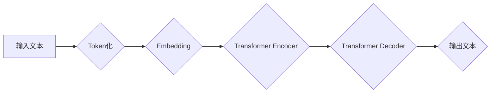

> 大语言模型、Transformer、BERT、GPT、LLM、自然语言处理、深度学习、文本生成

## 1. 背景介绍

近年来，深度学习技术取得了飞速发展，特别是Transformer模型的出现，为自然语言处理（NLP）领域带来了革命性的变革。大语言模型（LLM）作为Transformer模型的升级版，拥有强大的文本理解和生成能力，在文本分类、机器翻译、问答系统、代码生成等领域展现出巨大的应用潜力。

传统的NLP模型通常依赖于手工设计的特征工程，而LLM则通过学习海量文本数据，自动提取文本中的语义特征，从而实现更精准、更灵活的文本处理。

## 2. 核心概念与联系

大语言模型的核心概念包括：

* **Transformer模型:** Transformer是一种基于注意力机制的深度学习模型，能够有效捕捉文本序列中的长距离依赖关系，是LLM的基础架构。
* **自回归语言模型:** 自回归语言模型是一种预测下一个词的概率分布的模型，通过训练大量的文本数据，学习语言的语法和语义规律。
* **预训练与微调:** 预训练是指在大量文本数据上训练一个通用语言模型，微调是指将预训练模型应用于特定任务，通过少量任务数据进行调整。

**Mermaid 流程图:**



## 3. 核心算法原理 & 具体操作步骤

### 3.1  算法原理概述

Transformer模型的核心是注意力机制，它能够学习文本中不同词之间的关系，并赋予每个词不同的权重。

注意力机制可以分为三种类型：

* **自注意力 (Self-Attention):** 计算每个词与所有其他词之间的关系。
* **多头注意力 (Multi-Head Attention):** 使用多个自注意力头，学习不同类型的词语关系。
* **交叉注意力 (Cross-Attention):** 计算两个序列之间的关系，例如，将输入文本与目标文本进行交叉注意力。

Transformer模型由编码器和解码器组成。编码器负责将输入文本转换为隐藏状态，解码器则根据隐藏状态生成输出文本。

### 3.2  算法步骤详解

1. **Token化:** 将输入文本分割成一个个独立的词或子词。
2. **Embedding:** 将每个词转换为一个向量表示。
3. **编码器:** 将嵌入后的词向量输入到编码器中，通过多层Transformer模块进行处理，最终得到每个词的隐藏状态。
4. **解码器:** 将编码器的输出作为输入，解码器通过多层Transformer模块生成输出文本。

### 3.3  算法优缺点

**优点:**

* 能够有效捕捉文本序列中的长距离依赖关系。
* 训练效率高，能够处理海量文本数据。
* 在各种NLP任务中表现出色。

**缺点:**

* 计算量大，需要强大的计算资源。
* 训练数据量大，需要大量的文本数据进行预训练。
* 容易出现过拟合问题。

### 3.4  算法应用领域

* 文本分类
* 机器翻译
* 问答系统
* 代码生成
* 文本摘要
* 对话系统

## 4. 数学模型和公式 & 详细讲解 & 举例说明

### 4.1  数学模型构建

Transformer模型的数学模型主要包括以下几个部分：

* **词嵌入:** 将每个词转换为一个向量表示，可以使用Word2Vec、GloVe等预训练模型获得词嵌入。
* **注意力机制:** 计算每个词与所有其他词之间的关系，并赋予每个词不同的权重。
* **多层感知机 (MLP):** 用于对隐藏状态进行非线性变换。

### 4.2  公式推导过程

**注意力机制公式:**

$$
Attention(Q, K, V) = softmax(\frac{QK^T}{\sqrt{d_k}})V
$$

其中：

* $Q$：查询矩阵
* $K$：键矩阵
* $V$：值矩阵
* $d_k$：键向量的维度
* $softmax$：softmax函数

**多层感知机公式:**

$$
MLP(x) = ReLU(W_1x + b_1)W_2 + b_2
$$

其中：

* $x$：输入向量
* $W_1$、$W_2$：权重矩阵
* $b_1$、$b_2$：偏置向量
* $ReLU$：ReLU激活函数

### 4.3  案例分析与讲解

**举例说明:**

假设我们有一个句子 "The cat sat on the mat"，我们需要计算每个词与所有其他词之间的注意力权重。

1. 将每个词转换为词向量。
2. 计算每个词与所有其他词之间的点积。
3. 对点积进行归一化，得到每个词与所有其他词之间的注意力权重。

## 5. 项目实践：代码实例和详细解释说明

### 5.1  开发环境搭建

* Python 3.7+
* PyTorch 1.7+
* CUDA 10.2+

### 5.2  源代码详细实现

```python
import torch
import torch.nn as nn

class Transformer(nn.Module):
    def __init__(self, vocab_size, embedding_dim, num_heads, num_layers):
        super(Transformer, self).__init__()
        self.embedding = nn.Embedding(vocab_size, embedding_dim)
        self.transformer_layers = nn.ModuleList([
            nn.TransformerEncoderLayer(embedding_dim, num_heads)
            for _ in range(num_layers)
        ])
        self.linear = nn.Linear(embedding_dim, vocab_size)

    def forward(self, x):
        x = self.embedding(x)
        x = self.transformer_layers(x)
        x = self.linear(x)
        return x
```

### 5.3  代码解读与分析

* `__init__` 方法初始化模型参数，包括词嵌入层、Transformer编码器层和输出层。
* `forward` 方法定义模型的正向传播过程，将输入词向量经过词嵌入层、Transformer编码器层和输出层，最终得到输出概率分布。

### 5.4  运行结果展示

训练好的Transformer模型可以用于各种NLP任务，例如文本分类、机器翻译等。

## 6. 实际应用场景

### 6.1  文本分类

LLM可以用于分类文本，例如判断新闻文章的主题、识别垃圾邮件等。

### 6.2  机器翻译

LLM可以用于将文本从一种语言翻译成另一种语言，例如将英文翻译成中文。

### 6.3  问答系统

LLM可以用于构建问答系统，例如根据给定的问题从文本中找到答案。

### 6.4  未来应用展望

LLM在未来将有更广泛的应用场景，例如：

* 自动写作
* 代码生成
* 人机对话
* 个性化教育

## 7. 工具和资源推荐

### 7.1  学习资源推荐

* **书籍:**
    * 《深度学习》
    * 《自然语言处理》
* **在线课程:**
    * Coursera: 自然语言处理
    * Udacity: 深度学习

### 7.2  开发工具推荐

* **PyTorch:** 深度学习框架
* **TensorFlow:** 深度学习框架
* **HuggingFace:** 预训练模型库

### 7.3  相关论文推荐

* **Attention Is All You Need:** https://arxiv.org/abs/1706.03762
* **BERT: Pre-training of Deep Bidirectional Transformers for Language Understanding:** https://arxiv.org/abs/1810.04805
* **GPT-3: Language Models are Few-Shot Learners:** https://arxiv.org/abs/2005.14165

## 8. 总结：未来发展趋势与挑战

### 8.1  研究成果总结

近年来，LLM取得了显著的进展，在各种NLP任务中取得了优异的性能。

### 8.2  未来发展趋势

* **模型规模更大:** 随着计算资源的不断提升，LLM模型规模将继续扩大，从而提升模型的性能。
* **多模态学习:** 将文本与其他模态数据（例如图像、音频）进行融合，构建更强大的多模态LLM。
* **可解释性增强:** 研究LLM的决策机制，提高模型的可解释性。

### 8.3  面临的挑战

* **数据获取和标注:** 训练大型LLM需要海量高质量的数据，数据获取和标注成本较高。
* **计算资源:** 训练大型LLM需要大量的计算资源，成本较高。
* **伦理问题:** LLM可能被用于生成虚假信息、进行恶意攻击等，需要关注其伦理问题。

### 8.4  研究展望

未来，LLM研究将继续朝着更强大、更安全、更可解释的方向发展。


## 9. 附录：常见问题与解答

**常见问题:**

* **什么是LLM？**

LLM是指大规模语言模型，是一种能够理解和生成人类语言的深度学习模型。

* **LLM有哪些应用场景？**

LLM在文本分类、机器翻译、问答系统、代码生成等领域都有广泛的应用。

* **如何训练LLM？**

训练LLM需要大量的文本数据和强大的计算资源，通常采用预训练和微调的方法。

**解答:**

* **LLM的优势:**

LLM能够有效捕捉文本中的语义关系，并生成流畅、自然的文本。

* **LLM的局限性:**

LLM可能存在偏见、错误和虚假信息等问题，需要谨慎使用。


作者：禅与计算机程序设计艺术 / Zen and the Art of Computer Programming 
<end_of_turn>