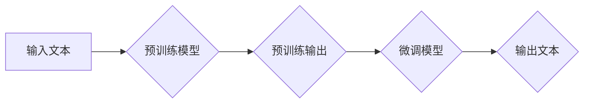

> 大语言模型、Transformer、深度学习、自然语言处理、文本生成、预训练、微调

## 1. 背景介绍

近年来，深度学习技术取得了飞速发展，特别是Transformer模型的出现，为自然语言处理（NLP）领域带来了革命性的变革。大语言模型（LLM）作为深度学习在NLP领域的顶尖成果，展现出强大的文本理解和生成能力，在文本分类、机器翻译、问答系统、代码生成等领域取得了令人瞩目的成就。

LLM的训练过程通常需要海量文本数据和强大的计算资源，其训练方法和模型架构也经历了不断的发展和完善。本文将深入探讨大语言模型的原理和工程实践，涵盖核心概念、算法原理、数学模型、项目实践、实际应用场景等方面，旨在为读者提供一个全面的理解。

## 2. 核心概念与联系

大语言模型的核心概念包括：

* **Transformer:**  Transformer是一种基于注意力机制的深度学习模型，能够有效处理长距离依赖关系，是构建大语言模型的基础架构。

* **预训练:** 预训练是指在大量文本数据上训练模型，学习语言的通用表示，为后续特定任务的微调提供基础。

* **微调:** 微调是指在预训练模型的基础上，使用特定任务的数据进行训练，进一步提升模型在该任务上的性能。

* **文本生成:** 文本生成是LLM的核心应用之一，是指根据输入文本或提示，生成新的文本内容。

**Mermaid 流程图:**



## 3. 核心算法原理 & 具体操作步骤

### 3.1  算法原理概述

Transformer模型的核心是**注意力机制**，它能够学习文本中不同词语之间的关系，并赋予每个词语不同的权重，从而更好地理解上下文信息。

Transformer模型由**编码器**和**解码器**两部分组成。编码器将输入文本序列转换为隐藏状态，解码器则根据隐藏状态生成输出文本序列。

### 3.2  算法步骤详解

1. **词嵌入:** 将输入文本中的每个词语转换为稠密的向量表示。

2. **编码器:** 将词向量输入到编码器中，通过多层Transformer模块进行处理，每个模块包含**多头注意力机制**和**前馈神经网络**。

3. **解码器:** 将编码器的输出作为输入，通过多层Transformer模块进行处理，生成输出文本序列。

4. **输出层:** 将解码器的输出转换为概率分布，预测下一个词语。

### 3.3  算法优缺点

**优点:**

* 能够有效处理长距离依赖关系。
* 训练效率高，能够在海量数据上进行训练。
* 表现优异，在多种NLP任务中取得了state-of-the-art的结果。

**缺点:**

* 计算资源消耗大，训练成本高。
* 模型参数量大，部署成本高。
* 容易受到训练数据质量的影响。

### 3.4  算法应用领域

* 文本分类
* 机器翻译
* 问答系统
* 代码生成
* 文本摘要
* 对话系统

## 4. 数学模型和公式 & 详细讲解 & 举例说明

### 4.1  数学模型构建

Transformer模型的数学模型主要包括以下几个部分：

* **词嵌入:** 使用词向量表示每个词语，例如Word2Vec或GloVe。

* **多头注意力机制:** 计算每个词语与其他词语之间的注意力权重，并将其加权求和，得到上下文信息。

* **前馈神经网络:** 对每个词语的上下文信息进行非线性变换，提取更深层的特征。

### 4.2  公式推导过程

**多头注意力机制的公式:**

$$
Attention(Q, K, V) = softmax(\frac{QK^T}{\sqrt{d_k}})V
$$

其中：

* $Q$：查询矩阵
* $K$：键矩阵
* $V$：值矩阵
* $d_k$：键向量的维度
* $softmax$：softmax函数

### 4.3  案例分析与讲解

假设我们有一个句子“The cat sat on the mat”，我们想要计算“cat”与其他词语之间的注意力权重。

1. 将每个词语转换为词向量。

2. 计算查询矩阵 $Q$、键矩阵 $K$ 和值矩阵 $V$。

3. 计算注意力权重矩阵，并将其与值矩阵 $V$ 相乘，得到上下文信息。

## 5. 项目实践：代码实例和详细解释说明

### 5.1  开发环境搭建

* Python 3.7+
* PyTorch 1.7+
* CUDA 10.2+

### 5.2  源代码详细实现

```python
import torch
import torch.nn as nn

class Transformer(nn.Module):
    def __init__(self, vocab_size, embedding_dim, num_heads, num_layers):
        super(Transformer, self).__init__()
        self.embedding = nn.Embedding(vocab_size, embedding_dim)
        self.transformer_layers = nn.ModuleList([
            nn.TransformerEncoderLayer(embedding_dim, num_heads)
            for _ in range(num_layers)
        ])
        self.linear = nn.Linear(embedding_dim, vocab_size)

    def forward(self, x):
        x = self.embedding(x)
        for layer in self.transformer_layers:
            x = layer(x)
        x = self.linear(x)
        return x
```

### 5.3  代码解读与分析

* `__init__` 方法初始化模型参数，包括词嵌入层、Transformer编码器层和输出层。

* `forward` 方法定义模型的正向传播过程，将输入序列转换为输出序列。

### 5.4  运行结果展示

训练完成后，可以使用模型对新的文本进行预测，例如生成续写文本或翻译文本。

## 6. 实际应用场景

* **聊天机器人:** LLMs可以用于构建更智能、更自然的聊天机器人，能够理解用户意图并提供更精准的回复。

* **文本摘要:** LLMs可以自动生成文本摘要，提取文本的关键信息，节省用户阅读时间。

* **机器翻译:** LLMs可以实现高质量的机器翻译，突破语言障碍，促进跨文化交流。

### 6.4  未来应用展望

* **个性化教育:** LLMs可以根据学生的学习进度和需求，提供个性化的学习内容和辅导。

* **医疗诊断:** LLMs可以辅助医生进行疾病诊断，提高诊断准确率。

* **代码生成:** LLMs可以自动生成代码，提高开发效率。

## 7. 工具和资源推荐

### 7.1  学习资源推荐

* **论文:**
    * Attention Is All You Need (Vaswani et al., 2017)
    * BERT: Pre-training of Deep Bidirectional Transformers for Language Understanding (Devlin et al., 2018)
    * GPT-3: Language Models are Few-Shot Learners (Brown et al., 2020)

* **书籍:**
    * Deep Learning (Goodfellow et al., 2016)
    * Natural Language Processing with PyTorch (Young et al., 2019)

### 7.2  开发工具推荐

* **PyTorch:** 深度学习框架，支持GPU加速。
* **TensorFlow:** 深度学习框架，支持GPU加速。
* **Hugging Face Transformers:** 提供预训练的LLM模型和工具。

### 7.3  相关论文推荐

* **BERT:** https://arxiv.org/abs/1810.04805
* **GPT-3:** https://arxiv.org/abs/2005.14165
* **T5:** https://arxiv.org/abs/1910.10683

## 8. 总结：未来发展趋势与挑战

### 8.1  研究成果总结

近年来，大语言模型取得了显著进展，在文本理解和生成方面展现出强大的能力。预训练模型和微调技术推动了LLM的快速发展，并促进了其在实际应用中的推广。

### 8.2  未来发展趋势

* **模型规模和能力的提升:** 随着计算资源的不断发展，LLM的规模和能力将继续提升，能够处理更复杂的任务。

* **多模态LLM:** 将文本、图像、音频等多种模态信息融合到LLM中，实现更全面的理解和生成能力。

* **可解释性增强:** 研究LLM的决策过程，提高其可解释性和透明度。

### 8.3  面临的挑战

* **数据安全和隐私:** LLMs的训练需要海量数据，如何保证数据安全和隐私是一个重要挑战。

* **模型偏见和公平性:** LLMs可能存在训练数据带来的偏见，需要研究如何 mitigate 这些偏见，确保模型的公平性。

* **计算资源消耗:** LLMs的训练和部署需要大量的计算资源，如何降低计算成本是一个重要的研究方向。

### 8.4  研究展望

未来，大语言模型将继续朝着更强大、更智能、更安全的方向发展，在更多领域发挥重要作用。

## 9. 附录：常见问题与解答

* **什么是预训练模型？** 预训练模型是在大量文本数据上训练的模型，已经学习了语言的通用表示，可以用于后续特定任务的微调。

* **如何微调预训练模型？** 微调是指在预训练模型的基础上，使用特定任务的数据进行训练，进一步提升模型在该任务上的性能。

* **如何评估大语言模型的性能？** 大语言模型的性能可以根据不同的任务进行评估，例如文本分类、机器翻译、问答系统等。常用的评估指标包括准确率、召回率、F1-score等。


作者：禅与计算机程序设计艺术 / Zen and the Art of Computer Programming 
<end_of_turn>