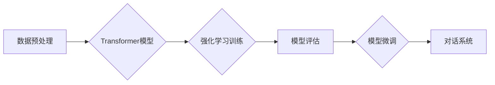

> 大语言模型、强化学习、DeepSpeed-Chat、训练实践、工程实践、Transformer、LLM

## 1. 背景介绍

近年来，大语言模型（LLM）在自然语言处理领域取得了显著进展，展现出强大的文本生成、翻译、问答等能力。这些模型通常基于Transformer架构，并通过海量文本数据进行预训练。然而，训练大型语言模型需要大量的计算资源和时间，并且模型的性能仍然存在提升空间。

强化学习（RL）作为一种机器学习范式，能够有效地训练智能体在复杂环境中做出最优决策。将RL与LLM相结合，可以进一步提升模型的性能，使其能够更好地理解和生成人类语言。

DeepSpeed-Chat是一个开源的LLM训练框架，它基于DeepSpeed深度学习优化库，并专门针对对话式LLM的训练进行了优化。DeepSpeed-Chat提供了高效的并行训练、模型压缩和微调等功能，使得训练大型对话式LLM更加便捷高效。

## 2. 核心概念与联系

**2.1  大语言模型 (LLM)**

大语言模型是指参数量巨大、训练数据海量的人工智能模型，能够理解和生成人类语言。

**2.2  Transformer 架构**

Transformer是一种基于注意力机制的神经网络架构，能够有效地处理序列数据，例如文本。

**2.3  强化学习 (RL)**

强化学习是一种机器学习范式，智能体通过与环境交互，学习策略以最大化累积奖励。

**2.4  DeepSpeed-Chat**

DeepSpeed-Chat是一个开源的LLM训练框架，基于DeepSpeed深度学习优化库，专门针对对话式LLM的训练进行了优化。

**2.5  流程图**



## 3. 核心算法原理 & 具体操作步骤

### 3.1  算法原理概述

DeepSpeed-Chat训练流程主要包括以下步骤：

1. **数据预处理:** 将原始文本数据进行清洗、分词、标记等操作，生成训练数据。
2. **Transformer模型训练:** 使用Transformer模型对预处理后的数据进行训练，学习语言表示和语法规则。
3. **强化学习训练:** 使用强化学习算法，训练模型生成符合人类语言习惯的对话回复。
4. **模型评估:** 使用评估指标，例如BLEU、ROUGE等，评估模型的性能。
5. **模型微调:** 根据评估结果，对模型进行微调，进一步提升性能。

### 3.2  算法步骤详解

**3.2.1 数据预处理:**

* **清洗:** 去除文本中的停用词、标点符号等无用信息。
* **分词:** 将文本分割成单词或子词。
* **标记:** 为文本中的单词或子词添加标签，例如词性标注、命名实体识别等。

**3.2.2 Transformer模型训练:**

* 使用预训练的Transformer模型作为基础，对预处理后的数据进行微调。
* 使用交叉熵损失函数，优化模型参数。
* 使用梯度下降算法，更新模型参数。

**3.2.3 强化学习训练:**

* 定义奖励函数，根据对话回复的质量给予奖励。
* 使用强化学习算法，例如策略梯度算法，训练模型生成符合奖励函数的对话回复。

**3.2.4 模型评估:**

* 使用BLEU、ROUGE等指标，评估模型的性能。
* 分析模型的错误类型，找出改进方向。

**3.2.5 模型微调:**

* 根据评估结果，调整模型参数，例如学习率、正则化参数等。
* 使用新的数据进行微调，进一步提升模型性能。

### 3.3  算法优缺点

**优点:**

* 能够生成高质量的对话回复。
* 可以适应不同的对话场景。
* 可以进行持续学习和改进。

**缺点:**

* 训练成本高，需要大量的计算资源和时间。
* 模型参数量大，部署成本高。
* 容易受到恶意攻击和数据偏差的影响。

### 3.4  算法应用领域

* **聊天机器人:** 开发更智能、更自然的聊天机器人。
* **虚拟助手:** 提供更便捷、更智能的虚拟助手服务。
* **教育领域:** 提供个性化的学习辅导和答疑服务。
* **客服领域:** 自动化客服服务，提高效率和客户满意度。

## 4. 数学模型和公式 & 详细讲解 & 举例说明

### 4.1  数学模型构建

DeepSpeed-Chat训练过程中，主要使用以下数学模型：

* **Transformer模型:** Transformer模型使用注意力机制和多头自注意力机制，学习文本的语义表示。
* **强化学习模型:** 强化学习模型使用策略梯度算法，学习生成符合奖励函数的对话回复。

### 4.2  公式推导过程

**4.2.1 Transformer模型注意力机制公式:**

$$
Attention(Q, K, V) = \frac{exp(Q \cdot K^T / \sqrt{d_k})}{exp(Q \cdot K^T / \sqrt{d_k})} \cdot V
$$

其中：

* $Q$：查询矩阵
* $K$：键矩阵
* $V$：值矩阵
* $d_k$：键向量的维度

**4.2.2 强化学习策略梯度公式:**

$$
\theta_{t+1} = \theta_t + \alpha \nabla_{\theta} J(\theta)
$$

其中：

* $\theta$：模型参数
* $\alpha$：学习率
* $J(\theta)$：策略梯度

### 4.3  案例分析与讲解

**4.3.1 Transformer模型注意力机制案例:**

在机器翻译任务中，Transformer模型可以使用注意力机制来关注源语言句子中与目标语言句子相关的重要词语，从而提高翻译质量。

**4.3.2 强化学习策略梯度案例:**

在对话系统训练中，可以使用强化学习策略梯度算法来训练模型生成符合人类语言习惯的对话回复。

## 5. 项目实践：代码实例和详细解释说明

### 5.1  开发环境搭建

* 安装Python3.7+
* 安装PyTorch
* 安装DeepSpeed
* 安装其他依赖库

### 5.2  源代码详细实现

```python
# 训练代码示例
import torch
import deepspeed

# 加载预训练模型
model = torch.load("pretrained_model.pth")

# 定义训练参数
optimizer = torch.optim.Adam(model.parameters(), lr=0.001)
loss_fn = torch.nn.CrossEntropyLoss()

# 数据加载器
train_dataloader = ...

# 训练循环
for epoch in range(num_epochs):
    for batch in train_dataloader:
        # 前向传播
        outputs = model(batch)
        loss = loss_fn(outputs, batch_labels)

        # 反向传播
        optimizer.zero_grad()
        loss.backward()

        # 更新参数
        optimizer.step()

# 保存模型
torch.save(model, "trained_model.pth")
```

### 5.3  代码解读与分析

* 代码首先加载预训练模型，并定义训练参数，例如学习率和损失函数。
* 然后，使用数据加载器加载训练数据。
* 训练循环中，模型进行前向传播，计算损失，并使用反向传播更新模型参数。
* 最后，保存训练好的模型。

### 5.4  运行结果展示

训练完成后，可以使用评估指标，例如BLEU、ROUGE等，评估模型的性能。

## 6. 实际应用场景

DeepSpeed-Chat可以应用于各种对话式应用场景，例如：

* **聊天机器人:** 开发更智能、更自然的聊天机器人，例如客服机器人、陪伴机器人等。
* **虚拟助手:** 提供更便捷、更智能的虚拟助手服务，例如日程安排、信息查询、任务执行等。
* **教育领域:** 提供个性化的学习辅导和答疑服务，例如智能答疑系统、个性化学习计划等。
* **客服领域:** 自动化客服服务，提高效率和客户满意度。

### 6.4  未来应用展望

随着深度学习技术的不断发展，DeepSpeed-Chat等对话式LLM模型将有更广泛的应用场景，例如：

* **多模态对话:** 将文本、图像、音频等多模态信息融合到对话系统中，实现更丰富的交互体验。
* **个性化对话:** 根据用户的个人喜好和需求，定制个性化的对话体验。
* **跨语言对话:** 实现跨语言的对话理解和生成，打破语言障碍。

## 7. 工具和资源推荐

### 7.1  学习资源推荐

* **DeepSpeed官方文档:** https://www.deepspeed.ai/docs/
* **Transformer模型论文:** https://arxiv.org/abs/1706.03762
* **强化学习论文:** https://arxiv.org/abs/1602.09477

### 7.2  开发工具推荐

* **PyTorch:** https://pytorch.org/
* **DeepSpeed:** https://www.deepspeed.ai/
* **HuggingFace Transformers:** https://huggingface.co/transformers/

### 7.3  相关论文推荐

* **DeepSpeed: Scaling Deep Learning Beyond Single GPUs:** https://arxiv.org/abs/2001.08337
* **Scaling Laws for Neural Language Models:** https://arxiv.org/abs/2001.08361
* **Language Models are Few-Shot Learners:** https://arxiv.org/abs/2005.14165

## 8. 总结：未来发展趋势与挑战

### 8.1  研究成果总结

DeepSpeed-Chat等对话式LLM模型取得了显著进展，能够生成高质量的对话回复，并应用于各种实际场景。

### 8.2  未来发展趋势

* **模型规模和性能提升:** 随着计算资源的不断发展，模型规模将进一步扩大，性能将得到进一步提升。
* **多模态对话:** 将文本、图像、音频等多模态信息融合到对话系统中，实现更丰富的交互体验。
* **个性化对话:** 根据用户的个人喜好和需求，定制个性化的对话体验。
* **跨语言对话:** 实现跨语言的对话理解和生成，打破语言障碍。

### 8.3  面临的挑战

* **训练成本高:** 训练大型LLM模型需要大量的计算资源和时间，成本较高。
* **模型参数量大:** 模型参数量大，部署成本高，对硬件资源要求高。
* **数据安全和隐私:** LLM模型训练需要大量数据，如何保证数据安全和隐私是一个重要挑战。
* **模型可解释性:** LLM模型的决策过程难以理解，如何提高模型的可解释性是一个重要研究方向。

### 8.4  研究展望

未来，LLM研究将继续朝着更智能、更安全、更可解释的方向发展。


## 9. 附录：常见问题与解答

**9.1  如何选择合适的LLM模型？**

选择合适的LLM模型需要根据具体的应用场景和需求进行考虑。例如，对于需要生成高质量文本的应用场景，可以选择参数量较大的模型；对于需要实时响应的应用场景，可以选择参数量较小的模型。

**9.2  如何训练自己的LLM模型？**

训练自己的LLM模型需要准备大量的训练数据，并使用合适的训练框架和算法。DeepSpeed-Chat是一个开源的LLM训练框架，可以帮助用户训练自己的对话式LLM模型。

**9.3  如何部署LLM模型？**

LLM模型的部署方式取决于具体的应用场景。可以部署在云端服务器、边缘设备或本地机器