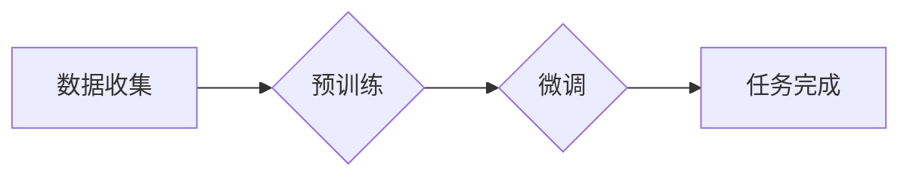

> 大语言模型、Transformer、预训练、微调、训练目标、文本生成、自然语言理解

## 1. 背景介绍

近年来，深度学习技术取得了飞速发展，特别是基于Transformer架构的大语言模型（Large Language Model，LLM）的出现，彻底改变了自然语言处理（NLP）领域的面貌。这些模型拥有数十亿甚至数千亿的参数，能够理解和生成人类语言，展现出惊人的文本生成、翻译、问答、摘要等能力。

然而，训练这些庞大的模型需要大量的计算资源和数据，并且需要精心设计的训练目标来引导模型学习。本文将深入探讨大语言模型的训练目标，从核心概念到具体算法原理，再到实际应用场景，全面解析LLM训练的奥秘。

## 2. 核心概念与联系

大语言模型的训练目标本质上是让模型学习语言的规律和结构，从而能够生成流畅、语法正确、语义相关的文本。

**核心概念：**

* **预训练 (Pre-training):** 在海量文本数据上进行无监督学习，让模型学习语言的通用表示和知识。
* **微调 (Fine-tuning):** 在特定任务的数据上进行有监督学习，让模型针对特定任务进行优化。
* **训练目标 (Training Objective):** 指导模型学习的函数，通常是衡量模型预测结果与真实结果之间的差异。

**架构流程图：**



## 3. 核心算法原理 & 具体操作步骤

### 3.1  算法原理概述

大语言模型的训练主要基于Transformer架构，其核心思想是利用自注意力机制捕捉文本序列中的长距离依赖关系。

**自注意力机制 (Self-Attention):**

自注意力机制允许模型在处理每个单词时，关注到其他单词的信息，从而更好地理解上下文关系。

**Transformer架构:**

Transformer架构由编码器 (Encoder) 和解码器 (Decoder) 组成。编码器将输入文本序列编码成固定长度的向量表示，解码器则根据编码后的向量生成输出文本序列。

### 3.2  算法步骤详解

1. **数据预处理:** 将文本数据进行清洗、分词、标记等预处理操作，使其适合模型训练。
2. **模型初始化:** 初始化模型参数，通常使用随机初始化或预训练模型的权重。
3. **前向传播:** 将输入文本序列输入模型，计算输出结果。
4. **损失函数计算:** 计算模型预测结果与真实结果之间的差异，使用损失函数衡量模型的训练误差。
5. **反向传播:** 利用梯度下降算法，更新模型参数，降低训练误差。
6. **迭代训练:** 重复步骤3-5，直到模型达到预设的性能指标。

### 3.3  算法优缺点

**优点:**

* 能够捕捉长距离依赖关系，提升文本理解能力。
* 训练效率高，能够在大型数据集上进行高效训练。
* 可迁移性强，预训练模型可以应用于多种下游任务。

**缺点:**

* 计算资源需求高，训练成本较高。
* 模型参数量大，容易过拟合。
* 对训练数据质量要求高，数据偏差会影响模型性能。

### 3.4  算法应用领域

大语言模型在自然语言处理领域有着广泛的应用，例如：

* 文本生成：小说、诗歌、剧本等创作。
* 机器翻译：将一种语言翻译成另一种语言。
* 问答系统：回答用户提出的问题。
* 文本摘要：生成文本的简短摘要。
* 代码生成：自动生成代码。

## 4. 数学模型和公式 & 详细讲解 & 举例说明

### 4.1  数学模型构建

大语言模型的训练目标通常使用交叉熵损失函数，其目标是让模型预测的概率分布与真实概率分布尽可能接近。

**交叉熵损失函数:**

$$
H(p, q) = - \sum_{i} p(i) \log q(i)
$$

其中：

* $p(i)$ 是真实概率分布，表示第i个词的真实概率。
* $q(i)$ 是模型预测的概率分布，表示第i个词的预测概率。

### 4.2  公式推导过程

交叉熵损失函数的推导过程基于信息论的原理，其本质是衡量两个概率分布之间的差异。

**信息熵:**

$$
H(p) = - \sum_{i} p(i) \log p(i)
$$

**KL散度:**

$$
D_{KL}(p || q) = \sum_{i} p(i) \log \frac{p(i)}{q(i)}
$$

交叉熵损失函数可以看作是KL散度的一种变体，其目标是最小化模型预测分布与真实分布之间的差异。

### 4.3  案例分析与讲解

假设我们训练一个文本分类模型，目标是将文本分类为“正面”或“负面”。

* 真实概率分布：$p(正面) = 0.6$, $p(负面) = 0.4$
* 模型预测概率分布：$q(正面) = 0.7$, $q(负面) = 0.3$

使用交叉熵损失函数计算模型的损失值：

$$
H(p, q) = - (0.6 \log 0.7 + 0.4 \log 0.3) \approx 0.52
$$

## 5. 项目实践：代码实例和详细解释说明

### 5.1  开发环境搭建

* Python 3.7+
* PyTorch 1.7+
* CUDA 10.2+

### 5.2  源代码详细实现

```python
import torch
import torch.nn as nn

class Transformer(nn.Module):
    # ... Transformer 模型架构定义 ...

# 实例化模型
model = Transformer()

# 定义损失函数和优化器
criterion = nn.CrossEntropyLoss()
optimizer = torch.optim.Adam(model.parameters(), lr=0.001)

# 训练循环
for epoch in range(num_epochs):
    for batch in dataloader:
        # 前向传播
        outputs = model(batch)
        loss = criterion(outputs, batch_labels)

        # 反向传播
        optimizer.zero_grad()
        loss.backward()
        optimizer.step()

    # 打印训练进度
    print(f"Epoch [{epoch+1}/{num_epochs}], Loss: {loss.item()}")
```

### 5.3  代码解读与分析

* Transformer 模型架构定义了模型的层级结构和参数。
* 损失函数和优化器用于训练模型，交叉熵损失函数用于衡量模型预测结果与真实结果之间的差异，Adam 优化器用于更新模型参数。
* 训练循环迭代训练模型，每次迭代处理一个批次的训练数据。

### 5.4  运行结果展示

训练完成后，可以评估模型的性能，例如使用准确率、F1-score 等指标。

## 6. 实际应用场景

大语言模型在各个领域都有着广泛的应用，例如：

* **客服机器人:** 自动回复用户咨询，提高客服效率。
* **内容创作:** 自动生成文章、广告文案等内容。
* **代码生成:** 自动生成代码，提高开发效率。
* **教育领域:** 提供个性化学习辅导，辅助教学。

### 6.4  未来应用展望

随着大语言模型技术的不断发展，其应用场景将更加广泛，例如：

* **个性化推荐:** 根据用户的兴趣爱好，推荐个性化的内容。
* **跨语言沟通:** 实现不同语言之间的实时翻译。
* **人工智能助手:** 成为用户的智能助手，帮助完成各种任务。

## 7. 工具和资源推荐

### 7.1  学习资源推荐

* **书籍:**
    * 《深度学习》
    * 《自然语言处理》
* **在线课程:**
    * Coursera: 自然语言处理
    * Udacity: 深度学习

### 7.2  开发工具推荐

* **PyTorch:** 深度学习框架
* **TensorFlow:** 深度学习框架
* **HuggingFace:** 预训练模型库

### 7.3  相关论文推荐

* **Attention Is All You Need:** https://arxiv.org/abs/1706.03762
* **BERT: Pre-training of Deep Bidirectional Transformers for Language Understanding:** https://arxiv.org/abs/1810.04805

## 8. 总结：未来发展趋势与挑战

### 8.1  研究成果总结

大语言模型在文本生成、理解、翻译等方面取得了显著的成果，展现出强大的能力。

### 8.2  未来发展趋势

* 模型规模进一步扩大，参数量达到万亿级甚至更高。
* 多模态大语言模型的出现，融合文本、图像、音频等多种模态信息。
* 模型训练效率提升，降低训练成本。
* 模型安全性与可解释性增强，解决模型偏见和黑盒问题。

### 8.3  面临的挑战

* 训练成本高昂，需要大量的计算资源和数据。
* 模型参数量大，容易过拟合，需要更有效的训练方法。
* 模型安全性与可解释性问题，需要进一步研究。

### 8.4  研究展望

未来，大语言模型将继续朝着更强大、更安全、更可解释的方向发展，在各个领域发挥更大的作用。

## 9. 附录：常见问题与解答

* **Q: 如何选择合适的预训练模型？**
* **A:** 选择预训练模型需要考虑任务类型、模型规模、训练数据等因素。

* **Q: 如何进行模型微调？**
* **A:** 微调需要准备特定任务的数据集，并调整模型的学习率和训练参数。

* **Q: 如何评估大语言模型的性能？**
* **A:** 可以使用准确率、F1-score、BLEU 等指标评估模型的性能。


作者：禅与计算机程序设计艺术 / Zen and the Art of Computer Programming 
<end_of_turn>