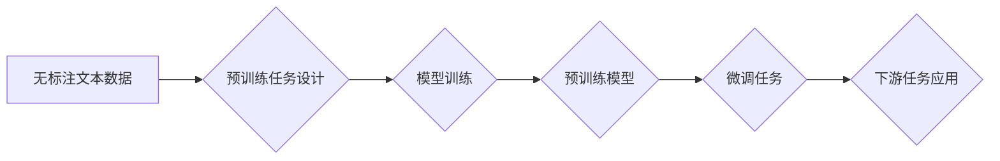

> 大语言模型、自监督学习、Transformer、预训练、微调、文本生成、自然语言理解

## 1. 背景介绍

近年来，深度学习在自然语言处理 (NLP) 领域取得了显著进展，其中大语言模型 (LLM) 作为其重要代表，展现出强大的文本生成、翻译、摘要、问答等能力。这些模型通常拥有数十亿甚至千亿个参数，通过海量文本数据进行训练，学习了丰富的语言知识和模式。

传统的监督学习方法依赖于大量标注数据，但标注数据成本高昂且难以获取。自监督学习 (SSL) 作为一种新兴的训练 paradigm，通过设计巧妙的预训练任务，利用无标注文本数据进行模型训练，有效降低了对标注数据的依赖。

## 2. 核心概念与联系

自监督学习的核心思想是，通过设计与实际任务相关的预训练任务，让模型在无标注数据上学习到语言的潜在结构和规律。这些预训练任务通常是文本级别的，例如：

* **Masked Language Modeling (MLM):** 随机遮盖文本中的部分词，让模型预测被遮盖词的词语。
* **Next Sentence Prediction (NSP):** 判断两个句子是否连续，训练模型学习句子之间的语义关系。
* **Sentence Order Prediction (SOP):** 随机打乱句子中的词序，让模型预测正确的句子顺序。

这些预训练任务能够帮助模型学习到丰富的语言表示，为下游任务的微调提供强大的基础。

**Mermaid 流程图:**



## 3. 核心算法原理 & 具体操作步骤

### 3.1  算法原理概述

自监督学习的核心算法是基于 Transformer 架构的深度神经网络。Transformer 是一种强大的序列建模器，能够有效捕捉长距离依赖关系。

在自监督学习中，Transformer 网络通常被分为编码器和解码器两部分。编码器负责将输入文本序列编码成固定长度的向量表示，解码器则根据编码后的向量表示生成输出文本序列。

### 3.2  算法步骤详解

1. **数据预处理:** 将无标注文本数据进行清洗、分词、词嵌入等预处理操作。
2. **预训练任务设计:** 选择合适的预训练任务，例如 MLM、NSP 或 SOP。
3. **模型训练:** 使用预训练任务的训练数据，训练 Transformer 网络，学习语言的潜在结构和规律。
4. **模型评估:** 使用验证集评估模型的性能，并根据性能调整模型参数和训练策略。
5. **模型微调:** 将预训练模型应用于下游任务，通过微调模型参数，使其适应特定任务的需求。

### 3.3  算法优缺点

**优点:**

* 降低了对标注数据的依赖，能够利用海量无标注数据进行训练。
* 预训练模型能够学习到丰富的语言知识和模式，为下游任务提供强大的基础。
* 能够有效提升下游任务的性能。

**缺点:**

* 预训练任务的设计需要一定的技巧，需要根据具体任务选择合适的预训练任务。
* 预训练模型的训练成本较高，需要大量的计算资源。

### 3.4  算法应用领域

自监督学习在 NLP 领域有着广泛的应用，例如：

* **文本生成:** 文本摘要、机器翻译、对话系统等。
* **自然语言理解:** 文本分类、情感分析、问答系统等。
* **代码生成:** 代码补全、代码翻译等。

## 4. 数学模型和公式 & 详细讲解 & 举例说明

### 4.1  数学模型构建

Transformer 网络的核心是注意力机制，它能够有效捕捉文本序列中的长距离依赖关系。注意力机制的数学模型可以表示为：

$$
Attention(Q, K, V) = softmax(\frac{QK^T}{\sqrt{d_k}})V
$$

其中：

* $Q$：查询矩阵
* $K$：键矩阵
* $V$：值矩阵
* $d_k$：键向量的维度
* $softmax$：softmax 函数

### 4.2  公式推导过程

注意力机制的公式推导过程如下：

1. 计算查询矩阵 $Q$ 与键矩阵 $K$ 的点积，并除以 $\sqrt{d_k}$。
2. 对点积结果应用 softmax 函数，得到注意力权重。
3. 将注意力权重与值矩阵 $V$ 进行加权求和，得到最终的注意力输出。

### 4.3  案例分析与讲解

例如，在 MLM 任务中，Transformer 网络会将输入文本序列编码成一系列向量表示。然后，模型会随机遮盖部分词，并根据上下文信息预测被遮盖词的词语。

在注意力机制的作用下，模型能够有效捕捉到被遮盖词与上下文词之间的语义关系，从而提高预测准确率。

## 5. 项目实践：代码实例和详细解释说明

### 5.1  开发环境搭建

* Python 3.7+
* PyTorch 1.7+
* CUDA 10.2+

### 5.2  源代码详细实现

```python
import torch
import torch.nn as nn

class Transformer(nn.Module):
    def __init__(self, vocab_size, embedding_dim, num_heads, num_layers):
        super(Transformer, self).__init__()
        self.embedding = nn.Embedding(vocab_size, embedding_dim)
        self.transformer_layers = nn.ModuleList([
            nn.TransformerEncoderLayer(embedding_dim, num_heads)
            for _ in range(num_layers)
        ])
        self.linear = nn.Linear(embedding_dim, vocab_size)

    def forward(self, x):
        x = self.embedding(x)
        for layer in self.transformer_layers:
            x = layer(x)
        x = self.linear(x)
        return x
```

### 5.3  代码解读与分析

* `Transformer` 类定义了 Transformer 网络的结构。
* `embedding` 层将词索引映射到词向量。
* `transformer_layers` 是一个列表，包含多个 Transformer Encoder Layer。
* `linear` 层将编码后的向量映射到输出词典。

### 5.4  运行结果展示

通过训练 Transformer 网络，可以得到一个预训练模型，该模型能够在 MLM、NSP 或 SOP 等任务上表现出色。

## 6. 实际应用场景

自监督学习在 NLP 领域有着广泛的应用场景，例如：

* **文本生成:** 使用预训练模型进行文本摘要、机器翻译、对话系统等任务。
* **自然语言理解:** 使用预训练模型进行文本分类、情感分析、问答系统等任务。
* **代码生成:** 使用预训练模型进行代码补全、代码翻译等任务。

### 6.4  未来应用展望

随着预训练模型的不断发展，自监督学习在 NLP 领域的应用将会更加广泛，例如：

* **跨语言理解:** 使用预训练模型进行跨语言文本生成、翻译和理解。
* **多模态理解:** 将文本与其他模态数据（例如图像、音频）结合，进行多模态理解任务。
* **个性化推荐:** 使用预训练模型进行个性化文本推荐和内容生成。

## 7. 工具和资源推荐

### 7.1  学习资源推荐

* **论文:**
    * Devlin, J., Chang, M. W., Lee, K., & Toutanova, K. (2018). Bert: Pre-training of deep bidirectional transformers for language understanding. arXiv preprint arXiv:1810.04805.
    * Radford, A., Wu, J., Child, R., Luan, D., Amodei, D., & Sutskever, I. (2019). Language models are unsupervised multitask learners. OpenAI blog.
* **博客:**
    * Jay Alammar's Blog: https://jalammar.github.io/
    * Hugging Face Blog: https://huggingface.co/blog

### 7.2  开发工具推荐

* **PyTorch:** https://pytorch.org/
* **TensorFlow:** https://www.tensorflow.org/
* **Hugging Face Transformers:** https://huggingface.co/docs/transformers/index

### 7.3  相关论文推荐

* BERT: Pre-training of Deep Bidirectional Transformers for Language Understanding
* GPT-3: Language Models are Few-Shot Learners
* T5: Text-to-Text Transfer Transformer

## 8. 总结：未来发展趋势与挑战

### 8.1  研究成果总结

自监督学习在 NLP 领域取得了显著进展，预训练模型的性能不断提升，为下游任务的应用提供了强大的基础。

### 8.2  未来发展趋势

* **模型规模的进一步扩大:** 预训练模型的规模将会继续扩大，从而学习到更丰富的语言知识和模式。
* **多模态学习:** 将文本与其他模态数据结合，进行多模态理解和生成任务。
* **可解释性研究:** 研究预训练模型的内部机制，提高模型的可解释性和可控性。

### 8.3  面临的挑战

* **数据效率:** 预训练模型的训练成本较高，需要大量的计算资源和数据。
* **公平性与偏见:** 预训练模型可能存在公平性与偏见问题，需要进行相应的缓解措施。
* **安全与隐私:** 预训练模型可能被用于恶意目的，需要加强安全和隐私保护。

### 8.4  研究展望

未来，自监督学习将会继续是 NLP 领域的重要研究方向，我们将看到更多创新性的模型和应用场景。


## 9. 附录：常见问题与解答

**Q1: 自监督学习与监督学习有什么区别？**

**A1:** 自监督学习利用无标注数据进行训练，通过设计与实际任务相关的预训练任务，学习语言的潜在结构和规律。而监督学习则依赖于标注数据，直接学习从输入到输出的映射关系。

**Q2: 自监督学习的预训练任务有哪些？**

**A2:** 常用的预训练任务包括 MLM、NSP、SOP 等。

**Q3: 自监督学习的优势是什么？**

**A3:** 自监督学习能够降低对标注数据的依赖，利用海量无标注数据进行训练，并能够学习到丰富的语言知识和模式，为下游任务提供强大的基础。


作者：禅与计算机程序设计艺术 / Zen and the Art of Computer Programming 
<end_of_turn>