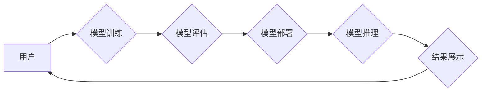

> 字节跳动, AI应用, 扣子平台, 模型部署, 算法优化, 效率提升, 

## 1. 背景介绍

在当今数据爆炸的时代，人工智能（AI）技术正在各个领域迅速发展，并逐渐渗透到人们生活的方方面面。字节跳动作为一家以科技创新为核心的公司，始终走在AI技术应用的前沿。为了更好地服务于公司内部各业务部门，以及外部合作伙伴，字节跳动自主研发了AI应用搭建平台“扣子”。

“扣子”平台旨在简化AI应用的开发、部署和管理流程，降低AI技术的使用门槛，让更多人能够轻松地利用AI技术解决实际问题。平台提供了一系列功能，包括模型训练、模型部署、模型监控、数据管理等，帮助用户快速构建和部署AI应用。

## 2. 核心概念与联系

### 2.1  平台架构

“扣子”平台采用微服务架构，将平台功能模块化，并通过API接口进行调用，实现高可用性和可扩展性。平台主要包含以下几个核心模块：

* **模型训练模块:** 提供了丰富的算法模型库，支持用户自定义模型训练，并提供模型训练、评估和调优工具。
* **模型部署模块:** 支持多种模型部署方式，包括在线推理、离线预测、边缘部署等，并提供模型版本管理和A/B测试功能。
* **数据管理模块:** 提供了数据存储、数据清洗、数据标注等功能，帮助用户管理和处理AI应用所需的数据。
* **监控管理模块:** 提供了模型性能监控、数据质量监控、系统健康监控等功能，帮助用户及时发现和解决问题。



### 2.2  平台功能

“扣子”平台提供了以下核心功能：

* **模型管理:** 用户可以上传、下载、管理自己的模型，并进行版本控制。
* **数据管理:** 用户可以上传、下载、清洗、标注自己的数据，并进行数据版本管理。
* **模型训练:** 用户可以利用平台提供的算法模型库，或自定义训练自己的模型。
* **模型部署:** 用户可以将训练好的模型部署到不同的环境中，例如在线推理、离线预测、边缘部署等。
* **模型监控:** 用户可以监控模型的性能、数据质量、系统健康等指标，并及时发现和解决问题。

## 3. 核心算法原理 & 具体操作步骤

### 3.1  算法原理概述

“扣子”平台采用了多种先进的算法模型，例如深度学习、机器学习、自然语言处理等。这些算法模型能够帮助用户解决各种各样的问题，例如图像识别、文本分类、语音识别、推荐系统等。

### 3.2  算法步骤详解

具体算法步骤根据不同的算法模型而有所不同，例如：

* **深度学习模型:** 训练过程通常包括数据预处理、模型构建、模型训练、模型评估和模型调优等步骤。
* **机器学习模型:** 训练过程通常包括数据预处理、特征工程、模型选择、模型训练、模型评估和模型调优等步骤。

### 3.3  算法优缺点

不同的算法模型都有其自身的优缺点，需要根据实际应用场景选择合适的算法模型。例如：

* **深度学习模型:** 优点是能够学习到更复杂的特征，性能通常更优；缺点是训练数据量要求较高，训练时间较长。
* **机器学习模型:** 优点是训练数据量要求较低，训练时间较短；缺点是学习到的特征相对简单，性能可能不如深度学习模型。

### 3.4  算法应用领域

“扣子”平台支持的算法模型应用于各个领域，例如：

* **内容推荐:** 基于用户行为和内容特征，推荐用户感兴趣的内容。
* **广告投放:** 根据用户画像和广告特征，精准投放广告。
* **图像识别:** 识别图像中的物体、场景、人物等。
* **自然语言处理:** 处理文本数据，例如文本分类、情感分析、机器翻译等。

## 4. 数学模型和公式 & 详细讲解 & 举例说明

### 4.1  数学模型构建

在“扣子”平台中，许多算法模型都基于数学模型构建。例如，推荐系统通常使用协同过滤算法，其数学模型可以表示为用户-物品交互矩阵。

### 4.2  公式推导过程

协同过滤算法的数学模型可以推导如下：

$$
r_{ui} = \frac{\sum_{j \in N(u)} \frac{r_{uj} \cdot s_{ij}}{\sum_{k \in N(u)} s_{uk}}}{\sum_{j \in N(u)} \frac{s_{ij}}{\sum_{k \in N(u)} s_{uk}}}
$$

其中：

* $r_{ui}$ 表示用户 $u$ 对物品 $i$ 的评分。
* $r_{uj}$ 表示用户 $u$ 对物品 $j$ 的评分。
* $s_{ij}$ 表示物品 $i$ 和物品 $j$ 之间的相似度。
* $N(u)$ 表示用户 $u$ 已经评分过的物品集合。

### 4.3  案例分析与讲解

假设用户 $u$ 已经评分了物品 $1$、$2$ 和 $3$，并且物品 $1$ 和 $2$ 之间相似度较高，那么根据上述公式，我们可以预测用户 $u$ 对物品 $4$ 的评分。

## 5. 项目实践：代码实例和详细解释说明

### 5.1  开发环境搭建

“扣子”平台的开发环境搭建需要满足以下条件：

* 操作系统：Linux
* 编程语言：Python
* 软件环境：Docker、Kubernetes

### 5.2  源代码详细实现

由于篇幅限制，这里只提供部分源代码示例：

```python
# 模型训练代码示例
from tensorflow.keras.models import Sequential
from tensorflow.keras.layers import Dense

model = Sequential()
model.add(Dense(64, activation='relu', input_shape=(10,)))
model.add(Dense(10, activation='softmax'))

model.compile(optimizer='adam', loss='categorical_crossentropy', metrics=['accuracy'])
model.fit(x_train, y_train, epochs=10)
```

### 5.3  代码解读与分析

这段代码示例展示了如何使用TensorFlow框架训练一个简单的多层感知机模型。

* `Sequential()` 创建一个顺序模型。
* `Dense()` 创建一个全连接层。
* `activation='relu'` 设置激活函数为ReLU。
* `input_shape=(10,)` 设置输入数据的形状为10维向量。
* `compile()` 配置模型的训练参数，包括优化器、损失函数和评价指标。
* `fit()` 训练模型，输入训练数据和训练轮数。

### 5.4  运行结果展示

训练完成后，可以评估模型的性能，例如计算准确率。

## 6. 实际应用场景

“扣子”平台已在字节跳动内部多个业务场景中得到应用，例如：

* **内容推荐:** 为用户推荐个性化的内容，例如短视频、新闻、文章等。
* **广告投放:** 根据用户画像和广告特征，精准投放广告，提高广告转化率。
* **搜索引擎:** 提升搜索引擎的准确性和效率，提供更精准的搜索结果。

### 6.4  未来应用展望

未来，“扣子”平台将继续扩展功能，支持更多类型的算法模型，并应用于更多新的场景，例如：

* **语音识别:** 识别语音指令，实现人机交互。
* **图像生成:** 生成高质量的图像，例如图片合成、图像修复等。
* **自动驾驶:** 辅助自动驾驶系统，提高驾驶安全性和效率。

## 7. 工具和资源推荐

### 7.1  学习资源推荐

* **在线课程:** Coursera、edX、Udacity 等平台提供丰富的AI课程。
* **书籍:** 《深度学习》、《机器学习》、《自然语言处理》等书籍。
* **博客:** TensorFlow博客、PyTorch博客等。

### 7.2  开发工具推荐

* **Python:** 广泛应用于AI开发，拥有丰富的AI库和框架。
* **TensorFlow:** Google开发的开源深度学习框架。
* **PyTorch:** Facebook开发的开源深度学习框架。
* **Keras:** TensorFlow的高级API，简化模型构建过程。

### 7.3  相关论文推荐

* **《ImageNet Classification with Deep Convolutional Neural Networks》**
* **《Attention Is All You Need》**
* **《BERT: Pre-training of Deep Bidirectional Transformers for Language Understanding》**

## 8. 总结：未来发展趋势与挑战

### 8.1  研究成果总结

“扣子”平台的研发成果表明，AI技术在字节跳动内部得到了广泛应用，并取得了显著的效益。平台的成功也证明了微服务架构、模型管理、数据管理等技术的有效性。

### 8.2  未来发展趋势

未来，“扣子”平台将继续朝着以下方向发展：

* **模型能力提升:** 支持更先进的算法模型，例如Transformer、GAN等。
* **平台易用性提升:** 提供更友好的用户界面和更便捷的操作流程。
* **场景应用拓展:** 应用于更多新的场景，例如自动驾驶、医疗健康等。

### 8.3  面临的挑战

“扣子”平台的研发和应用也面临着一些挑战：

* **模型训练成本:** 训练大型模型需要大量的计算资源和时间。
* **数据安全和隐私:** 需要确保用户数据的安全和隐私。
* **算法可解释性:** 需要提高算法的可解释性，方便用户理解模型的决策过程。

### 8.4  研究展望

未来，“扣子”平台将继续致力于推动AI技术的创新和应用，为字节跳动和合作伙伴提供更强大的AI工具和服务。

## 9. 附录：常见问题与解答

### 9.1  常见问题

* 如何注册使用“扣子”平台？
* 如何上传和管理模型？
* 如何训练和部署模型？
* 如何监控模型性能？

### 9.2  解答

...

作者：禅与计算机程序设计艺术 / Zen and the Art of Computer Programming


<end_of_turn>