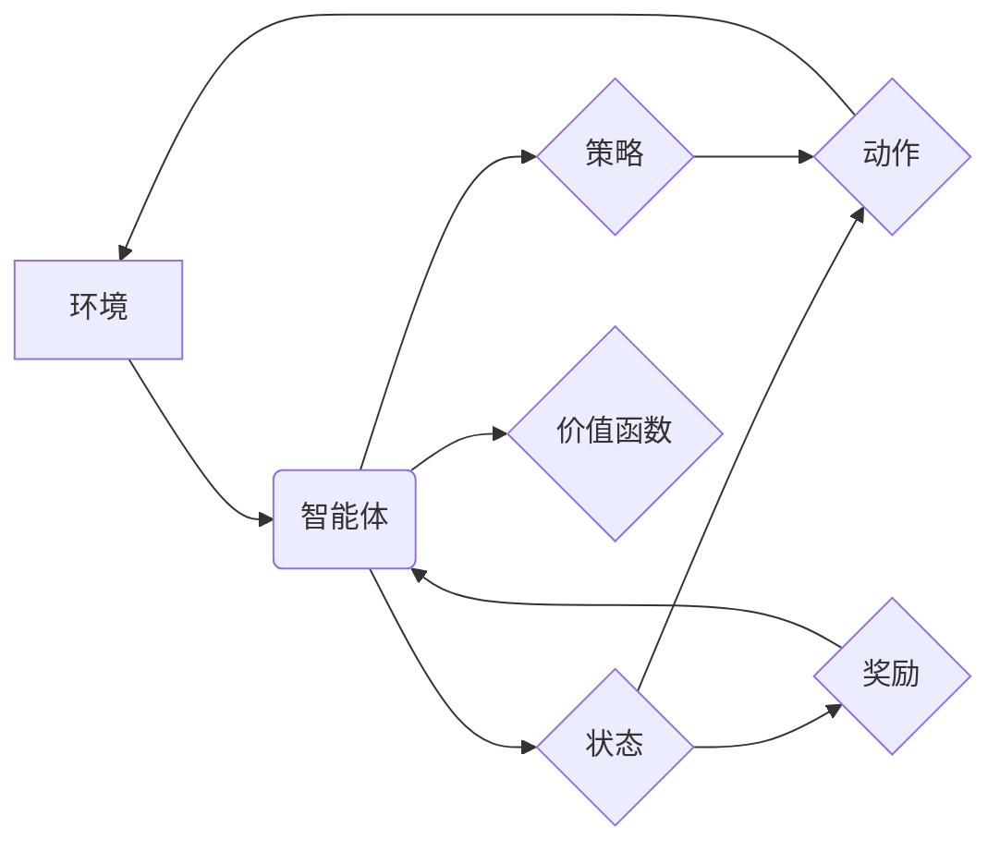

> 强化学习，RL，深度强化学习，Q学习，SARSA，环境，状态，动作，奖励，策略，价值函数

## 1. 背景介绍

在人工智能领域，强化学习 (Reinforcement Learning，RL) 作为一种重要的机器学习范式，近年来取得了显著进展，并在许多应用场景中展现出强大的潜力。与监督学习和无监督学习不同，强化学习的核心在于让智能体通过与环境的交互学习最优策略，以最大化累积的奖励。

强化学习的灵感来源于动物行为学和心理学，它模拟了动物通过试错学习和奖励机制来获得最佳行为模式的过程。在强化学习中，智能体被视为一个决策者，它会根据当前的状态选择一个动作，并根据环境的反馈获得奖励或惩罚。通过不断地学习和调整策略，智能体最终能够找到最优策略，从而在环境中取得最佳结果。

强化学习的应用领域非常广泛，包括游戏、机器人控制、推荐系统、医疗诊断、金融交易等。例如，AlphaGo通过强化学习战胜了世界围棋冠军，DeepMind的AlphaStar在星际争霸2游戏中取得了职业水平的表现，而强化学习也应用于个性化推荐、自动驾驶等领域。

## 2. 核心概念与联系

强化学习的核心概念包括：

* **环境 (Environment):** 智能体所处的外部世界，它提供状态信息和对智能体动作的反馈。
* **智能体 (Agent):** 决策者，它根据环境的状态选择动作并与环境交互。
* **状态 (State):** 环境的当前描述，它包含了所有与智能体决策相关的关键信息。
* **动作 (Action):** 智能体可以采取的行动，它会改变环境的状态。
* **奖励 (Reward):** 环境对智能体动作的反馈，它可以是正向奖励或负向惩罚，用于指导智能体的学习。
* **策略 (Policy):** 智能体选择动作的规则，它将状态映射到动作。
* **价值函数 (Value Function):** 评估状态或状态-动作对的期望奖励，它用于指导智能体选择最优策略。

**核心概念关系图:**



## 3. 核心算法原理 & 具体操作步骤

### 3.1  算法原理概述

强化学习算法的核心是通过不断地与环境交互，学习最优策略。常见的强化学习算法包括 Q 学习、SARSA 等。

* **Q 学习:** Q 学习是一种基于价值函数的强化学习算法，它通过学习状态-动作对的 Q 值来指导智能体选择最优动作。Q 值表示从当前状态执行某个动作后，在未来获得的期望奖励。

* **SARSA:** SARSA 是一种基于策略的强化学习算法，它通过学习策略的价值函数来指导智能体选择最优策略。SARSA 的策略更新规则基于当前状态、动作、下一个状态和奖励。

### 3.2  算法步骤详解

**Q 学习算法步骤:**

1. 初始化 Q 值表，将所有状态-动作对的 Q 值设置为 0。
2. 在环境中进行交互，观察当前状态和获得奖励。
3. 根据 Q 值表选择一个动作，并执行该动作。
4. 观察下一个状态和获得新的奖励。
5. 更新 Q 值表，根据 Bellman 方程更新当前状态-动作对的 Q 值。
6. 重复步骤 2-5，直到 Q 值表收敛。

**SARSA 算法步骤:**

1. 初始化策略 π，将所有状态映射到动作。
2. 在环境中进行交互，观察当前状态和获得奖励。
3. 根据策略 π 选择一个动作，并执行该动作。
4. 观察下一个状态和获得新的奖励。
5. 更新策略 π，根据 SARSA 更新规则更新策略参数。
6. 重复步骤 2-5，直到策略收敛。

### 3.3  算法优缺点

**Q 学习:**

* **优点:** 能够学习最优策略，收敛速度快。
* **缺点:** 需要探索所有状态-动作对，容易陷入局部最优。

**SARSA:**

* **优点:** 能够在线学习，不会陷入局部最优。
* **缺点:** 收敛速度慢，可能无法学习到最优策略。

### 3.4  算法应用领域

* **游戏:** AlphaGo、AlphaStar 等游戏 AI 都是基于强化学习算法训练的。
* **机器人控制:** 强化学习可以用于训练机器人执行复杂的任务，例如导航、抓取等。
* **推荐系统:** 强化学习可以用于个性化推荐，例如推荐电影、音乐、商品等。
* **医疗诊断:** 强化学习可以用于辅助医生诊断疾病，例如识别病理图像、预测患者病情等。

## 4. 数学模型和公式 & 详细讲解 & 举例说明

### 4.1  数学模型构建

强化学习的数学模型主要包括状态、动作、奖励、策略和价值函数。

* **状态空间 (S):** 所有可能的智能体状态的集合。
* **动作空间 (A):** 智能体可以采取的所有动作的集合。
* **奖励函数 (R):** 从状态 s 执行动作 a 后获得的奖励值。
* **策略 (π):** 从状态 s 选择动作 a 的概率分布。
* **价值函数 (V):** 状态 s 的期望累积奖励。

### 4.2  公式推导过程

**Bellman 方程:**

$$
V(s) = \max_a \sum_{s'} P(s'|s,a) [R(s,a,s') + \gamma V(s')]
$$

其中:

* $V(s)$ 是状态 s 的价值函数。
* $a$ 是智能体可以采取的动作。
* $s'$ 是下一个状态。
* $P(s'|s,a)$ 是从状态 s 执行动作 a 后到达状态 $s'$ 的概率。
* $R(s,a,s')$ 是从状态 s 执行动作 a 后到达状态 $s'$ 获得的奖励。
* $\gamma$ 是折扣因子，控制未来奖励的权重。

**Q 学习更新规则:**

$$
Q(s,a) = Q(s,a) + \alpha [R(s,a,s') + \gamma \max_{a'} Q(s',a') - Q(s,a)]
$$

其中:

* $Q(s,a)$ 是状态 s 执行动作 a 的 Q 值。
* $\alpha$ 是学习率，控制学习速度。

### 4.3  案例分析与讲解

假设一个智能体在玩一个简单的游戏，游戏环境包含两个状态： "开始" 和 "结束"。智能体可以采取两个动作： "前进" 和 "后退"。

* 从 "开始" 状态执行 "前进" 动作，获得奖励 1，到达 "结束" 状态。
* 从 "开始" 状态执行 "后退" 动作，获得奖励 0，仍然处于 "开始" 状态。
* 从 "结束" 状态执行任何动作，获得奖励 0。

使用 Q 学习算法，我们可以学习到最优策略，即从 "开始" 状态执行 "前进" 动作，以获得最大的累积奖励。

## 5. 项目实践：代码实例和详细解释说明

### 5.1  开发环境搭建

* Python 3.x
* TensorFlow 或 PyTorch

### 5.2  源代码详细实现

```python
import numpy as np

# 定义环境
class Environment:
    def __init__(self):
        self.state = "start"

    def step(self, action):
        if self.state == "start":
            if action == "forward":
                self.state = "end"
                reward = 1
            else:
                reward = 0
        else:
            reward = 0
        return self.state, reward

# 定义 Q 学习算法
class QLearning:
    def __init__(self, learning_rate=0.1, discount_factor=0.9):
        self.learning_rate = learning_rate
        self.discount_factor = discount_factor
        self.q_table = {}

    def learn(self, state, action, next_state, reward):
        if (state, action) not in self.q_table:
            self.q_table[(state, action)] = 0
        self.q_table[(state, action)] += self.learning_rate * (
            reward + self.discount_factor * max(self.q_table[(next_state, a)]) - self.q_table[(state, action)]
        )

    def choose_action(self, state):
        if (state, ) not in self.q_table:
            return np.random.choice(["forward", "backward"])
        return max(self.q_table[(state, a)], key=self.q_table[(state, a)])

# 主程序
if __name__ == "__main__":
    env = Environment()
    agent = QLearning()

    for episode in range(1000):
        state = env.state
        while state != "end":
            action = agent.choose_action(state)
            next_state, reward = env.step(action)
            agent.learn(state, action, next_state, reward)
            state = next_state

    print("Q table:")
    print(agent.q_table)
```

### 5.3  代码解读与分析

* **环境类 (Environment):** 定义了游戏环境，包括状态、动作和奖励函数。
* **Q 学习类 (QLearning):** 实现 Q 学习算法，包括 Q 值表、学习率和折扣因子。
* **learn() 方法:** 更新 Q 值表，根据 Bellman 方程计算 Q 值。
* **choose_action() 方法:** 根据 Q 值表选择最优动作。
* **主程序:** 创建环境和智能体，进行训练和测试。

### 5.4  运行结果展示

训练完成后，Q 值表会显示每个状态-动作对的 Q 值，反映了从每个状态执行每个动作的期望奖励。

## 6. 实际应用场景

### 6.1  游戏 AI

强化学习在游戏 AI 中取得了显著成果，例如 AlphaGo、AlphaStar 等游戏 AI 都是基于强化学习算法训练的。

### 6.2  机器人控制

强化学习可以用于训练机器人执行复杂的任务，例如导航、抓取、组装等。

### 6.3  推荐系统

强化学习可以用于个性化推荐，例如推荐电影、音乐、商品等。

### 6.4  未来应用展望

强化学习在未来将有更广泛的应用，例如自动驾驶、医疗诊断、金融交易等。

## 7. 工具和资源推荐

### 7.1  学习资源推荐

* **书籍:**
    * Reinforcement Learning: An Introduction by Richard S. Sutton and Andrew G. Barto
    * Deep Reinforcement Learning Hands-On by Maxim Lapan
* **在线课程:**
    * Deep Reinforcement Learning Specialization by DeepLearning.AI
    * Reinforcement Learning by David Silver (University of DeepMind)

### 7.2  开发工具推荐

* **TensorFlow:** 深度学习框架，支持强化学习算法的实现。
* **PyTorch:** 深度学习框架，支持强化学习算法的实现。
* **OpenAI Gym:** 强化学习环境库，提供各种标准的强化学习环境。

### 7.3  相关论文推荐

* **Deep Q-Network (DQN):** Mnih et al. (2015)
* **Proximal Policy Optimization (PPO):** Schulman et al. (2017)
* **Trust Region Policy Optimization (TRPO):** Schulman et al. (2015)

## 8. 总结：未来发展趋势与挑战

### 8.1  研究成果总结

强化学习近年来取得了显著进展，在游戏、机器人控制、推荐系统等领域取得了成功应用。

###