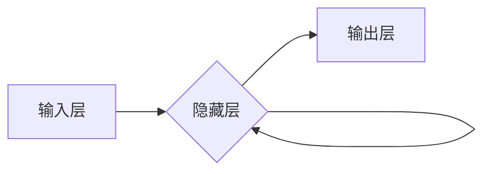

> 循环神经网络 (RNN)、长短期记忆网络 (LSTM)、反向传播算法、自然语言处理、时间序列预测

## 1. 背景介绍

循环神经网络 (RNN) 是一种专门设计用于处理序列数据的深度学习模型。与传统的多层感知机 (MLP) 不同，RNN 具有记忆机制，能够捕捉序列中时间步之间的依赖关系。这使得 RNN 在自然语言处理、语音识别、机器翻译、时间序列预测等领域表现出色。

随着深度学习的蓬勃发展，RNN 的变体，如长短期记忆网络 (LSTM) 和门控循环单元 (GRU)，进一步提升了 RNN 的性能，使其能够处理更长的序列数据，并更好地解决梯度消失问题。

## 2. 核心概念与联系

**2.1 RNN 的核心概念**

RNN 的核心概念是循环连接。在 RNN 中，每个神经元不仅接收当前时间步的输入，还接收来自前一个时间步的隐藏状态。隐藏状态相当于 RNN 的记忆，它存储了之前时间步的信息，并将其传递到下一个时间步。

**2.2 RNN 的架构**

RNN 的架构通常由以下几个部分组成：

* **输入层:** 接收序列数据的每个元素。
* **隐藏层:** 负责处理输入数据并生成隐藏状态。
* **输出层:** 生成对序列数据的预测结果。

**2.3 RNN 的工作原理**

RNN 的工作原理可以简单描述为：

1. 对于序列数据的每个元素，将它作为输入，并将其与隐藏状态进行结合。
2. 计算隐藏状态的更新值。
3. 将隐藏状态传递到下一个时间步。
4. 根据隐藏状态，生成对序列数据的预测结果。

**2.4 Mermaid 流程图**



## 3. 核心算法原理 & 具体操作步骤

**3.1 算法原理概述**

RNN 的核心算法是反向传播算法 (Backpropagation)。反向传播算法用于训练 RNN 的参数，使其能够更好地预测序列数据。

**3.2 算法步骤详解**

1. **前向传播:** 将序列数据输入到 RNN 中，计算隐藏状态和输出结果。
2. **损失函数计算:** 计算预测结果与真实结果之间的差异，即损失函数的值。
3. **反向传播:** 将损失函数的梯度反向传播到 RNN 的各个参数，更新参数的值。
4. **重复步骤 1-3:** 迭代训练 RNN，直到损失函数达到最小值。

**3.3 算法优缺点**

**优点:**

* 能够捕捉序列数据中的时间依赖关系。
* 在自然语言处理、语音识别等领域表现出色。

**缺点:**

* 训练 RNN 比较困难，容易出现梯度消失问题。
* 处理长序列数据时性能下降。

**3.4 算法应用领域**

* 自然语言处理 (NLP): 文本分类、情感分析、机器翻译、文本生成等。
* 语音识别: 语音转文本、语音助手等。
* 时间序列预测: 股票预测、天气预报等。

## 4. 数学模型和公式 & 详细讲解 & 举例说明

**4.1 数学模型构建**

RNN 的数学模型可以表示为以下公式：

$$h_t = f(W_{hh}h_{t-1} + W_{xh}x_t + b_h)$$

$$y_t = g(W_{hy}h_t + b_y)$$

其中：

* $h_t$ 是时间步 $t$ 的隐藏状态。
* $x_t$ 是时间步 $t$ 的输入。
* $W_{hh}$、$W_{xh}$、$W_{hy}$ 是权重矩阵。
* $b_h$、$b_y$ 是偏置项。
* $f$ 和 $g$ 是激活函数。

**4.2 公式推导过程**

RNN 的公式推导过程涉及到矩阵运算和微积分。

**4.3 案例分析与讲解**

假设我们有一个简单的 RNN 模型，用于预测一个序列数据的下一个元素。

**输入序列:** [1, 2, 3]

**隐藏状态初始值:** $h_0 = 0$

**权重矩阵和偏置项:**

* $W_{hh} = \begin{bmatrix} 0.5 & 0.2 \\ 0.3 & 0.7 \end{bmatrix}$
* $W_{xh} = \begin{bmatrix} 0.1 & 0.4 \\ 0.2 & 0.3 \end{bmatrix}$
* $W_{hy} = \begin{bmatrix} 0.6 & 0.8 \end{bmatrix}$
* $b_h = \begin{bmatrix} 0.1 \\ 0.2 \end{bmatrix}$
* $b_y = 0.3$

**激活函数:** $f(x) = tanh(x)$

**输出层激活函数:** $g(x) = sigmoid(x)$

通过上述公式和参数，我们可以计算出每个时间步的隐藏状态和输出结果。

## 5. 项目实践：代码实例和详细解释说明

**5.1 开发环境搭建**

* Python 3.6+
* TensorFlow 或 PyTorch

**5.2 源代码详细实现**

```python
import tensorflow as tf

# 定义 RNN 模型
model = tf.keras.Sequential([
    tf.keras.layers.Embedding(input_dim=10000, output_dim=128),
    tf.keras.layers.LSTM(units=128),
    tf.keras.layers.Dense(units=10, activation='softmax')
])

# 编译模型
model.compile(optimizer='adam',
              loss='sparse_categorical_crossentropy',
              metrics=['accuracy'])

# 训练模型
model.fit(x_train, y_train, epochs=10)

# 评估模型
loss, accuracy = model.evaluate(x_test, y_test)
print('Loss:', loss)
print('Accuracy:', accuracy)
```

**5.3 代码解读与分析**

* `Embedding`: 将词向量表示为稠密的向量。
* `LSTM`: 循环神经网络层，用于处理序列数据。
* `Dense`: 全连接层，用于分类。
* `adam`: 优化器，用于更新模型参数。
* `sparse_categorical_crossentropy`: 损失函数，用于分类任务。
* `accuracy`: 评估指标，用于衡量模型性能。

**5.4 运行结果展示**

训练完成后，我们可以使用 `evaluate()` 方法评估模型的性能。

## 6. 实际应用场景

**6.1 自然语言处理**

* **文本分类:** 使用 RNN 对文本进行分类，例如情感分析、主题分类等。
* **机器翻译:** 使用 RNN 将文本从一种语言翻译成另一种语言。
* **文本生成:** 使用 RNN 生成文本，例如诗歌、小说等。

**6.2 语音识别**

* **语音转文本:** 使用 RNN 将语音信号转换为文本。
* **语音助手:** 使用 RNN 构建语音助手，例如 Siri、Alexa 等。

**6.3 时间序列预测**

* **股票预测:** 使用 RNN 预测股票价格的未来走势。
* **天气预报:** 使用 RNN 预测未来几天的天气情况。

**6.4 未来应用展望**

RNN 在未来将有更广泛的应用场景，例如：

* **医疗诊断:** 使用 RNN 分析患者的病历和检查结果，辅助医生进行诊断。
* **金融风险管理:** 使用 RNN 预测金融市场风险。
* **自动驾驶:** 使用 RNN 帮助自动驾驶汽车理解周围环境。

## 7. 工具和资源推荐

**7.1 学习资源推荐**

* **书籍:**
    * 《深度学习》
    * 《自然语言处理》
* **在线课程:**
    * Coursera: 深度学习
    * Udacity: 自然语言处理

**7.2 开发工具推荐**

* **TensorFlow:** 开源深度学习框架。
* **PyTorch:** 开源深度学习框架。
* **Keras:** 高级深度学习 API，可以用于 TensorFlow 和 Theano。

**7.3 相关论文推荐**

* **Long Short-Term Memory**
* **Gated Recurrent Unit**

## 8. 总结：未来发展趋势与挑战

**8.1 研究成果总结**

RNN 在处理序列数据方面取得了显著的成果，并在自然语言处理、语音识别等领域取得了广泛应用。

**8.2 未来发展趋势**

* **更强大的 RNN 变体:** 研究更强大的 RNN 变体，例如 Transformer，以解决长序列数据处理问题。
* **端到端学习:** 将 RNN 与其他深度学习模型结合，实现端到端学习，提高模型性能。
* **可解释性:** 研究 RNN 的可解释性，使其能够更好地解释其决策过程。

**8.3 面临的挑战**

* **梯度消失问题:** RNN 训练时容易出现梯度消失问题，导致模型难以学习长序列数据。
* **计算资源:** 训练大型 RNN 模型需要大量的计算资源。
* **数据标注:** RNN 的训练需要大量的标注数据，这在某些领域比较困难。

**8.4 研究展望**

未来，RNN 将继续是深度学习领域的重要研究方向，并将在更多领域得到应用。


## 9. 附录：常见问题与解答

**9.1 什么是梯度消失问题？**

梯度消失问题是指 RNN 训练时，随着时间步的增加，梯度值逐渐减小，导致模型难以学习长序列数据。

**9.2 如何解决梯度消失问题？**

可以使用 LSTM 或 GRU 等 RNN 变体来解决梯度消失问题。

**9.3 RNN 的应用场景有哪些？**

RNN 的应用场景包括自然语言处理、语音识别、时间序列预测等。


作者：禅与计算机程序设计艺术 / Zen and the Art of Computer Programming 
<end_of_turn>