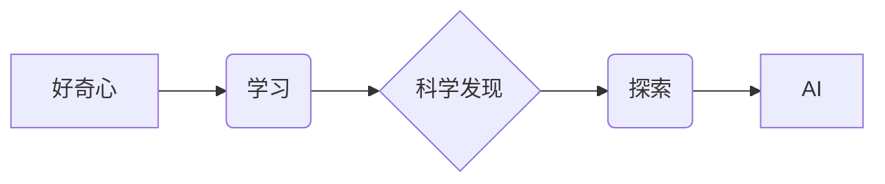

> 人工智能，好奇心，科学发现，探索，学习，创新

## 1. 背景介绍

在瞬息万变的科技时代，人工智能（AI）正以惊人的速度发展，不断突破人类认知的边界。从自动驾驶汽车到智能语音助手，AI已经渗透到我们生活的方方面面。然而，AI的发展并非一蹴而就，它离不开人类的智慧和探索精神。

好奇心是人类进步的原动力，也是科学发现的基石。它驱使我们不断探索未知领域，寻求问题的答案，最终推动人类文明的进步。在AI领域，好奇心同样至关重要。它激励着研究者不断探索新的算法、模型和应用场景，推动AI技术不断向前发展。

## 2. 核心概念与联系

### 2.1  好奇心与学习

好奇心是学习的驱动力。当我们对某件事物感到好奇时，我们就会主动去探索和学习，试图了解它的本质。这种主动学习的机制是人类学习的关键，也是AI学习的核心。

### 2.2  科学发现与探索

科学发现是人类对自然规律的探索和理解。它需要我们不断提出问题，设计实验，收集数据，并进行分析和推理。好奇心是科学发现的源泉，它让我们敢于质疑，敢于探索，最终揭示自然世界的奥秘。

### 2.3  AI与好奇心

AI系统可以通过模仿人类的学习机制，学习和探索新的知识。例如，一些AI模型可以通过阅读大量文本数据，学习语言和知识，并根据这些知识回答问题、生成文本甚至进行创作。

**核心概念与联系流程图**



## 3. 核心算法原理 & 具体操作步骤

### 3.1  算法原理概述

深度学习算法是AI领域的核心算法之一，它能够通过多层神经网络学习复杂的模式和关系。深度学习算法的原理是模仿人类大脑的神经网络结构，通过大量的训练数据，让神经网络不断调整权重，最终能够完成复杂的学习任务。

### 3.2  算法步骤详解

1. **数据预处理:** 将原始数据进行清洗、转换和格式化，使其适合深度学习算法的训练。
2. **网络结构设计:** 根据具体的学习任务，设计合适的深度神经网络结构，包括神经元的数量、连接方式和激活函数等。
3. **参数初始化:** 为神经网络中的参数进行随机初始化。
4. **前向传播:** 将输入数据通过神经网络进行传递，最终得到输出结果。
5. **反向传播:** 计算输出结果与真实值的误差，并根据误差反向传播，调整神经网络的参数。
6. **优化算法:** 使用优化算法，例如梯度下降法，不断更新神经网络的参数，使其能够更好地拟合训练数据。
7. **模型评估:** 使用测试数据评估模型的性能，并根据评估结果进行模型调优。

### 3.3  算法优缺点

**优点:**

* 能够学习复杂的模式和关系。
* 性能优于传统机器学习算法。
* 应用范围广泛，包括图像识别、自然语言处理、语音识别等。

**缺点:**

* 需要大量的训练数据。
* 计算资源消耗大。
* 模型解释性差。

### 3.4  算法应用领域

深度学习算法在各个领域都有广泛的应用，例如：

* **计算机视觉:** 图像识别、物体检测、图像分割、人脸识别等。
* **自然语言处理:** 文本分类、情感分析、机器翻译、对话系统等。
* **语音识别:** 语音转文本、语音助手等。
* **医疗诊断:** 病理图像分析、疾病预测等。
* **金融分析:** 风险评估、欺诈检测等。

## 4. 数学模型和公式 & 详细讲解 & 举例说明

### 4.1  数学模型构建

深度学习算法的核心是神经网络模型。神经网络模型由多个层组成，每一层包含多个神经元。神经元之间通过连接进行信息传递，每个连接都有一个权重。

**神经网络模型数学表示:**

$$
y = f(W_L x_L + b_L)
$$

其中:

* $y$ 是输出结果。
* $x_L$ 是上一层的输出。
* $W_L$ 是当前层的权重矩阵。
* $b_L$ 是当前层的偏置向量。
* $f$ 是激活函数。

### 4.2  公式推导过程

深度学习算法的训练过程是通过反向传播算法来进行的。反向传播算法的核心是计算误差梯度，并根据梯度更新神经网络的参数。

**误差梯度公式:**

$$
\frac{\partial Loss}{\partial W} = \frac{\partial Loss}{\partial y} \cdot \frac{\partial y}{\partial W}
$$

其中:

* $Loss$ 是损失函数。
* $W$ 是权重参数。

### 4.3  案例分析与讲解

假设我们有一个简单的线性回归问题，目标是预测房价。我们可以使用一个单层神经网络模型来解决这个问题。

**模型结构:**

* 输入层: 2 个神经元，分别表示房屋面积和房间数量。
* 输出层: 1 个神经元，表示房价。

**训练数据:**

| 面积 (平方米) | 房间数量 | 房价 (万元) |
|---|---|---|
| 80 | 2 | 1.5 |
| 120 | 3 | 2.5 |
| 150 | 4 | 3.5 |

**训练过程:**

1. 初始化权重和偏置。
2. 将训练数据输入神经网络，计算输出结果。
3. 计算损失函数值。
4. 使用反向传播算法计算误差梯度。
5. 根据误差梯度更新权重和偏置。
6. 重复步骤 2-5，直到损失函数值收敛。

## 5. 项目实践：代码实例和详细解释说明

### 5.1  开发环境搭建

* Python 3.x
* TensorFlow 或 PyTorch

### 5.2  源代码详细实现

```python
import tensorflow as tf

# 定义模型结构
model = tf.keras.models.Sequential([
    tf.keras.layers.Dense(128, activation='relu', input_shape=(2,)),
    tf.keras.layers.Dense(1)
])

# 编译模型
model.compile(optimizer='adam', loss='mse')

# 训练模型
model.fit(X_train, y_train, epochs=100)

# 评估模型
loss = model.evaluate(X_test, y_test)
```

### 5.3  代码解读与分析

* `tf.keras.models.Sequential`: 定义一个顺序模型，神经网络层按顺序连接。
* `tf.keras.layers.Dense`: 定义一个全连接层，每个神经元都连接到上一层的每个神经元。
* `activation='relu'`: 使用ReLU激活函数。
* `input_shape=(2,)`: 输入层的神经元数量为2。
* `optimizer='adam'`: 使用Adam优化算法。
* `loss='mse'`: 使用均方误差损失函数。
* `model.fit`: 训练模型。
* `model.evaluate`: 评估模型。

### 5.4  运行结果展示

训练完成后，我们可以使用测试数据评估模型的性能。例如，我们可以计算模型预测的房价与真实房价之间的均方误差。

## 6. 实际应用场景

深度学习算法在各个领域都有广泛的应用，例如：

* **计算机视觉:** 图像识别、物体检测、图像分割、人脸识别等。
* **自然语言处理:** 文本分类、情感分析、机器翻译、对话系统等。
* **语音识别:** 语音转文本、语音助手等。
* **医疗诊断:** 病理图像分析、疾病预测等。
* **金融分析:** 风险评估、欺诈检测等。

## 7. 工具和资源推荐

### 7.1  学习资源推荐

* **书籍:**
    * 深度学习 (Deep Learning) - Ian Goodfellow, Yoshua Bengio, Aaron Courville
    * 
    * 
* **在线课程:**
    * Coursera: 深度学习 Specialization
    * Udacity: Deep Learning Nanodegree
    * fast.ai: Practical Deep Learning for Coders

### 7.2  开发工具推荐

* **TensorFlow:** Google 开发的开源深度学习框架。
* **PyTorch:** Facebook 开发的开源深度学习框架。
* **Keras:** TensorFlow 的高层API，易于使用。

### 7.3  相关论文推荐

* **ImageNet Classification with Deep Convolutional Neural Networks** - Alex Krizhevsky, Ilya Sutskever, Geoffrey E. Hinton
* **Sequence to Sequence Learning with Neural Networks** - Ilya Sutskever, Oriol Vinyals, Quoc V. Le
* **Attention Is All You Need** - Ashish Vaswani, Noam Shazeer, Niki Parmar, Jakob Uszkoreit, Llion Jones, Aidan N. Gomez, Łukasz Kaiser, Illia Polosukhin

## 8. 总结：未来发展趋势与挑战

### 8.1  研究成果总结

深度学习算法取得了令人瞩目的成就，在各个领域都取得了突破性的进展。

### 8.2  未来发展趋势

* **模型规模和复杂度:** 未来深度学习模型将更加庞大复杂，拥有更多的参数和层数。
* **数据效率:** 研究者将致力于开发更加高效的深度学习算法，能够从更少的数据中学习。
* **可解释性:** 研究者将更加关注深度学习模型的可解释性，以便更好地理解模型的决策过程。
* **边缘计算:** 深度学习算法将更加广泛地应用于边缘设备，实现更快速的推理和响应。

### 8.3  面临的挑战

* **计算资源:** 训练大型深度学习模型需要大量的计算资源，这对于资源有限的机构和个人来说是一个挑战。
* **数据隐私:** 深度学习算法需要大量的训练数据，这可能会引发数据隐私问题。
* **算法安全性:** 深度学习算法可能存在安全漏洞，例如对抗攻击。

### 8.4  研究展望

未来，深度学习领域将继续朝着更加高效、可解释、安全的方向发展。

## 9. 附录：常见问题与解答

* **Q: 深度学习算法需要多少数据才能训练？**

* **A:** 不同任务所需的训练数据量不同，一般来说，深度学习算法需要大量的训练数据才能达到良好的性能。

* **Q: 深度学习算法的训练过程很慢，有什么方法可以加速训练？**

* **A:** 可以使用一些加速训练的方法，例如数据并行、模型并行、混合精度训练等。

* **Q: 深度学习算法的解释性差，如何提高模型的可解释性？**

* **A:** 可以使用一些可解释性分析方法，例如特征重要性分析、梯度可视化等。


作者：禅与计算机程序设计艺术 / Zen and the Art of Computer Programming 
<end_of_turn>