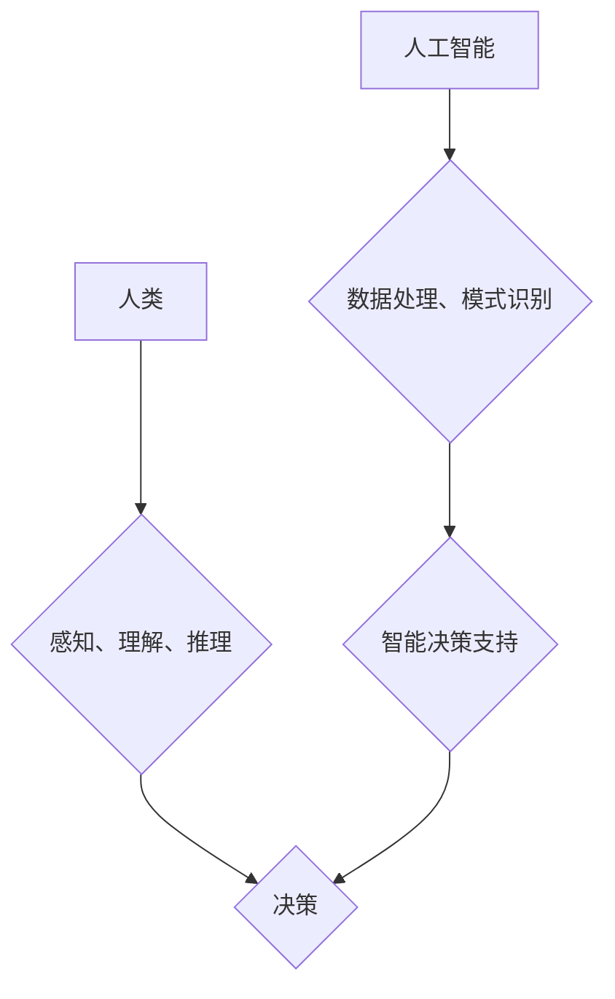

> 人类计算、人工智能、机器学习、深度学习、自然语言处理、计算机视觉、科技进步

## 1. 背景介绍

科技进步是人类社会发展的引擎，而人类计算作为科技进步的基石，在推动科技发展中扮演着至关重要的角色。从古老的算盘到现代的超级计算机，人类一直在探索更有效、更智能的计算方式。近年来，人工智能（AI）的蓬勃发展，特别是深度学习技术的突破，为人类计算注入了新的活力，也为我们构建更加智能、更加便捷的未来世界提供了强大的工具。

## 2. 核心概念与联系

**2.1 人类计算的本质**

人类计算是指人类利用自身的认知能力和计算能力进行信息处理和决策的过程。它包括感知、理解、推理、记忆和决策等一系列复杂的操作。人类计算的优势在于其灵活性、创造力和适应性，能够处理复杂、模糊和不确定性信息，并进行高度的抽象和概括。

**2.2 人工智能的崛起**

人工智能是指模拟人类智能行为的计算机系统。它涵盖了广泛的领域，包括机器学习、深度学习、自然语言处理、计算机视觉等。人工智能技术的快速发展，使得机器能够学习、推理、决策和解决问题，从而逐渐接近人类的智能水平。

**2.3 人类计算与人工智能的融合**

人类计算和人工智能并非相互排斥，而是相互补充、相互促进的关系。人工智能可以帮助人类提高计算效率、自动化重复性任务，释放人类的创造力和智力资源。而人类的智慧和经验则可以指导人工智能的发展方向，赋予人工智能更强的理解力和决策能力。

**2.4 融合架构**



## 3. 核心算法原理 & 具体操作步骤

**3.1 算法原理概述**

深度学习算法是人工智能领域的核心算法之一，它通过多层神经网络模拟人类大脑的学习机制，能够从海量数据中学习复杂的模式和特征。深度学习算法的优势在于其强大的学习能力和泛化能力，能够处理复杂、高维的数据，并取得优异的性能。

**3.2 算法步骤详解**

1. **数据预处理:** 将原始数据进行清洗、转换和格式化，使其适合深度学习算法的训练。
2. **网络结构设计:** 根据任务需求设计深度神经网络的结构，包括层数、节点数、激活函数等参数。
3. **参数初始化:** 为神经网络中的参数进行随机初始化。
4. **前向传播:** 将输入数据通过神经网络进行逐层传递，计算输出结果。
5. **反向传播:** 计算输出结果与真实值的误差，并根据误差反向传播，更新神经网络的参数。
6. **迭代训练:** 重复前向传播和反向传播的过程，直到模型的性能达到预设的目标。

**3.3 算法优缺点**

**优点:**

* 强大的学习能力，能够从海量数据中学习复杂的模式和特征。
* 泛化能力强，能够应用于不同的任务和领域。
* 自动特征提取，无需人工特征工程。

**缺点:**

* 训练数据量大，需要大量的计算资源和时间。
* 模型解释性差，难以理解模型的决策过程。
* 对数据质量要求高，数据噪声和偏差会影响模型性能。

**3.4 算法应用领域**

深度学习算法已广泛应用于各个领域，包括：

* **计算机视觉:** 图像识别、物体检测、图像分割、人脸识别等。
* **自然语言处理:** 文本分类、情感分析、机器翻译、对话系统等。
* **语音识别:** 语音转文本、语音合成等。
* **医疗诊断:** 疾病预测、影像分析、药物研发等。
* **金融分析:** 风险评估、欺诈检测、投资预测等。

## 4. 数学模型和公式 & 详细讲解 & 举例说明

**4.1 数学模型构建**

深度学习算法的核心是神经网络模型，它由多个层级的神经元组成。每个神经元接收来自上一层的输入信号，并通过激活函数进行处理，输出到下一层。神经网络的学习过程就是通过调整神经元之间的权重和偏差，使得网络的输出与真实值之间的误差最小化。

**4.2 公式推导过程**

深度学习算法的训练过程通常使用梯度下降算法，其目标函数是误差函数，通过最小化误差函数来更新网络参数。梯度下降算法的核心思想是沿着误差函数的梯度方向更新参数，直到达到最小值。

**误差函数:**

$$
E = \frac{1}{2} \sum_{i=1}^{N} (y_i - \hat{y}_i)^2
$$

其中：

* $E$ 是误差函数
* $N$ 是样本数量
* $y_i$ 是真实值
* $\hat{y}_i$ 是预测值

**梯度下降公式:**

$$
\theta_j = \theta_j - \alpha \frac{\partial E}{\partial \theta_j}
$$

其中：

* $\theta_j$ 是参数
* $\alpha$ 是学习率
* $\frac{\partial E}{\partial \theta_j}$ 是参数 $\theta_j$ 对误差函数的梯度

**4.3 案例分析与讲解**

以图像分类为例，假设我们使用深度学习算法训练一个模型，用于识别猫和狗的图片。

1. **数据准备:** 收集大量猫和狗的图片，并进行标记，将每张图片标注为“猫”或“狗”。
2. **模型设计:** 设计一个深度神经网络模型，例如卷积神经网络（CNN），用于提取图像特征。
3. **训练模型:** 使用梯度下降算法训练模型，将图片数据输入到模型中，并根据模型的输出结果与真实标签的误差进行参数更新。
4. **评估模型:** 使用测试集评估模型的性能，例如计算准确率、召回率等指标。

## 5. 项目实践：代码实例和详细解释说明

**5.1 开发环境搭建**

使用 Python 语言和 TensorFlow 或 PyTorch 等深度学习框架进行开发。

**5.2 源代码详细实现**

```python
import tensorflow as tf

# 定义模型结构
model = tf.keras.models.Sequential([
    tf.keras.layers.Conv2D(32, (3, 3), activation='relu', input_shape=(28, 28, 1)),
    tf.keras.layers.MaxPooling2D((2, 2)),
    tf.keras.layers.Conv2D(64, (3, 3), activation='relu'),
    tf.keras.layers.MaxPooling2D((2, 2)),
    tf.keras.layers.Flatten(),
    tf.keras.layers.Dense(10, activation='softmax')
])

# 编译模型
model.compile(optimizer='adam',
              loss='sparse_categorical_crossentropy',
              metrics=['accuracy'])

# 训练模型
model.fit(x_train, y_train, epochs=10)

# 评估模型
loss, accuracy = model.evaluate(x_test, y_test)
print('Test loss:', loss)
print('Test accuracy:', accuracy)
```

**5.3 代码解读与分析**

这段代码定义了一个简单的卷积神经网络模型，用于手写数字识别任务。

* `tf.keras.models.Sequential` 创建了一个顺序模型，层级结构清晰。
* `tf.keras.layers.Conv2D` 定义卷积层，用于提取图像特征。
* `tf.keras.layers.MaxPooling2D` 定义最大池化层，用于降维和提高模型鲁棒性。
* `tf.keras.layers.Flatten` 将多维特征转换为一维向量。
* `tf.keras.layers.Dense` 定义全连接层，用于分类。
* `model.compile` 编译模型，指定优化器、损失函数和评价指标。
* `model.fit` 训练模型，使用训练数据进行迭代训练。
* `model.evaluate` 评估模型，使用测试数据计算损失和准确率。

**5.4 运行结果展示**

训练完成后，模型可以用于识别新的手写数字图片。

## 6. 实际应用场景

**6.1 医疗诊断**

深度学习算法可以用于分析医学影像，例如X光片、CT扫描和MRI扫描，辅助医生诊断疾病。例如，可以用于识别肺结核、乳腺癌和脑肿瘤等疾病。

**6.2 金融风险评估**

深度学习算法可以用于分析金融数据，例如股票价格、交易记录和客户信息，评估金融风险。例如，可以用于识别欺诈交易、预测股票价格走势和评估客户信用风险。

**6.3 自动驾驶**

深度学习算法可以用于训练自动驾驶汽车，使其能够感知周围环境、识别障碍物和做出决策。例如，可以用于车道保持、自动刹车和自动导航等功能。

**6.4 未来应用展望**

随着人工智能技术的不断发展，深度学习算法将在更多领域得到应用，例如：

* **个性化教育:** 根据学生的学习情况，提供个性化的学习内容和教学方法。
* **智能客服:** 使用自然语言处理技术，提供更加智能和人性化的客服服务。
* **科学研究:** 加速科学研究的进程，例如药物研发、材料科学和天文学。

## 7. 工具和资源推荐

**7.1 学习资源推荐**

* **书籍:**
    * 深度学习 (Deep Learning) - Ian Goodfellow, Yoshua Bengio, Aaron Courville
    * 构建深度学习模型 (Hands-On Machine Learning with Scikit-Learn, Keras & TensorFlow) - Aurélien Géron
* **在线课程:**
    * 深度学习 Specialization - Andrew Ng (Coursera)
    * fast.ai - Practical Deep Learning for Coders
* **博客和网站:**
    * TensorFlow Blog
    * PyTorch Blog
    * Towards Data Science

**7.2 开发工具推荐**

* **深度学习框架:** TensorFlow, PyTorch, Keras
* **编程语言:** Python
* **数据处理工具:** Pandas, NumPy
* **可视化工具:** Matplotlib, Seaborn

**7.3 相关论文推荐**

* AlexNet: ImageNet Classification with Deep Convolutional Neural Networks (Krizhevsky et al., 2012)
* VGGNet: Very Deep Convolutional Networks for Large-Scale Image Recognition (Simonyan & Zisserman, 2014)
* ResNet: Deep Residual Learning for Image Recognition (He et al., 2015)

## 8. 总结：未来发展趋势与挑战

**8.1 研究成果总结**

近年来，深度学习算法取得了显著的成果，在图像识别、自然语言处理、语音识别等领域取得了突破性的进展。

**8.2 未来发展趋势**

* **模型规模和复杂度提升:** 随着计算资源的不断发展，深度学习模型的规模和复杂度将进一步提升，从而提高模型的性能和泛化能力。
* **算法创新:** 研究人员将继续探索新的深度学习算法，例如自监督学习、强化学习和联邦学习，以解决现有算法的局限性。
* **跨模态学习:** 深度学习模型将能够处理多种模态数据，例如文本、图像、音频和视频，从而实现更智能的交互和理解。

**8.3 面临的挑战**

* **数据获取和标注:** 深度学习算法需要大量的训练数据，而获取和标注高质量数据仍然是一个挑战。
* **模型解释性和可解释性:** 深度学习模型的决策过程往往难以理解，这限制了其在一些关键领域，例如医疗诊断和金融风险评估的应用。
* **公平性和偏见:** 深度学习模型可能存在公平性和偏见问题，需要采取措施确保模型的公平性和公正性。

**8.4 研究展望**

未来，人类计算和人工智能将继续融合