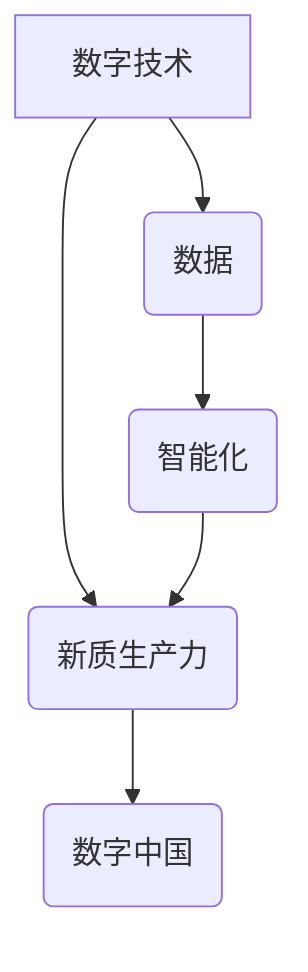

> 数字中国、新质生产力、人工智能、大数据、云计算、区块链、物联网、数字经济

## 1. 背景介绍

21世纪初，以互联网、移动互联网、大数据、人工智能等为代表的新一代信息技术蓬勃发展，深刻地改变着人类社会生产方式和生活方式。中国政府于2021年发布了《数字中国建设整体方案》，明确提出要建设数字中国，推动数字经济发展，提升国家治理能力和公共服务水平。

数字中国战略的提出，标志着中国迈入数字经济时代的新阶段。数字经济以数据为核心要素，以信息技术为驱动力量，以网络为基础设施，以智能化为发展方向。它将深刻地改变中国经济结构、产业布局、社会形态和生活方式。

## 2. 核心概念与联系

**2.1 数字中国**

数字中国是指以数字技术为基础，构建数字经济、数字社会、数字政府的国家发展战略。其核心目标是通过数字化转型，提升国家治理能力和公共服务水平，推动经济社会高质量发展。

**2.2 新质生产力**

新质生产力是指以数字技术为基础，以数据为核心要素，以智能化为特征，以网络化、协同化、平台化为特点的生产力。它打破了传统生产力的时空限制，实现了生产要素的灵活配置和资源的优化利用，推动了生产效率和经济效益的提升。

**2.3 核心概念联系**

数字中国战略的实施，将推动新质生产力的发展。数字技术为新质生产力的发展提供了基础设施和技术支撑，数据成为新质生产力的核心要素，智能化成为新质生产力的发展方向。



**2.4 数字经济**

数字经济是指以数字技术为基础，以数据为核心要素，以网络为基础设施，以智能化为发展方向的经济活动。它涵盖了电子商务、互联网金融、数字内容、云计算、大数据等多个领域。

**2.5 数字社会**

数字社会是指以数字技术为基础，以网络为平台，以数据为驱动，以智能化为特征的社会形态。它涵盖了数字政府、数字教育、数字医疗、数字文化等多个方面。

**2.6 数字政府**

数字政府是指利用数字技术，提升政府服务效率、加强政府监管、促进政府透明度和公众参与的政府治理模式。

## 3. 核心算法原理 & 具体操作步骤

**3.1 算法原理概述**

数字中国战略的实施需要大量的算法支持，例如：

* **推荐算法**: 用于推荐个性化内容，例如电商平台的商品推荐、视频平台的视频推荐等。
* **预测算法**: 用于预测未来趋势，例如天气预报、股票预测等。
* **分类算法**: 用于将数据进行分类，例如垃圾邮件过滤、图像识别等。
* **聚类算法**: 用于将数据进行聚类，例如客户画像、市场细分等。

这些算法的原理主要基于统计学、概率论、机器学习等领域。

**3.2 算法步骤详解**

以推荐算法为例，其基本步骤如下：

1. **数据收集**: 收集用户行为数据，例如用户浏览记录、购买记录、评分记录等。
2. **数据预处理**: 对数据进行清洗、转换、编码等操作，使其适合算法训练。
3. **特征提取**: 从数据中提取用户和物品的特征，例如用户年龄、性别、兴趣爱好、物品价格、类别、评价等。
4. **模型训练**: 使用训练数据训练推荐算法模型，例如协同过滤、内容过滤、深度学习等。
5. **模型评估**: 使用测试数据评估模型的性能，例如准确率、召回率、覆盖率等。
6. **模型部署**: 将训练好的模型部署到线上环境，为用户提供个性化推荐。

**3.3 算法优缺点**

不同的推荐算法具有不同的优缺点，需要根据实际应用场景选择合适的算法。

* **协同过滤**: 优点是能够发现用户之间的隐性关联，推荐个性化内容。缺点是数据稀疏性问题，当用户行为数据不足时，算法效果会下降。
* **内容过滤**: 优点是能够根据用户兴趣爱好推荐相关内容。缺点是容易陷入“同质化推荐”的困境，缺乏个性化。
* **深度学习**: 优点是能够学习更复杂的特征，提高推荐效果。缺点是需要大量的训练数据，训练成本较高。

**3.4 算法应用领域**

推荐算法广泛应用于电商、视频、音乐、新闻、社交等多个领域，例如：

* **电商平台**: 商品推荐、用户画像、个性化营销
* **视频平台**: 视频推荐、用户兴趣分析、内容创作
* **音乐平台**: 音乐推荐、用户喜好分析、音乐创作
* **新闻平台**: 新闻推荐、用户兴趣分析、个性化新闻订阅

## 4. 数学模型和公式 & 详细讲解 & 举例说明

**4.1 数学模型构建**

推荐算法的数学模型通常基于矩阵分解、概率图模型、深度学习等方法。

**4.1.1 矩阵分解**

矩阵分解是一种将用户-物品交互矩阵分解成多个低维矩阵的方法，例如：

* **协同过滤**: 将用户-物品交互矩阵分解成用户特征矩阵和物品特征矩阵，通过计算用户和物品的相似度进行推荐。

**4.1.2 概率图模型**

概率图模型是一种用于表示随机变量之间的依赖关系的图形模型，例如：

* **贝叶斯网络**: 用于建模用户行为和物品属性之间的关系，通过计算后验概率进行推荐。

**4.1.3 深度学习**

深度学习是一种基于多层神经网络的机器学习方法，例如：

* **神经网络推荐**: 使用多层神经网络学习用户和物品的特征，并预测用户对物品的评分或点击概率。

**4.2 公式推导过程**

例如，协同过滤算法的数学模型可以表示为：

$$
R_{ui} = p_u^T q_i + \epsilon_{ui}
$$

其中：

* $R_{ui}$ 表示用户 $u$ 对物品 $i$ 的评分。
* $p_u$ 表示用户 $u$ 的特征向量。
* $q_i$ 表示物品 $i$ 的特征向量。
* $\epsilon_{ui}$ 表示评分误差。

**4.3 案例分析与讲解**

例如，假设有一个电商平台，用户和商品的交互数据如下：

| 用户 | 商品1 | 商品2 | 商品3 |
|---|---|---|---|
| 用户1 | 5 | 3 | 4 |
| 用户2 | 4 | 5 | 2 |
| 用户3 | 3 | 4 | 5 |

可以使用协同过滤算法对用户和商品进行特征分解，并预测用户对商品的评分。

## 5. 项目实践：代码实例和详细解释说明

**5.1 开发环境搭建**

* 操作系统：Windows/Linux/macOS
* Python 版本：3.6+
* 必要的库：pandas, numpy, scikit-learn, tensorflow等

**5.2 源代码详细实现**

```python
import pandas as pd
from sklearn.metrics.pairwise import cosine_similarity

# 加载用户-商品交互数据
data = pd.read_csv('user_item_data.csv')

# 构建用户-商品交互矩阵
user_item_matrix = data.pivot_table(index='user_id', columns='item_id', values='rating')

# 计算用户-用户相似度矩阵
user_similarity = cosine_similarity(user_item_matrix)

# 计算物品-物品相似度矩阵
item_similarity = cosine_similarity(user_item_matrix.T)

# 根据用户相似度推荐商品
def recommend_items(user_id, top_n=5):
    # 获取用户相似用户
    similar_users = user_similarity[user_id].argsort()[:-top_n-1:-1]

    # 获取相似用户喜欢的商品
    recommended_items = set()
    for similar_user in similar_users:
        for item_id in user_item_matrix.columns:
            if user_item_matrix.loc[similar_user, item_id] > 0 and item_id not in recommended_items:
                recommended_items.add(item_id)

    return recommended_items

# 获取用户ID
user_id = 1

# 推荐商品
recommended_items = recommend_items(user_id)

# 打印推荐结果
print(f'推荐给用户 {user_id} 的商品：{recommended_items}')
```

**5.3 代码解读与分析**

* 代码首先加载用户-商品交互数据，并构建用户-商品交互矩阵。
* 然后，使用余弦相似度计算用户-用户相似度矩阵和物品-物品相似度矩阵。
* 基于用户相似度，推荐用户可能喜欢的商品。

**5.4 运行结果展示**

运行代码后，将输出用户1可能喜欢的商品列表。

## 6. 实际应用场景

数字中国战略的实施，将推动数字经济、数字社会、数字政府等多个领域的应用。

**6.1 数字经济**

* **电商**: 个性化商品推荐、精准营销、供应链优化
* **金融**: 金融风险管理、智能理财、移动支付
* **制造**: 智能制造、工业互联网、供应链管理
* **交通**: 智能交通、无人驾驶、智慧城市

**6.2 数字社会**

* **教育**: 在线教育、个性化学习、智慧校园
* **医疗**: 远程医疗、精准诊断、智慧医院
* **文化**: 数字文化产业、在线娱乐、虚拟现实

**6.3 数字政府**

* **政务服务**: 在线审批、电子政务、智慧政务
* **社会管理**: 公共安全、人口管理、环境监测
* **公共服务**: 社保、医疗、教育

**6.4 未来应用展望**

数字中国战略的实施，将带来更多新的应用场景，例如：

* **元宇宙**: 数字孪生、虚拟现实、增强现实
* **人工智能**: 人工智能助手、智能客服、自动驾驶
* **区块链**: 数字身份、数据安全、供应链管理

## 7. 工具和资源推荐

**7.1 学习资源推荐**

* **在线课程**: Coursera, edX, Udemy
* **书籍**: 《深度学习》、《机器学习》、《数据挖掘》
* **博客**: Towards Data Science, Machine Learning Mastery

**7.2 开发工具推荐**

* **编程语言**: Python, Java, C++
* **机器学习库**: scikit-learn, TensorFlow, PyTorch
* **数据分析工具**: pandas, numpy, matplotlib

**7.3 相关论文推荐**

* 《Attention Is All You Need》
* 《BERT: Pre-training of Deep Bidirectional Transformers for Language Understanding》
* 《Generative Adversarial Networks》

## 8. 总结：未来发展趋势与挑战

**8.1 研究成果总结**

数字中国战略的实施，取得了显著成果，例如：

* **数字经济规模持续增长**: 数字经济成为中国经济的重要引擎。
* **数字基础设施建设不断完善**: 5G、云计算、大数据等数字基础设施得到快速发展。
* **数字技术应用场景不断拓展**: 数字技术应用于各个领域，推动社会转型升级。

**8.2 未来发展趋势**

* **人工智能技术将更加成熟**: 人工智能将应用于更多领域，例如医疗、教育、金融等。
* **数据安全和隐私保护将更加重要**: 数据安全和隐私保护将成为数字经济发展的关键问题。
* **数字治理体系将更加完善**: 数字治理体系将更加完善，保障数字经济健康发展。

**8.3 面临的挑战**

* **数字鸿沟**: 数字技术应用不均衡，导致数字鸿沟加深。
* **数据安全和隐私保护**: 数据安全和隐私保护面临挑战，需要加强监管和技术保障。
* **人才短缺**: 数字经济发展需要大量高素质人才，人才