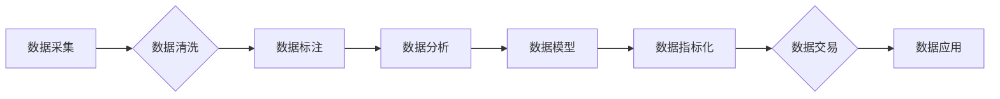

> 数据集、指标化、数据要素、市场化、新基建、数据价值、数据交易、数据标准

## 1. 背景介绍

数据已成为当今社会最宝贵的资源之一，其价值正在日益凸显。随着数字经济的蓬勃发展，数据要素市场化成为全球共识，各国纷纷出台政策推动数据流通和共享。然而，数据要素市场化面临着诸多挑战，其中之一就是缺乏有效的评估和交易机制。

传统的数据评估方法往往过于主观，难以量化数据价值，导致数据交易缺乏透明度和可信度。同时，数据格式多样、标准不统一，也阻碍了数据流通和共享。

为了解决这些问题，我们需要建立一套科学、高效的数据指标化体系，将数据要素量化，赋予其市场价值，从而推动数据要素市场化发展。

## 2. 核心概念与联系

**2.1 数据集指标化**

数据集指标化是指对数据集进行量化评估，并将其转化为可交易的数字资产。通过建立一套科学的指标体系，可以客观地衡量数据集的质量、价值和适用性，为数据交易提供依据。

**2.2 数据要素市场化**

数据要素市场化是指将数据要素作为一种商品进行交易，建立起数据供需关系，促进数据资源的有效配置和利用。

**2.3 新基建**

新基建是指以信息基础设施为核心，构建新型基础设施体系，以满足数字经济发展需求。数据要素市场化是新基建的重要组成部分，也是推动数字经济高质量发展的关键。

**2.4 数据价值链**

数据价值链是指从数据采集、存储、处理、分析到应用的整个过程，每个环节都创造着价值。数据集指标化可以帮助我们更好地理解数据价值链，并优化各个环节的运作。

**2.5 数据标准化**

数据标准化是指对数据格式、结构和语义进行统一规范，以确保数据互操作性和可共享性。数据标准化是数据要素市场化不可或缺的基础。

**2.6 数据交易平台**

数据交易平台是指提供数据交易服务的平台，包括数据发布、交易、结算等功能。数据集指标化可以为数据交易平台提供数据价值评估和交易规则，提高平台的效率和安全性。

**2.7 数据安全与隐私保护**

数据安全与隐私保护是数据要素市场化的重要保障。数据集指标化需要与数据安全和隐私保护机制相结合，确保数据安全和用户隐私。

**Mermaid 流程图**



## 3. 核心算法原理 & 具体操作步骤

**3.1 算法原理概述**

数据集指标化算法通常基于机器学习和数据挖掘技术，通过分析数据集的特征和结构，量化其质量、价值和适用性。常见的算法包括：

* **数据质量评估算法:** 评估数据集的完整性、一致性、准确性和及时性等指标。
* **数据价值评估算法:** 评估数据集的商业价值、研究价值和社会价值等指标。
* **数据适用性评估算法:** 评估数据集对特定应用场景的适用性。

**3.2 算法步骤详解**

1. **数据预处理:** 对数据集进行清洗、转换和格式化，确保数据质量和一致性。
2. **特征提取:** 从数据集提取关键特征，例如数据类型、数据量、数据更新频率等。
3. **模型训练:** 使用机器学习算法对特征进行训练，建立数据指标化模型。
4. **指标计算:** 将训练好的模型应用于新的数据集，计算其相应的指标值。
5. **结果评估:** 对计算结果进行评估，验证模型的准确性和有效性。

**3.3 算法优缺点**

* **优点:**

    * 客观量化数据价值，提高数据交易的透明度和可信度。
    * 促进数据资源的有效配置和利用，推动数据要素市场化发展。
    * 为数据安全和隐私保护提供技术支持。

* **缺点:**

    * 数据指标化模型的构建需要大量的数据和计算资源。
    * 数据指标化算法的准确性和有效性取决于数据的质量和特征的选取。
    * 数据指标化体系的建立需要跨行业、跨部门的协作和共识。

**3.4 算法应用领域**

* 数据交易平台
* 数据服务市场
* 数据资产管理
* 数据安全和隐私保护
* 数据科学研究

## 4. 数学模型和公式 & 详细讲解 & 举例说明

**4.1 数学模型构建**

数据集指标化模型可以采用多种数学模型，例如线性回归模型、支持向量机模型、神经网络模型等。

**4.2 公式推导过程**

例如，使用线性回归模型评估数据集的价值，可以采用以下公式：

$$
V = \beta_0 + \beta_1 * S + \beta_2 * A + \beta_3 * U
$$

其中：

* $V$ 表示数据集的价值
* $S$ 表示数据集的大小
* $A$ 表示数据集的准确性
* $U$ 表示数据集的更新频率
* $\beta_0$, $\beta_1$, $\beta_2$, $\beta_3$ 为模型参数

**4.3 案例分析与讲解**

假设我们有一个数据集，其大小为100GB，准确率为90%，更新频率为每天一次。根据上述公式，我们可以计算出该数据集的价值。

假设模型参数为：

* $\beta_0 = 100$
* $\beta_1 = 0.1$
* $\beta_2 = 5$
* $\beta_3 = 0.5$

则该数据集的价值为：

$$
V = 100 + 0.1 * 100 + 5 * 0.9 + 0.5 * 1 = 154.5
$$

## 5. 项目实践：代码实例和详细解释说明

**5.1 开发环境搭建**

* 操作系统：Linux
* Python 版本：3.7+
* 依赖库：pandas, scikit-learn, numpy

**5.2 源代码详细实现**

```python
import pandas as pd
from sklearn.linear_model import LinearRegression

# 数据加载
data = pd.read_csv('dataset_data.csv')

# 特征提取
X = data[['size', 'accuracy', 'update_frequency']]
y = data['value']

# 模型训练
model = LinearRegression()
model.fit(X, y)

# 模型评估
# ...

# 数据预测
new_data = pd.DataFrame({'size': [100], 'accuracy': [0.9], 'update_frequency': [1]})
predicted_value = model.predict(new_data)
print(predicted_value)
```

**5.3 代码解读与分析**

* 代码首先加载数据集，并提取特征和目标变量。
* 然后使用线性回归模型训练模型，并评估模型的性能。
* 最后使用训练好的模型预测新的数据集的价值。

**5.4 运行结果展示**

运行代码后，将输出新的数据集的价值预测结果。

## 6. 实际应用场景

**6.1 数据交易平台**

数据集指标化可以为数据交易平台提供数据价值评估和交易规则，提高平台的效率和安全性。

**6.2 数据服务市场**

数据集指标化可以帮助数据服务提供商更好地了解其数据的价值，并制定合理的定价策略。

**6.3 数据资产管理**

数据集指标化可以帮助企业更好地管理其数据资产，并将其转化为商业价值。

**6.4 未来应用展望**

随着数据要素市场化的发展，数据集指标化将得到更广泛的应用，例如：

* 数据共享和协同创新
* 数据驱动决策
* 数据安全和隐私保护

## 7. 工具和资源推荐

**7.1 学习资源推荐**

* 数据挖掘与数据分析
* 机器学习
* 数据科学

**7.2 开发工具推荐**

* Python
* pandas
* scikit-learn
* TensorFlow

**7.3 相关论文推荐**

* 数据集指标化研究进展
* 数据价值评估方法综述
* 数据要素市场化发展趋势

## 8. 总结：未来发展趋势与挑战

**8.1 研究成果总结**

数据集指标化是推动数据要素市场化发展的重要技术，已经取得了一定的成果。

**8.2 未来发展趋势**

未来，数据集指标化将朝着以下方向发展：

* 更精准的指标体系构建
* 更智能的算法模型
* 更广泛的应用场景

**8.3 面临的挑战**

数据集指标化还面临着一些挑战，例如：

* 数据标准化问题
* 数据安全和隐私保护问题
* 算法模型的解释性和可信度问题

**8.4 研究展望**

未来，我们需要继续加强对数据集指标化技术的研发，解决其面临的挑战，推动其在数据要素市场化中的应用。

## 9. 附录：常见问题与解答

**9.1 如何选择合适的指标体系？**

指标体系的选择应根据数据的特点、应用场景和市场需求进行。

**9.2 如何评估算法模型的准确性和有效性？**

可以使用交叉验证、测试集评估等方法评估算法模型的准确性和有效性。

**9.3 如何解决数据标准化问题？**

可以通过制定数据标准规范、建立数据交换平台等方式解决数据标准化问题。


作者：禅与计算机程序设计艺术 / Zen and the Art of Computer Programming 
<end_of_turn>