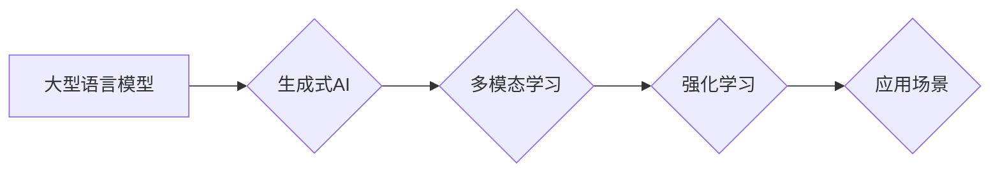

> 大型语言模型、生成式AI、多模态学习、强化学习、应用场景

## 1. 背景介绍

近年来，人工智能领域取得了令人瞩目的进展，其中大型语言模型（LLM）的出现尤为引人注目。这些模型拥有数十亿甚至数千亿的参数，能够理解和生成人类语言，展现出强大的文本生成、翻译、问答和代码编写能力。随着计算能力的提升和训练数据的积累，LLM正在迅速发展，并逐渐渗透到各个领域，改变着我们的生活方式。

然而，LLM的应用远不止于文本处理。随着多模态学习、强化学习等技术的进步，大型模型正在朝着更智能、更通用化的方向发展。未来，大型模型将应用于更广泛的领域，并带来更加深刻的影响。

## 2. 核心概念与联系

**2.1 大型语言模型 (LLM)**

大型语言模型是一种基于深度学习的统计模型，能够理解和生成人类语言。它们通过学习海量文本数据，掌握语言的语法、语义和上下文关系，从而实现各种自然语言处理任务。

**2.2 生成式AI**

生成式AI是指能够生成新内容的AI系统，例如文本、图像、音频、视频等。LLM是生成式AI的重要组成部分，能够生成高质量的文本内容，并被应用于写作、创作、翻译等领域。

**2.3 多模态学习**

多模态学习是指训练模型能够理解和处理多种类型的数据，例如文本、图像、音频等。多模态学习可以帮助模型获得更全面的信息，并实现更复杂的认知任务。

**2.4 强化学习**

强化学习是一种机器学习方法，通过奖励和惩罚机制训练模型，使其在特定环境中做出最优决策。强化学习可以应用于训练大型模型，使其能够更好地理解用户需求，并提供更个性化的服务。

**2.5 应用场景**

大型模型的应用场景非常广泛，包括：

* **自然语言处理:** 文本生成、翻译、问答、摘要、情感分析等。
* **计算机视觉:** 图像识别、分类、分割、生成等。
* **语音识别:** 语音转文本、语音合成等。
* **机器人:** 机器人控制、自然语言交互等。
* **医疗保健:** 疾病诊断、药物研发等。

**Mermaid 流程图**



## 3. 核心算法原理 & 具体操作步骤

**3.1 算法原理概述**

大型语言模型通常基于Transformer架构，该架构能够有效地处理序列数据，并捕捉长距离依赖关系。Transformer的核心组件是注意力机制，它允许模型关注输入序列中与当前位置相关的部分，从而更好地理解上下文信息。

**3.2 算法步骤详解**

1. **数据预处理:** 将文本数据转换为模型可理解的格式，例如词嵌入。
2. **模型训练:** 使用训练数据训练Transformer模型，通过反向传播算法优化模型参数。
3. **模型评估:** 使用测试数据评估模型性能，例如准确率、困惑度等。
4. **模型部署:** 将训练好的模型部署到实际应用场景中。

**3.3 算法优缺点**

**优点:**

* 能够处理长距离依赖关系。
* 训练效率高。
* 表现优异。

**缺点:**

* 参数量大，需要大量的计算资源。
* 训练数据量大，需要大量的数据标注。
* 容易受到训练数据偏差的影响。

**3.4 算法应用领域**

* 文本生成
* 翻译
* 问答
* 代码生成
* 摘要

## 4. 数学模型和公式 & 详细讲解 & 举例说明

**4.1 数学模型构建**

Transformer模型的核心是注意力机制，其数学模型可以表示为：

$$
Attention(Q, K, V) = softmax(\frac{QK^T}{\sqrt{d_k}})V
$$

其中：

* $Q$：查询矩阵
* $K$：键矩阵
* $V$：值矩阵
* $d_k$：键向量的维度
* $softmax$：softmax函数

**4.2 公式推导过程**

注意力机制的目的是计算查询向量与键向量的相似度，并根据相似度加权求和值向量。

1. 计算查询向量与每个键向量的点积，得到一个分数向量。
2. 对分数向量进行归一化，得到一个概率分布。
3. 将概率分布与值向量进行加权求和，得到最终的输出向量。

**4.3 案例分析与讲解**

例如，在机器翻译任务中，查询向量可以表示源语言的词语，键向量可以表示目标语言的词语，值向量可以表示目标语言的词语嵌入。注意力机制可以帮助模型找到源语言词语与目标语言词语之间的对应关系，从而实现更准确的翻译。

## 5. 项目实践：代码实例和详细解释说明

**5.1 开发环境搭建**

* Python 3.7+
* PyTorch 1.7+
* CUDA 10.2+

**5.2 源代码详细实现**

```python
import torch
import torch.nn as nn

class Transformer(nn.Module):
    def __init__(self, vocab_size, embedding_dim, num_heads, num_layers):
        super(Transformer, self).__init__()
        self.embedding = nn.Embedding(vocab_size, embedding_dim)
        self.transformer_layers = nn.ModuleList([
            nn.TransformerEncoderLayer(embedding_dim, num_heads)
            for _ in range(num_layers)
        ])
        self.linear = nn.Linear(embedding_dim, vocab_size)

    def forward(self, x):
        x = self.embedding(x)
        for layer in self.transformer_layers:
            x = layer(x)
        x = self.linear(x)
        return x
```

**5.3 代码解读与分析**

* `__init__` 方法初始化模型参数，包括词嵌入层、Transformer编码器层和线性输出层。
* `forward` 方法定义模型的正向传播过程，将输入序列经过词嵌入层、Transformer编码器层和线性输出层，最终得到输出序列。

**5.4 运行结果展示**

训练好的模型可以用于各种自然语言处理任务，例如文本生成、翻译、问答等。

## 6. 实际应用场景

**6.1 文本生成**

LLM可以用于生成各种类型的文本内容，例如小说、诗歌、新闻报道、代码等。

**6.2 翻译**

LLM可以实现机器翻译，将一种语言的文本翻译成另一种语言。

**6.3 问答**

LLM可以理解用户的问题，并从知识库中找到答案。

**6.4 代码生成**

LLM可以根据用户需求生成代码，例如Python、Java、C++等。

**6.5 未来应用展望**

未来，LLM将应用于更多领域，例如教育、医疗保健、金融等。

## 7. 工具和资源推荐

**7.1 学习资源推荐**

* **书籍:**
    * 《深度学习》
    * 《自然语言处理》
* **在线课程:**
    * Coursera: 自然语言处理
    * edX: 深度学习

**7.2 开发工具推荐**

* **PyTorch:** 深度学习框架
* **TensorFlow:** 深度学习框架
* **Hugging Face:** 预训练模型库

**7.3 相关论文推荐**

* 《Attention Is All You Need》
* 《BERT: Pre-training of Deep Bidirectional Transformers for Language Understanding》
* 《GPT-3: Language Models are Few-Shot Learners》

## 8. 总结：未来发展趋势与挑战

**8.1 研究成果总结**

近年来，LLM取得了显著进展，在文本生成、翻译、问答等任务上表现出色。

**8.2 未来发展趋势**

* **模型规模更大:** 模型参数量将继续增加，从而提升模型能力。
* **多模态学习更深入:** 模型将能够处理多种类型的数据，例如文本、图像、音频等。
* **应用场景更广泛:** LLM将应用于更多领域，例如教育、医疗保健、金融等。

**8.3 面临的挑战**

* **数据安全和隐私:** LLM训练需要大量数据，如何保证数据安全和隐私是一个重要挑战。
* **模型可解释性:** LLM的决策过程难以理解，如何提高模型可解释性是一个重要问题。
* **伦理问题:** LLM可能被用于生成虚假信息或进行恶意攻击，如何解决伦理问题是一个重要挑战。

**8.4 研究展望**

未来，LLM研究将继续深入，探索更强大的模型架构、更有效的训练方法和更广泛的应用场景。


## 9. 附录：常见问题与解答

**9.1 如何训练一个LLM？**

训练一个LLM需要大量的计算资源、数据和时间。通常需要使用分布式训练框架，例如PyTorch Distributed Data Parallel或TensorFlow Distributed Training。

**9.2 如何评估LLM的性能？**

LLM的性能可以评估多种指标，例如准确率、困惑度、BLEU分数等。

**9.3 如何部署LLM？**

LLM可以部署到云端服务器、边缘设备或本地机器。

**9.4 如何解决LLM的伦理问题？**

解决LLM的伦理问题需要多方共同努力，包括研究者、开发者、监管机构和社会公众。

作者：禅与计算机程序设计艺术 / Zen and the Art of Computer Programming


<end_of_turn>