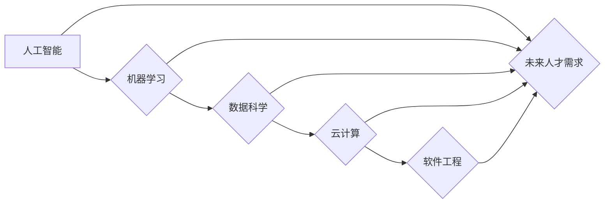

> 人工智能、机器学习、数据科学、云计算、软件工程、未来人才、技能培养

## 1. 背景介绍

当今世界正处于前所未有的科技变革时期。人工智能、机器学习、大数据、云计算等新兴技术蓬勃发展，深刻地改变着人们的生活方式、工作模式和社会结构。这些技术带来的机遇与挑战并存，也对未来人才的需求提出了新的要求。

传统的教育模式和技能体系难以适应快速变化的科技环境，因此，培养适应新时代的人才成为当务之急。我们需要培养具备跨学科知识、创新思维、解决问题能力和适应能力的复合型人才，以应对未来社会的发展需求。

## 2. 核心概念与联系

**2.1 人工智能 (AI)**

人工智能是指模拟人类智能行为的计算机系统。它涵盖了多个领域，包括机器学习、深度学习、自然语言处理、计算机视觉等。

**2.2 机器学习 (ML)**

机器学习是人工智能的一个子领域，它通过算法使计算机能够从数据中学习，并根据学习到的知识进行预测或决策。

**2.3 数据科学 (DS)**

数据科学是利用统计学、计算机科学、领域知识等方法，从海量数据中提取有价值的信息，并将其转化为可操作的洞察力。

**2.4 云计算 (CC)**

云计算是指通过互联网提供计算资源、存储资源和软件服务的模式。它具有弹性、可扩展性和成本效益等特点。

**2.5 软件工程 (SE)**

软件工程是设计、开发、维护和部署软件系统的科学方法。它涉及到多个方面，包括需求分析、软件设计、代码编写、测试和部署等。

**2.6 未来人才需求**

未来社会将需要具备以下技能的人才：

* **技术技能:** 掌握人工智能、机器学习、数据科学、云计算等新兴技术的知识和技能。
* **跨学科思维:** 能够将不同领域的知识和技能整合在一起，解决复杂问题。
* **创新思维:** 能够提出新的想法和解决方案，推动科技进步。
* **解决问题能力:** 能够分析问题、制定方案并有效解决问题。
* **沟通能力:** 能够清晰地表达自己的想法，并与他人有效沟通。
* **团队合作能力:** 能够与他人协作，共同完成目标。

**2.7 技能培养路径**

培养适应新时代的人才需要采取多方面的措施：

* **教育改革:** 更新教育课程体系，加强对新兴技术的教学。
* **职业培训:** 提供针对不同职业的技能培训，帮助人才提升竞争力。
* **企业实践:** 鼓励企业提供实习机会和实践平台，帮助人才积累经验。
* **个人学习:** 鼓励个人主动学习，不断提升自己的技能水平。

**Mermaid 流程图**



## 3. 核心算法原理 & 具体操作步骤

### 3.1  算法原理概述

机器学习算法的核心原理是通过学习数据中的模式和规律，建立数学模型，并利用该模型进行预测或决策。常见的机器学习算法包括：

* **监督学习:** 利用标记数据训练模型，例如分类和回归问题。
* **无监督学习:** 利用未标记数据发现数据中的隐藏结构，例如聚类和降维。
* **强化学习:** 通过试错学习，使智能体在环境中获得最大奖励。

### 3.2  算法步骤详解

**3.2.1 监督学习算法步骤:**

1. **数据收集和预处理:** 收集相关数据，并进行清洗、转换和特征工程等预处理操作。
2. **模型选择:** 根据具体问题选择合适的监督学习算法，例如线性回归、逻辑回归、决策树、支持向量机等。
3. **模型训练:** 利用标记数据训练模型，调整模型参数，使模型能够准确地预测或分类。
4. **模型评估:** 利用测试数据评估模型的性能，例如准确率、召回率、F1-score等。
5. **模型部署:** 将训练好的模型部署到实际应用场景中，用于预测或分类新的数据。

**3.2.2 无监督学习算法步骤:**

1. **数据收集和预处理:** 收集相关数据，并进行清洗、转换等预处理操作。
2. **模型选择:** 根据具体问题选择合适的无监督学习算法，例如k-means聚类、主成分分析等。
3. **模型训练:** 利用未标记数据训练模型，发现数据中的隐藏结构。
4. **结果分析:** 分析模型训练的结果，例如聚类结果、降维后的特征等。

### 3.3  算法优缺点

**3.3.1 监督学习算法:**

* **优点:** 准确率高，能够解决分类和回归问题。
* **缺点:** 需要大量的标记数据，训练时间长，容易过拟合。

**3.3.2 无监督学习算法:**

* **优点:** 不需要标记数据，能够发现数据中的隐藏结构。
* **缺点:** 准确率相对较低，难以评估模型性能。

### 3.4  算法应用领域

机器学习算法广泛应用于各个领域，例如：

* **图像识别:** 人脸识别、物体检测、图像分类等。
* **自然语言处理:** 文本分类、情感分析、机器翻译等。
* **推荐系统:** 商品推荐、音乐推荐、电影推荐等。
* **金融领域:** 欺诈检测、风险评估、信用评分等。
* **医疗领域:** 疾病诊断、药物研发、医疗影像分析等。

## 4. 数学模型和公式 & 详细讲解 & 举例说明

### 4.1  数学模型构建

机器学习算法通常基于数学模型进行构建。常见的数学模型包括线性回归模型、逻辑回归模型、决策树模型等。

**4.1.1 线性回归模型:**

线性回归模型假设数据之间存在线性关系，可以用以下公式表示：

$$y = w_0 + w_1x_1 + w_2x_2 + ... + w_nx_n + \epsilon$$

其中：

* $y$ 是目标变量
* $x_1, x_2, ..., x_n$ 是特征变量
* $w_0, w_1, w_2, ..., w_n$ 是模型参数
* $\epsilon$ 是误差项

**4.1.2 逻辑回归模型:**

逻辑回归模型用于二分类问题，将线性回归模型的输出映射到0到1之间的概率值。

$$P(y=1|x) = \frac{1}{1 + e^{-(w_0 + w_1x_1 + w_2x_2 + ... + w_nx_n)}}$$

### 4.2  公式推导过程

机器学习算法的训练过程通常涉及到参数的优化。常用的优化算法包括梯度下降法、随机梯度下降法等。

**4.2.1 梯度下降法:**

梯度下降法通过迭代更新模型参数，使模型的损失函数最小化。

$$w_{t+1} = w_t - \eta \nabla L(w_t)$$

其中：

* $w_t$ 是模型参数在第t次迭代的值
* $\eta$ 是学习率
* $\nabla L(w_t)$ 是损失函数在第t次迭代时的梯度

### 4.3  案例分析与讲解

**4.3.1 线性回归模型案例:**

假设我们想要预测房屋价格，已知房屋面积和房间数量等特征变量。我们可以使用线性回归模型建立预测模型。

**4.3.2 逻辑回归模型案例:**

假设我们想要预测客户是否会点击广告，已知客户的年龄、性别、兴趣爱好等特征变量。我们可以使用逻辑回归模型建立预测模型。

## 5. 项目实践：代码实例和详细解释说明

### 5.1  开发环境搭建

* **操作系统:** Ubuntu 20.04 LTS
* **编程语言:** Python 3.8
* **机器学习库:** scikit-learn
* **数据处理库:** pandas
* **可视化库:** matplotlib

### 5.2  源代码详细实现

```python
import pandas as pd
from sklearn.linear_model import LinearRegression
from sklearn.model_selection import train_test_split
from sklearn.metrics import mean_squared_error

# 加载数据
data = pd.read_csv('house_price.csv')

# 划分训练集和测试集
X = data[['area', 'rooms']]
y = data['price']
X_train, X_test, y_train, y_test = train_test_split(X, y, test_size=0.2, random_state=42)

# 创建线性回归模型
model = LinearRegression()

# 训练模型
model.fit(X_train, y_train)

# 预测测试集数据
y_pred = model.predict(X_test)

# 计算模型性能
mse = mean_squared_error(y_test, y_pred)
print(f'Mean Squared Error: {mse}')
```

### 5.3  代码解读与分析

* **数据加载:** 使用pandas库加载数据文件。
* **数据划分:** 将数据划分为训练集和测试集，用于模型训练和评估。
* **模型创建:** 使用scikit-learn库创建线性回归模型。
* **模型训练:** 使用训练集数据训练模型，调整模型参数。
* **模型预测:** 使用训练好的模型预测测试集数据。
* **模型评估:** 使用均方误差(MSE)等指标评估模型性能。

### 5.4  运行结果展示

运行代码后，会输出模型的均方误差值，该值越小，模型的预测精度越高。

## 6. 实际应用场景

### 6.1  金融领域

* **欺诈检测:** 利用机器学习算法分析交易数据，识别异常交易行为，防止欺诈行为发生。
* **风险评估:** 利用机器学习算法评估客户的信用风险，为贷款审批提供参考依据。
* **信用评分:** 利用机器学习算法对客户的信用情况进行评分，为贷款利率、信用卡额度等提供参考依据。

### 6.2  医疗领域

* **疾病诊断:** 利用机器学习算法分析患者的症状、检查结果等数据，辅助医生诊断疾病。
* **药物研发:** 利用机器学习算法分析药物的结构和作用机制，加速药物研发过程。
* **医疗影像分析:** 利用机器学习算法分析医学影像数据，辅助医生进行疾病诊断和治疗方案制定。

### 6.3  电商领域

* **商品推荐:** 利用机器学习算法分析用户的购买历史、浏览记录等数据，推荐用户可能感兴趣的商品。
* **价格预测:** 利用机器学习算法分析市场价格趋势，预测商品价格走势。
* **客户画像:** 利用机器学习算法分析客户的购买行为、浏览习惯等数据，构建客户画像，为精准营销提供支持。

### 6.4  未来应用展望

随着人工智能技术的不断发展，机器学习算法将在更多领域得到应用，例如自动驾驶、机器人、个性化教育等。

## 7. 工具和资源推荐

### 7.1  学习资源推荐

* **在线课程:** Coursera、edX、Udacity等平台提供丰富的机器学习课程。
* **书籍:** 《机器学习》 (周志华)、《深入理解机器学习》 (李航) 等书籍。
* **博客:** 机器学习相关的博客网站，例如机器之心、AI科技大本营等。

### 7.2  开发工具推荐

* **Python:** 机器学习开发的常用编程语言。
* **scikit-learn:** 机器学习算法库。
* **TensorFlow:** 深度学习框架。
* **PyTorch:** 深度学习框架。

### 7.3  相关论文推荐

* **《机器学习》 (周志华)**
* **《深入理解