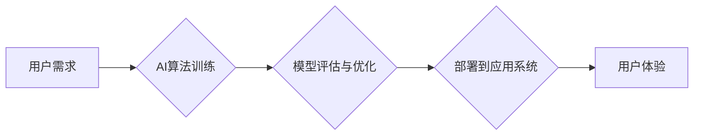

> 苹果, AI应用, 社会价值, 伦理, 责任, 创新, 发展

## 1. 背景介绍

近年来，人工智能（AI）技术飞速发展，已渗透到生活的方方面面。从智能手机的语音助手到自动驾驶汽车，AI正在改变着我们的生活方式。苹果公司作为科技行业的巨头，也积极布局AI领域，并将其应用于其产品和服务中。

2023年，苹果发布了一系列搭载AI技术的应用，引发了广泛的关注和讨论。这些应用涵盖了健康、教育、娱乐等多个领域，展现了AI技术在提升用户体验、解决社会问题方面的巨大潜力。然而，AI技术的应用也引发了一些伦理和社会价值的思考。

## 2. 核心概念与联系

**2.1 AI应用的社会价值**

AI应用的社会价值体现在以下几个方面：

* **提升生活品质:** AI可以帮助人们自动化重复性任务，解放人力，提高生活效率。例如，智能家居可以根据用户的习惯自动调节温度、灯光等，为用户提供更加舒适的生活环境。
* **促进经济发展:** AI可以提高生产效率，降低成本，推动经济增长。例如，在制造业中，AI可以帮助企业优化生产流程，提高产品质量，降低生产成本。
* **解决社会问题:** AI可以帮助人们解决一些社会问题，例如医疗诊断、环境保护等。例如，AI辅助诊断系统可以帮助医生更快、更准确地诊断疾病，提高医疗水平。

**2.2 苹果AI应用的优势**

苹果在AI应用领域拥有以下优势：

* **强大的硬件平台:** 苹果拥有强大的芯片和传感器，为AI应用提供了硬件基础。
* **丰富的软件生态:** 苹果拥有庞大的用户群体和丰富的软件生态，为AI应用提供了广阔的市场空间。
* **注重用户隐私:** 苹果一直以来都非常重视用户隐私，其AI应用也遵循了严格的隐私保护政策。

**2.3  AI应用的伦理挑战**

AI技术的应用也带来了一些伦理挑战，例如：

* **算法偏见:** AI算法可能存在偏见，导致不公平的结果。例如，招聘系统可能因为算法偏见而歧视某些群体。
* **数据隐私:** AI应用需要大量的数据进行训练，这可能会侵犯用户的隐私。
* **责任归属:** 当AI系统出现错误时，责任应该归属谁？

**2.4  AI应用的社会责任**

开发和应用AI技术需要承担社会责任，例如：

* **确保算法公平公正:** 开发者需要确保AI算法不产生偏见，并采取措施 mitigating 算法偏见。
* **保护用户隐私:** 开发者需要采取措施保护用户的隐私，并获得用户的知情同意。
* **透明化AI系统:** 开发者需要对AI系统的决策过程进行透明化，让用户了解AI是如何做出决定的。

**2.5  Mermaid 流程图**



## 3. 核心算法原理 & 具体操作步骤

**3.1  算法原理概述**

苹果在AI应用中广泛使用深度学习算法，例如卷积神经网络（CNN）、循环神经网络（RNN）等。这些算法能够从海量数据中学习特征，并进行预测或分类。

**3.2  算法步骤详解**

深度学习算法的训练过程通常包括以下步骤：

1. **数据预处理:** 将原始数据进行清洗、转换、格式化等操作，使其适合深度学习算法的训练。
2. **模型构建:** 根据具体的应用场景，选择合适的深度学习模型架构，并设置模型参数。
3. **模型训练:** 使用训练数据对模型进行训练，调整模型参数，使其能够准确地预测或分类数据。
4. **模型评估:** 使用测试数据对模型进行评估，评估模型的准确率、召回率等指标。
5. **模型优化:** 根据评估结果，对模型进行优化，例如调整模型参数、增加训练数据等。

**3.3  算法优缺点**

**优点:**

* **高准确率:** 深度学习算法能够从海量数据中学习到复杂的特征，从而实现高准确率的预测或分类。
* **自动化学习:** 深度学习算法能够自动学习特征，无需人工特征工程。
* **泛化能力强:** 深度学习算法能够对新的数据进行泛化，即能够在未见过的数据上进行准确的预测或分类。

**缺点:**

* **数据依赖:** 深度学习算法需要大量的训练数据才能达到较高的准确率。
* **计算资源消耗大:** 深度学习算法的训练过程需要大量的计算资源。
* **可解释性差:** 深度学习算法的决策过程比较复杂，难以解释其决策依据。

**3.4  算法应用领域**

深度学习算法在各个领域都有广泛的应用，例如：

* **计算机视觉:** 图像识别、物体检测、图像分割等。
* **自然语言处理:** 文本分类、机器翻译、语音识别等。
* **医疗诊断:** 疾病诊断、影像分析等。
* **金融预测:** 股票预测、风险评估等。

## 4. 数学模型和公式 & 详细讲解 & 举例说明

**4.1  数学模型构建**

深度学习模型通常由多个神经网络层组成，每一层都包含多个神经元。每个神经元接收来自上一层的输入信号，并对其进行处理，输出到下一层。

**4.2  公式推导过程**

深度学习模型的训练过程基于梯度下降算法。梯度下降算法的目标是找到模型参数，使得模型的预测结果与真实值之间的误差最小化。

**损失函数:** 用于衡量模型预测结果与真实值之间的误差。常见的损失函数包括均方误差（MSE）、交叉熵损失（Cross-Entropy Loss）等。

**梯度:** 损失函数对模型参数的偏导数，表示模型参数变化对损失函数的影响。

**更新规则:** 根据梯度信息，更新模型参数，使得损失函数逐渐减小。

**4.3  案例分析与讲解**

例如，在图像分类任务中，可以使用卷积神经网络（CNN）作为模型。CNN模型的每一层都包含卷积层、池化层和全连接层。卷积层用于提取图像特征，池化层用于降低特征维度，全连接层用于分类。

训练CNN模型时，需要使用大量的图像数据进行训练。训练过程中，模型会不断调整参数，使得其能够准确地识别图像中的物体。

**4.4  数学公式**

* **均方误差 (MSE):**

$$
MSE = \frac{1}{n} \sum_{i=1}^{n} (y_i - \hat{y}_i)^2
$$

其中，$y_i$ 是真实值，$\hat{y}_i$ 是模型预测值，$n$ 是样本数量。

* **交叉熵损失 (Cross-Entropy Loss):**

$$
Cross-Entropy Loss = - \sum_{i=1}^{n} y_i \log(\hat{y}_i)
$$

其中，$y_i$ 是真实值，$\hat{y}_i$ 是模型预测值。

## 5. 项目实践：代码实例和详细解释说明

**5.1  开发环境搭建**

* 操作系统: macOS, Linux, Windows
* Python 版本: 3.6+
* 深度学习框架: TensorFlow, PyTorch
* 其他工具: Jupyter Notebook, Git

**5.2  源代码详细实现**

```python
# 使用 TensorFlow 实现一个简单的图像分类模型

import tensorflow as tf

# 定义模型结构
model = tf.keras.models.Sequential([
    tf.keras.layers.Conv2D(32, (3, 3), activation='relu', input_shape=(28, 28, 1)),
    tf.keras.layers.MaxPooling2D((2, 2)),
    tf.keras.layers.Conv2D(64, (3, 3), activation='relu'),
    tf.keras.layers.MaxPooling2D((2, 2)),
    tf.keras.layers.Flatten(),
    tf.keras.layers.Dense(10, activation='softmax')
])

# 编译模型
model.compile(optimizer='adam',
              loss='sparse_categorical_crossentropy',
              metrics=['accuracy'])

# 训练模型
model.fit(x_train, y_train, epochs=5)

# 评估模型
loss, accuracy = model.evaluate(x_test, y_test)
print('Test loss:', loss)
print('Test accuracy:', accuracy)
```

**5.3  代码解读与分析**

这段代码定义了一个简单的卷积神经网络模型，用于图像分类任务。

* `tf.keras.models.Sequential` 创建了一个顺序模型，即层级结构。
* `tf.keras.layers.Conv2D` 定义了一个卷积层，用于提取图像特征。
* `tf.keras.layers.MaxPooling2D` 定义了一个池化层，用于降低特征维度。
* `tf.keras.layers.Flatten` 将多维特征转换为一维向量。
* `tf.keras.layers.Dense` 定义了一个全连接层，用于分类。
* `model.compile` 编译模型，指定优化器、损失函数和评价指标。
* `model.fit` 训练模型，使用训练数据进行训练。
* `model.evaluate` 评估模型，使用测试数据评估模型的性能。

**5.4  运行结果展示**

训练完成后，可以打印出模型的测试损失和测试准确率。

## 6. 实际应用场景

**6.1  医疗诊断**

AI可以辅助医生进行疾病诊断，例如：

* **影像分析:** AI可以分析X光片、CT扫描等影像数据，识别肿瘤、骨折等异常情况。
* **病历分析:** AI可以分析病历数据，识别患者的症状、病史等信息，辅助医生进行诊断。

**6.2  教育领域**

AI可以个性化学习体验，例如：

* **智能辅导:** AI可以根据学生的学习进度和能力，提供个性化的辅导和练习。
* **自动批改:** AI可以自动批改学生的作业，节省教师的时间和精力。

**6.3  金融服务**

AI可以提高金融服务的效率和安全性，例如：

* **欺诈检测:** AI可以分析交易数据，识别欺诈行为。
* **风险评估:** AI可以评估客户的信用风险，帮助银行进行贷款审批。

**6.4  未来应用展望**

随着AI技术的不断发展，其应用场景将会更加广泛，例如：

* **自动驾驶:** AI可以帮助汽车实现自动驾驶功能。
* **机器人:** AI可以赋予机器人更强的智能和自主性。
* **个性化推荐:** AI可以根据用户的喜好，提供个性化的商品推荐。

## 7. 工具和资源推荐

**7.1  学习资源推荐**

* **在线课程:** Coursera, edX, Udacity
* **书籍:** 深度学习，机器学习
* **博客:** TensorFlow Blog, PyTorch Blog

**7.2  开发工具推荐**

* **深度学习框架:** TensorFlow, PyTorch
* **数据处理工具:** Pandas, NumPy
* **可视化工具:** Matplotlib, Seaborn

**7.3  相关论文推荐**

* **ImageNet Classification with Deep Convolutional Neural Networks**
* **Attention Is All You Need**
* **BERT: Pre-training of Deep Bidirectional Transformers for Language Understanding**

## 8. 总结：未来发展趋势与挑战

**8.1  研究成果总结**

近年来，AI技术取得了长足的进步，在各个领域都取得了显著的应用成果。

**8.2  未来发展趋势**

* **模型规模和能力的提升:** 未来，AI模型的规模和能力将会进一步提升，能够处理更复杂的任务。
* **边缘计算的普及:** AI计算将更加靠近数据源，实现更实时、高效的处理。
* **跨模态学习的兴起:** AI模型将能够处理多种数据类型，例如文本、图像、音频等。

