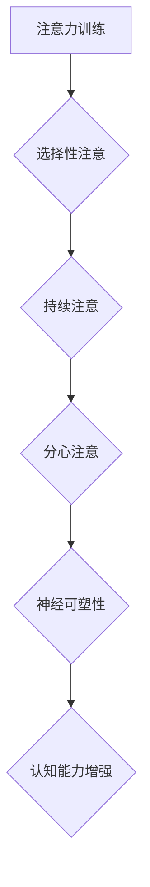

> 注意力训练，大脑增强，认知能力，神经可塑性，专注力，冥想，神经科学，机器学习

## 1. 背景介绍

在当今信息爆炸的时代，注意力已成为至关重要的认知能力。然而，现代生活节奏快，信息过载，人们的注意力持续受到干扰，导致专注力下降，认知能力受损。这不仅影响了学习、工作效率，也可能导致心理健康问题。

近年来，神经科学研究表明，大脑具有强大的神经可塑性，即大脑结构和功能可以随着经验和训练而改变。注意力训练正是利用这一特性，通过特定的练习和训练，增强大脑的注意力网络，提高专注力，从而提升认知能力。

## 2. 核心概念与联系

**2.1 注意力机制**

注意力机制是人类认知的核心，它指我们选择性地关注特定信息，而忽略其他无关信息的能力。注意力机制可以分为以下几个方面：

* **选择性注意:**  从多个刺激中选择性地关注某一个刺激。
* **持续注意:**  长时间地集中注意力在某一个刺激上。
* **分心注意:**  在多个刺激之间切换注意力。

**2.2 神经可塑性**

神经可塑性是指大脑神经元之间的连接强度和结构可以随着经验和学习而改变。当我们进行注意力训练时，大脑会形成新的神经连接，加强现有连接，从而提高注意力网络的效率。

**2.3 训练与增强**

注意力训练通过特定的练习和训练，刺激大脑神经元活动，促进神经可塑性，从而增强注意力网络的功能。

**2.4 流程图**



## 3. 核心算法原理 & 具体操作步骤

**3.1 算法原理概述**

注意力训练算法通常基于以下原理：

* **重复性训练:** 通过重复进行注意力训练，可以强化大脑神经元之间的连接，提高注意力网络的效率。
* **渐进式难度:** 从简单的训练开始，逐渐增加训练难度，挑战大脑，促进神经可塑性。
* **反馈机制:** 通过反馈机制，及时调整训练难度，确保训练效果。

**3.2 算法步骤详解**

1. **选择训练任务:** 根据个人的注意力需求，选择合适的训练任务，例如：专注力测试、冥想练习、视觉注意力训练等。
2. **设定训练目标:** 明确训练目标，例如：提高持续注意时间、增强选择性注意能力等。
3. **制定训练计划:** 根据训练目标和个人情况，制定合理的训练计划，包括训练时间、训练频率、训练难度等。
4. **进行训练:** 按照训练计划进行训练，并记录训练结果。
5. **分析结果:** 分析训练结果，调整训练计划，确保训练效果。

**3.3 算法优缺点**

* **优点:** 
    * 针对性强，可以针对不同个人的注意力需求进行训练。
    * 安全有效，无副作用。
    * 成本低廉，可以利用现有的资源进行训练。
* **缺点:** 
    * 需要坚持训练，才能看到效果。
    * 训练效果因人而异。

**3.4 算法应用领域**

注意力训练算法广泛应用于以下领域：

* **教育:** 提高学生的注意力和学习效率。
* **医疗:** 治疗注意力缺陷多动障碍 (ADHD) 等注意力相关疾病。
* **职场:** 提升员工的工作效率和专注力。
* **个人成长:** 增强个人专注力，提高生活质量。

## 4. 数学模型和公式 & 详细讲解 & 举例说明

**4.1 数学模型构建**

注意力机制可以用数学模型来表示，例如：

* **Softmax 函数:** 用于计算注意力权重，将多个输入特征映射到一个概率分布。

$$
\text{Attention}(Q, K, V) = \text{softmax}\left(\frac{Q K^T}{\sqrt{d_k}}\right) V
$$

其中：

* $Q$：查询向量
* $K$：键向量
* $V$：值向量
* $d_k$：键向量的维度

* **Transformer 模型:**  一种基于注意力机制的深度学习模型，广泛应用于自然语言处理等领域。

**4.2 公式推导过程**

Softmax 函数的推导过程如下：

1. 计算每个输入特征与查询向量的点积。
2. 将点积结果除以 $\sqrt{d_k}$，以规范化结果。
3. 对点积结果进行 softmax 操作，得到每个输入特征的注意力权重。

**4.3 案例分析与讲解**

例如，在机器翻译任务中，Transformer 模型可以利用注意力机制，将源语言句子中的每个词与目标语言句子的每个词进行匹配，从而更好地理解语义关系，提高翻译质量。

## 5. 项目实践：代码实例和详细解释说明

**5.1 开发环境搭建**

* 操作系统: Ubuntu 20.04
* Python 版本: 3.8
* 必要的库: TensorFlow, Keras, NumPy

**5.2 源代码详细实现**

```python
import tensorflow as tf
from tensorflow.keras.models import Sequential
from tensorflow.keras.layers import Embedding, LSTM, Dense

# 定义模型
model = Sequential()
model.add(Embedding(input_dim=vocab_size, output_dim=embedding_dim))
model.add(LSTM(units=hidden_units))
model.add(Dense(units=output_dim, activation='softmax'))

# 编译模型
model.compile(optimizer='adam', loss='categorical_crossentropy', metrics=['accuracy'])

# 训练模型
model.fit(x_train, y_train, epochs=epochs, batch_size=batch_size)

# 评估模型
loss, accuracy = model.evaluate(x_test, y_test)
print('Loss:', loss)
print('Accuracy:', accuracy)
```

**5.3 代码解读与分析**

* Embedding 层将单词映射到低维向量空间。
* LSTM 层用于捕捉文本序列中的长距离依赖关系。
* Dense 层用于输出预测结果。

**5.4 运行结果展示**

训练完成后，可以评估模型的性能，例如准确率、损失等。

## 6. 实际应用场景

**6.1 教育领域**

* **个性化学习:** 根据学生的注意力特点，定制个性化的学习计划和内容。
* **课堂互动:** 利用注意力训练游戏，提高学生的课堂参与度和学习兴趣。

**6.2 医疗领域**

* **ADHD 治疗:** 通过注意力训练，帮助患者提高注意力和控制力。
* **认知功能评估:** 利用注意力训练任务，评估患者的认知功能水平。

**6.3 职场领域**

* **员工培训:** 利用注意力训练，提高员工的学习效率和工作专注力。
* **远程办公:** 利用注意力训练，帮助员工克服远程办公带来的注意力分散问题。

**6.4 未来应用展望**

随着人工智能技术的不断发展，注意力训练技术将有更广泛的应用场景，例如：

* **智能家居:** 利用注意力训练，让智能家居设备更了解用户的需求，提供更个性化的服务。
* **自动驾驶:** 利用注意力训练，提高自动驾驶系统的感知能力和决策能力。

## 7. 工具和资源推荐

**7.1 学习资源推荐**

* **书籍:**
    * 《注意力训练与大脑增强练习》
    * 《专注力：如何提升注意力，克服拖延，实现目标》
* **在线课程:**
    * Coursera: 神经科学与认知科学
    * edX: 人工智能与机器学习

**7.2 开发工具推荐**

* **TensorFlow:** 开源深度学习框架
* **Keras:** 高级深度学习API
* **PyTorch:** 开源深度学习框架

**7.3 相关论文推荐**

* 《Attention Is All You Need》
* 《BERT: Pre-training of Deep Bidirectional Transformers for Language Understanding》

## 8. 总结：未来发展趋势与挑战

**8.1 研究成果总结**

注意力训练技术取得了显著的成果，证明了大脑的可塑性，并为提升认知能力提供了新的途径。

**8.2 未来发展趋势**

* **个性化训练:** 根据个人的注意力特点，定制个性化的训练计划。
* **多模态训练:** 将注意力训练扩展到多模态数据，例如文本、图像、音频等。
* **脑机接口:** 利用脑机接口技术，实现对大脑活动的实时监测和干预，进一步提升注意力训练效果。

**8.3 面临的挑战**

* **训练效果评估:** 目前缺乏统一的注意力训练效果评估标准。
* **长期效果:** 需要进一步研究注意力训练的长期效果。
* **伦理问题:** 需要关注注意力训练技术的伦理问题，例如数据隐私、信息安全等。

**8.4 研究展望**

未来，注意力训练技术将继续发展，为人类认知能力的提升做出更大的贡献。


## 9. 附录：常见问题与解答

**9.1 如何进行注意力训练？**

注意力训练可以通过多种方式进行，例如：冥想练习、专注力测试、视觉注意力训练等。

**9.2 注意力训练的效果多久可见？**

注意力训练的效果因人而异，一般需要坚持一段时间才能看到明显的效果。

**9.3 注意力训练有哪些风险？**

注意力训练一般来说是安全的，但如果过度训练，可能会导致疲劳、头痛等问题。

**9.4 注意力训练适合哪些人？**

注意力训练适合所有需要提高注意力的人，例如学生、职场人士、老年人等。


作者：禅与计算机程序设计艺术 / Zen and the Art of Computer Programming 
<end_of_turn>