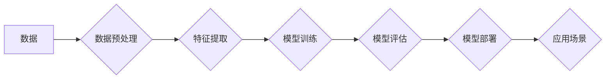

> 深度学习、人工智能、算法设计、机器学习、数据分析、创新思维、洞察力

## 1. 背景介绍

在当今数据爆炸的时代，人工智能（AI）正以惊人的速度发展，深刻地改变着我们的生活和工作方式。从自动驾驶汽车到智能语音助手，从医疗诊断到金融预测，AI技术的应用领域日益广泛。然而，在AI的蓬勃发展背后，我们不禁要思考：如何才能真正理解和驾驭AI的力量？如何才能将AI技术转化为真正的创新？

我认为，洞察力是关键。洞察力是指能够从纷繁复杂的现象中发现隐藏的规律和本质，并从中获得新的见解和启发的能力。在AI领域，洞察力不仅体现在算法的设计和优化上，更体现在对数据、问题和应用场景的深刻理解上。

## 2. 核心概念与联系

**2.1 深度学习与人工智能**

深度学习是人工智能领域的一个重要分支，它借鉴了生物神经网络的结构和功能，通过多层神经网络来学习和处理数据。深度学习算法能够自动从海量数据中提取特征，并进行复杂的模式识别和预测。

**2.2 算法设计与洞察力**

算法设计是深度学习的核心，它决定了模型的性能和效率。优秀的算法设计需要对数据、问题和模型的深刻理解，以及对数学、统计和计算机科学的扎实基础。

**2.3 数据驱动与洞察力**

数据是深度学习的燃料，高质量的数据能够训练出更准确、更强大的模型。然而，数据本身并不包含洞察力，我们需要通过数据分析、挖掘和可视化等手段，才能从中发现隐藏的规律和趋势。

**2.4 应用场景与洞察力**

深度学习的应用场景非常广泛，从图像识别到自然语言处理，从医疗诊断到金融预测，都有着巨大的潜力。在选择应用场景时，我们需要对目标领域有深入的了解，并能够将深度学习技术与实际问题相结合。

**Mermaid 流程图**

## 3. 核心算法原理 & 具体操作步骤

### 3.1 算法原理概述

卷积神经网络（CNN）是一种专门用于处理图像数据的深度学习算法。它借鉴了生物视觉系统的神经元结构和功能，通过卷积、池化和全连接层来提取图像特征，并进行分类或识别。

### 3.2 算法步骤详解

1. **数据预处理:** 将图像数据转换为适合CNN输入的格式，例如调整尺寸、归一化像素值等。
2. **卷积层:** 使用卷积核对图像进行卷积运算，提取图像局部特征。
3. **池化层:** 对卷积层的输出进行池化操作，例如最大池化或平均池化，降低数据维度并提高鲁棒性。
4. **全连接层:** 将池化层的输出连接到全连接层，进行特征融合和分类。
5. **激活函数:** 在每个神经元中使用激活函数，例如ReLU或Sigmoid，引入非线性，提高模型表达能力。
6. **损失函数:** 使用损失函数衡量模型预测结果与真实标签之间的差异。
7. **优化算法:** 使用优化算法，例如梯度下降，更新模型参数，降低损失函数值。

### 3.3 算法优缺点

**优点:**

* 能够自动提取图像特征，无需人工设计特征。
* 对图像变形、旋转等变化具有鲁棒性。
* 在图像分类、识别、检测等任务中表现出色。

**缺点:**

* 训练数据量大，计算资源消耗高。
* 对小样本数据效果较差。
* 模型解释性较差，难以理解模型的决策过程。

### 3.4 算法应用领域

* **图像识别:** 人脸识别、物体检测、场景理解等。
* **图像分类:** 图像标签识别、图片检索等。
* **图像分割:** 图像区域划分、医学图像分析等。
* **视频分析:** 行人跟踪、动作识别等。

## 4. 数学模型和公式 & 详细讲解 & 举例说明

### 4.1 数学模型构建

CNN的数学模型主要包括卷积层、池化层和全连接层。

**4.1.1 卷积层:**

卷积层使用卷积核对图像进行卷积运算，卷积核是一个小的矩阵，包含可学习的参数。卷积运算可以表示为：

$$
y_{i,j} = \sum_{m=0}^{M-1} \sum_{n=0}^{N-1} x_{i+m,j+n} * w_{m,n}
$$

其中：

* $y_{i,j}$ 是卷积层的输出值。
* $x_{i+m,j+n}$ 是输入图像的像素值。
* $w_{m,n}$ 是卷积核的参数。
* $M$ 和 $N$ 是卷积核的大小。

**4.1.2 池化层:**

池化层对卷积层的输出进行池化操作，例如最大池化或平均池化，可以降低数据维度并提高鲁棒性。

**4.1.3 全连接层:**

全连接层将池化层的输出连接到所有神经元，进行特征融合和分类。

### 4.2 公式推导过程

卷积层的输出值可以通过卷积运算公式推导得到。池化层的输出值可以通过最大池化或平均池化公式计算得到。全连接层的输出值可以通过神经网络激活函数和权重矩阵相乘得到。

### 4.3 案例分析与讲解

可以以图像分类为例，分析CNN模型的数学模型和公式是如何应用于实际场景的。

## 5. 项目实践：代码实例和详细解释说明

### 5.1 开发环境搭建

使用Python语言和深度学习框架TensorFlow或PyTorch搭建开发环境。

### 5.2 源代码详细实现

使用TensorFlow或PyTorch框架实现CNN模型，包括卷积层、池化层、全连接层等。

### 5.3 代码解读与分析

解释代码中的关键部分，例如卷积核大小、池化窗口大小、激活函数等参数的选择。

### 5.4 运行结果展示

使用训练好的CNN模型对图像进行分类，并展示分类结果。

## 6. 实际应用场景

### 6.1 图像识别

CNN在图像识别领域有着广泛的应用，例如人脸识别、物体检测、场景理解等。

### 6.2 图像分类

CNN可以用于图像分类，例如图片标签识别、图片检索等。

### 6.3 图像分割

CNN可以用于图像分割，例如图像区域划分、医学图像分析等。

### 6.4 未来应用展望

CNN技术还在不断发展，未来将有更多新的应用场景出现。

## 7. 工具和资源推荐

### 7.1 学习资源推荐

* 深度学习书籍：
    * 《深度学习》
    * 《动手学深度学习》
* 在线课程：
    * Coursera深度学习课程
    * Udacity深度学习课程

### 7.2 开发工具推荐

* 深度学习框架：
    * TensorFlow
    * PyTorch
* 图像处理库：
    * OpenCV
    * Pillow

### 7.3 相关论文推荐

* 《ImageNet Classification with Deep Convolutional Neural Networks》
* 《AlexNet》

## 8. 总结：未来发展趋势与挑战

### 8.1 研究成果总结

CNN技术取得了显著的成果，在图像识别、分类、分割等领域取得了突破性的进展。

### 8.2 未来发展趋势

* 模型效率提升：研究更轻量级、更高效的CNN模型。
* 迁移学习：利用预训练模型进行迁移学习，降低训练成本。
* 增强学习：结合强化学习，使CNN模型能够进行更复杂的决策。

### 8.3 面临的挑战

* 数据标注问题：高质量的标注数据是训练CNN模型的关键，但标注成本高昂。
* 模型解释性问题：CNN模型的决策过程难以解释，缺乏透明度。
* 伦理问题：CNN技术可能带来一些伦理问题，例如隐私泄露、算法偏见等。

### 8.4 研究展望

未来将继续研究CNN技术的改进和应用，探索其在更多领域中的潜力。

## 9. 附录：常见问题与解答

* **CNN模型为什么比传统方法效果更好？**

CNN模型能够自动提取图像特征，无需人工设计特征，这使得其在图像识别等任务中表现优于传统方法。

* **如何选择合适的CNN模型架构？**

选择合适的CNN模型架构需要根据具体的应用场景和数据特点进行选择。

* **如何训练CNN模型？**

训练CNN模型需要使用深度学习框架，例如TensorFlow或PyTorch，并使用大量的标注数据进行训练。

作者：禅与计算机程序设计艺术 / Zen and the Art of Computer Programming 
<end_of_turn>