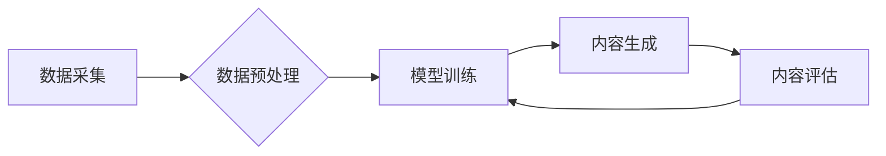

> 生成式AI, AIGC, 自然语言处理, 深度学习, Transformer, 商业模式创新, 知识图谱, 跨界融合

## 1. 背景介绍

人工智能（AI）技术近年来发展迅速，特别是生成式人工智能（AIGC）的兴起，正在深刻地改变着我们生活和工作的方式。AIGC是指能够根据输入的文本、图像、音频等数据生成新内容的AI模型，例如文本生成、图像生成、音频合成等。与传统的AI技术相比，AIGC更加注重创造性和想象力，能够生成具有原创性和艺术性的内容。

AIGC技术的应用场景广泛，涵盖了文娱、教育、营销、设计等多个领域。例如，在文娱领域，AIGC可以用于创作小说、剧本、歌曲等；在教育领域，AIGC可以用于生成个性化学习内容、自动批改作业等；在营销领域，AIGC可以用于生成广告文案、社交媒体内容等。

随着AIGC技术的不断发展和成熟，其商业价值也日益凸显。AIGC为企业提供了全新的商业模式创新机会，能够帮助企业提高效率、降低成本、创造新的价值。

## 2. 核心概念与联系

**2.1 生成式AI的概念**

生成式AI是指能够根据输入的数据生成新数据的AI模型。这些模型学习了输入数据的模式和结构，并能够根据这些知识生成新的、类似于训练数据的内容。

**2.2 AIGC的架构**

AIGC的架构通常包括以下几个部分：

* **数据采集和预处理:** 收集和清洗训练数据，并将其转换为模型可以理解的格式。
* **模型训练:** 使用深度学习算法训练生成式AI模型，例如Transformer模型。
* **内容生成:** 将输入数据输入到训练好的模型中，模型会根据输入数据生成新的内容。
* **内容评估和反馈:** 对生成的內容进行评估，并根据评估结果进行模型调整和优化。

**2.3 AIGC与其他AI技术的联系**

AIGC与其他AI技术密切相关，例如：

* **自然语言处理（NLP）:** AIGC在文本生成领域广泛应用NLP技术，例如词嵌入、句法分析、语义理解等。
* **计算机视觉（CV）:** AIGC在图像生成领域广泛应用CV技术，例如图像识别、图像分割、图像生成等。
* **语音识别和合成:** AIGC在音频生成领域应用语音识别和合成技术，例如语音助手、语音合成等。

**2.4 Mermaid 流程图**



## 3. 核心算法原理 & 具体操作步骤

**3.1 算法原理概述**

生成式AI的核心算法原理是深度学习，特别是Transformer模型。Transformer模型是一种基于注意力机制的深度神经网络，能够有效地捕捉文本序列中的长距离依赖关系。

**3.2 算法步骤详解**

1. **数据预处理:** 将文本数据进行清洗、分词、词嵌入等预处理操作，使其能够被模型理解。
2. **模型训练:** 使用深度学习算法训练Transformer模型，例如BERT、GPT、T5等。训练过程包括输入数据、计算损失函数、更新模型参数等步骤。
3. **内容生成:** 将输入文本数据输入到训练好的模型中，模型会根据输入数据生成新的文本内容。

**3.3 算法优缺点**

**优点:**

* 能够生成高质量、原创性的文本内容。
* 能够处理长文本序列，捕捉长距离依赖关系。
* 能够进行多种类型的文本生成任务，例如文本摘要、机器翻译、对话系统等。

**缺点:**

* 训练成本高，需要大量的计算资源和训练数据。
* 模型容易受到训练数据的影响，可能生成带有偏见或错误的信息。
* 缺乏对生成内容的理解和解释能力。

**3.4 算法应用领域**

* 文本生成：小说、剧本、诗歌、新闻报道等。
* 机器翻译：将一种语言翻译成另一种语言。
* 对话系统：与用户进行自然语言对话。
* 代码生成：自动生成代码。
* 内容创作辅助工具：帮助作家、设计师、营销人员等进行内容创作。

## 4. 数学模型和公式 & 详细讲解 & 举例说明

**4.1 数学模型构建**

生成式AI模型通常使用神经网络作为数学模型，其中Transformer模型是一种常用的架构。Transformer模型的核心是注意力机制，它能够有效地捕捉文本序列中的长距离依赖关系。

**4.2 公式推导过程**

Transformer模型的注意力机制使用以下公式计算注意力权重：

$$
\text{Attention}(Q, K, V) = \text{softmax}\left(\frac{Q K^T}{\sqrt{d_k}}\right) V
$$

其中：

* $Q$：查询矩阵
* $K$：键矩阵
* $V$：值矩阵
* $d_k$：键向量的维度
* $\text{softmax}$：softmax函数

**4.3 案例分析与讲解**

例如，在机器翻译任务中，输入文本序列为源语言句子，输出文本序列为目标语言句子。Transformer模型会使用注意力机制来计算每个源语言词与每个目标语言词之间的相关性，从而生成准确的翻译结果。

## 5. 项目实践：代码实例和详细解释说明

**5.1 开发环境搭建**

* Python 3.7+
* TensorFlow 或 PyTorch
* CUDA 和 cuDNN

**5.2 源代码详细实现**

```python
import tensorflow as tf

# 定义Transformer模型
class Transformer(tf.keras.Model):
    def __init__(self, vocab_size, embedding_dim, num_heads, num_layers):
        super(Transformer, self).__init__()
        self.embedding = tf.keras.layers.Embedding(vocab_size, embedding_dim)
        self.transformer_layers = tf.keras.layers.StackedRNNCells([
            tf.keras.layers.MultiHeadAttention(num_heads=num_heads, key_dim=embedding_dim)
            for _ in range(num_layers)
        ])
        self.fc = tf.keras.layers.Dense(vocab_size)

    def call(self, inputs):
        x = self.embedding(inputs)
        x = self.transformer_layers(x)
        x = self.fc(x)
        return x

# 实例化模型
model = Transformer(vocab_size=10000, embedding_dim=512, num_heads=8, num_layers=6)

# 训练模型
model.compile(optimizer='adam', loss='sparse_categorical_crossentropy', metrics=['accuracy'])
model.fit(train_data, train_labels, epochs=10)

```

**5.3 代码解读与分析**

* 代码定义了一个Transformer模型，包含嵌入层、多头注意力层和全连接层。
* 嵌入层将单词转换为向量表示。
* 多头注意力层捕捉文本序列中的长距离依赖关系。
* 全连接层将注意力输出转换为预测概率。
* 代码使用Adam优化器和交叉熵损失函数训练模型。

**5.4 运行结果展示**

训练完成后，模型可以用于生成新的文本内容。例如，可以输入一个句子作为输入，模型会根据输入句子生成一个新的句子。

## 6. 实际应用场景

**6.1 文本生成**

* **小说、剧本、诗歌创作:** AIGC可以帮助作家克服创作瓶颈，生成新的故事创意和情节。
* **新闻报道、文章写作:** AIGC可以自动生成新闻报道、科技文章等，提高新闻生产效率。
* **广告文案、营销内容:** AIGC可以根据目标受众生成个性化的广告文案和营销内容，提高广告转化率。

**6.2 机器翻译**

* **跨语言沟通:** AIGC可以实现实时跨语言翻译，打破语言障碍，促进国际交流。
* **文档翻译:** AIGC可以自动翻译大量文档，节省人力成本。

**6.3 对话系统**

* **智能客服:** AIGC可以构建智能客服系统，自动回答用户常见问题，提高客户服务效率。
* **聊天机器人:** AIGC可以开发更自然、更智能的聊天机器人，提供更人性化的用户体验。

**6.4 其他应用场景**

* **代码生成:** AIGC可以自动生成代码，提高开发效率。
* **音乐创作:** AIGC可以生成新的音乐旋律和节奏。
* **图像生成:** AIGC可以根据文本描述生成图像。

**6.5 未来应用展望**

AIGC技术的未来应用前景广阔，例如：

* **个性化教育:** AIGC可以根据学生的学习进度和特点生成个性化的学习内容。
* **医疗诊断:** AIGC可以辅助医生进行疾病诊断，提高诊断准确率。
* **科学研究:** AIGC可以帮助科学家进行数据分析和模型构建，加速科学研究进程。

## 7. 工具和资源推荐

**7.1 学习资源推荐**

* **书籍:**
    * 《深度学习》
    * 《Transformer模型详解》
* **在线课程:**
    * Coursera: 深度学习
    * Udacity: 自然语言处理
* **博客和论坛:**
    * TensorFlow博客
    * PyTorch博客
    * Hugging Face社区

**7.2 开发工具推荐**

* **TensorFlow:** 开源深度学习框架
* **PyTorch:** 开源深度学习框架
* **Hugging Face Transformers:** 预训练Transformer模型库

**7.3 相关论文推荐**

* 《Attention Is All You Need》
* 《BERT: Pre-training of Deep Bidirectional Transformers for Language Understanding》
* 《GPT-3: Language Models are Few-Shot Learners》

## 8. 总结：未来发展趋势与挑战

**8.1 研究成果总结**

近年来，生成式AI技术取得了显著进展，例如Transformer模型的提出和预训练模型的开发，使得AIGC能够生成更高质量、更具创造性的内容。

**8.2 未来发展趋势**

* **模型规模和能力的提升:** 未来，AIGC模型的规模和能力将会进一步提升，能够处理更复杂的任务，生成更精细的内容。
* **多模态生成:** AIGC将不仅仅局限于文本生成，还会扩展到图像、音频、视频等多模态内容的生成。
* **个性化定制:** AIGC将更加注重个性化定制，能够根据用户的需求生成个性化的内容。

**8.3 面临的挑战**

* **数据安全和隐私保护:** AIGC模型的训练需要大量数据，如何保证数据安全和隐私保护是一个重要挑战。
* **内容质量和可控性:** AIGC生成的內容可能存在质量问题，例如偏见、错误信息等，如何提高内容质量和可控性是一个关键问题。
* **伦理和社会影响:** AIGC技术的应用可能会带来一些伦理和社会问题，例如就业替代、信息操纵等，需要进行深入的探讨和研究。

**8.4 研究展望**

未来，AIGC研究将继续朝着更智能、更安全、更可控的方向发展，为人类社会带来更多价值。


## 9. 附录：常见问题与解答

**9.1 如何训练一个AIGC模型？**

训练AIGC模型需要准备大量的训练数据、选择合适的模型架构、使用深度学习框架进行训练等步骤。

**9.2 如何评估AIGC模型的性能？**

AIGC模型的性能可以根据不同的任务进行评估，例如文本生成任务可以使用BLEU、ROUGE等指标进行评估。

**9.3 AIGC技术有哪些伦理和社会影响？**

AIGC技术的应用可能会带来一些伦理和社会问题，例如就业替代、信息操纵等，需要进行深入的探讨和研究。


作者：禅与计算机程序设计艺术 / Zen and the Art of Computer Programming 
<end_of_turn>