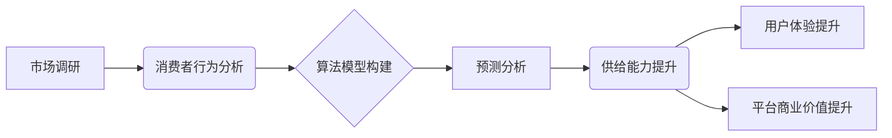

> 电商平台, 供给能力, 市场调研, 消费者行为, 数据分析, 算法模型, 预测分析, 优化策略

## 1. 背景介绍

在当今数字化时代，电商平台作为商品交易的重要载体，其供给能力直接影响着平台的运营效率和用户体验。供给能力的提升不仅能满足用户日益增长的需求，还能促进平台的商业发展。然而，电商平台的供给能力提升是一个复杂而多维度的挑战，需要综合考虑市场调研、消费者行为分析、算法模型构建等多个方面。

随着电商平台的快速发展，用户需求日益多样化，商品种类不断丰富，平台供给能力面临着前所未有的压力。传统的供给模式难以满足用户个性化需求，平台需要通过数据驱动和智能化手段来提升供给能力。

## 2. 核心概念与联系

**2.1  供给能力的概念**

供给能力是指电商平台能够提供商品和服务的总量和质量，包括商品种类、库存水平、配送速度、售后服务等多个方面。

**2.2  市场调研与消费者行为分析**

市场调研是指通过收集和分析市场信息，了解用户需求、竞争对手情况、市场趋势等，为平台决策提供依据。消费者行为分析是指通过分析用户购买行为、浏览习惯、评价反馈等数据，洞察用户需求和偏好，为平台优化商品推荐、营销策略等提供支持。

**2.3  算法模型构建与预测分析**

算法模型构建是指利用机器学习、深度学习等算法技术，从海量数据中提取特征，建立预测模型，预测用户需求、商品销量、库存变化等。预测分析可以帮助平台提前预判市场变化，优化库存管理、商品定价、营销推广等，提升供给能力。

**2.4  核心概念联系**

市场调研和消费者行为分析为算法模型构建提供数据支撑，算法模型构建可以帮助平台预测和优化供给能力，最终提升用户体验和平台商业价值。



## 3. 核心算法原理 & 具体操作步骤

### 3.1  算法原理概述

在电商平台供给能力提升中，常用的算法模型包括：

* **推荐算法:** 根据用户的历史购买行为、浏览记录、兴趣偏好等信息，推荐用户可能感兴趣的商品。
* **预测算法:** 利用历史数据预测未来商品销量、库存变化、用户需求等，帮助平台优化库存管理、商品定价、营销推广等。
* **分类算法:** 将商品进行分类和标签化，方便用户搜索和浏览。

### 3.2  算法步骤详解

以推荐算法为例，其具体操作步骤如下：

1. **数据收集:** 收集用户购买行为、浏览记录、评价反馈等数据。
2. **数据预处理:** 对收集到的数据进行清洗、转换、编码等预处理操作，使其符合算法模型的输入要求。
3. **特征提取:** 从用户行为数据中提取特征，例如用户购买的商品类别、价格范围、购买频率等。
4. **模型训练:** 利用机器学习算法，对训练数据进行模型训练，学习用户行为模式和商品特征之间的关系。
5. **模型评估:** 使用测试数据对模型进行评估，评估模型的准确率、召回率等指标。
6. **模型部署:** 将训练好的模型部署到线上环境，为用户提供个性化商品推荐。

### 3.3  算法优缺点

**优点:**

* **个性化推荐:** 可以根据用户的兴趣偏好提供个性化商品推荐，提升用户体验。
* **提高转化率:** 通过精准推荐，提高用户购买意愿，提升平台转化率。
* **数据驱动:** 基于数据分析，优化商品推荐策略，提升推荐效果。

**缺点:**

* **数据依赖:** 推荐算法依赖于海量用户行为数据，数据质量直接影响推荐效果。
* **冷启动问题:** 新用户或新商品缺乏历史数据，难以进行精准推荐。
* **算法偏差:** 算法模型可能存在偏差，导致推荐结果不准确或不公平。

### 3.4  算法应用领域

推荐算法广泛应用于电商平台、社交媒体、内容平台等领域，例如：

* **商品推荐:** 根据用户的兴趣偏好推荐商品。
* **内容推荐:** 根据用户的阅读习惯推荐文章、视频等内容。
* **广告推荐:** 根据用户的兴趣爱好推荐广告。

## 4. 数学模型和公式 & 详细讲解 & 举例说明

### 4.1  数学模型构建

在电商平台供给能力提升中，常用的数学模型包括：

* **线性回归模型:** 用于预测商品销量、库存变化等连续变量。
* **逻辑回归模型:** 用于预测用户购买行为、点击率等二分类问题。
* **协同过滤模型:** 用于推荐商品，根据用户的历史购买行为和商品相似度进行推荐。

### 4.2  公式推导过程

以线性回归模型为例，其目标是找到一条直线，使得预测值与实际值之间的误差最小。

假设我们有n个样本数据，每个样本包含一个输入特征x和一个输出目标y。线性回归模型的公式如下：

$$y = w_0 + w_1x$$

其中，$w_0$和$w_1$是模型参数，需要通过训练数据进行学习。

为了找到最佳的模型参数，我们使用最小二乘法，其目标是最小化预测值与实际值之间的平方误差。

$$Loss = \frac{1}{n}\sum_{i=1}^{n}(y_i - \hat{y}_i)^2$$

其中，$\hat{y}_i$是预测值，$y_i$是实际值。

通过求解损失函数的梯度，我们可以更新模型参数，最终得到最佳的模型参数。

### 4.3  案例分析与讲解

假设我们想要预测电商平台上某款商品的销量，我们可以使用线性回归模型。

我们可以收集历史数据，例如商品价格、促销活动、季节因素等，作为输入特征。

通过训练模型，我们可以得到最佳的模型参数，并使用这些参数预测未来商品的销量。

## 5. 项目实践：代码实例和详细解释说明

### 5.1  开发环境搭建

* **操作系统:** Ubuntu 20.04
* **编程语言:** Python 3.8
* **机器学习库:** scikit-learn
* **数据处理库:** pandas
* **可视化库:** matplotlib

### 5.2  源代码详细实现

```python
import pandas as pd
from sklearn.linear_model import LinearRegression
from sklearn.model_selection import train_test_split

# 加载数据
data = pd.read_csv('sales_data.csv')

# 选择特征和目标变量
features = ['price', 'promotion', 'season']
target = 'sales'

# 将数据分为训练集和测试集
X_train, X_test, y_train, y_test = train_test_split(data[features], data[target], test_size=0.2)

# 创建线性回归模型
model = LinearRegression()

# 训练模型
model.fit(X_train, y_train)

# 预测测试集数据
y_pred = model.predict(X_test)

# 评估模型性能
from sklearn.metrics import mean_squared_error
mse = mean_squared_error(y_test, y_pred)
print(f'Mean Squared Error: {mse}')
```

### 5.3  代码解读与分析

* **数据加载:** 使用pandas库加载销售数据。
* **特征选择:** 选择价格、促销活动、季节等特征作为输入，销量作为目标变量。
* **数据分割:** 将数据分为训练集和测试集，用于模型训练和评估。
* **模型创建:** 使用scikit-learn库创建线性回归模型。
* **模型训练:** 使用训练数据训练模型，学习特征和目标变量之间的关系。
* **模型预测:** 使用训练好的模型预测测试集数据。
* **模型评估:** 使用均方误差(MSE)评估模型性能。

### 5.4  运行结果展示

运行代码后，会输出模型的均方误差值，该值越小，模型的预测精度越高。

## 6. 实际应用场景

### 6.1  库存管理

通过预测商品销量，电商平台可以优化库存管理，避免库存积压或缺货情况。

### 6.2  商品定价

根据用户需求和市场竞争情况，电商平台可以利用算法模型优化商品定价，提高利润率。

### 6.3  营销推广

通过分析用户行为数据，电商平台可以精准推送广告和优惠券，提高营销推广效果。

### 6.4  未来应用展望

随着人工智能技术的不断发展，电商平台供给能力提升将更加智能化和个性化。未来，我们可以期待以下应用场景：

* **个性化商品推荐:** 基于用户的兴趣偏好、购买历史、浏览习惯等数据，提供更加精准的商品推荐。
* **智能库存管理:** 利用预测模型，自动调整库存水平，避免库存积压或缺货情况。
* **动态定价:** 根据市场需求、竞争对手情况等因素，动态调整商品价格，提高利润率。
* **个性化营销:** 根据用户的需求和偏好，提供个性化的营销方案，提高营销效果。

## 7. 工具和资源推荐

### 7.1  学习资源推荐

* **书籍:**
    * 《Python机器学习》
    * 《深度学习》
* **在线课程:**
    * Coursera: 机器学习
    * edX: 深度学习
* **博客:**
    * Towards Data Science
    * Machine Learning Mastery

### 7.2  开发工具推荐

* **Python:** 
    * scikit-learn: 机器学习库
    * pandas: 数据处理库
    * matplotlib: 可视化库
* **云平台:**
    * AWS
    * Azure
    * GCP

### 7.3  相关论文推荐

* **推荐算法:**
    * Collaborative Filtering for Implicit Feedback Datasets
    * Deep Learning for Recommender Systems
* **预测算法:**
    * Time Series Forecasting with Deep Learning
    * A Survey on Deep Learning for Time Series Forecasting

## 8. 总结：未来发展趋势与挑战

### 8.1  研究成果总结

电商平台供给能力提升是一个多学科交叉的领域，涉及到市场调研、消费者行为分析、算法模型构建等多个方面。近年来，随着人工智能技术的快速发展，电商平台供给能力提升取得了显著进展，例如推荐算法、预测算法等取得了突破性进展。

### 8.2  未来发展趋势

未来，电商平台供给能力提升将更加智能化和个性化。

* **更精准的推荐:** 基于用户的兴趣偏好、购买历史、浏览习惯等数据，提供更加精准的商品推荐。
* **更智能的库存管理:** 利用预测模型，自动调整库存水平，避免库存积压或缺货情况。
* **更个性化的营销:** 根据用户的需求和偏好，提供个性化的营销方案，提高营销效果。

### 8.3  面临的挑战

电商平台供给能力提升也面临着一些挑战，例如：

* **数据质量:** 推荐算法和预测算法依赖于海量数据，数据质量直接影响模型效果。
* **算法偏差:** 算法模型可能存在偏差，导致推荐结果不准确或不公平。
* **隐私保护:** 用户数据隐私保护是一个重要的议题，需要采取措施保障用户隐私安全。

### 8.4  研究展望

未来，我们需要继续加强对电商平台供给能力提升的研究，探索更精准、更智能、更个性化的供给能力提升方案，为用户提供更好的购物体验。

## 9. 附录：常见问题与解答

**Q1: 如何提高推荐算法的准确率？**

**A1:** 可以通过以下方式提高推荐算法的准确率：

* 提高数据质量，确保数据准确、