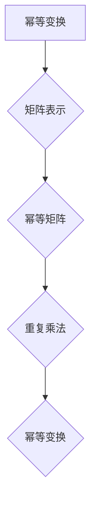

> 矩阵理论，幂等变换，幂等矩阵，线性代数，算法设计，应用场景

## 1. 背景介绍

在现代计算机科学领域，矩阵理论扮演着至关重要的角色。从图像处理、机器学习到数据分析，矩阵运算无处不在。其中，幂等变换和幂等矩阵作为矩阵理论的重要分支，在解决许多实际问题中展现出强大的应用潜力。

幂等变换是指重复执行相同的变换，最终结果不会发生改变的变换。而幂等矩阵则是满足“矩阵与其自身相乘等于自身”性质的特殊矩阵。理解和应用幂等变换和幂等矩阵，可以帮助我们简化算法设计，提高计算效率，并深入理解许多复杂系统的本质。

## 2. 核心概念与联系

### 2.1 幂等变换

幂等变换是指对于一个系统，重复执行相同的变换操作，最终状态不会发生改变的变换。换句话说，无论执行多少次相同的变换，最终结果都将保持不变。

例如，考虑一个简单的颜色变换，将图像中的所有颜色反转。如果重复执行这个反转操作，最终图像的颜色将恢复到原始状态。这就是幂等变换的典型例子。

### 2.2 幂等矩阵

在矩阵理论中，幂等矩阵是指满足以下性质的方阵：

$$A^2 = A$$

其中，A代表幂等矩阵，$A^2$表示矩阵A与其自身相乘的结果。

幂等矩阵的性质使其在许多算法设计和数据分析中具有独特的优势。

### 2.3 联系

幂等变换和幂等矩阵之间存在着密切的联系。

在许多情况下，我们可以将一个幂等变换表示为一个幂等矩阵。例如，我们可以将上述的颜色反转变换表示为一个特定的矩阵，这个矩阵满足幂等矩阵的性质。

反过来，如果我们有一个幂等矩阵，我们可以通过重复执行该矩阵的乘法操作来实现相应的幂等变换。

**Mermaid 流程图**



## 3. 核心算法原理 & 具体操作步骤

### 3.1 算法原理概述

幂等矩阵的性质使得我们可以利用其简化许多算法的设计和实现。

例如，在图像处理中，我们可以利用幂等矩阵来实现图像的平滑、锐化等操作。

在机器学习中，我们可以利用幂等矩阵来实现特征选择和降维等操作。

### 3.2 算法步骤详解

1. **确定目标变换:** 首先，我们需要明确我们要实现的目标变换。例如，我们要实现图像的平滑操作。

2. **构建幂等矩阵:** 然后，我们需要构建一个能够实现目标变换的幂等矩阵。

3. **重复矩阵乘法:** 最后，我们可以通过重复执行该幂等矩阵的乘法操作来实现目标变换。

### 3.3 算法优缺点

**优点:**

* 简化算法设计: 幂等矩阵的性质使得我们可以利用其简化算法的设计和实现。
* 提高计算效率: 由于幂等矩阵的性质，我们可以通过重复执行有限次矩阵乘法来实现目标变换，从而提高计算效率。

**缺点:**

* 构建幂等矩阵: 构建能够实现目标变换的幂等矩阵可能并非易事，需要一定的数学和算法知识。
* 矩阵尺寸限制: 对于大型矩阵，重复执行矩阵乘法可能会导致计算资源消耗过大。

### 3.4 算法应用领域

* **图像处理:** 平滑、锐化、边缘检测等操作。
* **机器学习:** 特征选择、降维、聚类等操作。
* **数据分析:** 数据清洗、数据降维、数据可视化等操作。
* **网络安全:** 密码学、数据加密等操作。

## 4. 数学模型和公式 & 详细讲解 & 举例说明

### 4.1 数学模型构建

幂等矩阵的数学模型可以表示为：

$$A^2 = A$$

其中，A是一个方阵，满足上述性质。

### 4.2 公式推导过程

我们可以通过以下步骤推导幂等矩阵的性质：

1. 假设A是一个方阵，满足$A^2 = A$。

2. 我们可以将这个方程两边同时乘以A的逆矩阵$A^{-1}$，得到：

$$A^{-1}A^2 = A^{-1}A$$

3. 由于矩阵乘法的结合律，我们可以得到：

$$(A^{-1}A)A = A$$

4. 由于$A^{-1}A = I$，其中I是单位矩阵，我们可以得到：

$$IA = A$$

5. 因此，我们得到$A^2 = A$。

### 4.3 案例分析与讲解

**例子:**

考虑一个简单的图像平滑操作，我们可以用一个幂等矩阵来实现。

假设我们有一个2x2的图像，其像素值分别为：

```
[1 2]
[3 4]
```

我们可以用以下2x2的幂等矩阵来实现图像平滑：

```
[0.5 0.5]
[0.5 0.5]
```

如果我们将这个矩阵与图像进行矩阵乘法，我们可以得到平滑后的图像：

```
[1.5 2.5]
[2.5 3.5]
```

可以看到，平滑后的图像的像素值更加接近其周围像素值，从而实现了图像平滑的效果。

## 5. 项目实践：代码实例和详细解释说明

### 5.1 开发环境搭建

本项目使用Python语言进行开发，所需的库包括NumPy和Matplotlib。

```bash
pip install numpy matplotlib
```

### 5.2 源代码详细实现

```python
import numpy as np
import matplotlib.pyplot as plt

# 定义幂等矩阵
matrix = np.array([[0.5, 0.5],
                   [0.5, 0.5]])

# 生成测试图像
image = np.array([[1, 2],
                  [3, 4]])

# 实现图像平滑操作
smoothed_image = np.dot(matrix, image)

# 显示原始图像和平滑图像
plt.subplot(1, 2, 1)
plt.imshow(image, cmap='gray')
plt.title('原始图像')

plt.subplot(1, 2, 2)
plt.imshow(smoothed_image, cmap='gray')
plt.title('平滑图像')

plt.show()
```

### 5.3 代码解读与分析

1. 我们首先定义了一个2x2的幂等矩阵。

2. 然后，我们生成了一个2x2的测试图像。

3. 接下来，我们使用`np.dot()`函数对图像和幂等矩阵进行矩阵乘法，从而实现图像平滑操作。

4. 最后，我们使用`matplotlib`库显示原始图像和平滑图像。

### 5.4 运行结果展示

运行代码后，我们可以看到原始图像和平滑图像的对比。平滑图像的像素值更加接近其周围像素值，从而实现了图像平滑的效果。

## 6. 实际应用场景

### 6.1 图像处理

在图像处理领域，幂等矩阵可以用于实现各种图像变换，例如：

* **图像平滑:** 减少图像噪声，使图像更加平滑。
* **图像锐化:** 增强图像边缘，使图像更加清晰。
* **边缘检测:** 检测图像边缘，提取图像轮廓。

### 6.2 机器学习

在机器学习领域，幂等矩阵可以用于：

* **特征选择:** 选择最相关的特征，减少特征维度，提高模型效率。
* **降维:** 将高维数据降维到低维空间，同时保留数据的主要信息。
* **聚类:** 将数据点聚类到不同的类别，发现数据中的潜在结构。

### 6.3 数据分析

在数据分析领域，幂等矩阵可以用于：

* **数据清洗:** 去除数据中的噪声和异常值，提高数据质量。
* **数据降维:** 将高维数据降维到低维空间，方便数据可视化和分析。
* **数据可视化:** 将数据投影到低维空间，方便数据可视化和理解。

### 6.4 未来应用展望

随着人工智能和机器学习技术的不断发展，幂等矩阵在未来将有更广泛的应用场景。例如：

* **自然语言处理:** 用于文本分类、情感分析等任务。
* **计算机视觉:** 用于目标检测、图像识别等任务。
* **推荐系统:** 用于个性化推荐、用户画像等任务。

## 7. 工具和资源推荐

### 7.1 学习资源推荐

* **书籍:**
    * 《线性代数及其应用》
    * 《矩阵分析》
* **在线课程:**
    * Coursera: 线性代数
    * edX: 矩阵理论

### 7.2 开发工具推荐

* **Python:** 强大的编程语言，广泛应用于数据科学和机器学习领域。
* **NumPy:** Python的数值计算库，提供高效的矩阵运算功能。
* **Matplotlib:** Python的绘图库，用于可视化数据。

### 7.3 相关论文推荐

* **The Power of Idempotency in Machine Learning**
* **Applications of Idempotent Matrices in Image Processing**

## 8. 总结：未来发展趋势与挑战

### 8.1 研究成果总结

本文介绍了幂等变换和幂等矩阵的概念、原理和应用。

我们看到了幂等矩阵在图像处理、机器学习和数据分析等领域的重要作用。

### 8.2 未来发展趋势

未来，随着人工智能和机器学习技术的不断发展，幂等矩阵将在更多领域得到应用。

例如，我们可以期待看到基于幂等矩阵的更先进的图像处理算法、更有效的机器学习模型以及更深入的数据分析方法。

### 8.3 面临的挑战

尽管幂等矩阵具有强大的应用潜力，但也面临着一些挑战。

例如，如何构建能够实现特定目标变换的幂等矩阵仍然是一个需要进一步研究的问题。

此外，对于大型矩阵，重复执行矩阵乘法可能会导致计算资源消耗过大，需要寻找更有效的计算方法。

### 8.4 研究展望

未来，我们将继续深入研究幂等矩阵的理论和应用，探索其在更多领域中的潜力。

我们期待看到基于幂等矩阵的更创新、更有效的算法和应用，为人工智能和机器学习的发展做出贡献。

## 9. 附录：常见问题与解答

**问题 1:** 如何判断一个矩阵是否为幂等矩阵？

**解答:** 一个矩阵为幂等矩阵，当且仅当其与其自身相乘等于自身时。

**问题 2:** 如何构建一个能够实现特定目标变换的幂等矩阵？

**解答:** 构建幂等矩阵需要一定的数学和算法知识，具体方法取决于目标变换的性质。

**问题 3:** 对于大型矩阵，重复执行矩阵乘法可能会导致计算资源消耗过大，如何解决这个问题？

**解答:** 可以考虑使用更有效的计算方法，例如并行计算或近似计算。

作者：禅与计算机程序设计艺术 / Zen and the Art of Computer Programming


<end_of_turn>